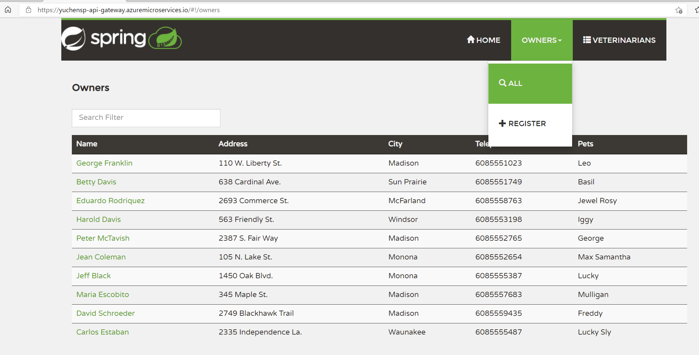
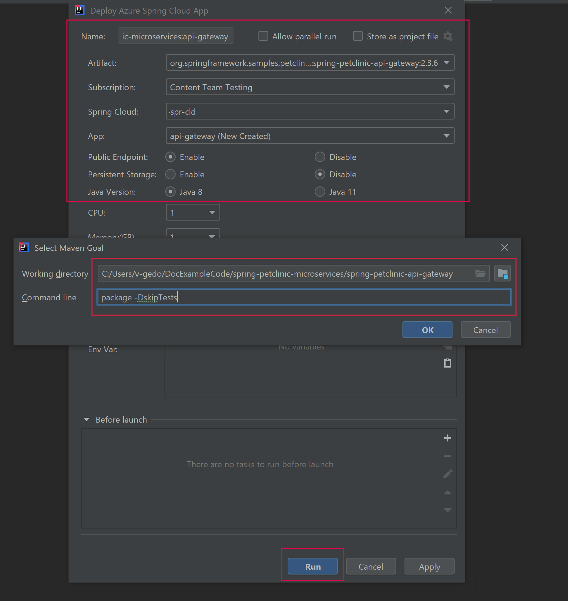

# Quickstart: Build and deploy apps to Azure Spring Cloud

::: zone pivot="programming-language-csharp"
In this quickstart, you build and deploy microservice applications to Azure Spring Cloud using the Azure CLI.

## Prerequisites

* Complete the previous quickstarts in this series:

  * [Provision Azure Spring Cloud service](./quickstart-provision-service-instance.md).
  * [Set up Azure Spring Cloud configuration server](./quickstart-setup-config-server.md).

## Download the sample app

If you've been using the Azure Cloud Shell up to this point, switch to a local command prompt for the following steps.

1. Create a new folder and clone the sample app repository.

   ```console
   mkdir source-code
   ```

   ```console
   cd source-code
   ```

   ```console
   git clone https://github.com/Azure-Samples/Azure-Spring-Cloud-Samples
   ```

1. Navigate into the repository directory.

   ```console
   cd Azure-Spring-Cloud-Samples
   ```

## Deploy PlanetWeatherProvider

1. Create an app for the PlanetWeatherProvider project in your Azure Spring Cloud instance.

   ```azurecli
   az spring-cloud app create --name planet-weather-provider --runtime-version NetCore_31
   ```

   To enable automatic service registration, you have given the app the same name as the value of `spring.application.name` in the project's *appsettings.json* file:

   ```json
   "spring": {
     "application": {
       "name": "planet-weather-provider"
     }
   }
   ```

   This command may take several minutes to run.

1. Change directory to the `PlanetWeatherProvider` project folder.

   ```console
   cd steeltoe-sample/src/planet-weather-provider
   ```

1. Create the binaries and the *.zip* file to be deployed.

   ```console
   dotnet publish -c release -o ./publish
   ```

   > [!TIP]
   > The project file contains the following XML to package the binaries in a *.zip* file after writing them to the *./publish* folder:
   >
   > ```xml
   > <Target Name="Publish-Zip" AfterTargets="Publish">
   >   <ZipDirectory SourceDirectory="$(PublishDir)" DestinationFile="$(MSBuildProjectDirectory)/publish-deploy-planet.zip" Overwrite="true" />
   > </Target>
   > ```

1. Deploy to Azure.

   Make sure that the command prompt is in the project folder before running the following command.

   ```console
   az spring-cloud app deploy -n planet-weather-provider --runtime-version NetCore_31 --main-entry Microsoft.Azure.SpringCloud.Sample.PlanetWeatherProvider.dll --artifact-path ./publish-deploy-planet.zip
   ```

   The `--main-entry` option specifies the relative path from the *.zip* file's root folder to the *.dll* file that contains the application's entry point. After the service uploads the *.zip* file, it extracts all the files and folders and tries to execute the entry point in the specified *.dll* file.

   This command may take several minutes to run.

## Deploy SolarSystemWeather

1. Create another app in your Azure Spring Cloud instance, this time for the SolarSystemWeather project:

   ```azurecli
   az spring-cloud app create --name solar-system-weather --runtime-version NetCore_31
   ```

   `solar-system-weather` is the name that is specified in the `SolarSystemWeather` project's *appsettings.json* file.

   This command may take several minutes to run.

1. Change directory to the `SolarSystemWeather` project.

   ```console
   cd ../solar-system-weather
   ```

1. Create the binaries and *.zip* file to be deployed.

   ```console
   dotnet publish -c release -o ./publish
   ```

1. Deploy to Azure.

   ```console
   az spring-cloud app deploy -n solar-system-weather --runtime-version NetCore_31 --main-entry Microsoft.Azure.SpringCloud.Sample.SolarSystemWeather.dll --artifact-path ./publish-deploy-solar.zip
   ```

   This command may take several minutes to run.

## Assign public endpoint

To test the application, send an HTTP GET request to the `solar-system-weather` application from a browser.  To do that, you need a public endpoint for the request.

1. To assign the endpoint, run the following command.

   ```azurecli
   az spring-cloud app update -n solar-system-weather --assign-endpoint true
   ```

1. To get the URL of the endpoint, run the following command.

   Windows:

   ```azurecli
   az spring-cloud app show -n solar-system-weather -o table
   ```

   Linux:

   ```azurecli
   az spring-cloud app show --name solar-system-weather | grep url
   ```

## Test the application

Send a GET request to the `solar-system-weather` app. In a browser, navigate to the public URL with `/weatherforecast` appended to the end of it. For example: `https://servicename-solar-system-weather.azuremicroservices.io/weatherforecast`

The output is JSON:

```json
[{"Key":"Mercury","Value":"very warm"},{"Key":"Venus","Value":"quite unpleasant"},{"Key":"Mars","Value":"very cool"},{"Key":"Saturn","Value":"a little bit sandy"}]
```

This response shows that both microservice apps are working. The `SolarSystemWeather` app returns data that it retrieved from the `PlanetWeatherProvider` app.
::: zone-end
---
::: zone pivot="programming-language-java"
This document explains how to build and deploy microservice applications to Azure Spring Cloud using:
* Azure CLI
* Maven Plugin
* Intellij

Before deployment using Azure CLI or Maven, complete the examples that [provision an instance of Azure Spring Cloud](./quickstart-provision-service-instance.md) and [set up the config server](./quickstart-setup-config-server.md).

## Prerequisites

* [Install JDK 8](/java/azure/jdk/)
* [Sign up for an Azure subscription](https://azure.microsoft.com/free/)
* (Optional) [Install the Azure CLI version 2.0.67 or higher](/cli/azure/install-azure-cli) and install the Azure Spring Cloud extension with command: `az extension add --name spring-cloud`
* (Optional) [Install the Azure Toolkit for IntelliJ](https://plugins.jetbrains.com/plugin/8053-azure-toolkit-for-intellij/) and [sign in](/azure/developer/java/toolkit-for-intellij/create-hello-world-web-app#installation-and-sign-in)

## Deployment procedures

#### [CLI](#tab/Azure-CLI)

## Build the microservices applications locally

1. Clone the sample app repository to your Azure Cloud account.  Change the directory, and build the project.

    ```azurecli
    git clone https://github.com/azure-samples/spring-petclinic-microservices
    cd spring-petclinic-microservices
    mvn clean package -DskipTests -Denv=cloud
    ```

Compiling the project takes 5 -10 minutes. Once completed, you should have individual JAR files for each service in their respective folders.

## Create and deploy apps on Azure Spring Cloud

1. If you didn't run the following commands in the previous quickstarts, set the CLI defaults.

    ```azurecli
    az configure --defaults group=<resource group name> spring-cloud=<service name>
    ```

1. Create the 2 core microservices for PetClinic: API gateway and customers-service.

    ```azurecli
    az spring-cloud app create --name api-gateway --instance-count 1 --memory 2 --assign-endpoint
    az spring-cloud app create --name customers-service --instance-count 1 --memory 2
    ```

1. Deploy the JAR files built in the previous step.

    ```azurecli
    az spring-cloud app deploy --name api-gateway --jar-path spring-petclinic-api-gateway/target/spring-petclinic-api-gateway-2.3.6.jar --jvm-options="-Xms2048m -Xmx2048m"
    az spring-cloud app deploy --name customers-service --jar-path spring-petclinic-customers-service/target/spring-petclinic-customers-service-2.3.6.jar --jvm-options="-Xms2048m -Xmx2048m"
    ```

1. Query app status after deployments with the following command.

    ```azurecli
    az spring-cloud app list -o table
    ```

    ```azurecli
        Name               Location    ResourceGroup    Production Deployment    Public Url                                           Provisioning Status    CPU    Memory    Running Instance    Registered Instance    Persistent Storage
    -----------------  ----------  ---------------  -----------------------  ---------------------------------------------------  ---------------------  -----  --------  ------------------  ---------------------  --------------------
    api-gateway        eastus      xxxxxx-sp         default                  https://<service name>-api-gateway.azuremicroservices.io   Succeeded              1      2         1/1                 1/1                    -
    customers-service  eastus      <service name>         default                                                                       Succeeded              1      2         1/1                 1/1                    -
    ```

## Verify the services

Access the app gateway and customers service from browser with the **Public Url** shown above, in the format of `https://<service name>-api-gateway.azuremicroservices.io`.



> [!TIP]
> To troubleshot deployments, you can use the following command to get logs streaming in real time whenever the app is running `az spring-cloud app logs --name <app name> -f`.

## Deploy extra apps

To get the PetClinic app functioning with all features like Admin Server, Visits and Veterinarians, you can deploy the other apps with following commands:

```azurecli
az spring-cloud app create --name admin-server --instance-count 1 --memory 2 --assign-endpoint
az spring-cloud app create --name vets-service --instance-count 1 --memory 2
az spring-cloud app create --name visits-service --instance-count 1 --memory 2
az spring-cloud app deploy --name admin-server --jar-path spring-petclinic-admin-server/target/spring-petclinic-admin-server-2.3.6.jar --jvm-options="-Xms2048m -Xmx2048m"
az spring-cloud app deploy --name vets-service --jar-path spring-petclinic-vets-service/target/spring-petclinic-vets-service-2.3.6.jar --jvm-options="-Xms2048m -Xmx2048m"
az spring-cloud app deploy --name visits-service --jar-path spring-petclinic-visits-service/target/spring-petclinic-visits-service-2.3.6.jar --jvm-options="-Xms2048m -Xmx2048m"
```

#### [Maven](#tab/Maven)

## Build the microservices applications locally

1. Clone the sample app repository to your Azure Cloud account.  Change the directory, and build the project.

    ```azurecli
    git clone https://github.com/azure-samples/spring-petclinic-microservices
    cd spring-petclinic-microservices
    mvn clean package -DskipTests -Denv=cloud
    ```

Compiling the project takes 5 -10 minutes. Once completed, you should have individual JAR files for each service in their respective folders.

## Generate configurations and deploy to the Azure Spring Cloud

1. Generate configurations by running the following command in the root folder of Pet Clinic containing the parent POM. If you have already signed-in with Azure CLI, the command will automatically pick up the credentials. Otherwise, it will sign you in with prompt instructions. For more information, see our [wiki page](https://github.com/microsoft/azure-maven-plugins/wiki/Authentication).

    ```azurecli
    mvn com.microsoft.azure:azure-spring-cloud-maven-plugin:1.6.0:config
    ```

    You will be asked to select:

    * **Modules:** Select `api-gateway` and `customers-service`.
    * **Subscription:** This is your subscription used to create an Azure Spring Cloud instance.
    * **Service Instance:** This is the name of your Azure Spring Cloud instance.
    * **Public endpoint:** In the list of provided projects, enter the number that corresponds with `api-gateway`.  This gives it public access.

1. Verify the `appName` elements in the POM files are correct:

    ```xml
    <build>
        <plugins>
            <plugin>
                <groupId>com.microsoft.azure</groupId>
                <artifactId>azure-spring-cloud-maven-plugin</artifactId>
                <version>1.6.0</version>
                <configuration>
                    <subscriptionId>xxxxxxxxx-xxxx-xxxx-xxxxxxxxxxxx</subscriptionId>
                    <clusterName>v-spr-cld</clusterName>
                    <appName>customers-service</appName>

    ```

    Please make sure `appName` texts match the following, remove any prefix if needed and save the file:
    * api-gateway
    * customers-service

1. The POM now contains the plugin dependencies and configurations. Deploy the apps using the following command.

    ```azurecli
    mvn azure-spring-cloud:deploy
    ```

## Verify the services

A successful deployment command will return a the URL of the form: `https://<service name>-spring-petclinic-api-gateway.azuremicroservices.io`. Use it to navigate to the running service.


You can also navigate the Azure portal to find the URL.

1. Navigate to the service.
2. Select **Apps**.
3. Select **api-gateway**.
4. Find the URL on the **api-gateway | Overview** page.

## Deploy extra apps

To get the PetClinic app functioning with all features like Admin Server, Visits and Veterinarians, you can deploy the other microservices. Rerun the configuration command and select the following microservices.

* admin-server
* vets-service
* visits-service

Correct app names in each `pom.xml` for above modules and then run the `deploy` command again.

#### [IntelliJ](#tab/IntelliJ)

## Import sample project in IntelliJ

1. Download and unzip the source repository for this tutorial, or clone it using Git: `git clone https://github.com/azure-samples/spring-petclinic-microservices`

1. Open IntelliJ **Welcome** dialog, select **Import Project** to open the import wizard.

1. Select `spring-petclinic-microservices` folder.

    

### Deploy api-gateway app to Azure Spring Cloud

In order to deploy to Azure you must sign in with your Azure account with Azure Toolkit for IntelliJ, and choose your subscription. For sign-in details, see [Installation and sign-in](/azure/developer/java/toolkit-for-intellij/create-hello-world-web-app#installation-and-sign-in).

1. Right-click your project in IntelliJ project explorer, and select **Azure** -> **Deploy to Azure Spring Cloud**.

    

1. In the **Name** field, append *:api-gateway* to the existing **Name**.
1. In the **Artifact** textbox, select *spring-petclinic-api-gateway-2.3.6*.
1. In the **Subscription** textbox, verify your subscription.
1. In the **Spring Cloud** textbox, select the instance of Azure Spring Cloud that you created in [Provision Azure Spring Cloud instance](./quickstart-provision-service-instance.md).
1. Set **Public Endpoint** to *Enable*.
1. In the **App:** textbox, select **Create app...**.
1. Enter *api-gateway*, then select **OK**.
1. Specify the memory to 2 GB and JVM options: `-Xms2048m -Xmx2048m`.

    

1. In the **Before launch** section of the dialog, double-click *Run Maven Goal*.
1. In the **Working directory** textbox, navigate to the *spring-petclinic-microservices/gateway* folder.
1. In the **Command line** textbox, enter *package -DskipTests*. Select **OK**.

    

1. Start the deployment by selecting the **Run** button at the bottom of the **Deploy Azure Spring Cloud app** dialog. The plug-in will run the command `mvn package` on the `api-gateway` app and deploy the jar generated by the `package` command.

### Deploy customers-service and other apps to Azure Spring Cloud

Repeat the steps above to deploy `customers-service` and other Pet Clinic apps to Azure Spring Cloud:

1. Modify the **Name** and **Artifact** to identify the `customers-service` app.
1. In the **App:** textbox, select **Create app...** to create `customers-service` app.
1. Verify that the **Public Endpoint** option is set to *Disabled*.
1. In the **Before launch** section of the dialog, switch the **Working directory** to the *petclinic/customers-service* folder.
1. Start the deployment by selecting the **Run** button at the bottom of the **Deploy Azure Spring Cloud app** dialog.

## Verify the services

Navigate to the URL of the form: `https://<service name>-spring-petclinic-api-gateway.azuremicroservices.io`


You can also navigate the Azure portal to find the URL.

1. Navigate to the service
2. Select **Apps**
3. Select **api-gateway**
4. Find the URL on the **api-gateway | Overview** page

## Deploy extra apps

Other microservices included in this sample can be deployed similarly.

* admin-server
* vets-service
* visits-service

::: zone-end

## Next steps

In this quickstart, you created Azure resources that will continue to accrue charges if they remain in your subscription. If you don't intend to continue on to the next quickstart, see [Clean up resources](./quickstart-logs-metrics-tracing.md#clean-up-resources). Otherwise, advance to the next quickstart:

> [!div class="nextstepaction"]
> [Logs, Metrics and Tracing](./quickstart-logs-metrics-tracing.md)
