# Quickstart: Monitoring Azure Spring Cloud apps with logs, metrics, and tracing

::: zone pivot="programming-language-csharp"
With the built-in monitoring capability in Azure Spring Cloud, you can debug and monitor complex issues. Azure Spring Cloud integrates Steeltoe [distributed tracing](https://docs.steeltoe.io/api/v3/tracing/) with Azure's [Application Insights](../azure-monitor/app/app-insights-overview.md). This integration provides powerful logs, metrics, and distributed tracing capability from the Azure portal.

The following procedures explain how to use Log Streaming, Log Analytics, Metrics, and Distributed Tracing with the sample app that you deployed in the preceding quickstarts.

## Prerequisites

* Complete the previous quickstarts in this series:

  * [Provision Azure Spring Cloud service](./quickstart-provision-service-instance.md).
  * [Set up Azure Spring Cloud configuration server](./quickstart-setup-config-server.md).
  * [Build and deploy apps](./quickstart-deploy-apps.md).

## Logs

There are two ways to see logs on Azure Spring Cloud: **Log Streaming** of real-time logs per app instance or **Log Analytics** for aggregated logs with advanced query capability.

### Log streaming

You can use log streaming in the Azure CLI with the following command.

```azurecli
az spring-cloud app logs -n solar-system-weather -f
```

You will see output similar to the following example:

```output
=> ConnectionId:0HM2HOMHT82UK => RequestPath:/weatherforecast RequestId:0HM2HOMHT82UK:00000003, SpanId:|e8c1682e-46518cc0202c5fd9., TraceId:e8c1682e-46518cc0202c5fd9, ParentId: => Microsoft.Azure.SpringCloud.Sample.SolarSystemWeather.Controllers.WeatherForecastController.Get (Microsoft.Azure.SpringCloud.Sample.SolarSystemWeather)
Executing action method Microsoft.Azure.SpringCloud.Sample.SolarSystemWeather.Controllers.WeatherForecastController.Get (Microsoft.Azure.SpringCloud.Sample.SolarSystemWeather) - Validation state: Valid
←[40m←[32minfo←[39m←[22m←[49m: Microsoft.Azure.SpringCloud.Sample.SolarSystemWeather.Controllers.WeatherForecastController[0]

=> ConnectionId:0HM2HOMHT82UK => RequestPath:/weatherforecast RequestId:0HM2HOMHT82UK:00000003, SpanId:|e8c1682e-46518cc0202c5fd9., TraceId:e8c1682e-46518cc0202c5fd9, ParentId: => Microsoft.Azure.SpringCloud.Sample.SolarSystemWeather.Controllers.WeatherForecastController.Get (Microsoft.Azure.SpringCloud.Sample.SolarSystemWeather)
Retrieved weather data from 4 planets
←[40m←[32minfo←[39m←[22m←[49m: Microsoft.AspNetCore.Mvc.Infrastructure.ControllerActionInvoker[2]

=> ConnectionId:0HM2HOMHT82UK => RequestPath:/weatherforecast RequestId:0HM2HOMHT82UK:00000003, SpanId:|e8c1682e-46518cc0202c5fd9., TraceId:e8c1682e-46518cc0202c5fd9, ParentId: => Microsoft.Azure.SpringCloud.Sample.SolarSystemWeather.Controllers.WeatherForecastController.Get (Microsoft.Azure.SpringCloud.Sample.SolarSystemWeather)
Executing ObjectResult, writing value of type 'System.Collections.Generic.KeyValuePair`2[[System.String, System.Private.CoreLib, Version=4.0.0.0, Culture=neutral, PublicKeyToken=7cec85d7bea7798e],[System.String, System.Private.CoreLib, Version=4.0.0.0, Culture=neutral, PublicKeyToken=7cec85d7bea7798e]][]'.
←[40m←[32minfo←[39m←[22m←[49m: Microsoft.AspNetCore.Mvc.Infrastructure.ControllerActionInvoker[2]
```

> [!TIP]
> Use `az spring-cloud app logs -h` to explore more parameters and log stream functionality.

### Log Analytics

1. In the Azure portal, go to the **service | Overview** page and select **Logs** in the **Monitoring** section. Select **Run** on one of the sample queries for Azure Spring Cloud.

   [ 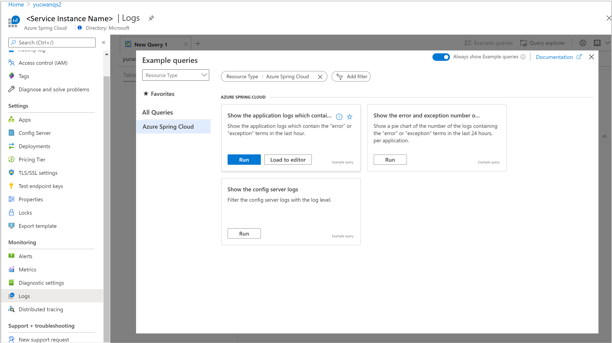 ](media/spring-cloud-quickstart-logs-metrics-tracing/logs-entry.png#lightbox)

1. Edit the query to remove the Where clauses that limit the display to warning and error logs.

1. Then select `Run`, and you will see logs. See [Azure Log Analytics docs](../azure-monitor/logs/get-started-queries.md) for more guidance on writing queries.

   [ 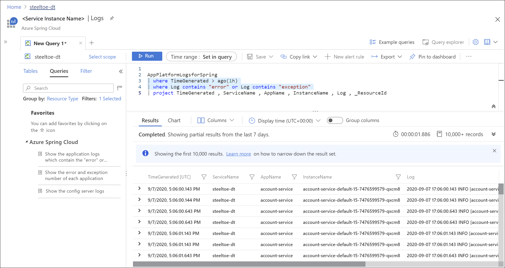 ](media/spring-cloud-quickstart-logs-metrics-tracing/logs-query-steeltoe.png#lightbox)

1. To learn more about the query language that's used in Log Analytics, see [Azure Monitor log queries](/azure/data-explorer/kusto/query/). To query all your Log Analytics logs from a centralized client, check out [Azure Data Explorer](/azure/data-explorer/query-monitor-data).

## Metrics

1. In the Azure portal, go to the **service | Overview** page and select **Metrics** in the **Monitoring** section. Add your first metric by selecting one of the .NET metrics under **Performance (.NET)** or **Request (.NET)** in the **Metric** drop-down, and `Avg` for **Aggregation** to see the timeline for that metric.

   [ 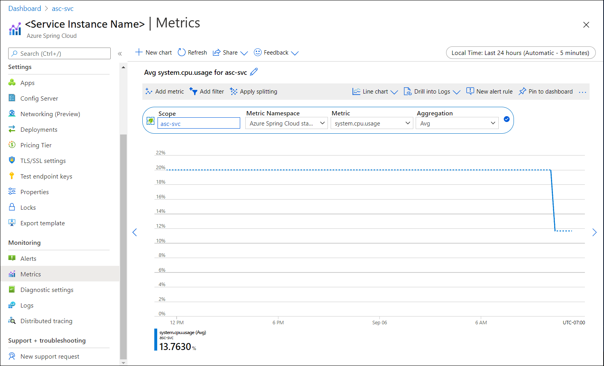 ](media/spring-cloud-quickstart-logs-metrics-tracing/metrics-basic-cpu-steeltoe.png#lightbox)

1. Select **Add filter** in the toolbar, select `App=solar-system-weather` to see CPU usage only for the **solar-system-weather** app.

   [  ](media/spring-cloud-quickstart-logs-metrics-tracing/metrics-filter-steeltoe.png#lightbox)

1. Dismiss the filter created in the preceding step, select **Apply Splitting**, and select `App` for **Values** to see CPU usage by different apps.

   [  ](media/spring-cloud-quickstart-logs-metrics-tracing/metrics-split-steeltoe.png#lightbox)

## Distributed tracing

1. In the Azure portal, go to the **service | Overview** page and select **Distributed tracing** in the **Monitoring** section. Then select the **View application map** tab on the right.

   [  ](media/spring-cloud-quickstart-logs-metrics-tracing/tracing-entry.png#lightbox)

1. You can now see the status of calls between apps.

   [  ](media/spring-cloud-quickstart-logs-metrics-tracing/tracing-overview-steeltoe.png#lightbox)

1. Select the link between **solar-system-weather** and **planet-weather-provider** to see more details like slowest calls by HTTP methods.

   [  ](media/spring-cloud-quickstart-logs-metrics-tracing/tracing-call-steeltoe.png#lightbox)

1. Finally, select **Investigate Performance** to explore more powerful built-in performance analysis.

   [ 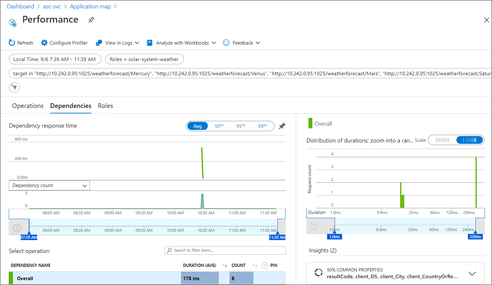 ](media/spring-cloud-quickstart-logs-metrics-tracing/tracing-performance-steeltoe.png#lightbox)
::: zone-end

::: zone pivot="programming-language-java"
With the built-in monitoring capability in Azure Spring Cloud, you can debug and monitor complex issues. Azure Spring Cloud integrates [Spring Cloud Sleuth](https://spring.io/projects/spring-cloud-sleuth) with Azure's [Application Insights](../azure-monitor/app/app-insights-overview.md). This integration provides powerful logs, metrics, and distributed tracing capability from the Azure portal. The following procedures explain how to use Log Streaming, Log Analytics, Metrics, and Distributed tracing with deployed PetClinic apps.

## Prerequisites

Complete previous steps:

* [Provision an instance of Azure Spring Cloud](./quickstart-provision-service-instance.md)
* [Set up the config server](./quickstart-setup-config-server.md)
* [Build and deploy apps](./quickstart-deploy-apps.md).

## Logs

There are two ways to see logs on Azure Spring Cloud: **Log Streaming** of real-time logs per app instance or **Log Analytics** for aggregated logs with advanced query capability.

### Log streaming

#### [CLI](#tab/Azure-CLI)

You can use log streaming in the Azure CLI with the following command.

```azurecli
az spring-cloud app logs -s <service instance name> -g <resource group name> -n gateway -f
```

You will see logs like this:

[ 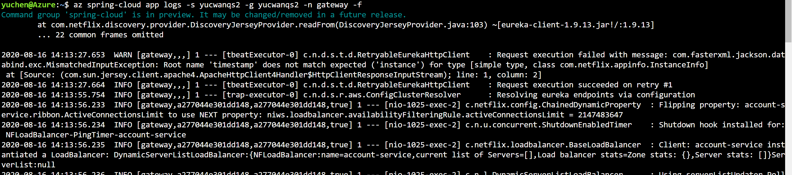 ](media/spring-cloud-quickstart-logs-metrics-tracing/logs-streaming-cli.png#lightbox)

> [!TIP]
> Use `az spring-cloud app logs -h` to explore more parameters and log stream functionalities.

To learn more about the query language that's used in Log Analytics, see [Azure Monitor log queries](/azure/data-explorer/kusto/query/). To query all your Log Analytics logs from a centralized client, check out [Azure Data Explorer](/azure/data-explorer/query-monitor-data).

#### [IntelliJ](#tab/IntelliJ)

To get the logs using Azure Toolkit for IntelliJ:

1. Select **Azure Explorer**, then **Spring Cloud**.

1. Right-click the running app.

1. Select **Streaming Logs** from the drop-down list.

   

1. Select **Instance**.

   

1. The streaming log will be visible in the output window.

   

 To learn more about the query language that's used in Log Analytics, see [Azure Monitor log queries](/azure/data-explorer/kusto/query/). To query all your Log Analytics logs from a centralized client, check out [Azure Data Explorer](/azure/data-explorer/query-monitor-data).

---

### Log Analytics

1. Go to the **service | Overview** page and select **Logs** in the **Monitoring** section. Select **Run** on one of the sample queries for Azure Spring Cloud.

   [  ](media/spring-cloud-quickstart-logs-metrics-tracing/update-logs-metrics-tracing/logs-entry.png#lightbox)

1. Then you will see filtered logs. See [Azure Log Analytics docs](../azure-monitor/logs/get-started-queries.md) for more guidance on writing queries.

   [  ](media/spring-cloud-quickstart-logs-metrics-tracing/update-logs-metrics-tracing/logs-query.png#lightbox)

## Metrics

Navigate to the `Application insights` blade. Then, navigate to the `Metrics` blade - you can see metrics contributed by Spring Boot apps, 
Spring Cloud modules, and dependencies. 

The chart below shows `gateway-requests` (Spring Cloud Gateway), `hikaricp_connections`
 (JDBC Connections) and `http_client_requests`.

[ 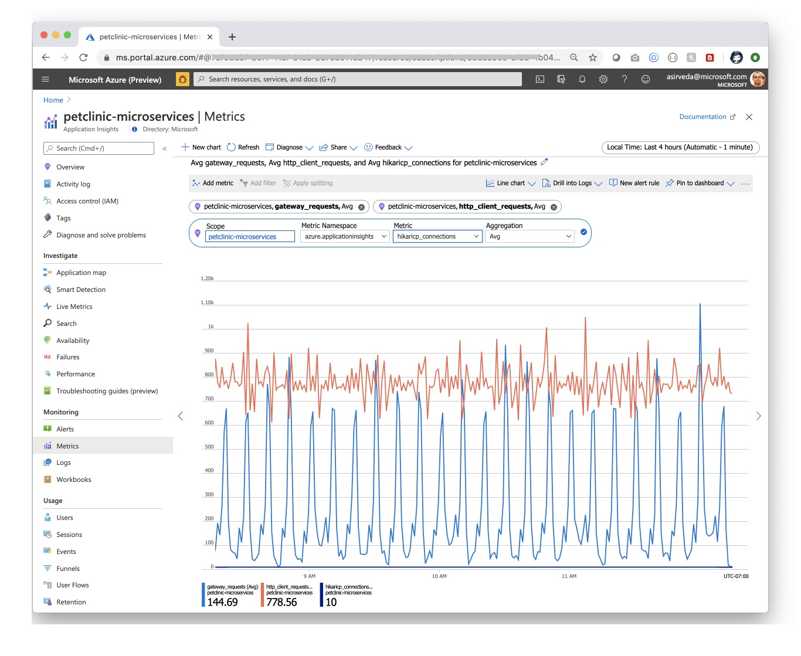 ](media/spring-cloud-quickstart-logs-metrics-tracing/update-logs-metrics-tracing/petclinic-microservices-metrics.jpg#lightbox)

Spring Boot registers a lot number of core metrics: JVM, CPU, Tomcat, Logback...
The Spring Boot auto-configuration enables the instrumentation of requests handled by Spring MVC.
All those three REST controllers `OwnerResource`, `PetResource` and `VisitResource` have been instrumented by the `@Timed` Micrometer annotation at class level.

* `customers-service` application has the following custom metrics enabled:
  * @Timed: `petclinic.owner`
  * @Timed: `petclinic.pet`
* `visits-service` application has the following custom metrics enabled:
  * @Timed: `petclinic.visit`

You can see these custom metrics in the `Metrics` blade:
[  ](media/spring-cloud-quickstart-logs-metrics-tracing/update-logs-metrics-tracing/petclinic-microservices-custom-metrics.jpg#lightbox)

You can use the Availability Test feature in Application Insights and monitor
the availability of applications:

[ 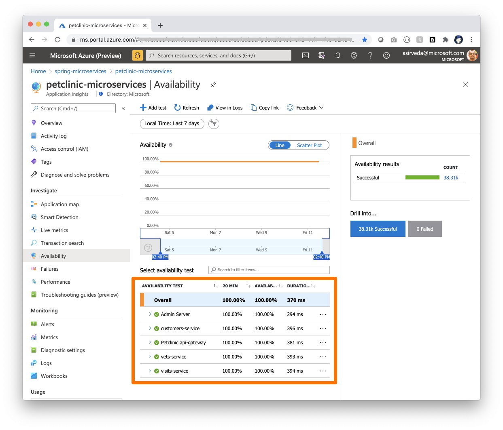 ](media/spring-cloud-quickstart-logs-metrics-tracing/update-logs-metrics-tracing/petclinic-microservices-availability.jpg#lightbox)

Navigate to the `Live Metrics` blade - you can see live metrics on screen with low latencies < 1 second:
[ 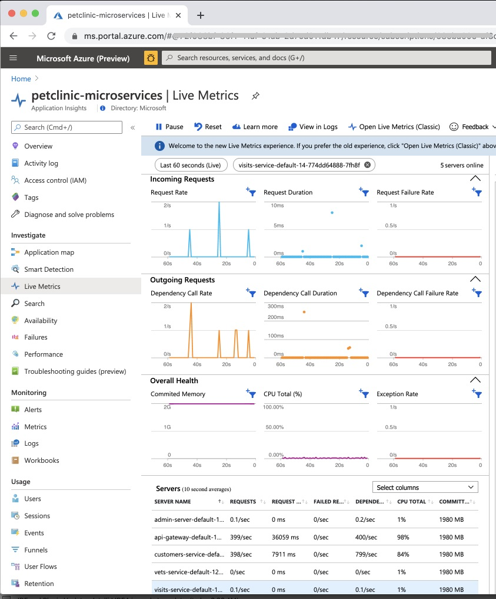 ](media/spring-cloud-quickstart-logs-metrics-tracing/update-logs-metrics-tracing/petclinic-microservices-live-metrics.jpg#lightbox)

## Tracing

Open the Application Insights created by Azure Spring Cloud and start monitoring microservice applications.

Navigate to the `Application Map` blade:
[ 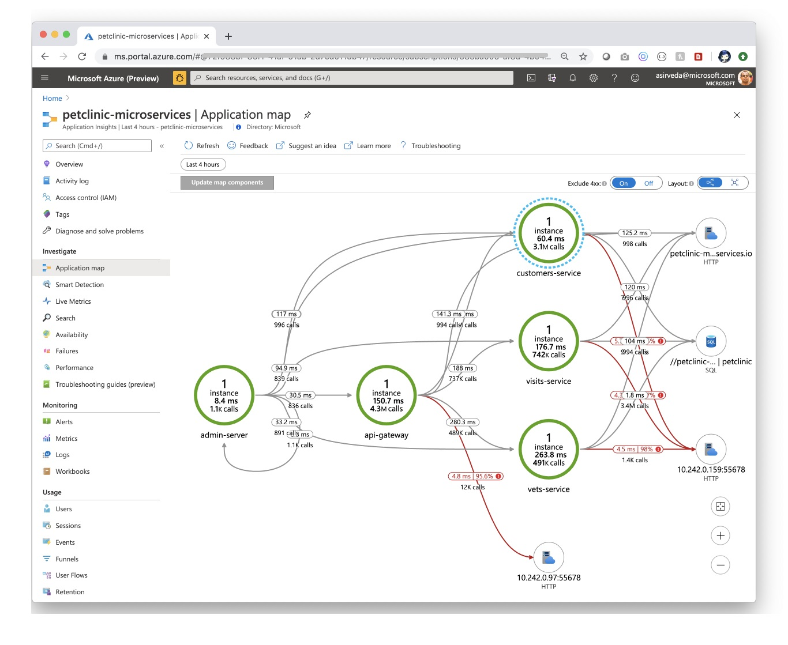 ](media/spring-cloud-quickstart-logs-metrics-tracing/update-logs-metrics-tracing/distributed-tracking-new-ai-agent.jpg#lightbox)

Navigate to the `Performance` blade:
[ 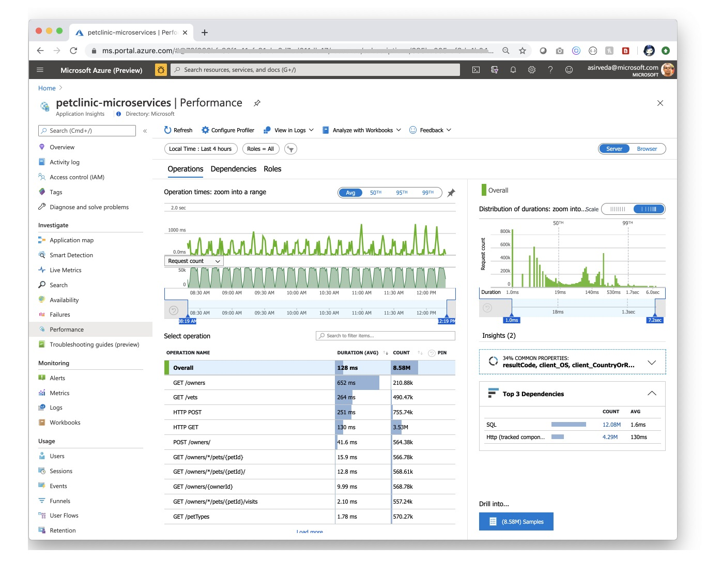 ](media/spring-cloud-quickstart-logs-metrics-tracing/update-logs-metrics-tracing/petclinic-microservices-performance.jpg#lightbox)

Navigate to the `Performance/Dependenices` blade - you can see the performance number for dependencies, particularly SQL calls:
[ 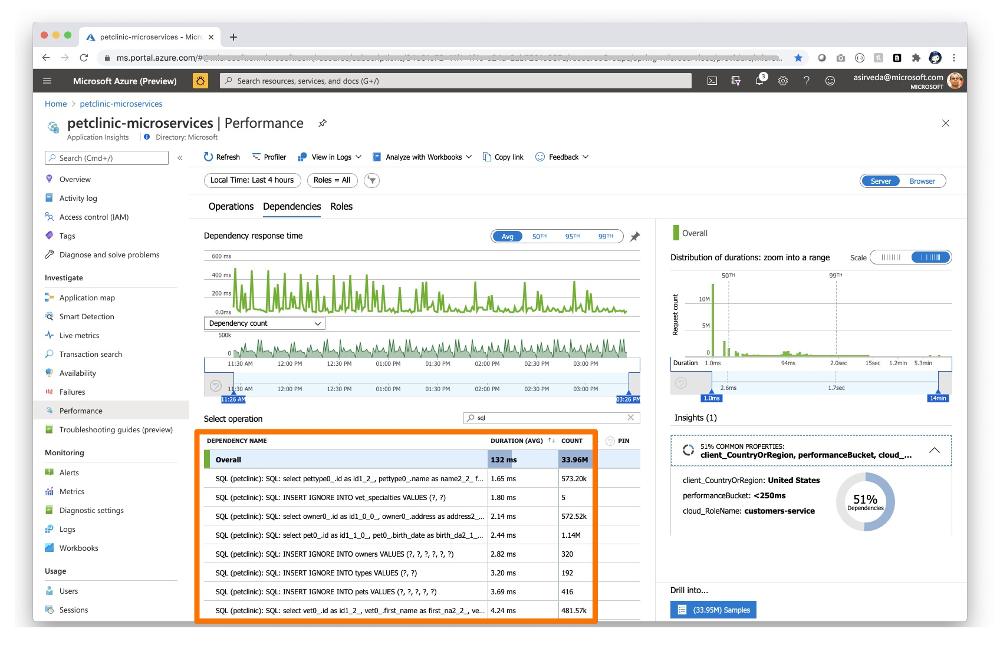 ](media/spring-cloud-quickstart-logs-metrics-tracing/update-logs-metrics-tracing/petclinic-microservices-insights-on-dependencies.jpg#lightbox)

Select a SQL call to see the end-to-end transaction in context:
[ 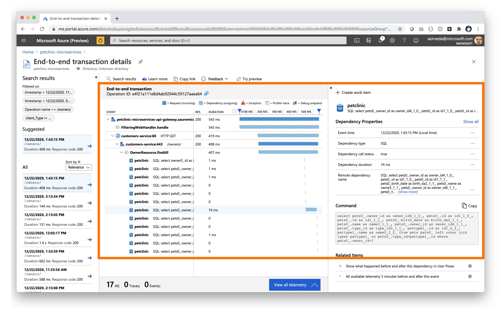 ](media/spring-cloud-quickstart-logs-metrics-tracing/update-logs-metrics-tracing/petclinic-microservices-end-to-end-transaction-details.jpg#lightbox)

Navigate to the `Failures/Exceptions` blade - you can see a collection of exceptions:
[  ](media/spring-cloud-quickstart-logs-metrics-tracing/update-logs-metrics-tracing/petclinic-microservices-failures-exceptions.png#lightbox)

Select an exception to see the end-to-end transaction and stacktrace in context:
[ 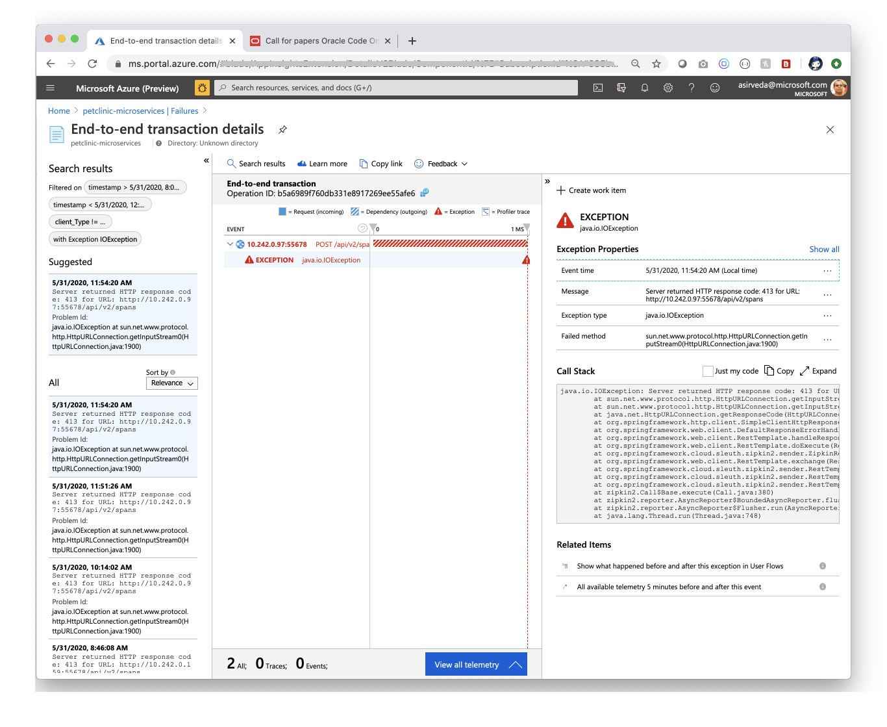 ](media/spring-cloud-quickstart-logs-metrics-tracing/update-logs-metrics-tracing/end-to-end-transaction-details.jpg#lightbox)

::: zone-end

## Clean up resources

In these quickstarts, you created Azure resources that will continue to accrue charges if they remain in your subscription. If you don't expect to need these resources in the future, delete the resource group by using the portal or by running the following command in the Cloud Shell:

```azurecli
az group delete --name <your resource group name; for example: helloworld-1558400876966-rg> --yes
```

In an earlier quickstart, you also set the default resource group name. If you don't intend to continue to the next quickstart, clear out that default by running the following CLI command:

```azurecli
az config set defaults.group=
```

## Next steps

To explore more monitoring capabilities of Azure Spring Cloud, see:

> [!div class="nextstepaction"]
> [Diagnostic services](diagnostic-services.md)
>
> [Distributed tracing](./how-to-distributed-tracing.md)
>
> [Stream logs in real time](./how-to-log-streaming.md)
