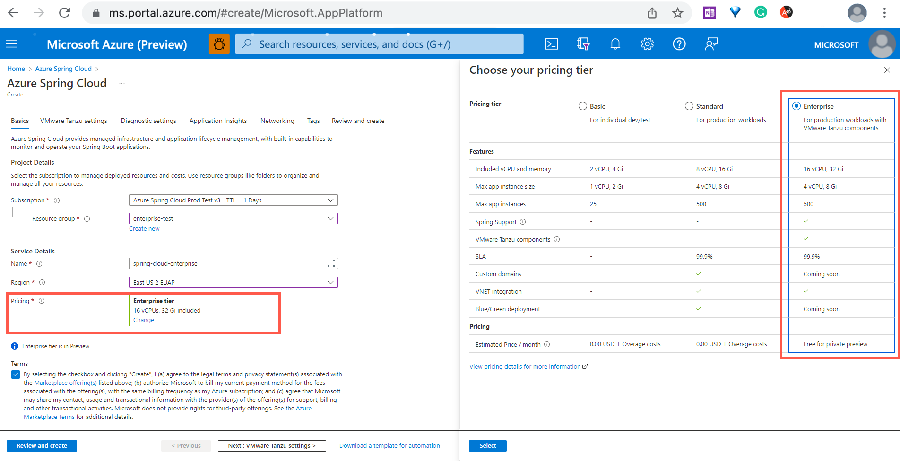
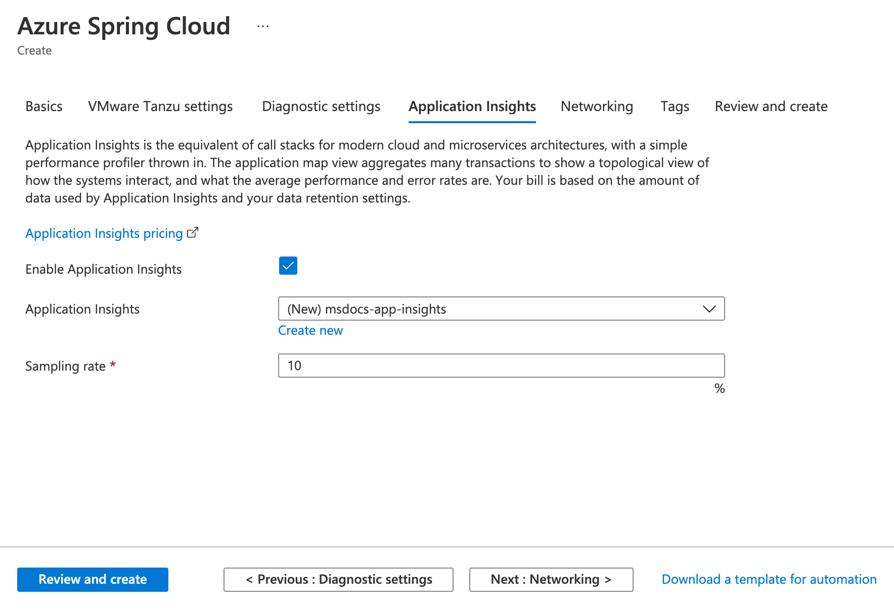

# Quickstart: Provision an Azure Spring Cloud service using the Enterprise tier

**This article applies to:** ✔️ Enterprise tier ❌ Basic/Standard tier

This quickstart shows you how to create an Azure Spring Cloud service instance using the Enterprise tier.

## Prerequisites

- An Azure account with an active subscription. [Create an account for free](https://azure.microsoft.com/free/?WT.mc_id=A261C142F).
- A license for Azure Spring Cloud Enterprise Tier. For more information, see [View Azure Spring Cloud Enterprise Tier Offer in Azure Marketplace](./how-to-enterprise-marketplace-offer.md).
- [The Azure CLI version 2.0.67 or higher](/cli/azure/install-azure-cli).
- [!INCLUDE [install-enterprise-extension](includes/install-enterprise-extension.md)]

## Provision a service instance

### Portal
Use the following steps to provision an Azure Spring Cloud service instance:

1. Open the [Azure portal](https://ms.portal.azure.com/).

1. In the top search box, search for *Azure Spring Cloud*.

1. Select **Azure Spring Cloud** from the **Services** results.

1. On the **Azure Spring Cloud** page, select **Create**.

1. On the Azure Spring Cloud *Create* page, select **Change** next to the *Pricing* option, then select the **Enterprise** tier.

   

   Select the **Terms** checkbox to agree to the legal terms and privacy statements of the Enterprise tier offering in the Azure Marketplace.

1. To configure VMware Tanzu components, select **Next: VMware Tanzu settings** at the bottom right of the page.

   > [!NOTE]
   > All Tanzu components are enabled by default. Please carefully consider which Tanzu components you want to use or enable during the provisioning phase. After provisioning the Azure Spring Cloud instance, you can't enable or disable Tanzu components.

   

1. Select the **Application Insights** section, then select **Enable Application Insights**. You can also enable Application Insights after you provision the Azure Spring Cloud instance.

   - Choose an existing Application Insights instance or create a new Application Insights instance.
   - Give a **Sampling Rate** with in the range of 0-100, or use the default value 10.

   > [!NOTE]
   > You'll pay for the usage of Application Insights when integrated with Azure Spring Cloud. For more information about Application Insights pricing, see [Manage usage and costs for Application Insights](../azure-monitor/app/pricing.md).

   

1. Select **Review and create** at the bottom left of the page. After validation completes successfully, select **Create** to start provisioning the service instance.

It takes about 5 minutes to finish the resource provisioning.

### CLI
The following procedure uses the Azure CLI extension to provision an instance of Azure Spring Cloud.
1. Update Azure CLI with Azure Spring Cloud extension.

    ```azurecli
    az extension update --name spring-cloud
    ```

1. Sign in to the Azure CLI and choose your active subscription.

    ```azurecli
    az login
    az account list -o table
    az account set --subscription <Name or ID of subscription, skip if you only have 1 subscription>
    ```

1. Accept term to agree to all legal terms and privacy statements of the Enterprise tier if the Azure Subscription never hosts Azure Spring Cloud Enterprise instance.
    ```azurecli
        az provider register -n Microsoft.SaaS
        az term accept --publisher vmware-inc --product azure-spring-cloud-vmware-tanzu-2 --plan tanzu-asc-ent-mtr
    ```

1. Prepare a name for your Azure Spring Cloud service.  The name must be between 4 and 32 characters long and can contain only lowercase letters, numbers, and hyphens.  The first character of the service name must be a letter and the last character must be either a letter or a number.

1. Create a resource group to contain your Azure Spring Cloud service.  Create instance of the Azure Spring Cloud service.

    ```azurecli
    az group create --name <resource group name>
    az spring-cloud create -n <service instance name> -g <resource group name> --sku enterprise
    ```

    Learn more about [Azure Resource Groups](../azure-resource-manager/management/overview.md).

1. Set your default resource group name and Spring Cloud service name using the following command:

    ```azurecli
    az config set defaults.group=<resource group name> defaults.spring-cloud=<service name>
    ```

## Next steps

> [!div class="nextstepaction"]
> [Quickstart: Build and deploy apps to Azure Spring Cloud using the Enterprise tier](quickstart-deploy-apps-enterprise.md)
