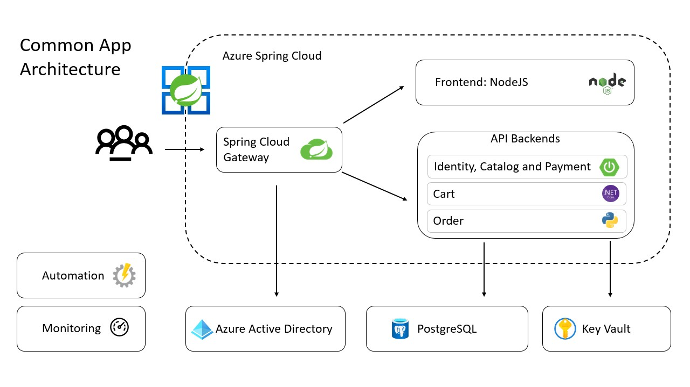
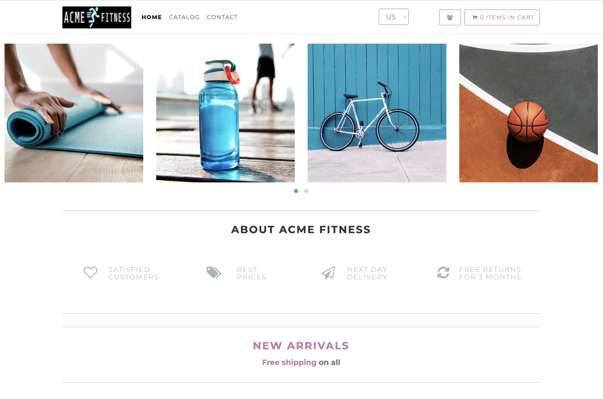

# Introduction to the ACME Fitness Store sample app

**This article applies to:** ❌ Basic/Standard tier ✔️ Enterprise tier

In this quickstart, we use the [ACME Fitness Store](https://github.com/Azure-Samples/acme-fitness-store) application that will show how to deploy polyglot applications to Azure Spring Cloud Enterprise tier. You will see how polyglot applications are built and deployed using Azure Spring Cloud Enterprise Tier capabilities including Tanzu Build Service, Service Discovery, externalized configuration with Application Configuration Service, application routing with Spring Cloud Gateway, logs, metrics, and distributed tracing.

The following diagram shows a common application architecture:

This architecture shows an application composed of smaller applications with a gateway, multiple databases, security services, monitoring, and automation.

This quickstart applies this architecture to a Fitness Store application. This application is composed of several services split up by domain:

- 3 Java Spring Boot applications:
  - **Catalog Service**: contains an API for fetching available products
  - **Payment Service**: Validates and processes payments for users' orders
  - **Identity Service**: Provides reference to the authenticated user

- 1 Python application:
  - **Cart Service**: Manages users' items that have been selected for purchase

- 1 ASP.NET Core application:
  - **Order Service**: Places orders to buy products that are in the users' carts

- 1 NodeJS and static HTML Application
  - **Frontend**: shopping application that depends on other services

The following picture shows the ACME Fitness Store home page.

## Next steps

> [!div class="nextstepaction"]
> [Quickstart - Build and deploy apps to Azure Spring Cloud Enterprise tier](quickstart-deploy-apps-enterprise.md)
