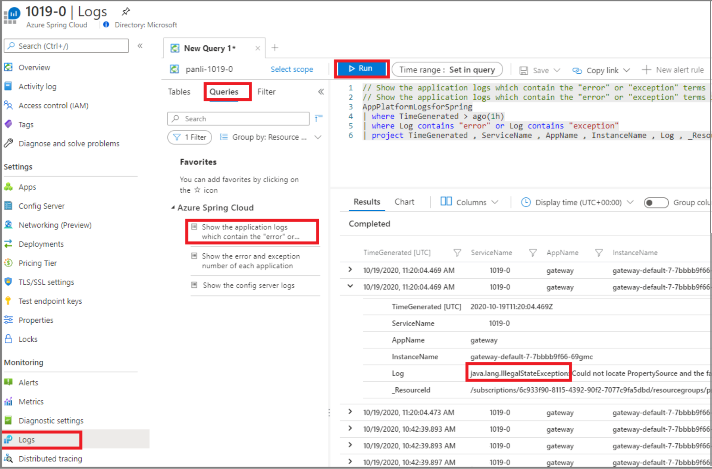
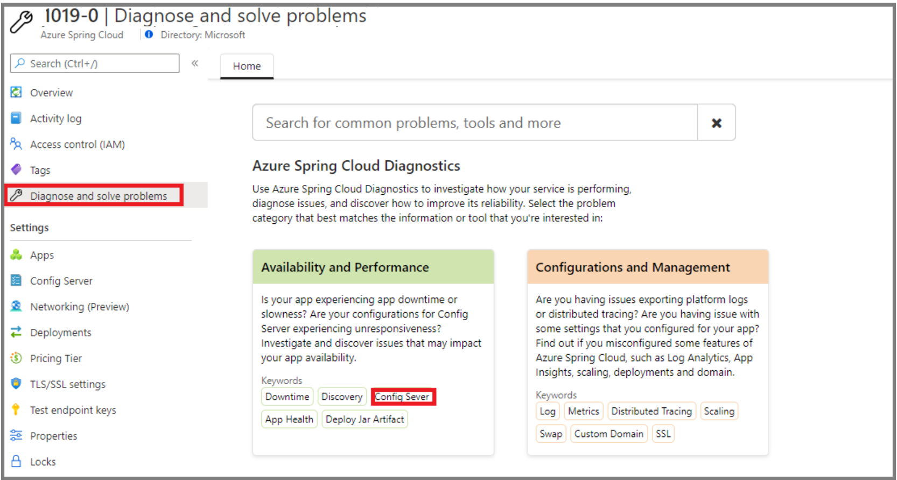
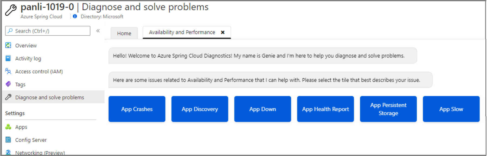
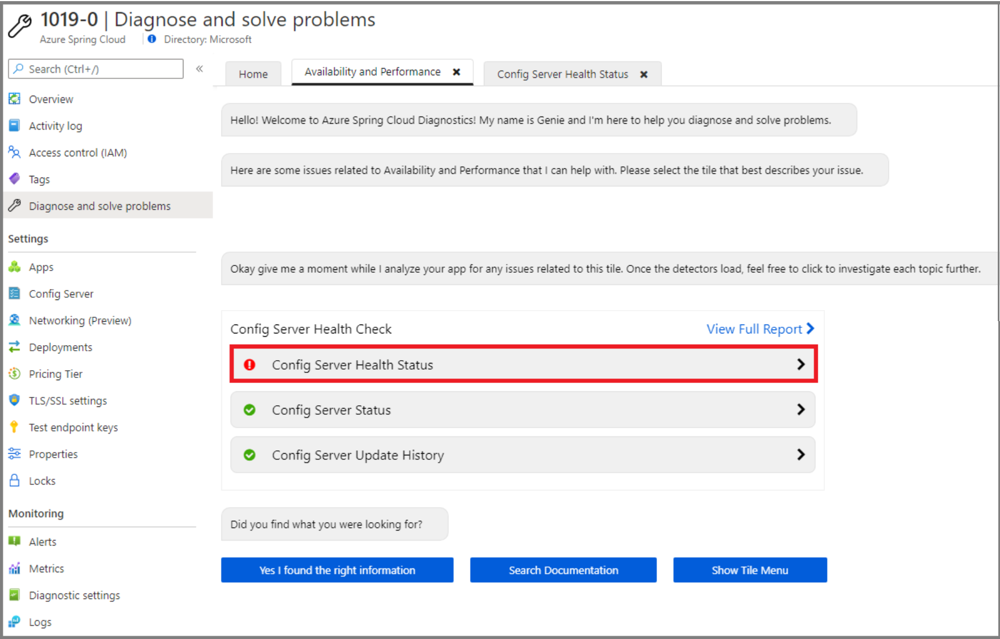

# Quickstart: Set up Azure Spring Cloud Config Server

**This article applies to:** ✔️ Basic/Standard tier ❌ Enterprise tier

Azure Spring Cloud Config Server is a centralized configuration service for distributed systems. It uses a pluggable repository layer that currently supports local storage, Git, and Subversion. In this quickstart, you set up the Config Server to get data from a Git repository.

::: zone pivot="programming-language-csharp"

## Prerequisites

* Complete the previous quickstart in this series: [Provision Azure Spring Cloud service](./quickstart-provision-service-instance.md).
* Azure Spring Cloud Config server is only applicable to basic or standard tier.

## Azure Spring Cloud Config Server procedures

Set up your Config Server with the location of the git repository for the project by running the following command. Replace *\<service instance name>* with the name of the service you created earlier. The default value for service instance name that you set in the preceding quickstart doesn't work with this command.

```azurecli
az spring-cloud config-server git set -n <service instance name> --uri https://github.com/Azure-Samples/Azure-Spring-Cloud-Samples --search-paths steeltoe-sample/config
```

This command tells Config Server to find the configuration data in the [steeltoe-sample/config](https://github.com/Azure-Samples/Azure-Spring-Cloud-Samples/tree/master/steeltoe-sample/config) folder of the sample app repository. Since the name of the app that will get the configuration data is `planet-weather-provider`, the file that will be used is [planet-weather-provider.yml](https://github.com/Azure-Samples/Azure-Spring-Cloud-Samples/blob/master/steeltoe-sample/config/planet-weather-provider.yml).

::: zone-end

::: zone pivot="programming-language-java"
Azure Spring Cloud Config Server is centralized configuration service for distributed systems. It uses a pluggable repository layer that currently supports local storage, Git, and Subversion. Set up the Config Server to deploy Spring apps to Azure Spring Cloud.

## Prerequisites

* [Install JDK 8 or JDK 11](/azure/developer/java/fundamentals/java-jdk-install)
* [Sign up for an Azure subscription](https://azure.microsoft.com/free/)
* (Optional) [Install the Azure CLI version 2.0.67 or higher](/cli/azure/install-azure-cli) and install the Azure Spring Cloud extension with command: `az extension add --name spring-cloud`
* (Optional) [Install the Azure Toolkit for IntelliJ](https://plugins.jetbrains.com/plugin/8053-azure-toolkit-for-intellij/) and [sign-in](/azure/developer/java/toolkit-for-intellij/create-hello-world-web-app#installation-and-sign-in)

## Azure Spring Cloud Config Server procedures

#### [Portal](#tab/Azure-portal)

The following procedure sets up the Config Server using the Azure portal to deploy the [PetClinic sample](https://github.com/azure-samples/spring-petclinic-microservices).

1. Go to the service **Overview** page and select **Config Server**.

2. In the **Default repository** section, set **URI** to `https://github.com/azure-samples/spring-petclinic-microservices-config`.

3. Select **Validate**.

    

4. When validation is complete, select **Apply** to save your changes.

    

5. Updating the configuration can take a few minutes.

    

6. You should get a notification when the configuration is complete.

#### [CLI](#tab/Azure-CLI)

The following procedure uses the Azure CLI to set up Config Server to deploy the [Pet Clinic sample](https://github.com/azure-samples/spring-petclinic-microservices).

Run the following command to set the Default repository.

```azurecli
az spring-cloud config-server git set -n <service instance name> --uri https://github.com/azure-samples/spring-petclinic-microservices-config
```

::: zone-end

> [!TIP]
> If you are using a private repository for Config Server, please refer to our [tutorial on setting up authentication](./how-to-config-server.md).

## Troubleshooting of Azure Spring Cloud Config Server

The following procedure explains how to troubleshoot config server settings.

1. In the Azure portal, go to the service **Overview** page and select **Logs**.
1. Select **Queries** and **Show the application logs that contain the "error" or "exception" terms"**.
1. Select **Run**.
1. If you find the error **java.lang.illegalStateException** in logs, this indicates that spring cloud service cannot locate properties from config server.

    [  ](media/spring-cloud-quickstart-setup-config-server/setup-config-server-query.png)

1. Go to the service **Overview** page.
1. Select **Diagnose and solve problems**.
1. Select **Config Server** detector.

    [  ](media/spring-cloud-quickstart-setup-config-server/setup-config-server-diagnose.png)

1. Select **Config Server Health Check**.

    [  ](media/spring-cloud-quickstart-setup-config-server/setup-config-server-genie.png)

1. Select **Config Server Status** to see more details from the detector.

    [  ](media/spring-cloud-quickstart-setup-config-server/setup-config-server-health-status.png)

## Clean up resources

If you plan to continue working with subsequent quickstarts and tutorials, you might want to leave these resources in place. When no longer needed, delete the resource group, which deletes the resources in the resource group. To delete the resource group by using Azure CLI, use the following commands:

```azurecli
echo "Enter the Resource Group name:" &&
read resourceGroupName &&
az group delete --name $resourceGroupName &&
echo "Press [ENTER] to continue ..."
```

## Next steps

> [!div class="nextstepaction"]
> [Quickstart: Build and deploy apps to Azure Spring Cloud](quickstart-deploy-apps.md)
