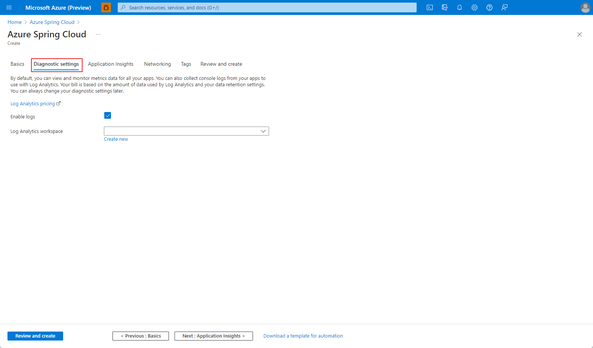
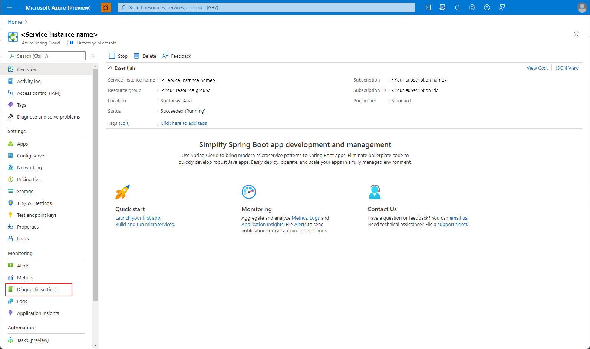
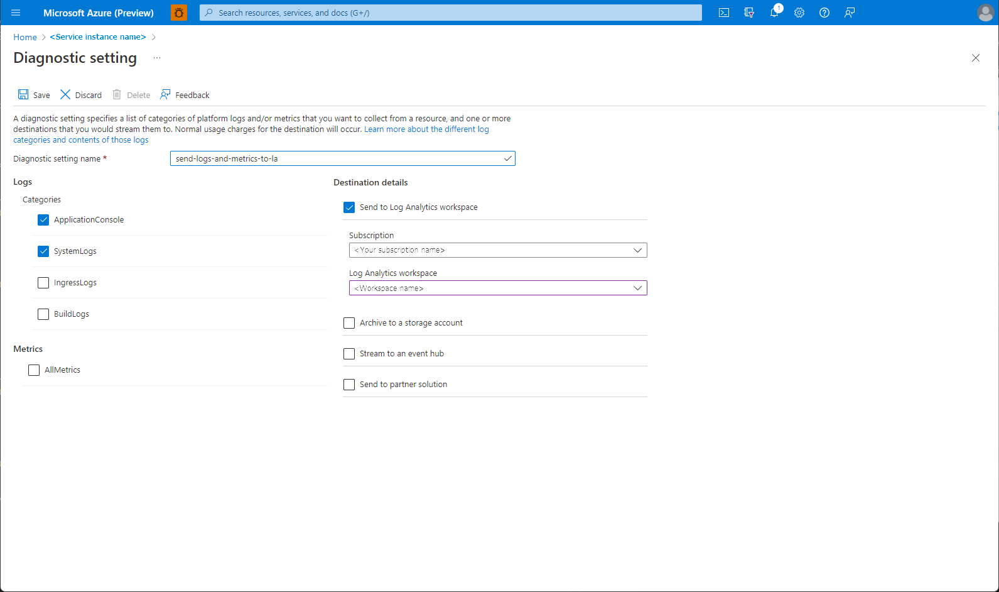

# Quickstart: Set up a Log Analytics workspace

This quickstart explains how to set up a Log Analytics workspace in Azure Spring Cloud for application development.

Log Analytics is a tool in the Azure portal used to edit and run log queries with data in Azure Monitor Logs. You may write a query that returns a set of records and then use features of Log Analytics to sort, filter, and analyze those records. You may also write a more advanced query to do statistical analysis and visualize the results in a chart to identify particular trends. Whether you work with the results of your queries interactively or use them with other Azure Monitor features, Log Analytics is the tool that you use to write and test queries.

You can set up Azure Monitor Logs for your application in Azure Spring Cloud to collect logs and run logs queries via Log Analytics.

## Prerequisites

* Complete the previous quickstart in this series: [Provision Azure Spring Cloud service](./quickstart-provision-service-instance.md).

## Set up a Log Analytics workspace

Use the following steps to set up your Log Analytics workspace.

#### [Portal](#tab/Azure-Portal)

## Create a Log Analytics Workspace

* To create a workspace, follow the steps in [Create a Log Analytics workspace in the Azure portal](../azure-monitor/logs/quick-create-workspace.md).

## Set up Log Analytics for a new service

* In the create Azure Spring Cloud service wizard, you can configure the **Log Analytics workspace** field with an existing workspace or create one.

    [](media/spring-cloud-quickstart-setup-log-analytics/setup-diagnostics-setting.png#lightbox)

## Set up Log Analytics for an existing service

1. In the Azure portal, go to the **Diagnostic Settings** section under **Monitoring**.

    [](media/spring-cloud-quickstart-setup-log-analytics/diagnostic-settings-entry.png#lightbox) 

1. If no settings exist, select **Add diagnostic setting**. You can also select **Edit setting** to update existing settings.

1. Fill out the form on the **Diagnostics setting** page.
    * **Diagnostic setting name**: Set a unique name for the given configuration.
    * **Logs/Categories**: Choose **ApplicationConsole** and **SystemLogs**. For more information on log categories and contents, see [Create diagnostic settings to send Azure Monitor platform logs and metrics to different destinations](../azure-monitor/essentials/diagnostic-settings.md).
    * **Destination details**: Choose **Send to Log Analytics workspace** and specify the Log Analytics workspace you created previously.

    [](media/spring-cloud-quickstart-setup-log-analytics/diagnostic-settings-edit-form.png#lightbox)

1. Click **Save**

#### [CLI](#tab/Azure-CLI)

## Create a Log Analytics Workspace

1. Create a Log Analytics workspace and get the workspace ID

   ```azurecli
   az monitor log-analytics workspace create \
       --workspace-name <new-workspace-name> \
       --resource-group <your-resource-group> \
       --location <your-service-region> \
       --query id --output tsv
   ```

    If you have an existing workspace, you can get the workspace ID with the following command:

   ```azurecli
   az monitor log-analytics workspace show \
        --resource-group <your-resource-group> \
        --workspace-name <workspace-name> \
        --query id --output tsv
   ```

## Set up Log Analytics for an existing service

1. Get the Azure Spring Cloud service instance ID

   ```azurecli
   az spring-cloud show \
       --name <spring-cloud-service-name> \
       --resource-group <your-resource-group> \
       --query id --output tsv
    ```

1. Set up the diagnostic settings. For more information on log categories and contents, see [Create diagnostic settings to send Azure Monitor platform logs and metrics to different destinations](../azure-monitor/essentials/diagnostic-settings.md).

   ```azurecli
   az monitor diagnostic-settings create \
       --name "<new-name-for-settings>" \
       --resource "<service-instance-id>" \
       --workspace "<workspace-id>" \
       --logs '[
            {
                "category": "ApplicationConsole",
                "enabled": true,
                "retentionPolicy": {
                    "enabled": false,
                    "days": 0
                }
            },
            {
                "category": "SystemLogs",
                "enabled": true,
                "retentionPolicy": {
                    "enabled": false,
                    "days": 0
                }
            }
        ]'
    ```

---

## Next steps

In this quickstart, you created Azure resources that will continue to accrue charges if they remain in your subscription. If you don't intend to continue on to the next quickstart, see [Clean up resources](./quickstart-logs-metrics-tracing.md#clean-up-resources). Otherwise, advance to the next quickstart:

> [!div class="nextstepaction"]
> [Logs, Metrics and Tracing](./quickstart-logs-metrics-tracing.md)
