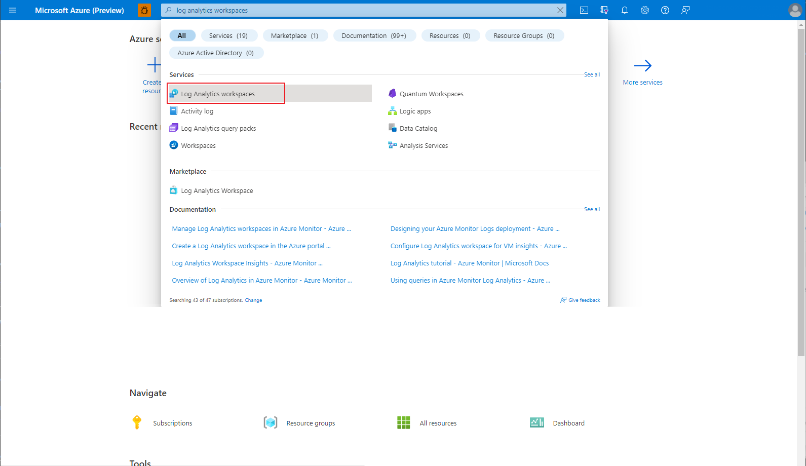
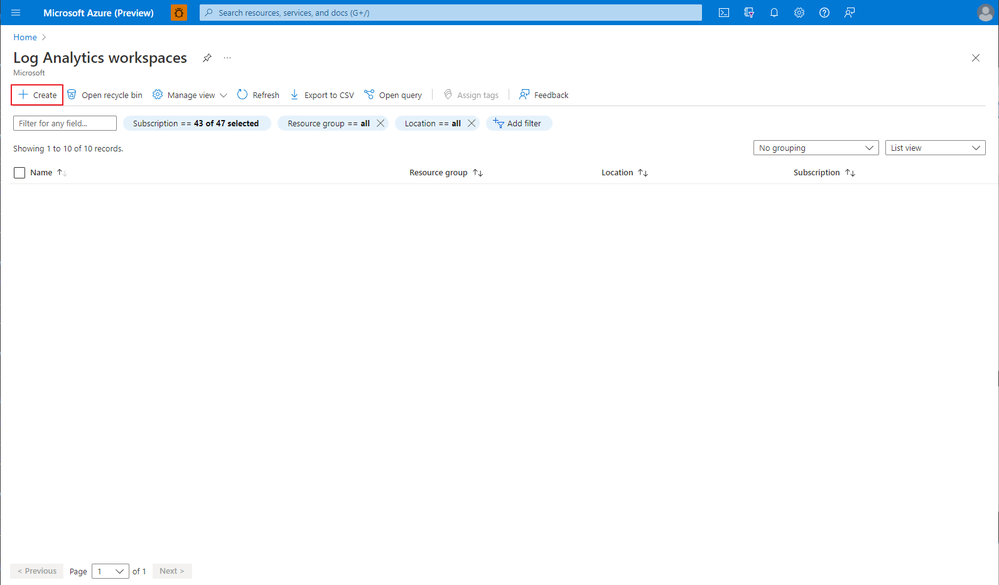
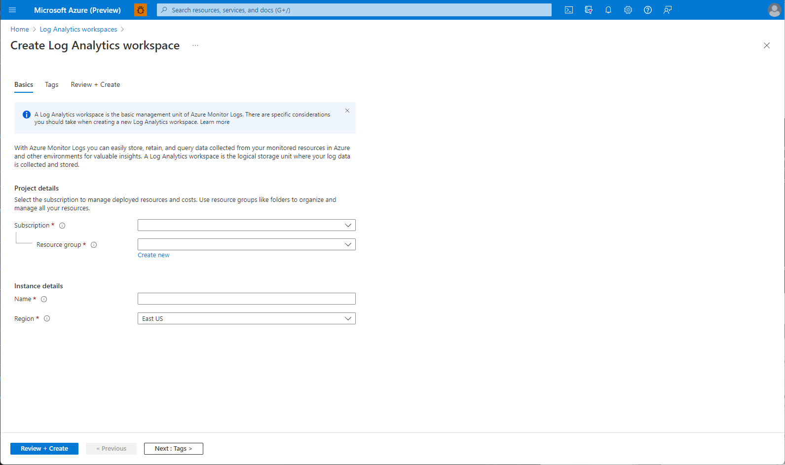
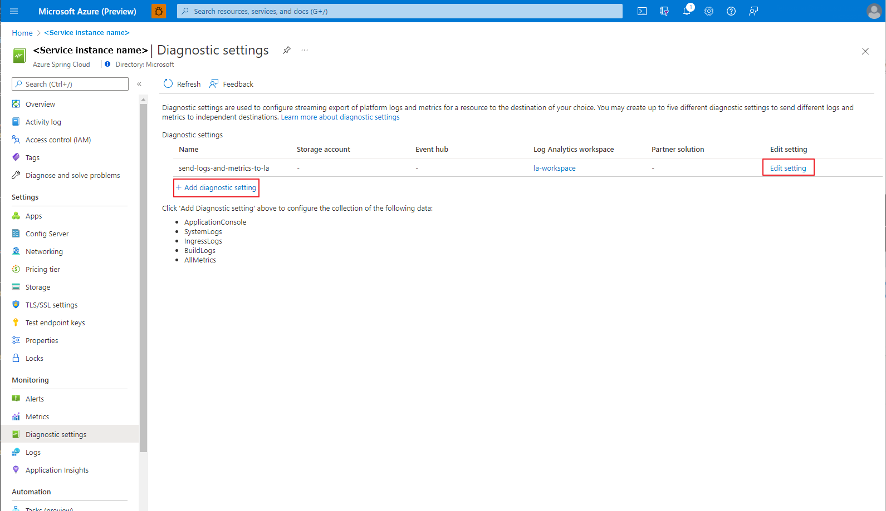

# Quickstart: Set up Log Analytics workspace

Log Analytics is a tool in the Azure portal to edit and run log queries from data collected by Azure Monitor Logs and interactively analyze their results. You can use Log Analytics queries to retrieve records that match particular criteria, identify trends, analyze patterns, and provide a variety of insights into your data.

Azure Spring Cloud supports you leverage Azure Monitor Logs to collect logs and edit and run log queries via Log Analytics.

## Prerequisites

* Complete the previous quickstart in this series: [Provision Azure Spring Cloud service](./quickstart-provision-service-instance.md).

## Set up procedures

#### [Portal](#tab/Azure-Portal)

## Create Log Analytics Workspace

1. Open the [Azure portal](https://ms.portal.azure.com/).

1. From the top search box, search for *Log Analytics Workspaces*.

1. Select **Log Analytics Workspaces** from the results.

   [  ](media/spring-cloud-quickstart-setup-log-analytics/search-log-analytics-workspaces.png#lightbox)

1. On the Log Analytics workspaces page, select **Create**.

   [  ](media/spring-cloud-quickstart-setup-log-analytics/create-log-analytics-workspace.png#lightbox)

1. Fill out the form on the Azure Spring Cloud **Create** page.  Consider the following guidelines:

   * **Subscription**: Select the subscription you want to be billed for this resource.
   * **Resource group**: Create a new resource group. The name you enter here will be used in later steps as **\<resource group name\>**.
   * **Instance Details/Name**: Specify the **\<workspace name\>**.  The name must be between 4 and 32 characters long and can contain only lowercase letters, numbers, and hyphens.  The first character of the service name must be a letter and the last character must be either a letter or a number.
   * **Region**: Select the region for your service instance.

   [  ](media/spring-cloud-quickstart-setup-log-analytics/create-log-analytics-workspace-form.png#lightbox)

1. Select **Review and create**.

1. Select **Create**.

## Diagnostic setting

1. In the Azure portal, go to the **service | Overview** page and select **Diagnostic Settings** under **Monitoring**.

   [  ](media/spring-cloud-quickstart-setup-log-analytics/diagnostic-settings-entry.png#lightbox) 

1. If no setting exist on the service, Click **Add diagnostic setting**.

   If there are existing settings on the service, you see a list of settings already configured. Either click **Add diagnostic setting** to add a new setting or **Edit setting** to edit an existing one. 

   [  ](media/spring-cloud-quickstart-setup-log-analytics/diagnostic-settings-add.png)

1. Fill out the form on **Diagnostics setting** page. Consider the following guidelines:
   * **Diagnostic setting name**: Give your setting a name if it doesn't already have one.
   * **Logs/Categories**: Just choose **ApplicationConsole** and **SystemLogs** for quick start. See [diagnostic settings doc](https://docs.microsoft.com/azure/azure-monitor/essentials/diagnostic-settings?WT.mc_id=Portal-Microsoft_Azure_Monitoring&tabs=CMD) for more guidance about the different log categories and contents of those logs.
   * **Destination details**: Choose **Send to Log Analytics workspace** and specify the Log Analytics workspace you created in last step.

   [  ](media/spring-cloud-quickstart-setup-log-analytics/diagnostic-settings-edit-form.png#lightbox)

1. Select **Save**

#### [CLI](#tab/Azure-CLI)

## Create Log Analytics Workspace

1. Create and get workspace id

   ```azurecli
   az monitor log-analytics workspace create --workspace-name <give a name for workspace> --resource-group <your resource group> --location <your service region>
   ```

    You will get a json and get the **\<workspace id\>**.

    ```json
    {
        ...
        "id": "<workspace id>",
        ...
    }
    ```

    If you have already created workspace before, you could get **\<workspace id\>** by the commend below.

    ```azurecli
    az monitor log-analytics workspace show --resource-group <your resource group> --workspace-name <workspace name>
    ```

1. Get Azure Spring Cloud service instance id

    ```azurecli
    az spring-cloud show --name <spring cloud service name> --resource-group <your resource group>
    ```

    You will get a json and get the **\<service instance id\>**

    ```json
    {
        "id": "<service instance id>",
        ...
    }
    ```

1. Setup diagnostic setting, you could see [diagnostic settings doc](https://docs.microsoft.com/azure/azure-monitor/essentials/diagnostic-settings?WT.mc_id=Portal-Microsoft_Azure_Monitoring&tabs=CMD) for more guidance about the different log categories and contents of those logs.

    ```azurecli
    az monitor diagnositc-settings create --name "<give your setting a name>" \
        --resource "<service resource id>" \
        --workspace "<workspace id>" \
        --logs '[
            {
                "category": "ApplicationConsole",
                "enabled": true,
                "retentionPolicy": {
                    "enabled": false,
                    "days": 0
                }
            },
            {
                "category": "SystemLogs",
                "enabled": true,
                "retentionPolicy": {
                    "enabled": false,
                    "days": 0
                }
            }
        ]'
    ```

---

> [!TIP]
> You could also setup Log Analytics during creating Azure Spring Cloud service instance.
> In Azure Spring Cloud creating service wizard form, you could create or specify **Log Analytics workspace**.
> [  ](media/spring-cloud-quickstart-setup-log-analytics/setup-diagnostics-setting2.png#lightbox)

## Next steps

In this quickstart, you created Azure resources that will continue to accrue charges if they remain in your subscription. If you don't intend to continue on to the next quickstart, see [Clean up resources](./quickstart-logs-metrics-tracing.md#clean-up-resources). Otherwise, advance to the next quickstart:

> [!div class="nextstepaction"]
> [Logs, Metrics and Tracing](./quickstart-logs-metrics-tracing.md)
