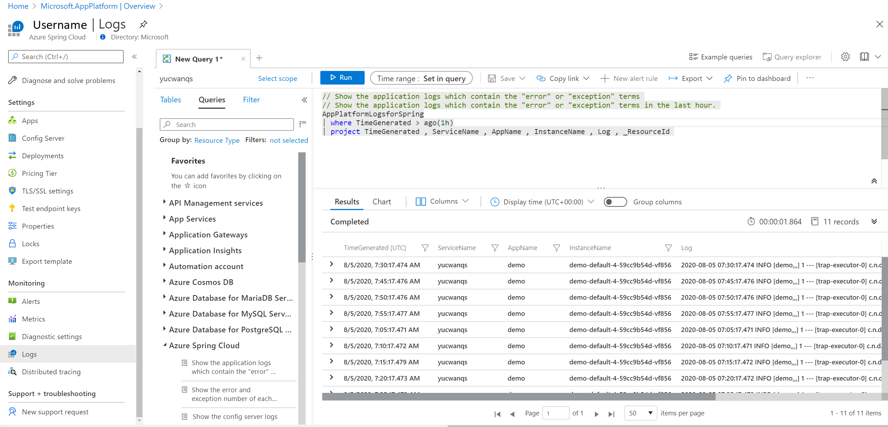
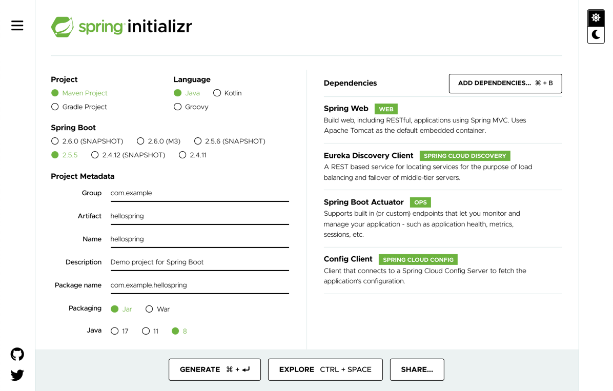
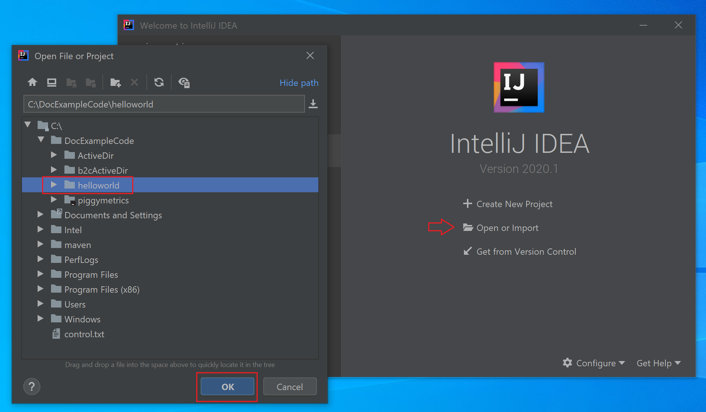
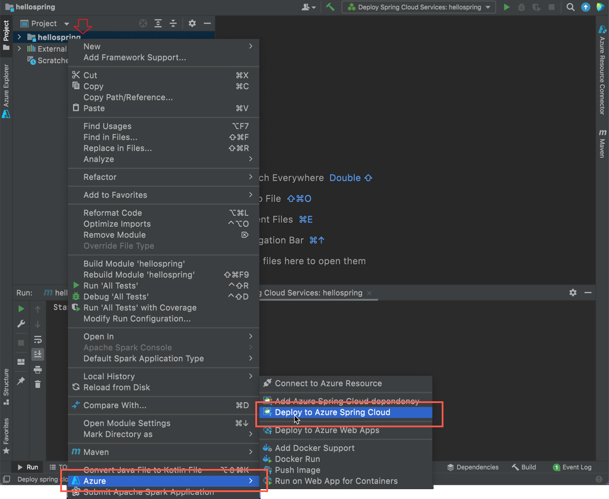
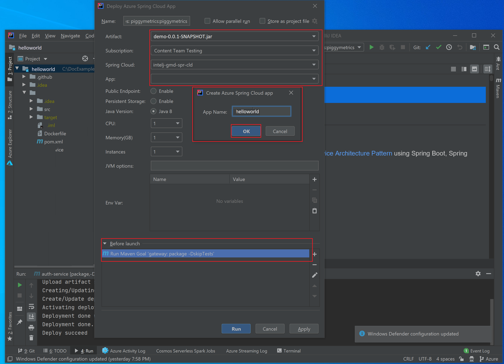
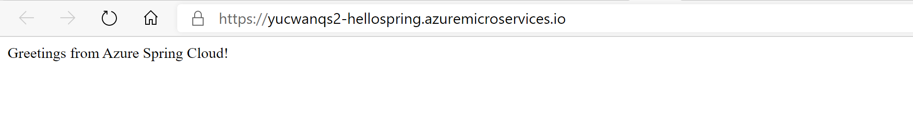
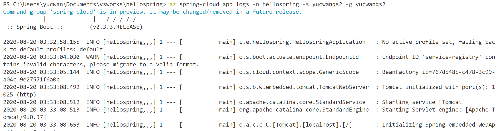
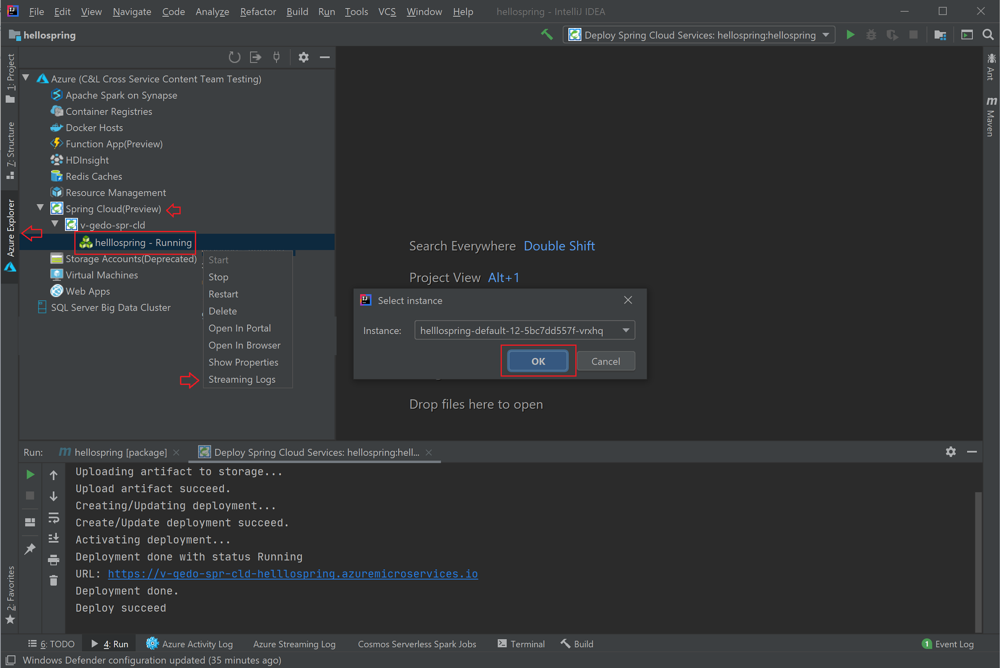
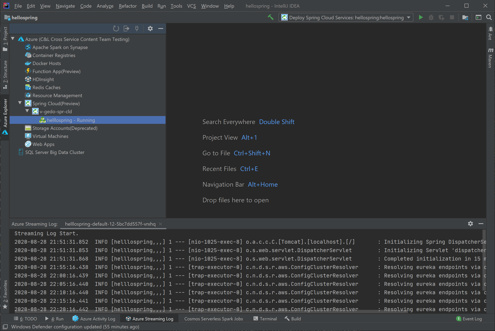

# Quickstart: Deploy your first Azure Spring Cloud application

::: zone pivot="programming-language-csharp"
This quickstart explains how to deploy a simple Azure Spring Cloud microservice application to run on Azure.

>[!NOTE]
> Steeltoe support for Azure Spring Cloud is currently offered as a public preview. Public preview offerings allow customers to experiment with new features prior to their official release.  Public preview features and services are not meant for production use.  For more information about support during previews, see the [FAQ](https://azure.microsoft.com/support/faq/) or file a [Support request](../azure-portal/supportability/how-to-create-azure-support-request.md).

By following this quickstart, you'll learn how to:

> [!div class="checklist"]
> * Generate a basic Steeltoe .NET Core project
> * Provision an Azure Spring Cloud service instance
> * Build and deploy the app with a public endpoint
> * Stream logs in real time

The application code used in this quickstart is a simple app built with a .NET Core Web API project template. When you've completed this example, the application will be accessible online and can be managed via the Azure portal and the Azure CLI.

## Prerequisites

* An Azure account with an active subscription. [Create an account for free](https://azure.microsoft.com/free/?WT.mc_id=A261C142F).
* [.NET Core 3.1 SDK](https://dotnet.microsoft.com/download/dotnet-core/3.1). The Azure Spring Cloud service supports .NET Core 3.1 and later versions.
* [Azure CLI version 2.0.67 or later](/cli/azure/install-azure-cli).
* [Git](https://git-scm.com/).

## Install Azure CLI extension

Verify that your Azure CLI version is 2.0.67 or later:

```azurecli
az --version
```

Install the Azure Spring Cloud extension for the Azure CLI using the following command:

```azurecli
az extension add --name spring-cloud
```

## Log in to Azure

1. Log in to the Azure CLI

    ```azurecli
    az login
    ```

1. If you have more than one subscription, choose the one you want to use for this quickstart.

   ```azurecli
   az account list -o table
   ```

   ```azurecli
   az account set --subscription <Name or ID of a subscription from the last step>
   ```

## Generate a Steeltoe .NET Core project

In Visual Studio, create an ASP.NET Core Web application named as "hello-world" with API project template. Please notice there will be a auto generated WeatherForecastController which will be our test endpoint later on.

1. Create a folder for the project source code and generate the project.
 
   ```console
   mkdir source-code
   ```

   ```console
   cd source-code
   ```

   ```dotnetcli
   dotnet new webapi -n hello-world --framework netcoreapp3.1
   ```

1. Navigate into the project directory.

   ```console
   cd hello-world
   ```

1. Edit the *appSettings.json* file to add the following settings:

   ```json
   "spring": {
     "application": {
       "name": "hello-world"
     }
   },
   "eureka": {
     "client": {
       "shouldFetchRegistry": true,
       "shouldRegisterWithEureka": true
     }
   }
   ```

1. Also in *appsettings.json*, change the log level for the `Microsoft` category from `Warning` to `Information`. This change ensures that logs will be produced when you view streaming logs in a later step.

   The *appsettings.json* file now looks similar to the following example:

   ```json
   {
     "Logging": {
       "LogLevel": {
         "Default": "Information",
         "Microsoft": "Information",
         "Microsoft.Hosting.Lifetime": "Information"
       }
     },
     "AllowedHosts": "*",
     "spring": {
       "application": {
         "name": "hello-world"
       }
     },
     "eureka": {
       "client": {
         "shouldFetchRegistry": true,
         "shouldRegisterWithEureka": true
       }
     }
   }
   ```
   
1. Add dependencies and a `Zip` task to the *.csproj* file:

   ```xml
   <ItemGroup>
     <PackageReference Include="Steeltoe.Discovery.ClientCore" Version="3.0.0" />
     <PackageReference Include="Microsoft.Azure.SpringCloud.Client" Version="2.0.0-preview.1" />
   </ItemGroup>
   <Target Name="Publish-Zip" AfterTargets="Publish">
	   <ZipDirectory SourceDirectory="$(PublishDir)" DestinationFile="$(MSBuildProjectDirectory)/deploy.zip" Overwrite="true" />
   </Target>
   ```

   The packages are for Steeltoe Service Discovery and the Azure Spring Cloud client library. The `Zip` task is for deployment to Azure. When you run the `dotnet publish` command, it generates the binaries in the *publish* folder, and this task zips the *publish* folder into a *.zip* file that you upload to Azure.

3. In the *Program.cs* file, add a `using` directive and code that uses the Azure Spring Cloud client library:

   ```csharp
   using Microsoft.Azure.SpringCloud.Client;
   ```

   ```csharp
   public static IHostBuilder CreateHostBuilder(string[] args) =>
               Host.CreateDefaultBuilder(args)
                   .UseAzureSpringCloudService()
                   .ConfigureWebHostDefaults(webBuilder =>
                   {
                       webBuilder.UseStartup<Startup>();
                   });
   ```

4. In the *Startup.cs* file, add a `using` directive and code that uses the Steeltoe Service Discovery at the end of the `ConfigureServices` and `Configure` methods:

   ```csharp
   using Steeltoe.Discovery.Client;
   ```

   ```csharp
   public void ConfigureServices(IServiceCollection services)
   {
       // Template code not shown.

       services.AddDiscoveryClient(Configuration);
   }
   ```

   ```csharp
   public void Configure(IApplicationBuilder app, IWebHostEnvironment env)
   {
       // Template code not shown.

       app.UseDiscoveryClient();
   }
   ```

1. Build the project to make sure there are no compile errors.

   ```dotnetcli
   dotnet build
   ```
 
## Provision a service instance

The following procedure creates an instance of Azure Spring Cloud using the Azure portal.

1. Open the [Azure portal](https://ms.portal.azure.com/). 

1. From the top search box, search for *Azure Spring Cloud*.

1. Select *Azure Spring Cloud* from the results.

   

1. On the Azure Spring Cloud page, select **+ Add**.

   

1. Fill out the form on the Azure Spring Cloud **Create** page.  Consider the following guidelines:

   * **Subscription**: Select the subscription you want to be billed for this resource.
   * **Resource group**: Create a new resource group. The name you enter here will be used in later steps as **\<resource group name\>**.
   * **Service Details/Name**: Specify the **\<service instance name\>**.  The name must be between 4 and 32 characters long and can contain only lowercase letters, numbers, and hyphens.  The first character of the service name must be a letter and the last character must be either a letter or a number.
   * **Region**: Select the region for your service instance.

   

6. Select **Review and create**.

## Build and deploy the app

The following procedure builds and deploys the project that you created earlier.

1. Make sure the command prompt is still in the project folder.

1. Run the following command to build the project, publish the binaries, and store the binaries in a *.zip* file in the project folder.

   ```dotnetcorecli
   dotnet publish -c release -o ./publish
   ```

1. Create an app in your Azure Spring Cloud instance with a public endpoint assigned. Use the same application name "hello-world" that you specified in *appsettings.json*.

   ```console
   az spring-cloud app create -n hello-world -s <service instance name> -g <resource group name> --assign-endpoint --runtime-version NetCore_31
   ```

1. Deploy the *.zip* file to the app.

   ```azurecli
   az spring-cloud app deploy -n hello-world -s <service instance name> -g <resource group name> --runtime-version NetCore_31 --main-entry hello-world.dll --artifact-path ./deploy.zip
   ```

   The `--main-entry` option identifies the *.dll* file that contains the application's entry point. After the service uploads the *.zip* file, it extracts all the files and folders and tries to execute the entry point in the *.dll* file specified by `--main-entry`.

   It takes a few minutes to finish deploying the application. To confirm that it has deployed, go to the **Apps** blade in the Azure portal.

## Test the app

Once deployment has completed, access the app at the following URL:

```http
https://<service instance name>-hello-world.azuremicroservices.io/weatherforecast
```

The app returns JSON data similar to the following example:

```json
[{"date":"2020-09-08T21:01:50.0198835+00:00","temperatureC":14,"temperatureF":57,"summary":"Bracing"},{"date":"2020-09-09T21:01:50.0200697+00:00","temperatureC":-14,"temperatureF":7,"summary":"Bracing"},{"date":"2020-09-10T21:01:50.0200715+00:00","temperatureC":27,"temperatureF":80,"summary":"Freezing"},{"date":"2020-09-11T21:01:50.0200717+00:00","temperatureC":18,"temperatureF":64,"summary":"Chilly"},{"date":"2020-09-12T21:01:50.0200719+00:00","temperatureC":16,"temperatureF":60,"summary":"Chilly"}]
```

## Stream logs in real time

Use the following command to get real time logs from the App.

```azurecli
az spring-cloud app logs -n hello-world -s <service instance name> -g <resource group name> --lines 100 -f
```

Logs appear in the output:

```output
[Azure Spring Cloud] The following environment variables are loaded:
2020-09-08 20:58:42,432 INFO supervisord started with pid 1
2020-09-08 20:58:43,435 INFO spawned: 'event-gather_00' with pid 9
2020-09-08 20:58:43,436 INFO spawned: 'dotnet-app_00' with pid 10
2020-09-08 20:58:43 [Warning] No managed processes are running. Wait for 30 seconds...
2020-09-08 20:58:44,843 INFO success: event-gather_00 entered RUNNING state, process has stayed up for > than 1 seconds (startsecs)
2020-09-08 20:58:44,843 INFO success: dotnet-app_00 entered RUNNING state, process has stayed up for > than 1 seconds (startsecs)
←[40m←[32minfo←[39m←[22m←[49m: Steeltoe.Discovery.Eureka.DiscoveryClient[0]
      Starting HeartBeat
info: Microsoft.Hosting.Lifetime[0]
      Now listening on: http://[::]:1025
info: Microsoft.Hosting.Lifetime[0]
      Application started. Press Ctrl+C to shut down.
info: Microsoft.Hosting.Lifetime[0]
      Hosting environment: Production
info: Microsoft.Hosting.Lifetime[0]
      Content root path: /netcorepublish/6e4db42a-b160-4b83-a771-c91adec18c60
2020-09-08 21:00:13 [Information] [10] Start listening...
info: Microsoft.AspNetCore.Hosting.Diagnostics[1]
      Request starting HTTP/1.1 GET http://asc-svc-hello-world.azuremicroservices.io/weatherforecast
info: Microsoft.AspNetCore.Routing.EndpointMiddleware[0]
      Executing endpoint 'hello_world.Controllers.WeatherForecastController.Get (hello-world)'
info: Microsoft.AspNetCore.Mvc.Infrastructure.ControllerActionInvoker[3]
      Route matched with {action = "Get", controller = "WeatherForecast"}. Executing controller action with signature System.Collections.Generic.IEnumerable`1[hello_world.WeatherForecast] Get() on controller hello_world.Controllers.WeatherForecastController (hello-world).
info: Microsoft.AspNetCore.Mvc.Infrastructure.ObjectResultExecutor[1]
      Executing ObjectResult, writing value of type 'hello_world.WeatherForecast[]'.
info: Microsoft.AspNetCore.Mvc.Infrastructure.ControllerActionInvoker[2]
      Executed action hello_world.Controllers.WeatherForecastController.Get (hello-world) in 1.8902ms
info: Microsoft.AspNetCore.Routing.EndpointMiddleware[1]
      Executed endpoint 'hello_world.Controllers.WeatherForecastController.Get (hello-world)'
info: Microsoft.AspNetCore.Hosting.Diagnostics[2]
      Request finished in 4.2591ms 200 application/json; charset=utf-8
```

> [!TIP]
> Use `az spring-cloud app logs -h` to explore more parameters and log stream functionalities.

For advanced log analytics features, visit **Logs** tab in the menu on [Azure portal](https://portal.azure.com/). Logs here have a latency of a few minutes.
[  ](media/spring-cloud-quickstart-java/logs-analytics.png#lightbox)
::: zone-end

::: zone pivot="programming-language-java"
This quickstart explains how to deploy a simple Azure Spring Cloud microservice application to run on Azure. 

The application code used in this tutorial is a simple app built with Spring Initializr. When you've completed this example, the application will be accessible online and can be managed via the Azure portal.

This quickstart explains how to:

> [!div class="checklist"]
> * Generate a basic Spring Cloud project
> * Provision a service instance
> * Build and deploy the app with a public endpoint
> * Stream logs in real time

## Prerequisites

To complete this quickstart:

* [Install JDK 8](/java/azure/jdk/)
* [Sign up for an Azure subscription](https://azure.microsoft.com/free/)
* (Optional) [Install the Azure CLI version 2.0.67 or higher](/cli/azure/install-azure-cli) and the Azure Spring Cloud extension with command: `az extension add --name spring-cloud`
* (Optional) [Install the Azure Toolkit for IntelliJ](https://plugins.jetbrains.com/plugin/8053-azure-toolkit-for-intellij/) and [sign-in](/azure/developer/java/toolkit-for-intellij/create-hello-world-web-app#installation-and-sign-in)

## Generate a Spring Cloud project

Start with [Spring Initializr](https://start.spring.io/#!type=maven-project&language=java&platformVersion=2.3.10.RELEASE&packaging=jar&jvmVersion=1.8&groupId=com.example&artifactId=hellospring&name=hellospring&description=Demo%20project%20for%20Spring%20Boot&packageName=com.example.hellospring&dependencies=web,cloud-eureka,actuator,cloud-starter-sleuth,cloud-starter-zipkin,cloud-config-client) to generate a sample project with recommended dependencies for Azure Spring Cloud. The following image shows the Initializr set up for this sample project.
```url
https://start.spring.io/#!type=maven-project&language=java&platformVersion=2.3.10.RELEASE&packaging=jar&jvmVersion=1.8&groupId=com.example&artifactId=hellospring&name=hellospring&description=Demo%20project%20for%20Spring%20Boot&packageName=com.example.hellospring&dependencies=web,cloud-eureka,actuator,cloud-starter-sleuth,cloud-starter-zipkin,cloud-config-client
```
Note that this example uses Java version 8.  If you want to use Java version 11, change the option under **Project Metadata**.

  

1. Click **Generate** when all the dependencies are set. Download and unpack the package, then create a web controller for a simple web application by adding `src/main/java/com/example/hellospring/HelloController.java` as follows:

    ```java
    package com.example.hellospring;
    
    import org.springframework.web.bind.annotation.RestController;
    import org.springframework.web.bind.annotation.RequestMapping;
    
    @RestController
    public class HelloController {
    
    	@RequestMapping("/")
    	public String index() {
    		return "Greetings from Azure Spring Cloud!";
    	}
    
    }
    ```
## Provision an instance of Azure Spring Cloud

The following procedure creates an instance of Azure Spring Cloud using the Azure portal.

1. In a new tab, open the [Azure portal](https://ms.portal.azure.com/). 

2. From the top search box, search for *Azure Spring Cloud*.

3. Select *Azure Spring Cloud* from the results.

    

4. On the Azure Spring Cloud page, click **+ Add**.

    

5. Fill out the form on the Azure Spring Cloud **Create** page.  Consider the following guidelines:
    - **Subscription**: Select the subscription you want to be billed for this resource.
    - **Resource group**: Creating new resource groups for new resources is a best practice. This will be used in later steps as **\<resource group name\>**.
    - **Service Details/Name**: Specify the **\<service instance name\>**.  The name must be between 4 and 32 characters long and can contain only lowercase letters, numbers, and hyphens.  The first character of the service name must be a letter and the last character must be either a letter or a number.
    - **Location**: Select the region for your service instance.

    

6. Click **Review and create**.

## Build and deploy the app
    
#### [CLI](#tab/Azure-CLI)
The following procedure builds and deploys the application using the Azure CLI. Execute the following command at the root of the project.

1. Build the project using Maven:

    ```console
    mvn clean package -DskipTests
    ```

1. (If you haven't already installed it) Install the Azure Spring Cloud extension for the Azure CLI:

    ```azurecli
    az extension add --name spring-cloud
    ```
    
1. Create the app with public endpoint assigned. If you are using Java 11, include the `--runtime-version=Java_11` switch.

    ```azurecli
    az spring-cloud app create -n hellospring -s <service instance name> -g <resource group name> --assign-endpoint true
    ```

1. Deploy the Jar file for the app (`target\hellospring-0.0.1-SNAPSHOT.jar` on Windows):

    ```azurecli
    az spring-cloud app deploy -n hellospring -s <service instance name> -g <resource group name> --jar-path <jar file path>
    ```
    
1. It takes a few minutes to finish deploying the application. To confirm that it has deployed, go to the **Apps** blade in the Azure portal. You should see the status of the application.

#### [IntelliJ](#tab/IntelliJ)

The following procedure uses the IntelliJ plug-in for Azure Spring Cloud to deploy the sample app in the IntelliJ IDEA.  

### Import project

1. Open IntelliJ **Welcome** dialog, and select **Import Project** to open the import wizard.
1. Select `hellospring` folder.

    

### Deploy the app
In order to deploy to Azure you must sign in with your Azure account, and choose your subscription.  For sign-in details, see [Installation and sign-in](/azure/developer/java/toolkit-for-intellij/create-hello-world-web-app#installation-and-sign-in).

1. Right-click your project in IntelliJ project explorer, and select **Azure** -> **Deploy to Azure Spring Cloud**.

    [  ](media/spring-cloud-quickstart-java/intellij-deploy-azure-1.png#lightbox)

1. Accept the name for app in the **Name** field. **Name** refers to the configuration, not app name. Users don't usually need to change it.
1. In the **Artifact** textbox, select *hellospring-0.0.1-SNAPSHOT.jar*.
1. In the **Subscription** textbox, verify your subscription.
1. In the **Spring Cloud** textbox, select the instance of Azure Spring Cloud that you created in [Provision Azure Spring Cloud instance](./spring-cloud-quickstart-provision-service-instance.md).
1. Set **Public Endpoint** to *Enable*.
1. In the **App:** textbox, select **Create app...**.
1. Enter *hellospring*, then click **OK**.

    [  ](media/spring-cloud-quickstart-java/intellij-deploy-to-azure.png#lightbox)

1. Start the deployment by clicking **Run** button at the bottom of the **Deploy Azure Spring Cloud app** dialog. The plug-in will run the command `mvn package` on the `hellospring` app and deploy the jar generated by the `package` command.
---

Once deployment has completed, you can access the app at `https://<service instance name>-hellospring.azuremicroservices.io/`.

  [  ](media/spring-cloud-quickstart-java/access-app-browser.png#lightbox)

## Streaming logs in real time

#### [CLI](#tab/Azure-CLI)

Use the following command to get real time logs from the App.

```azurecli
az spring-cloud app logs -n hellospring -s <service instance name> -g <resource group name> --lines 100 -f

```
Logs appear in the results:

[  ](media/spring-cloud-quickstart-java/streaming-logs.png#lightbox)

>[!TIP]
> Use `az spring-cloud app logs -h` to explore more parameters and log stream functionalities.

#### [IntelliJ](#tab/IntelliJ)

1. Select **Azure Explorer**, then **Spring Cloud**.
1. Right-click the running app.
1. Select **Streaming Logs** from the drop-down list.
1. Select instance.

    [  ](media/spring-cloud-quickstart-java/intellij-get-streaming-logs.png)

1. The streaming log will be visible in the output window.

    [  ](media/spring-cloud-quickstart-java/intellij-streaming-logs-output.png)
---

For advanced logs analytics features, visit **Logs** tab in the menu on [Azure portal](https://portal.azure.com/). Logs here have a latency of a few minutes.

[  ](media/spring-cloud-quickstart-java/logs-analytics.png#lightbox)
::: zone-end

## Clean up resources

In the preceding steps, you created Azure resources that will continue to accrue charges while they remain in your subscription. If you don't expect to need these resources in the future, delete the resource group from the portal or by running the following command in the Azure CLI:

```azurecli
az group delete --name <your resource group name; for example: hellospring-1558400876966-rg> --yes
```

## Next steps

In this quickstart, you learned how to:

> [!div class="checklist"]
> * Generate a basic Azure Spring Cloud project
> * Provision a service instance
> * Build and deploy the app with a public endpoint
> * Stream logs in real time

To learn how to use more Azure Spring capabilities, advance to the quickstart series that deploys a sample application to Azure Spring Cloud:

> [!div class="nextstepaction"]
> [Build and Run Microservices](spring-cloud-quickstart-sample-app-introduction.md)

More samples are available on GitHub: [Azure Spring Cloud Samples](https://github.com/Azure-Samples/Azure-Spring-Cloud-Samples).
