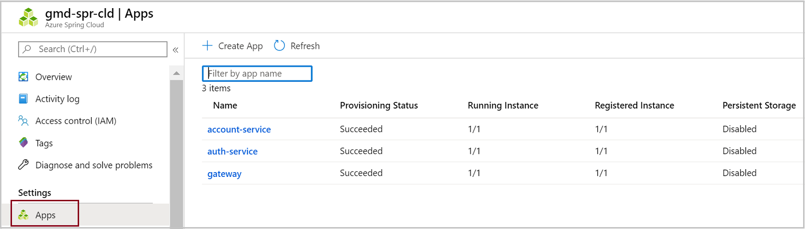
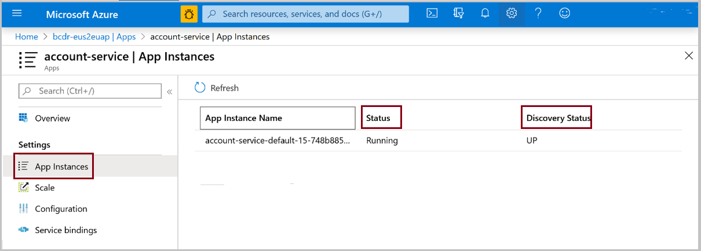

# Understanding app status in Azure Spring Cloud

The Azure Spring Cloud UI delivers information about the status of running applications.  There is an **Apps** option for each resource group in a subscription that displays general status of application types.  For each application type, there is display of **Application instances**.

## Apps status
To view general status of an application type, select **Apps** in the left navigation pane of a resource group. The result displays the status of the deployed app:

* **Provisioning Status** shows the deployment’s provisioning state
* **Running instance** shows how many app instances are running/how many app instances are desired. If the app should be stopped, this column shows *stopped*.
* **Registered Instance** shows how many app instances are registered to eureka/how many app instance are desired. If the app should be stopped, this column shows *stopped*.

 

**The deployment status is reported as one of the following values:**

| Enum | Definition |
|:--:|:----------------:|
| Running | The deployment SHOULD be running. |
| Stopped | The deployment SHOULD be stopped. |

**The provisioning state is accessible only from the CLI.  It is reported as one of the following values:**

| Enum | Definition |
|:--:|:----------------:|
| Creating | The resource is creating. |
| Updating | The resource is updating. |
| Succeeded | Successfully supplied resources and deploys the binary. |
| Failed | Failed to achieve the *Succeeded* goal. |
| Deleting | The resource is being deleted. This prevents operation, and the resource is not available in this status. |

## App instances status

To view the status of a specific instance of a deployed app, click the **Name** of the app in the **Apps** UI. The results will display:
* **Status**: Whether the instance is running or its state
* **DiscoveryStatus**: The registered status of the app instance in Eureka server

 

**The instance status is reported as one of the following values:**

| Enum | Definition |
|:--:|:----------------:|
| Starting | The binary is successfully deployed to the given instance. Instance booting the jar file may fail because jar cannot run properly. |
| Running | The instance works. |
| Failed | The app instance failed to start user’s binary after several retries. |
| Terminating | The app instance is shutting down. |

**The discovery status of the instance is reported as one of the following values:**

| Enum | Definition |
|:--:|:----------------:|
| UP | The app instance is registered to eureka and ready to receive traffic |
| OUT_OF_SERVICE | The app instance is registered to Eureka and able to receive traffic. but shuts down for traffic intentionally. |
| DOWN | The app instance is not registered to Eureka or is registered but not able to receive traffic. |

## See also
* [Prepare a Java Spring application for deployment in Azure Spring Cloud](spring-cloud-tutorial-prepare-app-deployment.md)