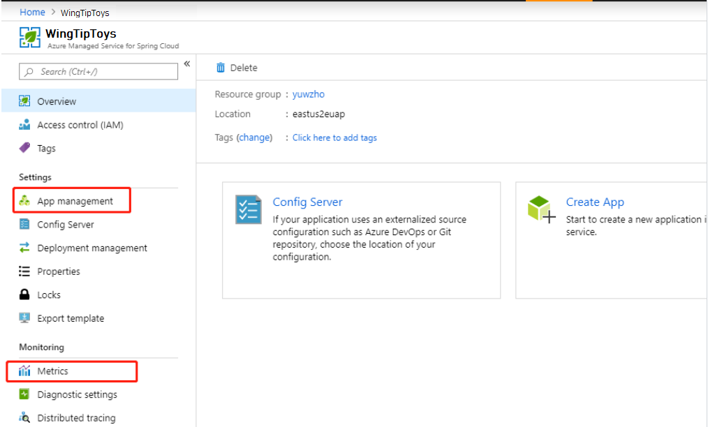
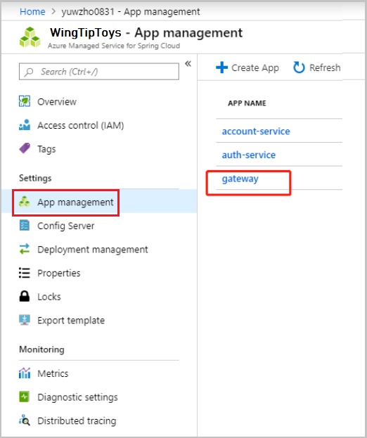
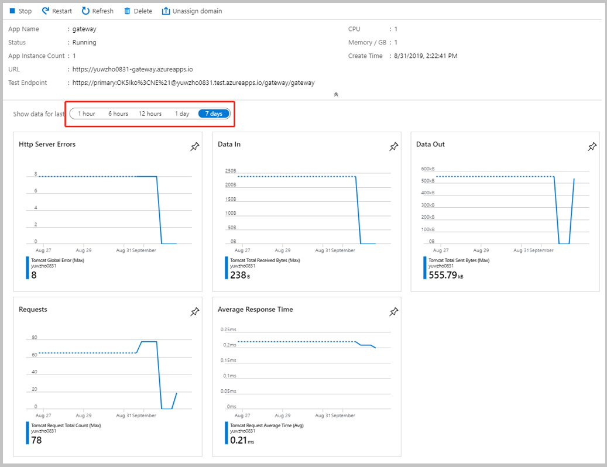
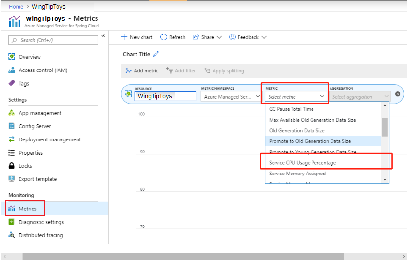
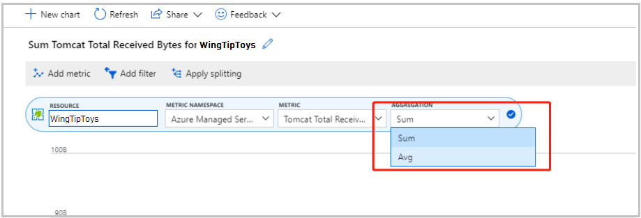
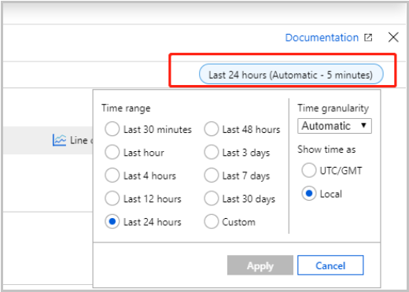
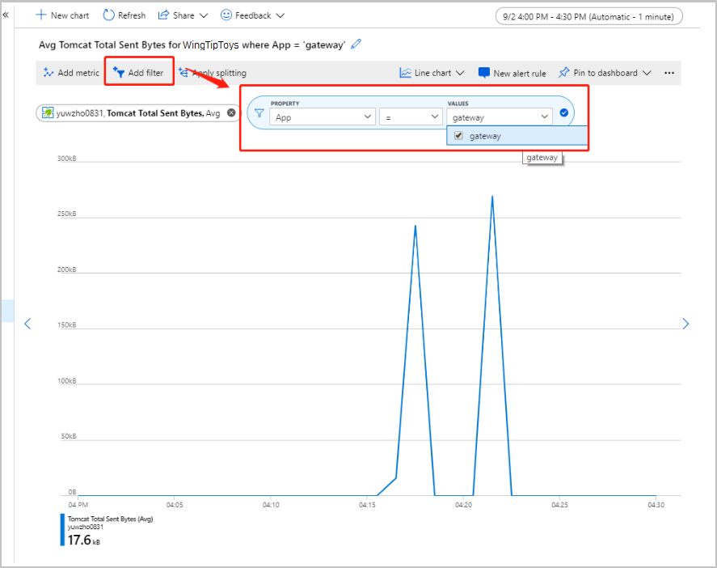
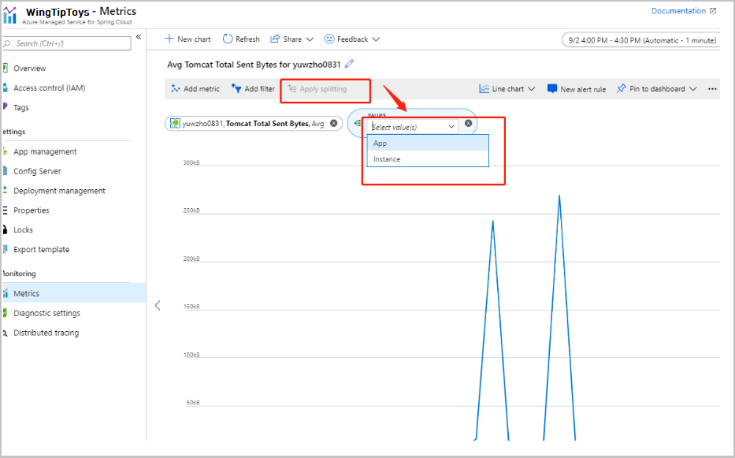

# Understand metrics for Azure Spring Cloud

Azure Metrics explorer is a component of the Microsoft Azure portal that allows plotting charts, visually correlating trends, and investigating spikes and dips in metrics. Use the metrics explorer to investigate the health and utilization of your resources. 

In Azure Spring Cloud, there are two view points for metrics.
* Charts in each application overview page
* Common metrics page

 

Charts in the application **Overview** provide quick status checks for each application. The common **Metrics** page contains all metrics available for reference. You can build your own charts in the common metrics page and pin them in Dashboard.

## Application overview page
Select an app in **App Management** to find charts in the overview page.  

 

Each application's **Application Overview** page presents a metrics chart that allows you to perform a quick status check of your application.  

 

Azure Spring Cloud provides these five charts with metrics that are updated every minute:

* **Http Server Errors**: Error count for HTTP requests to your app
* **Data In**: Bytes received by your app
* **Data Out**: Bytes sent by your app
* **Requests**: Requests received by your app
* **Average Response Time**: Average response time from your app

For the chart, you can select a time range from one hour to seven days.

## Common metrics page

The **Metrics** in the left navigation pane links to the common metrics page.

First, select metrics to view:

Next, select aggregation type for each metric:

The aggregation type indicates how to aggregate time. There is one metric point every minute.
* Total: Sum all metrics as target output.
* Average: Use the Average value in the period as target output.
* Max/Min: Use the Max/Min value in the period as target output.

Time range to show can also be modified.  The time range can be chosen from last 30 minutes to last 30 days, or a custom time range.

The default view includes all of an Azure Spring Cloud service's application's metrics together. Metrics of one app or instance can be filtered in the display.  Click **Add filter**, set the property to **App**, and select the target application you want to monitor in the **Values** text box. 

You can use two kinds of filters (properties):
* App: filter by app name
* Instance: filter by app instance

YOu can also use the **Apply splitting** option, which will draw multiple lines for one app:

>[!TIP]
> You can build your own charts in metrics page and pin them to your **Dashboard**. Start by naming your chart.  Next, select **Pin to dashboard in the top right corner**. You can now check on your application at your Portal **Dashboard**.

## User portal metrics options

The following table shows the available metrics and details.
>[!div class="mx-tdBreakAll"]
>| Name | Display Name | Spring Actuator Metric Name | Unit | Details |
>|----|----|----|----|------------|
>| SystemCpuUsagePercentage | System CPU Usage Percentage | system.cpu.usage | Percent | Recent CPU usage for the whole system. This value is a double in the [0.0,1.0] interval. A value of 0.0 means that all CPUs were idle during the recent period of time observed, while a value of 1.0 means that all CPUs were actively running 100% of the time during the recent period being observed. All values between 0.0 and 1.0 are possible depending on the activities going on in the system. If the system recent cpu usage is not available, the method returns a negative value. |
>| AppCpuUsagePercentage | App CPU Usage Percentage | App CPU Usage Percentage | Percent | Recent CPU usage for the Java Virtual Machine process. This value is a double in the [0.0,1.0] interval. A value of 0.0 means that none of the CPUs were running threads from the JVM process during the recent period of time observed, while a value of 1.0 means that all CPUs were actively running threads from the JVM 100% of the time during the recent period being observed. Threads from the JVM include the application threads as well as the JVM internal threads. All values between 0.0 and 1.0 are possible depending on the activities going on in the JVM process and the whole system. If the Java Virtual Machine recent CPU usage is not available, the method returns a negative value. |
>| AppMemoryCommitted | App Memory Assigned | jvm.memory.committed | Bytes | Represents the amount of memory (in bytes) that is guaranteed to be available for use by the Java virtual machine. The amount of committed memory may change over time (increase or decrease). The Java virtual machine may release memory to the system and committed could be less than init. committed will always be greater than or equal to used. |
>| AppMemoryUsed | App Memory Used | jvm.memory.used | Bytes | Represents the amount of memory currently used in bytes. |
>| AppMemoryMax | App Memory Max | jvm.memory.max | Bytes | Represents the maximum amount of memory (in bytes) that can be used for memory management. Its value may be undefined. The maximum amount of memory may change over time if defined. The amount of used and committed memory will always be less than or equal to max if max is defined. A memory allocation may fail if it attempts to increase the used memory such that used > committed even if used <= max would still be true (for example, when the system is low on virtual memory). |
>| MaxOldGenMemoryPoolBytes | Max Available Old Generation Data Size | jvm.gc.max.data.size | Bytes | The peak memory usage of the old generation memory pool since the Java virtual machine was started. |
>| OldGenMemoryPoolBytes | Old Generation Data Size | jvm.gc.live.data.size | Bytes | Size of old generation memory pool after a full GC. |
>| OldGenPromotedBytes | Promote to Old Generation Data Size | jvm.gc.memory.promoted | Bytes | Count of positive increases in the size of the old generation memory pool before GC to after GC. |
>| YoungGenPromotedBytes | Promote to Young Generation Data Size | jvm.gc.memory.allocated | Bytes | Incremented for an increase in the size of the young generation memory pool after one GC to before the next. |
>| GCPauseTotalCount | GC Pause Count | jvm.gc.pause (total-count) | Count | Total GC count after this JMV started, including Young and Old GC. |
>| GCPauseTotalTime | GC Pause Total Time | jvm.gc.pause (total-time) | Milliseconds | Total GC time consumed after this JMV started, including Young and Old GC. |
>| TomcatSentBytes | Tomcat Total Sent Bytes | tomcat.global.sent | Bytes | Amount of data Tomcat web server sent, in bytes |
>| TomcatReceivedBytes | Tomcat Total Received Bytes | tomcat.global.received | Bytes | Amount of data Tomcat web server received, in bytes |
>| TomcatRequestTotalTime | Tomcat Request Total Time | tomcat.global.request (total-time) | Milliseconds | Total time of Tomcat web server to process the requests. |
>| TomcatRequestTotalCount | Tomcat Request Total Count | tomcat.global.request (total-count) | Count | Total count of Tomcat web server processed requests |
>| TomcatRequestMaxTime | Tomcat Request Max Time | tomcat.global.request.max | Milliseconds | Maximum time of Tomcat web server to process a request |
>| TomcatErrorCount | Tomcat Global Error | tomcat.global.error | Count | Number of errors occurs of processed requests |
>| TomcatSessionActiveMaxCount | Tomcat Session Max Active Count | tomcat.sessions.active.max | Count | Maximum number of sessions that have been active at the same time |
>| TomcatSessionAliveMaxTime | Tomcat Session Max Alive Time | tomcat.sessions.alive.max | Milliseconds | Longest time (in seconds) that an expired session had been alive |
>| TomcatSessionCreatedCount | Tomcat Session Created Count | tomcat.sessions.created | Count | Number of sessions that have been created |
>| TomcatSessionExpiredCount | Tomcat Session Expired Count | tomcat.sessions.expired | Count | Number of sessions that have expired |
>| TomcatSessionRejectedCount | Tomcat Session Rejected Count | tomcat.sessions.rejected | Count | Number of sessions that were not created because the maximum number of active sessions reached. |

## See also
* [Getting started with Azure Metrics Explorer](https://docs.microsoft.com/azure/azure-monitor/platform/metrics-getting-started)

* [Analyze logs and metrics with diagnostics settings](https://docs.microsoft.com/azure/spring-cloud/diagnostic-services)

## Next steps
* [Tutorial: Monitor Spring Cloud resources using alerts and action groups](https://docs.microsoft.com/azure/spring-cloud/spring-cloud-tutorial-alerts-action-groups)

* [Quotas and Service Plans for Azure Spring Cloud](https://docs.microsoft.com/azure/spring-cloud/spring-cloud-quotas)

