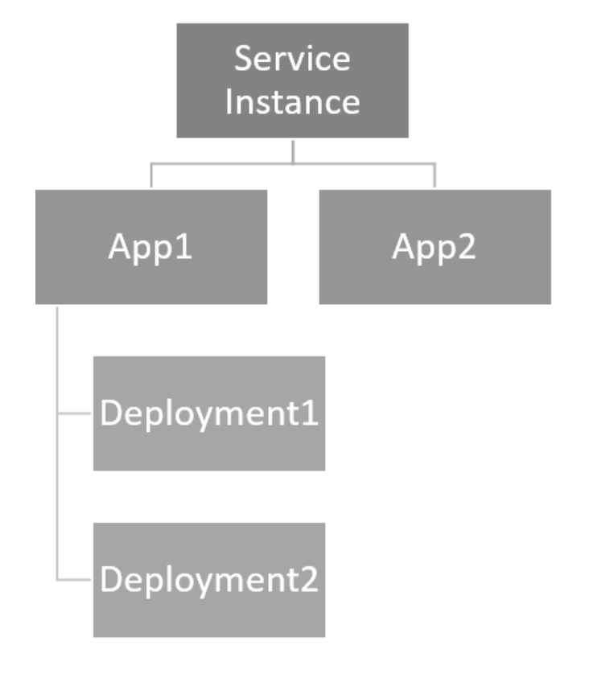

# Understanding app and deployment in Azure Spring Cloud

**App** and **Deployment** are the two key concepts in the resource model of Azure Spring Cloud. In Azure Spring Cloud, an *App* is an abstraction of one business app or one microservice.  One version of code or binary deployed as the *App* runs in a *Deployment*.

 

Azure Spring Cloud standard tier allows one App to have one production deployment and one staging deployment, so that you can do blue/green deployment on it easily.

## App
The following features/properties are defined on App level.

| Enum | Definition |
|:--:|:----------------:|
| Public Endpoint | The URL to access the app |
| Custom Domain | CNAME record that secures the custom domain |
| Service Binding | Binding configuration properties set in the function.json file and the ServiceBusTrigger attribute |
| Managed Identity | Managed identity by Azure Active Directory allows your app to easily access other Azure AD-protected resources such as Azure Key Vault |
| Persistent Storage | App Service setting that enables data to persist beyond app restart |

## Deployment

The following features/properties are defined on Deployment level, and will be exchanged when swapping production/staging deployment.

| Enum | Definition |
|:--:|:----------------:|
| CPU | Number of vcores per App instance |
| Memory | App Service setting that allocates memory to scale up or scale out deployments |
| Instance Count | The number of app instances, set manually or automatically in App Service |
| Auto-Scale | Scale instance count automatically based on predefined rules and schedules |
| JVM Options | App Service setting: JAVA_OPTS |
| Environment Variables | Settings that apply to the entire Azure App Service environment |
| Runtime Version | Java 8/Java 11|

## Restrictions

* **An App must have one production Deployment**: Deleting a production Deployment is blocked by the API. It should be swapped to staging before deleting.
* **An App can have at most two Deployments**: Creating more than two deployments is blocked by the API. Deploy your new binary to either the existing production or staging deployment.
* **Deployment management is not available in Basic Tier**: Use Standard tier for Blue-Green deployment capability.

## See also
* [Set up a staging environment in Azure Spring Cloud](spring-cloud-howto-staging-environment.md)
* [Introduction to the App Service Environments](https://docs.microsoft.com/azure/app-service/environment/intro)