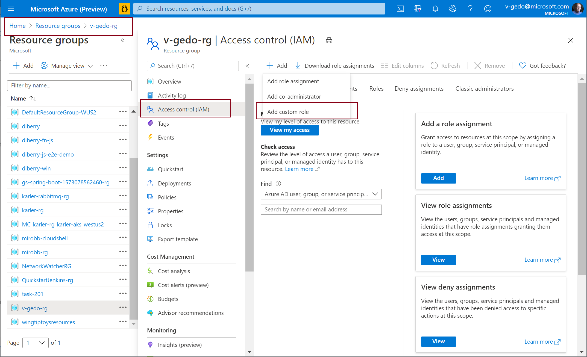
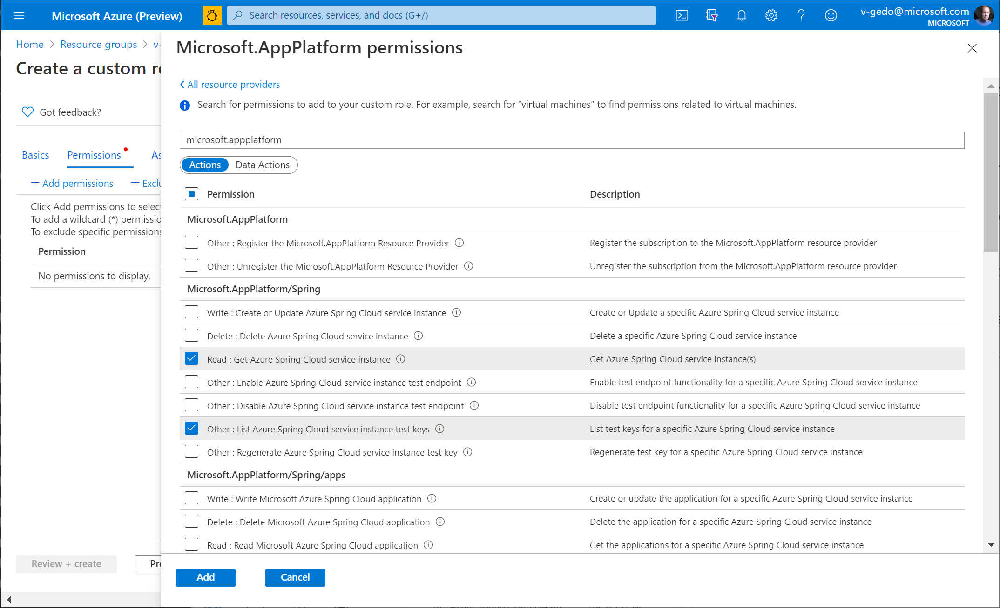
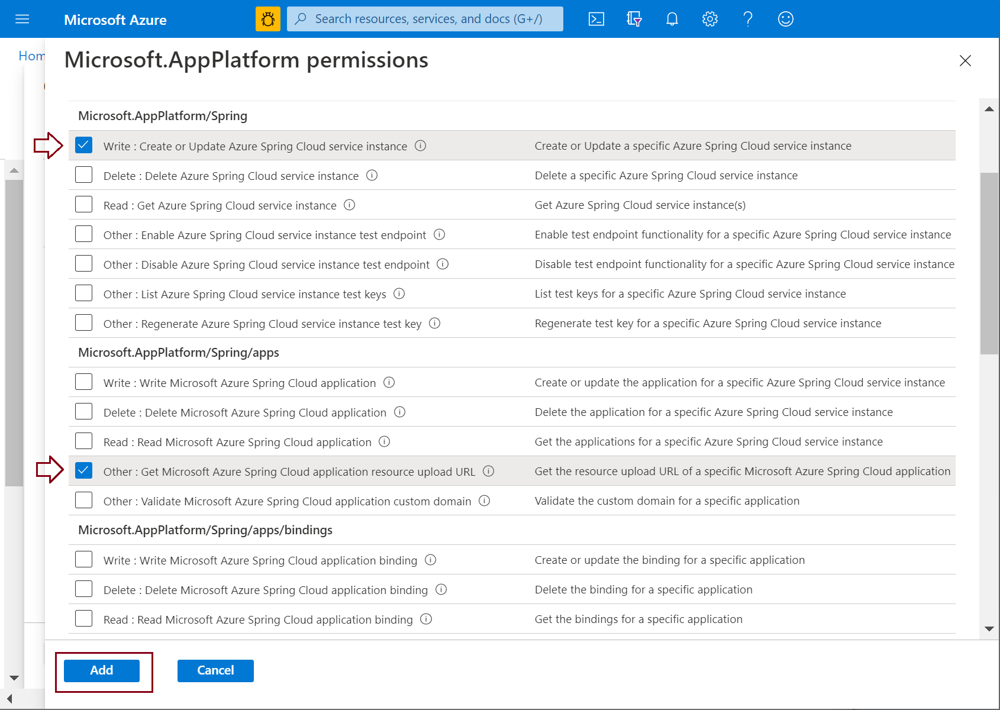
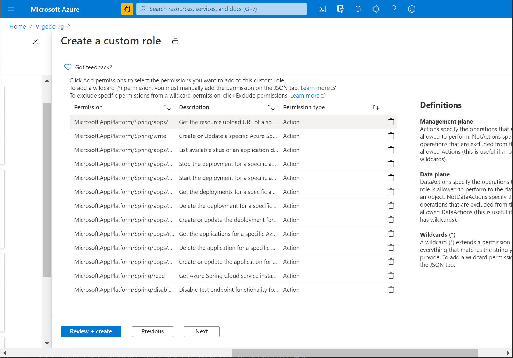
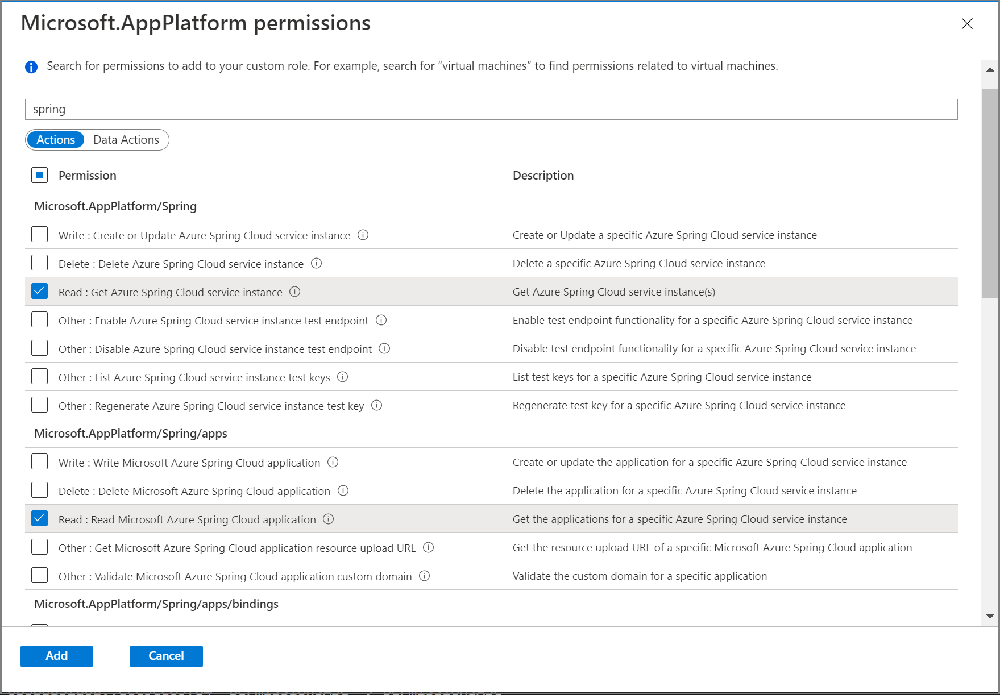

# How to use permissions in Azure Spring Cloud
This article shows you how to create custom roles that delegate permissions to Azure Spring Cloud resources. Custom roles extend [built-in Azure roles](https://docs.microsoft.com/azure/role-based-access-control/built-in-roles) with various stock permissions.

We implement the following roles:
* Deploy, test, and restart apps
* DevOps
* Developer

## Navigate subscription and resource group Access control (IAM)

Follow these steps to start defining a role.

1. In the Azure portal, open the subscription and resource group where you want the custom role to be assignable.
1. Open **Access control (IAM)**.
1. Click **+ Add**.
1. Click **Add custom role**.

   

## Define role to deploy, test, and restart apps
This procedure defines a role with permissions to deploy, test, and restart Azure Spring Cloud apps.

1. In the **Create custom role** dialog add role name and description.
2. Click **Next**.

   

3. Click **Add permissions**.

   

4. In the search box, search for *Microsoft.app*.
5. Select *Microsoft Azure Spring Cloud*.

   

6. Select the permissions:

From Microsoft.AppPlatform/Spring

select:

   Read : Get Azure Spring Cloud service instance

   Other : List Azure Spring Cloud service instance test keys

From Microsoft.AppPlatform/Spring/apps/deployments

select: 

   Other : Start Microsoft Azure Spring Cloud application deployment

   Other : Stop Microsoft Azure Spring Cloud application deployment

   

7. Click **Add**.

## Define DevOps role

1. Repeat the previous procedures to create a role.

   
2. Open the **Permissions** options.

3. Select the permissions:
  
From: Microsoft.AppPlatform/Spring

select:
 
   Write : Create or Update Azure Spring Cloud service instance

   Read : Get Azure Spring Cloud service instance

   Other : Get Microsoft Azure Spring Cloud application resource upload URL

From: Microsoft.AppPlatform/Spring/apps

select:

   Write : Write Microsoft Azure Spring Cloud application

   Delete : Delete Microsoft Azure Spring Cloud application

   Read : Read Microsoft Azure Spring Cloud application

   Other : Get Microsoft Azure Spring Cloud application resource upload URL

From Microsoft.AppPlatform/Spring/apps/deployments

select:

   Write : Write Microsoft Azure Spring Cloud application deployment

   Delete : Delete Microsoft Azure Spring Cloud application deployment

   Read : Read Microsoft Azure Spring Cloud application deployment

   Other : Start Microsoft Azure Spring Cloud application deployment

   Other : Stop Microsoft Azure Spring Cloud application deployment

From: Microsoft.AppPlatform/Spring/apps/deployments/skus

select:

   Read: List application deployment available skus    

   

4. Click **Add**.

5. Review the permissions.
   

6. Click **Review and create**.

## Define Developer role

1. Repeat the previous procedures to create a new role.
2. Select the permissions:

From: Microsoft.AppPlatform/Spring

select:

   Read : Get Azure Spring Cloud service instance

From: Microsoft.AppPlatform/Spring/apps

select:

   Read : Read Microsoft Azure Spring Cloud application

From: Microsoft.AppPlatform/Spring/apps/deployments

select:

   Read : Read Microsoft Azure Spring Cloud application deployment

   Other : Start Microsoft Azure Spring Cloud application deployment

   Other : Stop Microsoft Azure Spring Cloud application deployment

   Other : Restart Microsoft Azure Spring Cloud application deployment

  

3. Click **Add**.

For more information about three methods that define a custom permissions see:
* [Clone a role](https://docs.microsoft.com/azure/role-based-access-control/custom-roles-portal#clone-a-role)
* [Start from scratch](https://docs.microsoft.com/azure/role-based-access-control/custom-roles-portal#start-from-scratch)
* [Start from JSON](https://docs.microsoft.com/azure/role-based-access-control/custom-roles-portal#start-from-json)

## See also
[Create or update Azure custom roles using the Azure portal](https://docs.microsoft.com/azure/role-based-access-control/custom-roles-portal)