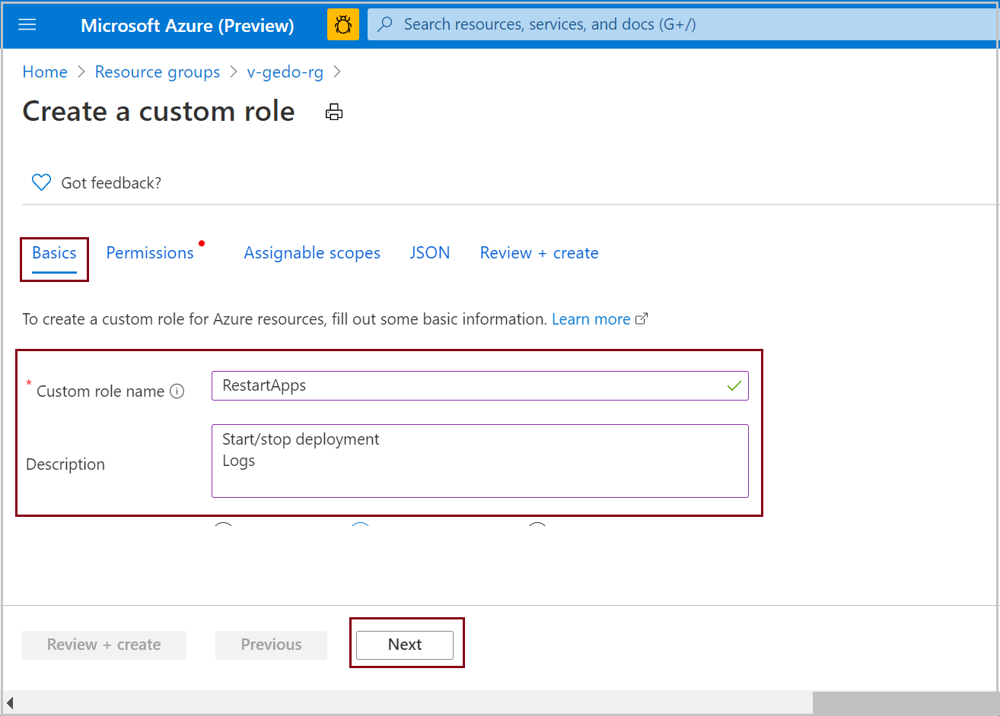
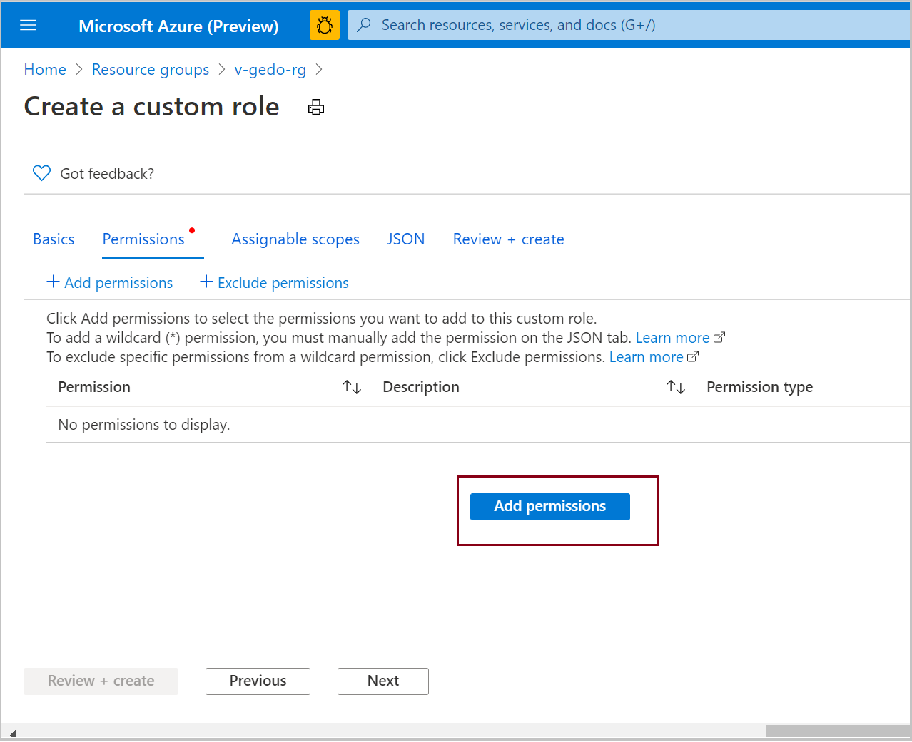
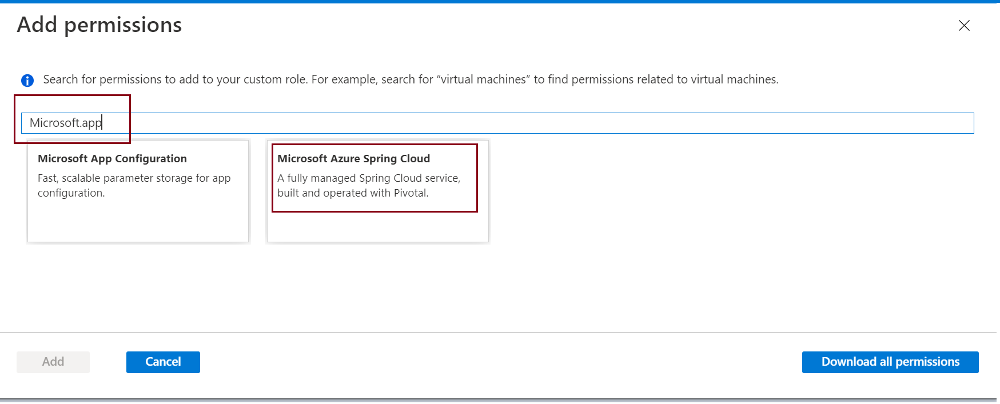

# How to use permissions in Azure Spring Cloud
This article shows you how to create custom roles that delegate permissions to Azure Spring Cloud resources. Custom roles extend [Azure built-in roles](https://docs.microsoft.com/azure/role-based-access-control/built-in-roles) with various stock permissions.

We will implement the following custom roles:

* **Developer role**: 
    * Deploy
    * Test
    * Restart apps
    * Can apply and make changes to app configurations in the git repository
    * Can get the log stream
* **Ops - Site Reliability Engineering**: 
    * Restart apps
    * Get log streams
    * Cannot make changes to apps or configurations
* **Azure Pipelines/Jenkins/Github Actions role**:
    * Can perform create, read, update, delete operations
    * Can create and configure everything in Azure Spring Cloud and apps within service instance: Azure Pipelines, Jenkins or GitHub Actions, using Terraform or ARM Templates

## Define Developer role

The developer role includes permissions to restart apps and see their log streams, but cannot make changes to apps, configuration.

### Navigate subscription and resource group Access control (IAM)

Follow these steps to start defining a role.

1. In the Azure portal, open the subscription and resource group where you want the custom role to be assignable.
2. Open **Access control (IAM)**.
3. Click **+ Add**.
4. Click **Add custom role**.
5. Click **Next**.

   

6. Click **Add permissions**.

   

### Search for Azure Spring Cloud permissions:
7. In the search box, search for *Microsoft.app*.
Select *Microsoft Azure Spring Cloud*.

   

8. Select the permissions for the developer role:

From **Microsoft.AppPlatform/Spring**, select:
* Write : Create or Update Azure Spring Cloud service instance
* Read : Get Azure Spring Cloud service instance
* Other : List Azure Spring Cloud service instance test keys

From **Microsoft.AppPlatform/Spring/apps**, select:
* Read : Read Microsoft Azure Spring Cloud application
* Other : Get Microsoft Azure Spring Cloud application resource upload URL

From **Microsoft.AppPlatform/Spring/apps/bindings**, select:
* Read : Read Microsoft Azure Spring Cloud application binding

From **Microsoft.AppPlatform/Spring/apps/deployments**, select:
* Write : Write Microsoft Azure Spring Cloud application deployment
* Read : Read Microsoft Azure Spring Cloud application deployment
* Other : Start Microsoft Azure Spring Cloud application deployment
* Other : Stop Microsoft Azure Spring Cloud application deployment
* Other : Restart Microsoft Azure Spring Cloud application deployment
* Other : Get Microsoft Azure Spring Cloud application deployment log file URL

From **Microsoft.AppPlatform/Spring/apps/domains**, select:
* Read : Read Microsoft Azure Spring Cloud application custom domain

From **Microsoft.AppPlatform/Spring/certificates**, select:
* Read : Read Microsoft Azure Spring Cloud certificate

From **Microsoft.AppPlatform/locations/operationResults/Spring**, select:
* Read : Read operation result

From **Microsoft.AppPlatform/locations/operationStatus/operationId**, select:
* Read : Read operation status

    

9. Click **Add**.

10. Review the permissions.

11. Click **Review and create**.

## Define DevOps engineer role
This procedure defines a role with permissions to deploy, test, and restart Azure Spring Cloud apps.

1. Repeat the procedure to navigate subscription, resource group,and access Access control (IAM).
2. Select the permissions for the DevOps engineer role:

From **Microsoft.AppPlatform/Spring**, select:
* Write : Create or Update Azure Spring Cloud service instance
* Delete : Delete Azure Spring Cloud service instance
* Read : Get Azure Spring Cloud service instance
* Other : Enable Azure Spring Cloud service instance test endpoint
* Other : Disable Azure Spring Cloud service instance test endpoint
* Other : List Azure Spring Cloud service instance test keys
* Other : Regenerate Azure Spring Cloud service instance test key

From **Microsoft.AppPlatform/Spring/apps**, select:
* Write : Write Microsoft Azure Spring Cloud application
* Delete : Delete Microsoft Azure Spring Cloud application
* Read : Read Microsoft Azure Spring Cloud application
* Other : Get Microsoft Azure Spring Cloud application resource upload URL
* Other : Validate Microsoft Azure Spring Cloud application custom domain

From **Microsoft.AppPlatform/Spring/apps/bindings**, select:
* Write : Write Microsoft Azure Spring Cloud application binding
* Delete : Delete Microsoft Azure Spring Cloud application binding
* Read : Read Microsoft Azure Spring Cloud application binding

From **Microsoft.AppPlatform/Spring/apps/deployments**, select:
* Write : Write Microsoft Azure Spring Cloud application deployment
* Delete : Delete Azure Spring Cloud application deployment
* Read : Read Microsoft Azure Spring Cloud application deployment
* Other : Start Microsoft Azure Spring Cloud application deployment
* Other : Stop Microsoft Azure Spring Cloud application deployment
* Other : Restart Microsoft Azure Spring Cloud application deployment
* Other : Get Microsoft Azure Spring Cloud application deployment log file URL

From **Microsoft.AppPlatform/Spring/apps/deployments/skus**, select:
* Read : List application deployment available skus

From **Microsoft.AppPlatform/locations**, select:
* Other : Check name availability

From Microsoft.AppPlatform/locations/operationResults/Spring select:
Read : Read operation result

From **Microsoft.AppPlatform/locations/operationStatus/operationId**, select:
* Read : Read operation status

From **Microsoft.AppPlatform/skus**, select:
* Read : List available skus

   

3. Click **Add**.

4. Review the permissions.

5. Click **Review and create**.

## Define Ops - Site Reliability Engineering role
This procedure defines a role with permissions to deploy, test, and restart Azure Spring Cloud apps.

1. Repeat the procedure to navigate subscription, resource group,and access Access control (IAM).

2. Select the permissions for the Ops - Site Reliability Engineering role:

From **Microsoft.AppPlatform/Spring**, select:
* Read : Get Azure Spring Cloud service instance
* Other : List Azure Spring Cloud service instance test keys

From **Microsoft.AppPlatform/Spring/apps**, select:
* Read : Read Microsoft Azure Spring Cloud application

From **Microsoft.AppPlatform/apps/deployments**, select:
* Read : Read Microsoft Azure Spring Cloud application deployment
* Other : Start Microsoft Azure Spring Cloud application deployment
* Other : Stop Microsoft Azure Spring Cloud application deployment
* Other : Restart Microsoft Azure Spring Cloud application deployment

From **Microsoft.AppPlatform/locations/operationResults/Spring**, select:
* Read : Read operation result

From **Microsoft.AppPlatform/locations/operationStatus/operationId**, select:
* Read : Read operation status

   

3. Click **Add**.

4. Review the permissions.

5. Click **Review and create**.

## Define Azure Pipelines/Provisioning role
This Jenkins/Github Actions role can create and configure everything in Azure Spring Cloud and apps with a service instance. This role is for releasing or deploying code.

1. Repeat the procedure to navigate subscription, resource group, and access Access control (IAM).

2. Open the **Permissions** options.

3. Select the permissions for the Azure Pipelines/Provisioning role:
  
From **Microsoft.AppPlatform/Spring**, select:
* Write : Create or Update Azure Spring Cloud service instance
* Delete : Delete Azure Spring Cloud service instance
* Read : Get Azure Spring Cloud service instance
* Other : Enable Azure Spring Cloud service instance test endpoint
* Other : Disable Azure Spring Cloud service instance test endpoint
* Other : List Azure Spring Cloud service instance test keys
* Other : Regenerate Azure Spring Cloud service instance test key

From **Microsoft.AppPlatform/Spring/apps**, select:
* Write : Write Microsoft Azure Spring Cloud application
* Delete : Delete Microsoft Azure Spring Cloud application
* Read : Read Microsoft Azure Spring Cloud application
* Other : Get Microsoft Azure Spring Cloud application resource upload URL
* Other : Validate Microsoft Azure Spring Cloud application custom domain

From **Microsoft.AppPlatform/Spring/apps/bindings**, select:
* Write : Write Microsoft Azure Spring Cloud application binding
* Delete : Delete Microsoft Azure Spring Cloud application binding
* Read : Read Microsoft Azure Spring Cloud application binding

From **Microsoft.AppPlatform/Spring/apps/deployments**, select:
* Write : Write Microsoft Azure Spring Cloud application deployment
* Delete : Delete Azure Spring Cloud application deployment
* Read : Read Microsoft Azure Spring Cloud application deployment
* Other : Start Microsoft Azure Spring Cloud application deployment
* Other : Stop Microsoft Azure Spring Cloud application deployment
* Other : Restart Microsoft Azure Spring Cloud application deployment
* Other : Get Microsoft Azure Spring Cloud application deployment log file URL

From **Microsoft.AppPlatform/skus**, select:
* Read : List available skus

From **Microsoft.AppPlatform/locations**, select:
* Other : Check name availability

From **Microsoft.AppPlatform/locations/operationResults/Spring**, select:
* Read : Read operation result

From **Microsoft.AppPlatform/locations/operationStatus/operationId**, select:
* Read : Read operation status

From **Microsoft.AppPlatform/skus**, select:
* Read : List available skus

     

4. Click **Add**.

5. Review the permissions.

6. Click **Review and create**.

## See also
* [Create or update Azure custom roles using the Azure portal](https://docs.microsoft.com/azure/role-based-access-control/custom-roles-portal)

For more information about three methods that define a custom permissions see:
* [Clone a role](https://docs.microsoft.com/azure/role-based-access-control/custom-roles-portal#clone-a-role)
* [Start from scratch](https://docs.microsoft.com/azure/role-based-access-control/custom-roles-portal#start-from-scratch)
* [Start from JSON](https://docs.microsoft.com/azure/role-based-access-control/custom-roles-portal#start-from-json)