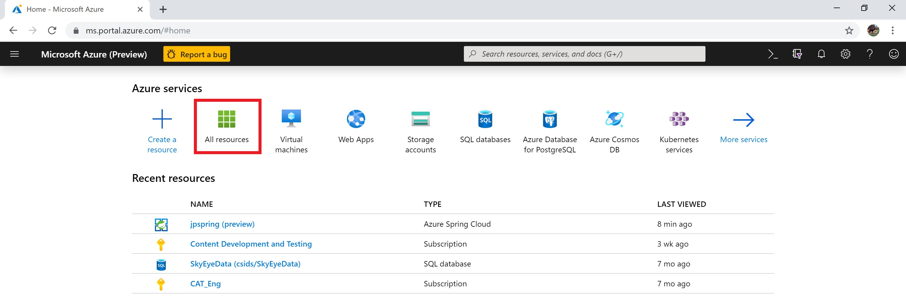
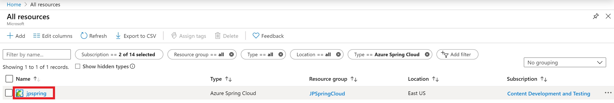

# How to use persistent storage in Azure Spring Cloud

Azure Spring Cloud provides two types of storage for your application:  persistent and temporary.  Azure Spring Cloud enables temporary storage by default for each application instance. Temporary storage is limited to 5GB with a default mount path: `/tmp`.

> [!WARNING]
> Restarting an application instance will permanently delete its associated temporary storage..

Persistent storage is a file share container managed by Azure allocated per application. Data stored in persistent storage is shared across all of the application's instances. An Azure Spring Cloud service instance can have a maximum of 10 applications with persistent disk enabled. Each application receives 50GB of persistent storage. The default mount path for persistent storage is `/persistent`.

> [!WARNING]
> *Disabling* persistent storage will deallocate the storage for that application.  All data in that storage account will be lost. 

## Enable persistent storage using the Azure portal

1. From the Home screen of your Azure portal, select **All Resources**.

     >

1. Find and select the Azure Spring Cloud resource that needs persistent storage.  In this example, the application is called *jpspring*.

    > 

1. Under the **Settings** heading, select **Apps**.

1. Your Spring Cloud services will appear in table.  Select the service to which you want to add persistent storage.  In this example, we will select our **gateway** service.

    > 

1. From the service's configuration blade, select **Configuration**

1. Select the **Persistent Storage** tab and enable persistent storage.

    > 

When persistent storage is enabled, its size and path are shown both on this page.

## Use the Azure CLI to modify persistent storage

Create an app with persistent disk enabled:
 
```azurecli
az spring-cloud app create -n <app> -g <resource-group> -s <service-name> --enable-persistent-storage true
```

Enable persistent storage in an existing app:

```azurecli
az spring-cloud app update -n <app> -g <resource-group> -s <service-name> --enable-persistent-storage true
``` 

Disable persistent storage in an existing app:

> [!WARNING]
> Disabling persistent storage will deallocate the storage for that application, permanently losing any data that was stored there. 

```azurecli
az spring-cloud app update -n <app> -g <resource-group> -s <service-name> --enable-persistent-storage false
```

## Next steps

Learn about [application and service quotas](spring-cloud-quotas.md), or learn how to [manually scale your application](spring-cloud-tutorial-scale-manual.md).