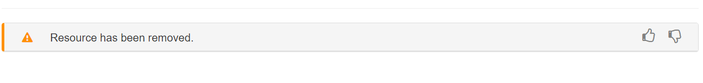
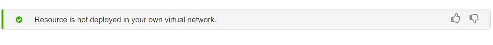
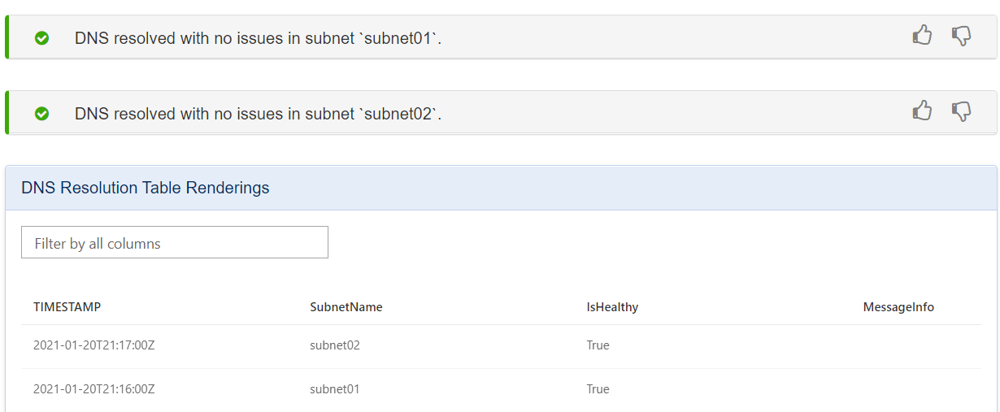
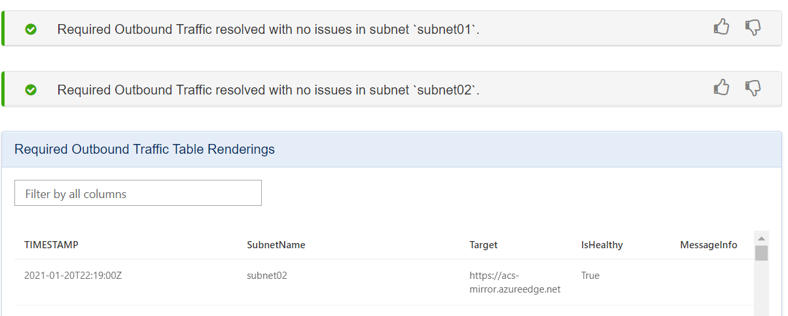

# Self-diagnose running Azure Spring Cloud in VNET
Azure Spring Cloud diagnostics supports interactive troubleshooting apps running in virtual networks. No configuration is required. When you find issues, Azure Spring Cloud diagnostics identifies what’s wrong and guides you to information that helps troubleshoot and resolve the issue.

## Navigate to the diagnostics page
The following procedure starts diagnostics for networked applications.
1. Sign in to the Azure portal.
1. Go to your Azure Spring Cloud Overview page.
1. Open **Diagnose and solve problems** in the menu on the left navigation pane.
1. Select the third category, **Networking**.

   

## View a diagnostic report
After you click the **Networking** category, you can view two issues related to Networking specific to your VNet injected Azure Spring Cloud: **DNS Resolution** and **Required Outbound Traffic**.

   

Find your target issue, and click it to view the diagnostic report. A summary of diagnostics will be displayed. Some results contain related documentation.

If your Azure Spring Cloud resource has been deleted, you will see **Resource has been removed.**
   

If your Azure Spring Cloud resource is not deployed in your own virtual network, you will see the following result.
   

Different subnets will display the results separately.
### DNS Resolution 
Healthy applications show results such as the following:
   

The following diagnostic report example assumes the context end time is **2021-01-21T11:22:00Z**. The latest TIMESTAMP in the **DNS Resolution Table Renderings** was the previous day, more than **30 minutes** from the context end time, so the health status will be unknown. The health check log may not have been sent out because of the blocked network. 

The unknown health status results contain related documentation.  You can click the left angle bracket to see the drop-down display.
    

If you misconfigured your Private DNS Zone record set, you will get a critical result such as: `Failed to resolve the Private DNS in subnet xxx`. 

In the drop-down **DNS Resolution Table Renderings** you will find the detail message info from which you can check your config.

### Required Outbound Traffic 
Healthy applications show results such as the following:
    

If any of your subnet is blocked by NSG or firewall rules, you will find the following failures if you have not blocked the log. You can check whether you overlooked any [Customer Responsibilities](spring-cloud-vnet-customer-responsibilities.md).
    
   

If there are no data in `Required Outbound Traffic Table Renderings` within 30 minutes, the result will be `health status unknown`. 
Maybe your network is blocked or the Log service is down.

   

## See also
* [How to self diagnose Azure Spring Cloud](spring-cloud-howto-self-diagnose-solve.md)