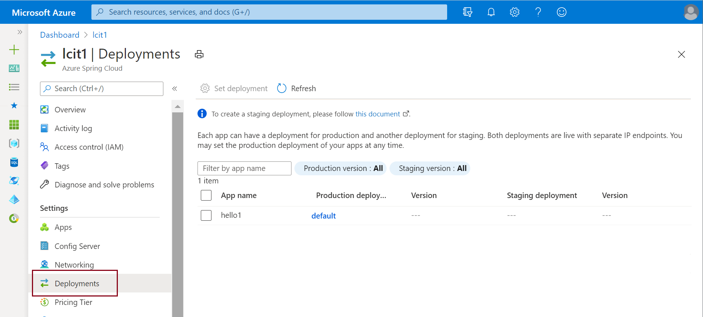
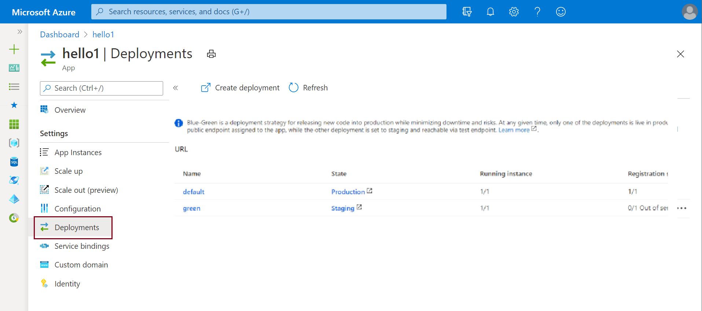

# Set up a staging environment in Azure Spring Cloud

**This article applies to:** ✔️ Java

This article discusses how to set up a staging deployment by using the blue-green deployment pattern in Azure Spring Cloud. Blue/green deployment is an Azure DevOps Continuous Delivery pattern that relies on keeping an existing (blue) version live, while a new (green) one is deployed. This article shows you how to put that staging deployment into production without changing the production deployment directly.

## Prerequisites

* A running application.  See [Quickstart: Deploy your first Azure Spring Cloud application](spring-cloud-quickstart.md).
* Azure CLI [asc extension](https://docs.microsoft.com/cli/azure/azure-cli-extensions-overview)

If you want to use a different application for this example, you need to make a simple change in a public-facing portion of the application.  This change differentiates your staging deployment from production.

>[!TIP]
> Azure Cloud Shell is a free interactive shell that you can use to run the instructions in this article.  It has common, preinstalled Azure tools, including the latest versions of Git, JDK, Maven, and the Azure CLI. If you're signed in to your Azure subscription, start your [Azure Cloud Shell](https://shell.azure.com).  To learn more, see [Overview of Azure Cloud Shell](../cloud-shell/overview.md).

To set up a staging environment in Azure Spring Cloud, follow the instructions in the next sections.

## Install the Azure CLI extension

Install the Azure Spring Cloud extension for the Azure CLI by using the following command:

```azurecli
az extension add --name spring-cloud
```
    
## View apps and deployments

View deployed apps using the following procedures.

1. Go to your Azure Spring Cloud instance in the Azure portal.

1. From the left navigation pane open **Deployments**.

    [ ](media/spring-cloud-blue-green-staging/deployments.png)

1. Open the "Apps" blade to view apps for your service instance.

    [ ](media/spring-cloud-blue-green-staging/app-dashboard.png)

1. You can click an app and view details.

    [ ](media/spring-cloud-blue-green-staging/app-overview.png)

1. Open the **Deployments** blade to see all deployments of the app. The deployment grid shows whether the deployment is production or staging.

    [ ](media/spring-cloud-blue-green-staging/deployments-dashboard.png)

1. You can click the name of the deployment to view the deployment overview. In this case the only deployment is named *Default*.

    [ ](media/spring-cloud-blue-green-staging/deployments-overview.png)
    

## Create a staging deployment

1. In your local development environment, make a small modification to your application. Doing so lets you easily differentiate the two deployments. To build the jar package, run the following command: 

    ```console
    mvn clean package -DskipTests
    ```

1. In the Azure CLI, create a new deployment, and give it the staging deployment name "green."

    ```azurecli
    az spring-cloud app deployment create -g <resource-group-name> -s <service-instance-name> --app default -n green --jar-path gateway/target/gateway.jar
    ```

1. After the CLI deployment finishes successfully, access the app page from the **Application Dashboard**, and view all your instances in the **Deployments** tab on the left.

   [ ](media/spring-cloud-blue-green-staging/deployments-dashboard-2.png)

  
> [!NOTE]
> The discovery status is *OUT_OF_SERVICE* so that traffic won't be routed to this deployment before verification is complete.

## Verify the staging deployment

To verify that the green staging development is working:
1. go to **Deployments** and click the `green` **Staging deployment**.
1. From the **Overview** page, click the **Test endpoint**.
1. This will open the staging build showing your changes.

>[!TIP]
> * Confirm that your test endpoint ends with a slash (/) to ensure that the CSS file is loaded correctly.  
> * If your browser requires you to enter login credentials to view the page, use [URL decode](https://www.urldecoder.org/) to decode your test endpoint. URL decode returns a URL in the form "https://\<username>:\<password>@\<cluster-name>.test.azureapps.io/gateway/green".  Use this form to access your endpoint.

>[!NOTE]    
> Config server settings apply to both your staging environment and production. For example, if you set the context path (`server.servlet.context-path`) for your app gateway in config server as *somepath*, the path to your green deployment changes to "https://\<username>:\<password>@\<cluster-name>.test.azureapps.io/gateway/green/somepath/...".
 
 If you visit your public-facing app gateway at this point, you should see the old page without your new change.
    
## Set the green deployment as the production environment

1. After you've verified your change in your staging environment, you can push it to production. Return to **Deployment management**, and select the application currently in `Production`.

1. Click the ellipses after the **Registration status** and set the production build to `staging`.

   [ ](media/spring-cloud-blue-green-staging/set-staging-deployment.png)

1. Return to the **Deployment management** page.  Your `green` deployment deployment status should show *Up*. This is now the running production build.

   [ ](media/spring-cloud-blue-green-staging/set-staging-deployment-result.png)

1. Copy and paste the URL into a new browser window, and the new application page should be displayed with your changes.

>[!NOTE]
> After you've set the green deployment as the production environment, the previous deployment becomes the staging deployment.

## Modify the staging deployment

If you're not satisfied with your change, you can modify your application code, build a new jar package, and upload it to your green deployment by using the Azure CLI.

```azurecli
az spring-cloud app deploy  -g <resource-group-name> -s <service-instance-name> -n gateway -d green --jar-path gateway.jar
```

## Delete the staging deployment

To delete your staging deployment from the Azure port, go to your staging deployment page, and then select the **Delete** button.

Alternatively, delete your staging deployment from the Azure CLI by running the following command:

```azurecli
az spring-cloud app deployment delete -n <staging-deployment-name> -g <resource-group-name> -s <service-instance-name> --app gateway
```

## Next steps

* [CI/CD for Azure Spring Cloud](https://review.docs.microsoft.com/azure/spring-cloud/spring-cloud-howto-cicd?branch=pr-en-us-142929&pivots=programming-language-java)