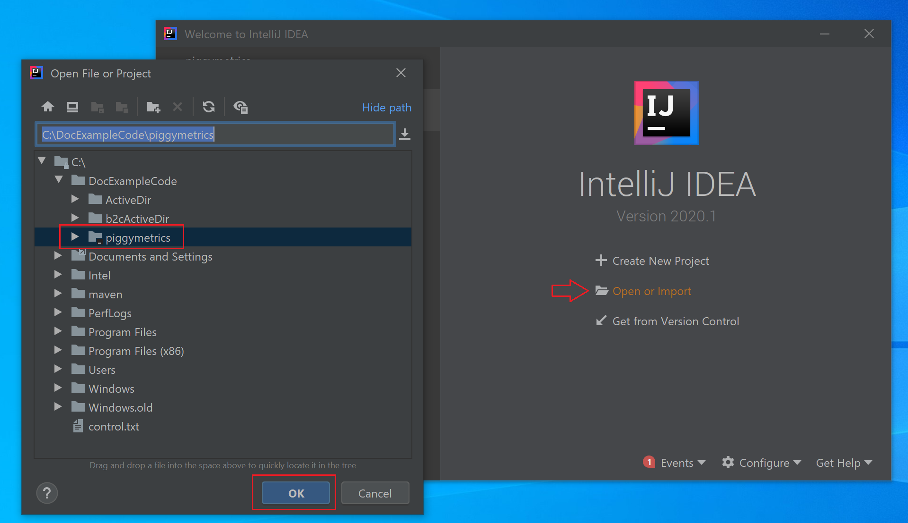
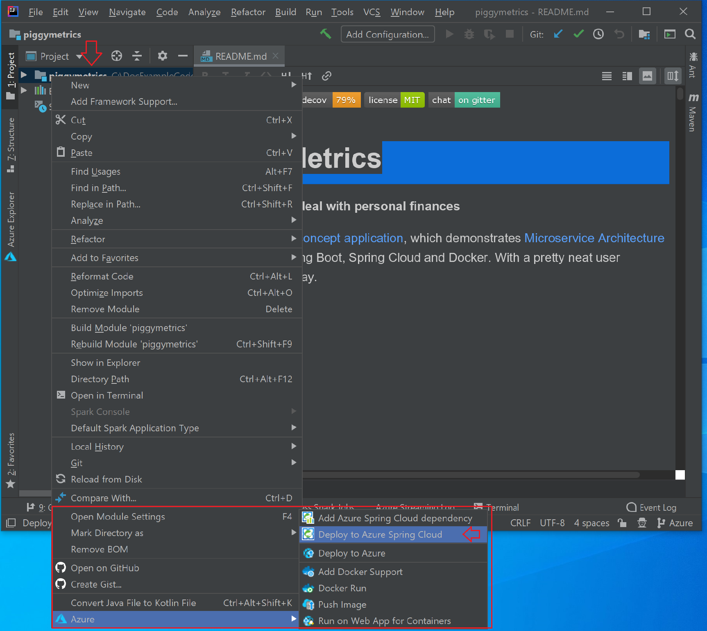
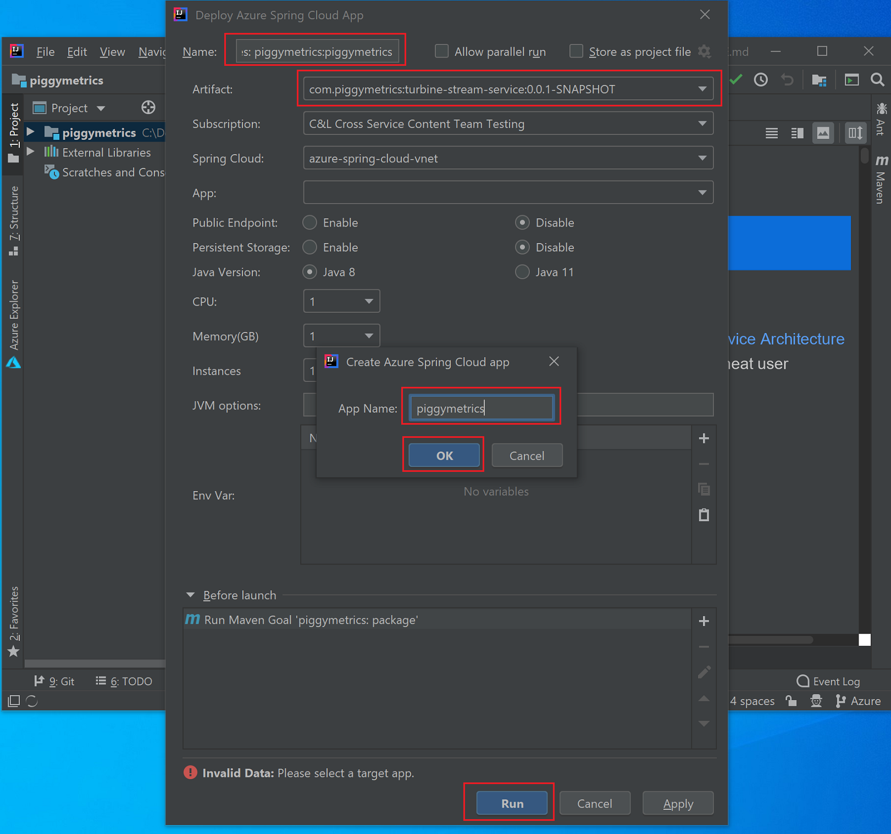

# Quickstart: Build and deploy apps to Azure Spring Cloud

::: zone pivot="programming-language-csharp"
In this quickstart, you build and deploy microservice applications to Azure Spring Cloud using the Azure CLI.

## Prerequisites

* Complete the previous quickstarts in this series:

  * [Provision Azure Spring Cloud service](spring-cloud-quickstart-provision-service-instance.md).
  * [Set up Azure Spring Cloud configuration server](spring-cloud-quickstart-setup-config-server.md).

## Download the sample app

If you've been using the Azure Cloud Shell up to this point, switch to a local command prompt for the following steps.

1. Create a new folder and clone the sample app repository.

   ```console
   mkdir source-code
   ```

   ```console
   cd source-code
   ```

   ```console
   git clone https://github.com/Azure-Samples/Azure-Spring-Cloud-Samples
   ```

1. Navigate into the repository directory.

   ```console
   cd Azure-Spring-Cloud-Samples
   ```

## Deploy PlanetWeatherProvider

1. Create an app for the PlanetWeatherProvider project in your Azure Spring Cloud instance.

   ```azurecli
   az spring-cloud app create --name planet-weather-provider --runtime-version NetCore_31
   ```

   To enable automatic service registration, you have given the app the same name as the value of `spring.application.name` in the project's *appsettings.json* file:

   ```json
   "spring": {
     "application": {
       "name": "planet-weather-provider"
     }
   }
   ```

   This command may take several minutes to run.

1. Change directory to the `PlanetWeatherProvider` project folder.

   ```console
   cd steeltoe-sample/src/planet-weather-provider
   ```

1. Create the binaries and the *.zip* file to be deployed.

   ```console
   dotnet publish -c release -o ./publish
   ```

   > [!TIP]
   > The project file contains the following XML to package the binaries in a *.zip* file after writing them to the *./publish* folder:
   >
   > ```xml
   > <Target Name="Publish-Zip" AfterTargets="Publish">
   >   <ZipDirectory SourceDirectory="$(PublishDir)" DestinationFile="$(MSBuildProjectDirectory)/publish-deploy-planet.zip" Overwrite="true" />
   > </Target>
   > ```

1. Deploy to Azure.

   Make sure that the command prompt is in the project folder before running the following command.

   ```console
   az spring-cloud app deploy -n planet-weather-provider --runtime-version NetCore_31 --main-entry Microsoft.Azure.SpringCloud.Sample.PlanetWeatherProvider.dll --artifact-path ./publish-deploy-planet.zip
   ```

   The `--main-entry` option specifies the relative path from the *.zip* file's root folder to the *.dll* file that contains the application's entry point. After the service uploads the *.zip* file, it extracts all the files and folders and tries to execute the entry point in the specified *.dll* file.

   This command may take several minutes to run.

## Deploy SolarSystemWeather

1. Create another app in your Azure Spring Cloud instance, this time for the SolarSystemWeather project:

   ```azurecli
   az spring-cloud app create --name solar-system-weather --runtime-version NetCore_31
   ```

   `solar-system-weather` is the name that is specified in the `SolarSystemWeather` project's *appsettings.json* file.

   This command may take several minutes to run.

1. Change directory to the `SolarSystemWeather` project.

   ```console
   cd ../solar-system-weather
   ```

1. Create the binaries and *.zip* file to be deployed.

   ```console
   dotnet publish -c release -o ./publish
   ```

1. Deploy to Azure.

   ```console
   az spring-cloud app deploy -n solar-system-weather --runtime-version NetCore_31 --main-entry Microsoft.Azure.SpringCloud.Sample.SolarSystemWeather.dll --artifact-path ./publish-deploy-solar.zip
   ```
   
   This command may take several minutes to run.

## Assign public endpoint

To test the application, send an HTTP GET request to the `solar-system-weather` application from a browser.  To do that, you need a public endpoint for the request.

1. To assign the endpoint, run the following command.

   ```azurecli
   az spring-cloud app update -n solar-system-weather --is-public true
   ```

1. To get the URL of the endpoint, run the following command.

   Windows:

   ```azurecli
   az spring-cloud app show -n solar-system-weather -o table
   ```

   Linux:

   ```azurecli
   az spring-cloud app show --name solar-system-weather | grep url
   ```

## Test the application

Send a GET request to the `solar-system-weather` app. In a browser, navigate to the public URL with `/weatherforecast` appended to the end of it. For example:

```
https://servicename-solar-system-weather.azuremicroservices.io/weatherforecast
```

The output is JSON:

```json
[{"Key":"Mercury","Value":"very warm"},{"Key":"Venus","Value":"quite unpleasant"},{"Key":"Mars","Value":"very cool"},{"Key":"Saturn","Value":"a little bit sandy"}]
```

This response shows that both microservice apps are working. The `SolarSystemWeather` app returns data that it retrieved from the `PlanetWeatherProvider` app.
::: zone-end

::: zone pivot="programming-language-java"
This document explains how to build and deploy microservice applications to Azure Spring Cloud using:
* Azure CLI
* Maven Plugin
* Intellij

Before deployment using Azure CLI or Maven, complete the examples that [provision an instance of Azure Spring Cloud](spring-cloud-quickstart-provision-service-instance.md) and [set up the config server](spring-cloud-quickstart-setup-config-server.md).

## Prerequisites

* [Install JDK 8](https://docs.microsoft.com/java/azure/jdk/?view=azure-java-stable&preserve-view=true)
* [Sign up for an Azure subscription](https://azure.microsoft.com/free/)
* (Optional) [Install the Azure CLI version 2.0.67 or higher](https://docs.microsoft.com/cli/azure/install-azure-cli?view=azure-cli-latest&preserve-view=true) and install the Azure Spring Cloud extension with command: `az extension add --name spring-cloud`
* (Optional) [Install the Azure Toolkit for IntelliJ](https://plugins.jetbrains.com/plugin/8053-azure-toolkit-for-intellij/) and [sign in](https://docs.microsoft.com/azure/developer/java/toolkit-for-intellij/create-hello-world-web-app#installation-and-sign-in)

## Deployment procedures

#### [CLI](#tab/Azure-CLI)

### Build the microservices applications locally

1. Clone the sample app repository to your Azure Cloud account.  

    ```azurecli
    git clone https://github.com/Azure-Samples/piggymetrics
    ```

2. Change directory and build the project.

    ```azurecli
    cd piggymetrics
    mvn clean package -DskipTests
    ```

Compiling the project takes about 5 minutes. Once completed, you should have individual JAR files for each service in their respective folders.

### Create and deploy the apps

1. Set your default resource group name and cluster name using the following commands:

    ```azurecli
    az configure --defaults group=<resource group name>
    az configure --defaults spring-cloud=<service instance name>
    ```

1. Create Azure Spring Cloud microservices using the JAR files built in the previous step. You will create three apps: **gateway**, **auth-service**, and **account-service**.

    ```azurecli
    az spring-cloud app create --name gateway
    az spring-cloud app create --name auth-service
    az spring-cloud app create --name account-service
    ```

1. We need to deploy applications created in the previous step to Azure. Use the following commands to deploy all three applications:

    ```azurecli
    az spring-cloud app deploy -n gateway --jar-path ./gateway/target/gateway.jar
    az spring-cloud app deploy -n account-service --jar-path ./account-service/target/account-service.jar
    az spring-cloud app deploy -n auth-service --jar-path ./auth-service/target/auth-service.jar
    ```

### Assign public endpoint to gateway

We need a way to access the application via a web browser. Our gateway application needs a public facing endpoint.

1. Assign the endpoint using the following command:

    ```azurecli
    az spring-cloud app update -n gateway --is-public true
    ```

2. Query the **gateway** application for its public IP so you can verify that the application is running:

    ```azurecli
    az spring-cloud app show --name gateway --query properties.url
    ```

#### [Maven](#tab/Maven)

### Clone and build the sample application repository

1. Clone the Git repository by running the following command:

    ```
    git clone https://github.com/Azure-Samples/PiggyMetrics
    ```
  
1. Change directory and build the project by running the following command:

    ```
    cd piggymetrics
    mvn clean package -DskipTests
    ```

### Generate configurations and deploy to the Azure Spring Cloud

1. Generate configurations by running the following command in the root folder of PiggyMetrics containing the parent POM. If you have already signed-in with Azure CLI, the command will automatically pick up the credentials. Otherwise, it will sign you in with prompt instructions. For more information, see our [wiki page](https://github.com/microsoft/azure-maven-plugins/wiki/Authentication).

    ```
    mvn com.microsoft.azure:azure-spring-cloud-maven-plugin:1.3.0:config
    ```
    
    You will be asked to select:
    * **Modules:** Select `gateway`,`auth-service`, and `account-service`.
    * **Subscription:** This is your subscription used to create an Azure Spring Cloud instance.
    * **Service Instance:** This is the name of your Azure Spring Cloud instance.
    * **Public endpoint:** In the list of provided projects, enter the number that corresponds with `gateway`.  This gives it public access.

1. The POM now contains the plugin dependencies and configurations. Deploy the apps using the following command. 

    ```
    mvn azure-spring-cloud:deploy
    ```

#### [IntelliJ](#tab/IntelliJ)

### Import sample project in IntelliJ

1. Download and unzip the source repository for this tutorial, or clone it using Git: `git clone https://github.com/Azure-Samples/piggymetrics` 

1. Open IntelliJ **Welcome** dialog, select **Import Project** to open the import wizard.

1. Select `piggymetric` folder.

    

### Deploy gateway app to Azure Spring Cloud
In order to deploy to Azure you must sign in with your Azure account with Azure Toolkit for IntelliJ, and choose your subscription. For sign-in details, see [Installation and sign-in](https://docs.microsoft.com/azure/developer/java/toolkit-for-intellij/create-hello-world-web-app#installation-and-sign-in).

1. Right-click your project in IntelliJ project explorer, and select **Azure** -> **Deploy to Azure Spring Cloud**.

    

1. In the **Name** field, append *:gateway* to the existing **Name**.
1. In the **Artifact** textbox, select *com.piggymetrics:gateway:1.0-SNAPSHOT*.
1. In the **Subscription** textbox, verify your subscription.
1. In the **Spring Cloud** textbox, select the instance of Azure Spring Cloud that you created in [Provision Azure Spring Cloud instance](https://docs.microsoft.com/azure/spring-cloud/spring-cloud-quickstart-provision-service-instance).
1. Set **Public Endpoint** to *Enable*.
1. In the **App:** textbox, select **Create app...**.
1. Enter *gateway*, then click **OK**.

    

1. In the **Before launch** section of the dialog, double-click *Run Maven Goal*.
1. In the **Working directory** textbox, navigate to the *piggymetrics/gateway* folder.
1. In the **Command line** textbox, enter *package -DskipTests*. Click **OK**.
1. Start the deployment by clicking **Run** button at the bottom of the **Deploy Azure Spring Cloud app** dialog. The plug-in will run the command `mvn package` on the `gateway` app and deploy the jar generated by the `package` command.

### Deploy auth-service and account-service apps to Azure Spring Cloud
You can repeat the steps above to deploy `auth-service` and the `account-service` apps to Azure Spring Cloud:

1. Modify the **Name** and **Artifact** to identify the `auth-service` app.
1. In the **App:** textbox, select **Create app...** to create `auth-service` apps.
1. Verify that the **Public Endpoint** option is set to *Disabled*.
1. In the **Before launch** section of the dialog, switch the **Working directory** to the *piggymetrics/auth-service* folder.
1. Start the deployment by clicking **Run** button at the bottom of the **Deploy Azure Spring Cloud app** dialog. 
1. Repeat these procedures to configure and deploy the `account-service`.
---

Navigate to the URL provided in the output the previous steps to access the PiggyMetrics application. For example: `https://<service instance name>-gateway.azuremicroservices.io`


You can also navigate the Azure portal to find the URL. 
1. Navigate to the service
2. Select **Apps**
3. Select **gateway**

    
    
4. Find the URL on the **gateway | Overview** page

    

::: zone-end

## Next steps

In this quickstart, you created Azure resources that will continue to accrue charges if they remain in your subscription. If you don't intend to continue on to the next quickstart, see [Clean up resources](spring-cloud-quickstart-logs-metrics-tracing.md#clean-up-resources). Otherwise, advance to the next quickstart:

> [!div class="nextstepaction"]
> [Logs, Metrics and Tracing](spring-cloud-quickstart-logs-metrics-tracing.md)
