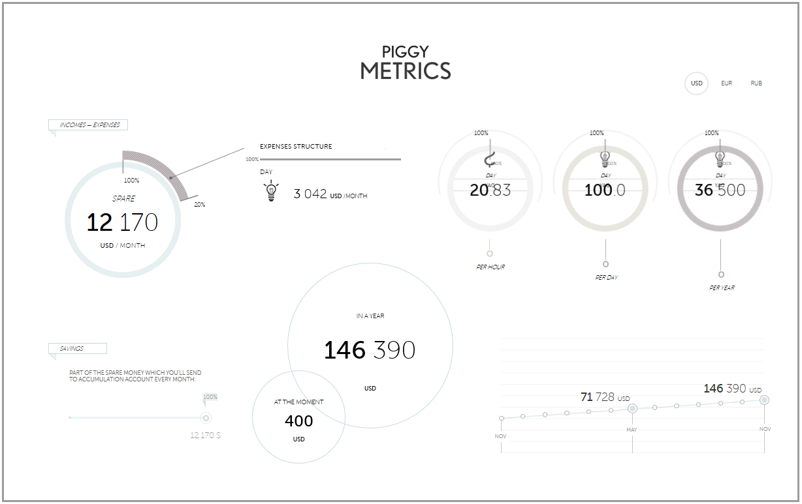
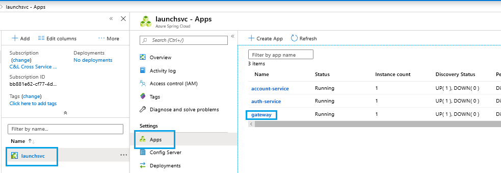
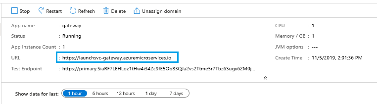

# Quickstart: Launch a Java Spring application using the Azure CLI

Azure Spring Cloud enables you to easily run a Spring Boot based microservices application on Azure.

This quickstart shows you how to deploy an existing Java Spring Cloud application to Azure. When you're finished, you can continue to manage the application via the Azure CLI or switch to using the Azure portal.

Following this quickstart, you will learn how to:

> [!div class="checklist"]
> * Provision a service instance
> * Set a configuration server for an instance
> * Build a microservices application locally
> * Deploy each microservice
> * Assign public endpoint for your application

## Prerequisites

>[!Note]
> Azure Spring Cloud is currently offered as a public preview. Public preview offerings allow customers to experiment with new features prior to their official release.  Public preview features and services are not meant for production use.  For more information about support during previews, please review our [FAQ](https://azure.microsoft.com/support/faq/) or file a [Support request](https://docs.microsoft.com/azure/azure-portal/supportability/how-to-create-azure-support-request) to learn more.

>[!TIP]
> The Azure Cloud Shell is a free interactive shell that you can use to run the steps in this article.  It has common Azure tools preinstalled, including the latest versions of Git, JDK, Maven, and the Azure CLI. If you are logged in to your Azure subscription, launch your [Azure Cloud Shell](https://shell.azure.com) from shell.azure.com.  You can learn more about Azure Cloud Shell by [reading our documentation](../cloud-shell/overview.md)

To complete this quickstart:

1. [Install Git](https://git-scm.com/)
2. [Install JDK 8](https://docs.microsoft.com/java/azure/jdk/?view=azure-java-stable)
3. [Install Maven 3.0 or above](https://maven.apache.org/download.cgi)
4. [Install the Azure CLI version 2.0.67 or higher](https://docs.microsoft.com/cli/azure/install-azure-cli?view=azure-cli-latest)
5. [Sign up for an Azure subscription](https://azure.microsoft.com/free/)

## Install the Azure CLI extension

Install the Azure Spring Cloud extension for the Azure CLI using the following command

```azurecli
az extension add --name spring-cloud
```

## Provision a service instance on the Azure CLI

1. Login to the Azure CLI and choose your active subscription. Be sure to choose the active subscription that is whitelisted for Azure Spring Cloud

    ```azurecli
        az login
        az account list -o table
        az account set --subscription
    ```

2. Prepare a name for your Azure Spring Cloud service.  The name must be between 4 and 32 characters long and can contain only lowercase letters, numbers, and hyphens.  The first character of the service name must be a letter and the last character must be either a letter or a number.

3. Create a resource group to contain your Azure Spring Cloud service.

    ```azurecli
        az group create --location eastus --name <resource group name>
    ```
    Learn more about [Azure Resource Groups](../azure-resource-manager/management/overview.md).

4. Open an Azure CLI window and run the following commands to provision an instance of Azure Spring Cloud.

    ```azurecli
        az spring-cloud create -n <service name> -g <resource group name>
    ```

    The service instance will take around five minutes to deploy.

5. Set your default resource group name and cluster name using the following commands:

    ```azurecli
        az configure --defaults group=<service group name>
        az configure --defaults spring-cloud=<service instance name>
    ```

> [!div class="nextstepaction"]
> [I ran into an issue](https://www.research.net/r/javae2e?tutorial=asc-cli-quickstart&step=provision)

## Setup your configuration server

Update your config-server with the location of the git repository for our project:

```git
az spring-cloud config-server git set -n <your-service-name> --uri https://github.com/Azure-Samples/piggymetrics --label config
```

> [!div class="nextstepaction"]
> [I ran into an issue](https://www.research.net/r/javae2e?tutorial=asc-cli-quickstart&step=config-server)

## Build the microservices applications locally

1. Create a new folder and clone the sample app repository to your Azure Cloud account.  

    ```azurecli
        mkdir source-code
        git clone https://github.com/Azure-Samples/piggymetrics
    ```

2. Change directory and build the project.

    ```azurecli
        cd piggymetrics
        mvn clean package -D skipTests
    ```

Compiling the project takes about 5 minutes.  Once completed, you should have individual JAR files for each service in their respective folders.

## Create the microservices

Create Spring Cloud microservices using the JAR files built in the previous step. You will create three microservices: **gateway**, **auth-service**, and **account-service**.

```azurecli
az spring-cloud app create --name gateway
az spring-cloud app create --name auth-service
az spring-cloud app create --name account-service
```

## Deploy applications and set environment variables

We need to actually deploy our applications to Azure. Use the following commands to deploy all three applications:

```azurecli
az spring-cloud app deploy -n gateway --jar-path ./gateway/target/gateway.jar
az spring-cloud app deploy -n account-service --jar-path ./account-service/target/account-service.jar
az spring-cloud app deploy -n auth-service --jar-path ./auth-service/target/auth-service.jar
```

> [!div class="nextstepaction"]
> [I ran into an issue](https://www.research.net/r/javae2e?tutorial=asc-cli-quickstart&step=deploy)

## Assign public endpoint to gateway

We need a way to access the application via a web browser. Our gateway application needs a public facing endpoint, which can be assigned using the following command:

```azurecli
az spring-cloud app update -n gateway --is-public true
```

Finally, query the **gateway** application for its public IP so you can verify that the application is running:

```azurecli
az spring-cloud app show --name gateway | grep url
```

Navigate to the URL provided by the previous command to run the PiggyMetrics application.
    

You can also navigate the Azure portal to find the URL. 
1. Navigate to the service
1. Select **Apps**
1. Select **gateway**

    
1. Find the URL on the **gateway Overview** page
    

> [!div class="nextstepaction"]
> [I ran into an issue](https://www.research.net/r/javae2e?tutorial=asc-cli-quickstart&step=public-endpoint)

## Next Steps

In this quickstart, you've deployed a Spring Cloud application from the Azure CLI.  To learn more about Azure Spring Cloud, continue to the tutorial on preparing your app for deployment.

> [!div class="nextstepaction"]
> [Prepare your Azure Spring Cloud application for deployment](spring-cloud-tutorial-prepare-app-deployment.md)

More samples are available on GitHub: [Azure Spring Cloud Samples](https://github.com/Azure-Samples/Azure-Spring-Cloud-Samples/tree/master/service-binding-cosmosdb-sql).
