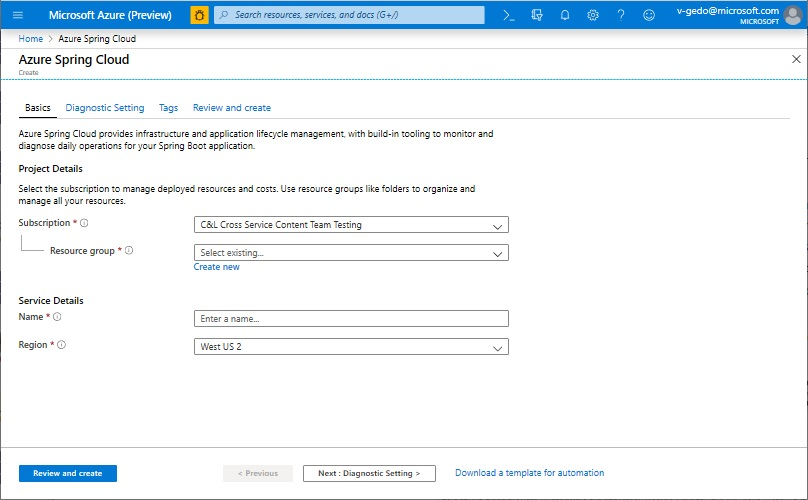
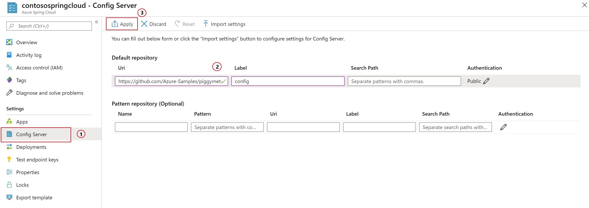

# Quickstart: Launch an Azure Spring Cloud app using the Maven plug-in

Using the Azure Spring Cloud Maven plug-in, you can easily create and update your Azure Spring Cloud applications. By predefining a configuration, you can deploy applications to your existing Azure Spring Cloud service. In this article, you use a sample application called PiggyMetrics to demonstrate this feature.

Following this quickstart, you will learn how to:

> [!div class="checklist"]
> * Provision a service instance
> * Set up a configuration server for an instance
> * Clone and build microservices application locally
> * Deploy each microservice
> * Assign a public endpoint for your application

>[!Note]
> Azure Spring Cloud is currently offered as a public preview. Public preview offerings allow customers to experiment with new features prior to their official release.  Public preview features and services are not meant for production use.  For more information about support during previews, please review our [FAQ](https://azure.microsoft.com/support/faq/) or file a [Support request](https://docs.microsoft.com/azure/azure-portal/supportability/how-to-create-azure-support-request) to learn more.


>[!TIP]
> Azure Cloud Shell is a free interactive shell that you can use to run the commands in this article. It has common Azure tools preinstalled, including the latest versions of Git, the Java Development Kit (JDK), Maven, and the Azure CLI. If you're signed in to your Azure subscription, launch [Azure Cloud Shell](https://shell.azure.com). For more information, see [Overview of Azure Cloud Shell](../cloud-shell/overview.md).

To complete this quickstart:

1. [Install Git](https://git-scm.com/).
2. [Install JDK 8](https://docs.microsoft.com/java/azure/jdk/?view=azure-java-stable).
3. [Install Maven 3.0 or later](https://maven.apache.org/download.cgi).
4. [Sign up for a free Azure subscription](https://azure.microsoft.com/free/).

## Provision a service instance on the Azure portal

1. In a web browser, open [this link to Azure Spring Cloud in the Azure portal](https://ms.portal.azure.com/#create/Microsoft.AppPlatform), and sign in to your account.

1. Provide the **Project Details** for the sample application as follows:

    1. Select the **Subscription** with which the application will be associated.
    1. Select or create a resource group for the application. We recommend creating a new resource group.  The example below shows a new resource group called `myspringservice`.
    1. Provide a name for the new Azure Spring Cloud service.  The name must be between 4 and 32 characters long and can contain only lowercase letters, numbers, and hyphens. The first character of the service name must be a letter and the last character must be either a letter or a number.  The service in the example below has the name `contosospringcloud`.
    1. Select a location for your application from the options provided.  In this example, we select `East US`.
    1. Select **Review + create** to review a summary of your new service.  If everything looks correct, select **Create**.

    > [!div class="mx-imgBorder"]
    > 

It takes about 5 minutes for the service to be deployed. After the service is deployed, select **Go to resource** and the **Overview** page for the service instance appears.

> [!div class="nextstepaction"]
> [I ran into an issue](https://www.research.net/r/javae2e?tutorial=asc-maven-quickstart&step=provision)

## Set up your configuration server

1. On the service **Overview** page, select **Config Server**.
1. In the **Default repository** section, set **URI** to **https://github.com/Azure-Samples/piggymetrics**, set **Label** to **config**, and then select **Apply** to save your changes.

    > [!div class="mx-imgBorder"]
    > 

> [!div class="nextstepaction"]
> [I ran into an issue](https://www.research.net/r/javae2e?tutorial=asc-maven-quickstart&step=config-server)

## Clone and build the sample application repository

1. Launch the [Azure Cloud Shell](https://shell.azure.com).

1. Clone the Git repository by running the following command:

    ```azurecli
    git clone https://github.com/Azure-Samples/PiggyMetrics
    ```
  
1. Change directory and build the project by running the following command:

    ```azurecli
    cd piggymetrics
    mvn clean package -DskipTests
    ```

## Generate configurations and deploy to the Azure Spring Cloud

1. Generate configurations by running the following command in the root folder of PiggyMetrics containing the parent POM:

    ```azurecli
    mvn com.microsoft.azure:azure-spring-cloud-maven-plugin:1.0.0:config
    ```

    a. Select the modules `gateway`,`auth-service`, and `account-service`.

    b. Select your subscription and Azure Spring Cloud service cluster.

    c. In the list of provided projects, enter the number that corresponds with `gateway` to give it public access.
    
    d. Confirm the configuration.

1. The POM now contains the plugin dependencies and configurations. Deploy the apps using the following command:

   ```azurecli
   mvn azure-spring-cloud:deploy
   ```

1. After the deployment has finished, you can access PiggyMetrics by using the URL provided in the output from the preceding command.

> [!div class="nextstepaction"]
> [I ran into an issue](https://www.research.net/r/javae2e?tutorial=asc-maven-quickstart&step=deploy)

## Next steps

In this quickstart, you've deployed a Spring Cloud application from a Maven repository. To learn more about Azure Spring Cloud, continue to the tutorial about preparing your app for deployment.

> [!div class="nextstepaction"]
> [Prepare your Azure Spring Cloud application for deployment](spring-cloud-tutorial-prepare-app-deployment.md)
> [Learn more about Maven plug-ins for Azure](https://github.com/microsoft/azure-maven-plugin)

More samples are available on GitHub: [Azure Spring Cloud Samples](https://github.com/Azure-Samples/Azure-Spring-Cloud-Samples/tree/master/service-binding-cosmosdb-sql).
