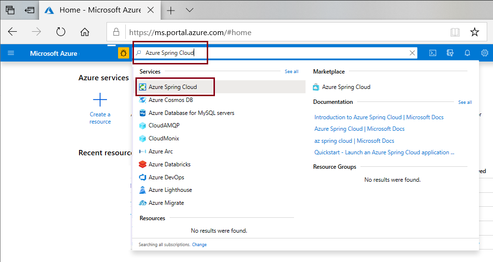
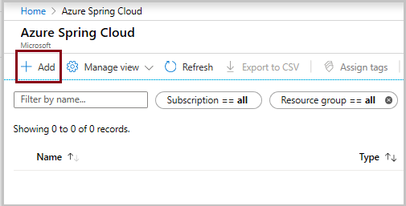
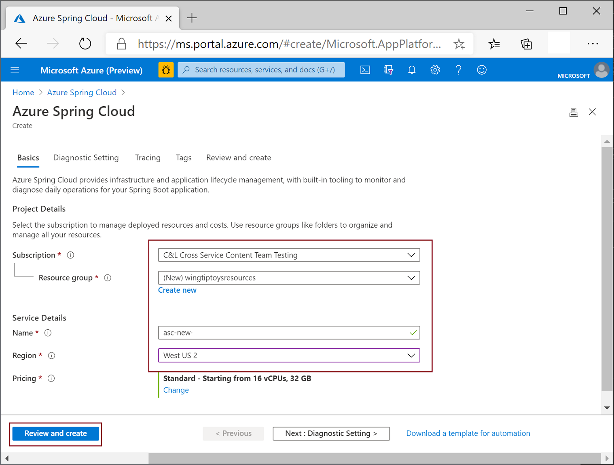
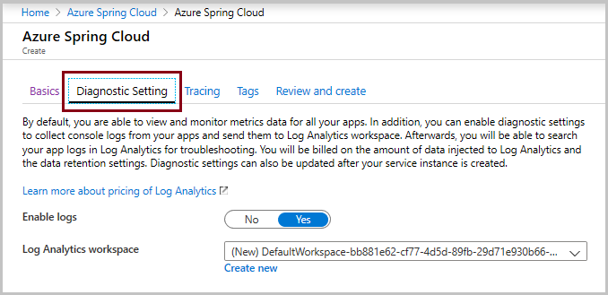
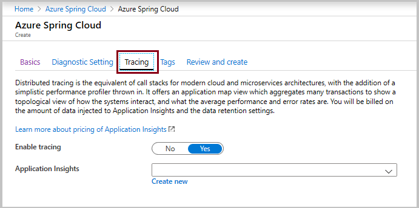
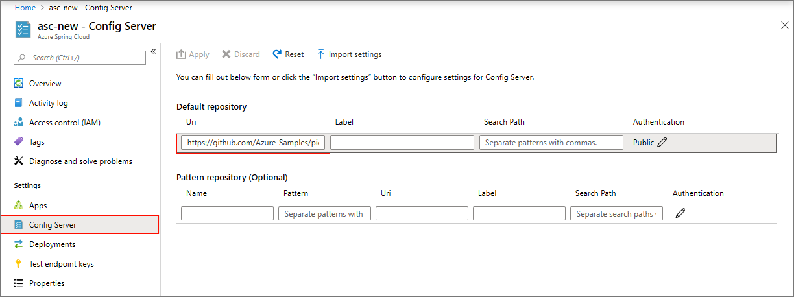
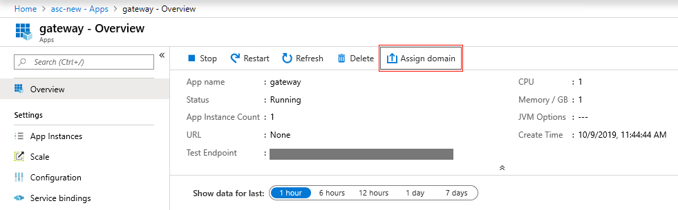
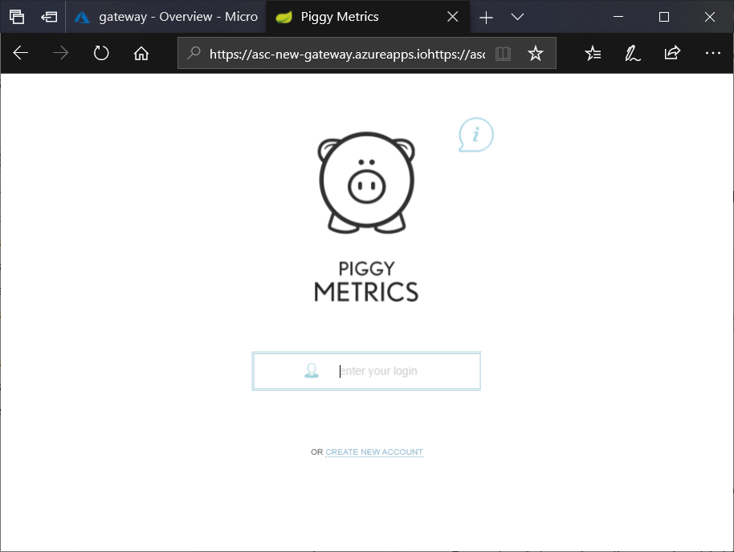

# Quickstart: Launch an existing Azure Spring Cloud application using the Azure portal

This quickstart shows you how to deploy an existing Spring Cloud application to Azure. Azure Spring Cloud enables you to easily run Spring Cloud based microservice applications on Azure. 

You can find the sample application code used in this tutorial in our [GitHub samples repository](https://github.com/Azure-Samples/PiggyMetrics). When you're finished, the provided sample application will be accessible online and ready to be managed via the Azure portal.

Following this quickstart, you will learn how to:

> [!div class="checklist"]
> * Provision a service instance
> * Set a configuration server for an instance
> * Build a microservices application locally
> * Deploy each microservice
> * Assign public endpoint for your application

## Prerequisites

>[!Note]
> Azure Spring Cloud is currently offered as a public preview. Public preview offerings allow customers to experiment with new features prior to their official release.  Public preview features and services are not meant for production use.  For more information about support during previews, please review our [FAQ](https://azure.microsoft.com/support/faq/) or file a [Support request](https://docs.microsoft.com/azure/azure-portal/supportability/how-to-create-azure-support-request) to learn more.

>[!TIP]
> The Azure Cloud Shell is a free interactive shell that you can use to run the steps in this article.  It has common Azure tools preinstalled, including the latest versions of Git, JDK, Maven, and the Azure CLI. If you are logged in to your Azure subscription, launch your [Azure Cloud Shell](https://shell.azure.com) from shell.azure.com.  You can learn more about Azure Cloud Shell by [reading our documentation](../cloud-shell/overview.md)

To complete this quickstart:

1. [Install Git](https://git-scm.com/)
2. [Install JDK 8](https://docs.microsoft.com/java/azure/jdk/?view=azure-java-stable)
3. [Install Maven 3.0 or above](https://maven.apache.org/download.cgi)
4. [Install the Azure CLI version 2.0.67 or higher](https://docs.microsoft.com/cli/azure/install-azure-cli?view=azure-cli-latest)
5. [Sign up for an Azure subscription](https://azure.microsoft.com/free/)

## Install the Azure CLI extension

Install the Azure Spring Cloud extension for the Azure CLI using the following command

```azurecli
az extension add --name spring-cloud
```

## Provision a service instance on the Azure portal

1. In a new tab, open the [Azure portal](https://ms.portal.azure.com/). 

2. From the top search box, search for **Azure Spring Cloud**.

3. Select **Azure Spring Cloud** from the results.

 

4. On the Azure Spring Cloud page, click **+ Add**.

 

5. Fill out the form on the Azure Spring Cloud **Create** page.  Consider the following guidelines:
    - **Subscription**: Select the subscription you want to be billed for this resource.  Ensure that this subscription has been added to our allow-list for Azure Spring Cloud.
    - **Resource group**: Creating new resource groups for new resources is a best practice.
    - **Service Details/Name**: Specify the name of your service instance.  The name must be between 4 and 32 characters long and can contain only lowercase letters, numbers, and hyphens.  The first character of the service name must be a letter and the last character must be either a letter or a number.
    - **Location**: Select the location for your service instance. Currently supported locations include East US, West US 2, West Europe, and Southeast Asia.

    

6. Click the **Diagnostic Setting** tab to open the following dialog.

7. You can set **Enable logs** to *yes* or *no* according to your requirements.

    

8. Click the **Tracing** tab.

9. You can set **Enable tracing** to *yes* or *no* according to your requirements.  If you set **Enable tracing** to yes,  also select an existing application insight, or create a new one. Without the **Application Insights** specification there will be a validation error.


    

10. Click **Review and create**.

11. Verify your specifications, and click **Create**.

It takes about 5 minutes for the service to deploy.  Once it is deployed, the **Overview** page for the service instance will appear.

> [!div class="nextstepaction"]
> [I ran into an issue](https://www.research.net/r/javae2e?tutorial=asc-portal-quickstart&step=provision)


## Set up your configuration server

1. Go to the service **Overview** page and select **Config Server**.

2. In the **Default repository** section, set **URI** to "https://github.com/Azure-Samples/piggymetrics-config".

3. Select **Apply** to save your changes.

    

> [!div class="nextstepaction"]
> [I ran into an issue](https://www.research.net/r/javae2e?tutorial=asc-portal-quickstart&step=config-server)

## Build and deploy microservice applications

1. Open an [Azure Cloud Shell](https://shell.azure.com)  and clone the sample app repository to your local machine.  Here, we first create a temporary directory called `source-code` before cloning the app.

    ```console
    mkdir source-code
    cd source-code
    git clone https://github.com/Azure-Samples/piggymetrics
    ```

2. Build the cloned package.

    ```console
    cd piggymetrics
    mvn clean package -DskipTests
    ```

3. Assign names to your resource group and your service. Be sure to substitute the placeholders below with the resource group name and service name that you provisioned earlier in this tutorial.

    ```azurecli
    az configure --defaults group=<resource group name>
    az configure --defaults spring-cloud=<service instance name>
    ```

4. Create the `gateway` application and deploy the JAR file.

    ```azurecli
    az spring-cloud app create -n gateway
    az spring-cloud app deploy -n gateway --jar-path ./gateway/target/gateway.jar
    ```

5. Following the same pattern, create the `account-service` and `auth-service` applications and deploy their JAR files.

    ```azurecli
    az spring-cloud app create -n account-service
    az spring-cloud app deploy -n account-service --jar-path ./account-service/target/account-service.jar
    az spring-cloud app create -n auth-service
    az spring-cloud app deploy -n auth-service --jar-path ./auth-service/target/auth-service.jar
    ```

6. It takes a few minutes to finish deploying the applications. To confirm that they have deployed, go to the **Apps** blade in the Azure portal. You should see a line each of the three applications.

> [!div class="nextstepaction"]
> [I ran into an issue](https://www.research.net/r/javae2e?tutorial=asc-portal-quickstart&step=deploy)

## Assign a public endpoint to gateway

1. Open the **Apps** tab in the menu on the left.

2. Select the `gateway` application to show the **Overview** page.

3. Select **Assign Endpoint** to assign a public endpoint to gateway. This can take a few minutes.

    

4. Enter the assigned public endpoint (labeled **URL**) into your browser to view your running application.

    

> [!div class="nextstepaction"]
> [I ran into an issue](https://www.research.net/r/javae2e?tutorial=asc-portal-quickstart&step=public-endpoint)

## Next steps

In this quickstart, you learned how to:

> [!div class="checklist"]
> * Provision a service instance
> * Set a configuration server for an instance
> * Build a microservices application locally
> * Deploy each microservice
> * Assign public endpoint for your application gateway

> [!div class="nextstepaction"]
> [Prepare your Azure Spring Cloud application for deployment](spring-cloud-tutorial-prepare-app-deployment.md)

More samples are available on GitHub: [Azure Spring Cloud Samples](https://github.com/Azure-Samples/Azure-Spring-Cloud-Samples/tree/master/service-binding-cosmosdb-sql).
