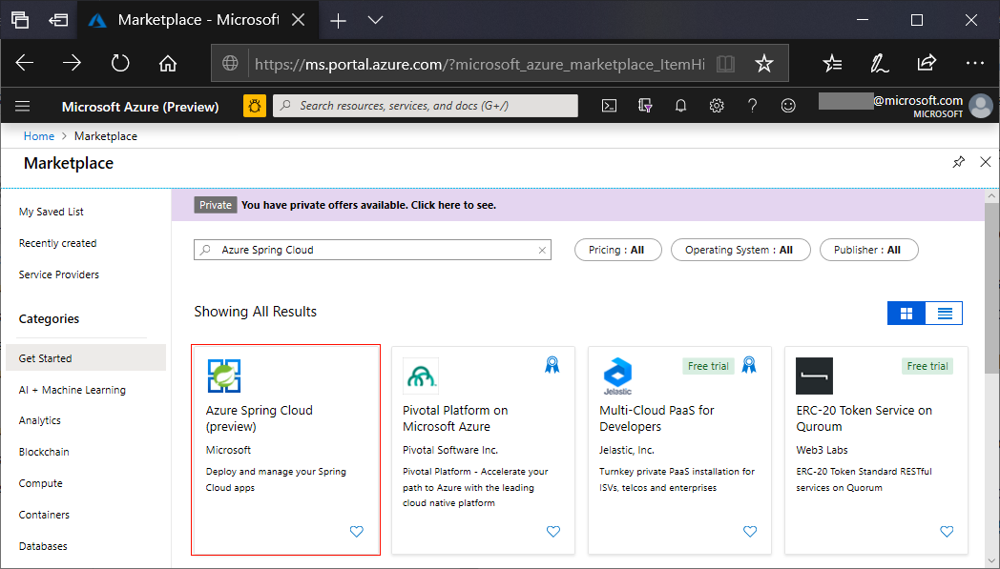

# Quickstart: Launch an Azure Spring Cloud application using the Azure portal

Azure Spring Cloud enables you to easily run Spring Cloud based microservice applications on Azure.

This quickstart shows you how to deploy an existing Spring Cloud application to Azure. [Here is a link](https://github.com/Azure-Samples/PiggyMetrics) to the sample application code used in this tutorial. When you're finished, the provided sample application will be accessible online and ready to be managed via the Azure portal.

Following this quickstart, you will learn how to:

> [!div class="checklist"]
> * Provision a service instance
> * Set a configuration server for an instance
> * Build a microservices application locally
> * Deploy each microservice
> * Assign public endpoint for your application

## Prerequisites

>[!Note]
> Before beginning this quickstart, ensure that your Azure subscription has access to Azure Spring Cloud.  As a  preview service, we ask customers to reach out to us so that we can add your subscription to our allow-list.  If you would like to explore the capabilities of Azure Spring Cloud, please reach out to us by email: azure-spring-cloud@service.microsoft.com.

>[!TIP]
> The Azure Cloud Shell is a free interactive shell that you can use to run the steps in this article.  It has common Azure tools preinstalled, including the latest versions of Git, JDK, Maven, and the Azure CLI. If you are logged in to your Azure subscription, launch your [Azure Cloud Shell](https://shell.azure.com) from shell.azure.com.  You can learn more about Azure Cloud Shell by [reading our documentation](../cloud-shell/overview.md)

To complete this quickstart:

1. [Install Git](https://git-scm.com/)
2. [Install JDK 8](https://docs.microsoft.com/java/azure/jdk/?view=azure-java-stable)
3. [Install Maven 3.0 or above](https://maven.apache.org/download.cgi)
4. [Install the Azure CLI](https://docs.microsoft.com/cli/azure/install-azure-cli?view=azure-cli-latest)
5. [Sign up for an Azure subscription](https://azure.microsoft.com/free/)

## Install the Azure CLI extension

Install the Azure Spring Cloud extension for the Azure CLI using the following command

```Azure CLI
az extension add -y --source https://azureclitemp.blob.core.windows.net/spring-cloud/spring_cloud-0.1.0-py2.py3-none-any.whl
```

## Provision a service instance on the Azure portal

1. In a web browser, open [this link to Azure Spring Cloud in the Azure portal](https://ms.portal.azure.com/?microsoft_azure_marketplace_ItemHideKey=AppPlatformExtension#blade/Microsoft_Azure_Marketplace/MarketplaceOffersBlade/selectedMenuItemId/home/searchQuery/Azure%20Spring%20Cloud).

    

1. Select **Azure Spring Cloud** to go to the overview page. Then select the **Create** button to get started.

1. Fill out the form, considering the following guidelines:
    - Service Name: Specify the name of your service instance.  The name must be between 4 and 32 characters long and can contain only lowercase letters, numbers, and hyphens.  The first character of the service name must be a letter and the last character must be either a letter or a number.
    - Subscription: Select the subscription you want to be billed for this resource.  Ensure that this subscription has been added to our allow-list for Azure Spring Cloud.
    - Resource group: Creating new resource groups for new resources is a best practice.
    - Location: Select the location for your service instance. Currently supported locations include East US, West US 2, West Europe, and Southeast Asia.
    
It takes about 5 minutes for the service to deploy.  Once it is deployed, the **Overview** page for the service instance will appear.

## Set up your configuration server

1. Go to the service **Overview** page and select **Config Server**.

1. In the **Default repository** section, set **URI** to "https\://github.com/Azure-Samples/piggymetrics", set **LABEL** to "config", and select **Apply** to save your changes.

    

## Build and deploy microservice applications

1. Open a command window and run the following command to clone the sample app repository to your local machine.

    ```cli
    git clone https://github.com/Azure-Samples/piggymetrics
    ```

1. Build the project by running below command.

    ```cli
    cd PiggyMetrics
    mvn clean package -DskipTests
    ```

1. Login to Azure CLI and set your active subscription.

    ```cli
    # Login to Azure CLI
    az login

    # List all subscriptions
    az account list -o table

    # Set active subscription
    az account set --subscription <target subscription ID>
    ```

1. Assign names to your resource group and your service. Be sure to substitute the placeholders below with the resource group name and service name that you provisioned earlier in this tutorial.

    ```azurecli
    az configure --defaults group=<resource group name>
    az configure --defaults spring-cloud=<service instance name>
    ```

1. Create the `gateway` application and deploy the JAR file.

    ```azurecli
    az spring-cloud app create -n gateway
    az spring-cloud app deploy -n gateway --jar-path ./gateway/target/gateway.jar
    ```

1. Following the same pattern, create the `account-service` and `auth-service` applications and deploy their JAR files.

    ```cli
    az spring-cloud app create -n account-service
    az spring-cloud app deploy -n account-service --jar-path ./account-service/target/account-service.jar
    az spring-cloud app create -n auth-service
    az spring-cloud app deploy -n auth-service --jar-path ./auth-service/target/auth-service.jar
    ```

1. It takes a few minutes to finish deploying the applications. To confirm that they have deployed, go to the **Apps** blade in the Azure portal. You should see a line each of the three applications.

## Assign a public endpoint to gateway

1. Open the **Apps** tab in the menu on the left.
2. Select the `gateway` application to show the **Overview** page.
3. Select **Assign Domain** to assign a public endpoint to gateway. This can a few minutes.

    

1. Enter the assigned public endpoint (labeled **URL**) into your browser to view your running application.

    


## Next steps

In this quickstart, you learned how to:

> [!div class="checklist"]
> * Provision a service instance
> * Set a configuration server for an instance
> * Build a microservices application locally
> * Deploy each microservice
> * Assign public endpoint for your application gateway

> [!div class="nextstepaction"]
> [Prepare your Azure Spring Cloud application for deployment](spring-cloud-tutorial-prepare-app-deployment.md)
