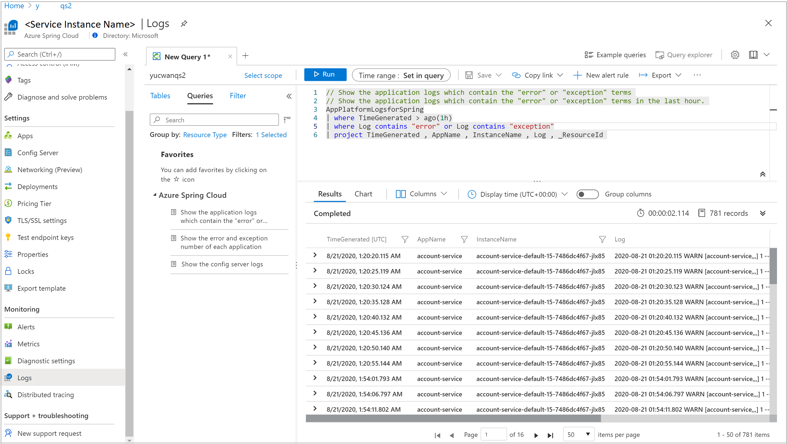
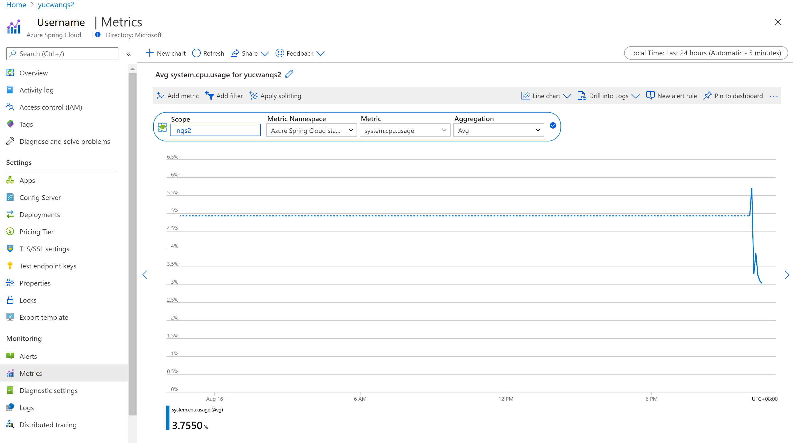
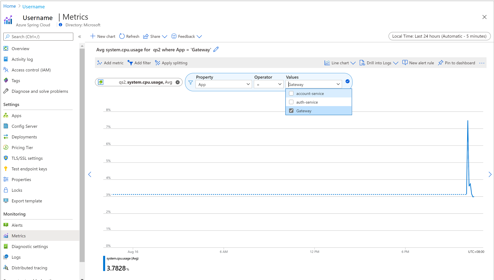
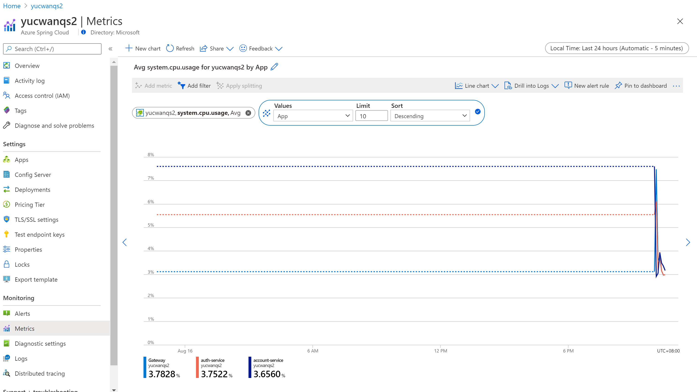
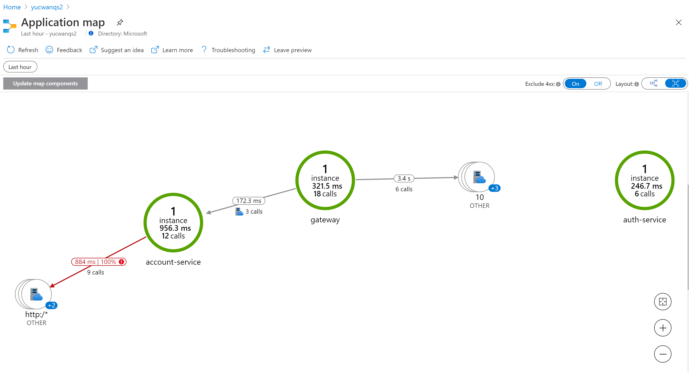
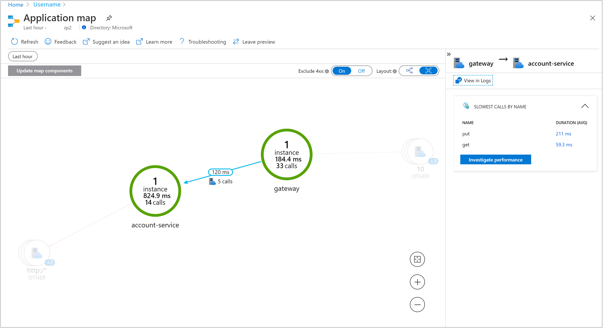
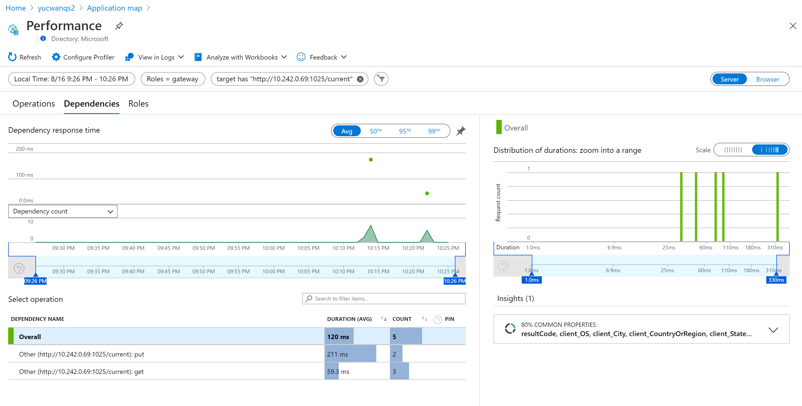

# Quickstart: Monitoring Azure Spring Cloud apps with logs, metrics, and tracing

With the built-in monitoring capability in Azure Spring Cloud, you can debug and monitor complex issues. Azure Spring Cloud integrates [Spring Cloud Sleuth](https://spring.io/projects/spring-cloud-sleuth) with Azure's [Application Insights](https://docs.microsoft.com/azure/azure-monitor/app/app-insights-overview). This integration provides powerful logs, metrics, and distributed tracing capability from the Azure portal. The following procedures explain how to use Log Streaming, Log Analytics, Metrics, and Distributed tracing with deployed PiggyMetrics apps.

## Prerequisites

Complete previous steps: 

* [Provision an instance of Azure Spring Cloud](spring-cloud-quickstart-provision-service-instance.md)
* [Set up the config server](spring-cloud-quickstart-setup-config-server.md)
* [Build and deploy apps](spring-cloud-quickstart-deploy-apps.md).

## Logs

There are two ways to see logs on Azure Spring Cloud: **Log Streaming** of real-time logs per app instance or **Log Analytics** for aggregated logs with advanced query capability.

### Log streaming

#### [CLI](#tab/Azure-CLI)

You can use log streaming in the Azure CLI with the following command.

```azurecli
az spring-cloud app logs -s <service instance name> -g <resource group name> -n gateway -f
```

You will see logs like this:

[  ](media/spring-cloud-quickstart-logs-metrics-tracing/logs-streaming-cli.png#lightbox)

> [!TIP]
> Use `az spring-cloud app logs -h` to explore more parameters and log stream functionalities.

#### [IntelliJ](#tab/IntelliJ)

To get the logs using Azure Toolkit for IntelliJ:

1. Select **Azure Explorer**, then **Spring Cloud**.

1. Right-click the running app.

1. Select **Streaming Logs** from the drop-down list.

   
    
1. Select **Instance**.

   
    
1. The streaming log will be visible in the output window.

   

---
### Log Analytics

1. Go to the **service | Overview** page and select **Logs** in the **Monitoring** section. Click **Run** on one of the sample queries for Azure Spring Cloud. 

   [  ](media/spring-cloud-quickstart-logs-metrics-tracing/logs-entry.png#lightbox)
    
1. Then you will see filtered logs. See [Azure Log Analytics docs](https://docs.microsoft.com/azure/azure-monitor/log-query/get-started-queries) for more guidance on writing queries.

   [  ](media/spring-cloud-quickstart-logs-metrics-tracing/logs-query.png#lightbox)

## Metrics

1. Go to the **service | Overview** page and select **Metrics** in the **Monitoring** section. Add your first metric by selecting `system.cpu.usage` for **Metric** and `Avg` for **Aggregation** to see the timeline for overall CPU usage.

   [  ](media/spring-cloud-quickstart-logs-metrics-tracing/metrics-basic-cpu.png#lightbox)
    
1. Click **Add filter** in the toolbar above, select `App=Gateway` to see CPU usage only for the **gateway** app.

   [  ](media/spring-cloud-quickstart-logs-metrics-tracing/metrics-filter.png#lightbox)

1. Dismiss the filter created above, click **Apply Splitting** and select `App` for **Values** to see CPU usage by different apps.

   [  ](media/spring-cloud-quickstart-logs-metrics-tracing/metrics-split.png#lightbox)

## Distributed tracing

1. Go to the **service | Overview** page and select **Distributed tracing** in the **Monitoring** section. Then click the **View application map** tab on the right.

   [  ](media/spring-cloud-quickstart-logs-metrics-tracing/tracing-entry.png#lightbox)

1. You can now see the status of calls between Piggymetrics apps. 

   [  ](media/spring-cloud-quickstart-logs-metrics-tracing/tracing-overview.png#lightbox)
    
1. Click the link between **gateway** and **account-service** to see more details like slowest calls by HTTP methods.

   [  ](media/spring-cloud-quickstart-logs-metrics-tracing/tracing-call.png#lightbox)
    
1. Finally, click **Investigate Performance** to explore more powerful built-in performance analysis.

   [  ](media/spring-cloud-quickstart-logs-metrics-tracing/tracing-performance.png#lightbox)

## Clean up resources

In the preceding steps, you created Azure resources in a resource group. If you don't expect to need these resources in the future, delete the resource group from portal, or by running the following command in the Cloud Shell:

```azurecli
az group delete --name <your resource group name; for example: hellospring-1558400876966-rg> --yes
```

In the preceding steps, you also set the default resource group name. To clear out that default, run the following command in the Cloud Shell:

```azurecli
az configure --defaults group=
```

## Next steps

To explore more on the out of box monitoring capability for Azure Spring Cloud, see:

> [!div class="nextstepaction"]
> [Diagnostic services](diagnostic-services.md)
> [Distributed tracing](spring-cloud-tutorial-distributed-tracing.md)
> [Stream logs in real time](spring-cloud-howto-log-streaming.md)
