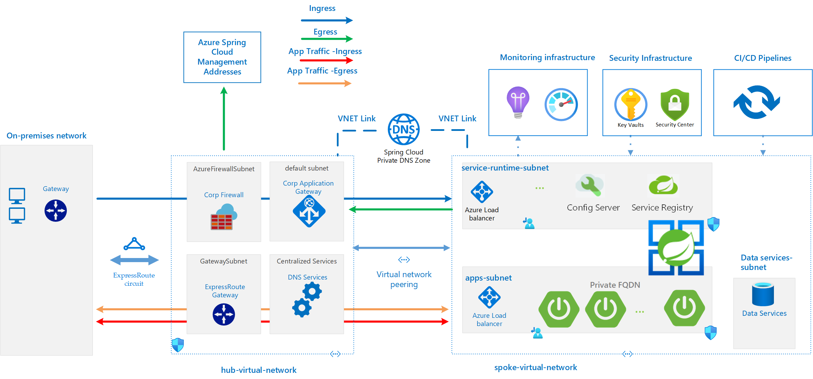
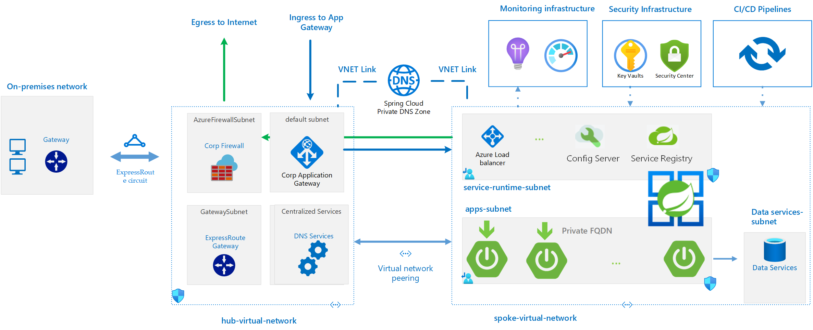

# Azure Spring Cloud reference architecture

This reference architecture is a foundation using a typical enterprise hub and spoke design for the use of Azure Spring Cloud. In the design, Azure Spring Cloud is deployed in a single spoke that's dependent on shared services hosted in the hub. The architecture is built with components to achieve the tenets in the [Microsoft Azure Well-Architected Framework][16].

For an implementation of this architecture, see the [Azure Spring Cloud Reference Architecture][10] repository on GitHub. Deployment options for this architecture include Azure Resource Manager (ARM), Terraform, and Azure CLI. The artifacts in this repo provide a foundation that you can customize for your environment. You can group resources such as Azure Firewall or Application Gateway into different resource groups or subscriptions. This grouping helps keep different functions separate, such as IT infrastructure, security, business application teams, and so on.

## Planning the address space

Azure Spring Cloud requires two dedicated subnets:

* Service runtime
* Spring Boot applications

Each of these subnets requires a dedicated cluster. Multiple clusters can't share the same subnets. The minimum size of each subnet is /28. The number of application instances that Azure Spring Cloud can support varies based on the size of the subnet. The detailed Virtual Network (VNET) requirements can be found in the [Virtual network requirements][11] section of [Deploy Azure Spring Cloud in a virtual network][17]

> [!WARNING]
> The selected subnet size can't overlap with the existing VNET address space, and should not overlap with any peered or on-premises subnet address ranges.

## Use cases

Typical uses for this architecture include:

* Internal applications deployed in hybrid cloud environments
* Externally facing applications

These use cases are similar except for their security and network traffic rules. This architecture is designed to support the nuances of each.

## Private applications

The infrastructure requirements for a private application are in the following list. These requirements are typically seen in highly regulated environments.

* There should be no direct egress to the public Internet except for control-plane traffic.
* Egress traffic should travel through a central Network Virtual Appliance (NVA) (for example, Azure Firewall).
* Data at rest should be encrypted.
* Data in transit should be encrypted.
* DevOps deployment pipelines can be used (for example, Azure DevOps) and require network connectivity to Azure Spring Cloud.
* Microsoft's Zero Trust security approach requires secrets, certificates, and credentials to be stored in a secure vault. The recommended service is Azure Key Vault.
* Application host Domain Name Service (DNS) records should be stored in Azure Private DNS.
* Name resolution of hosts on-premises and in the cloud should be bidirectional.
* Adherence to at least one security benchmark should be enforced.
* Azure service dependencies should communicate through service endpoints or private link.
* Resource groups managed by the Azure Spring Cloud deployment must not be modified.
* Subnets managed by the Azure Spring Cloud deployment must not be modified.
* A subnet must only have one instance of Azure Spring Cloud.
* If Azure Spring Cloud Config Server is used to load config properties from a repository, the repository must be private. For more information, see [Set up a Spring Cloud Config Server instance for your service][8].

The components that make up the design are in the following list:

* On-premises network
  * Domain Name Service (DNS)
  * Gateway
* Hub subscription
  * Azure Firewall Subnet
  * Application Gateway Subnet
  * Shared Services Subnet
* Connected subscription
  * Virtual Network Peer
  * Azure Bastion Subnet

The Azure services that are used in this reference architecture are in the following list:

* [Azure Spring Cloud][1]: provides a managed service that's designed and optimized specifically for Spring Boot applications that are written in Java.

* [Azure Key Vault][2]: a hardware-backed credential management service that has tight integration with Microsoft identity services and compute resources.

* [Azure Monitor][3]: an all-encompassing suite of monitoring services for applications that deploy both in Azure and on-premises.

* [Azure Security Center][4]: a unified security management and threat protection system for workloads across on-premises, multiple clouds, and Azure.

* [Azure Pipelines][5]: a fully featured Continuous Integration/Continuous Development (CI/CD) service that can automatically deploy updated Spring Boot apps to Azure Spring Cloud.

The following diagram represents a well-architected hub and spoke design that addresses the above requirements.

## Public applications

These requirements are typically seen in highly regulated environments. The infrastructure requirements for a public application are in the following list:

* Ingress traffic should be managed by at least Application Gateway or Azure Front Door.
* Azure DDoS Protection standard should be enabled.
* No direct egress to the public Internet except for control plane traffic.
* Egress traffic should traverse a central Network Virtual Appliance (NVA) (for example, Azure Firewall).
* Data at rest should be encrypted.
* Data in transit should be encrypted.
* DevOps deployment pipelines can be used (for example, Azure DevOps) and require network connectivity to Azure Spring Cloud.
* Microsoft's Zero Trust security approach requires secrets, certificates, and credentials to be stored in a secure vault. The recommended service is Azure Key Vault.
* Application host DNS records should be stored in Azure Private DNS.
* Internet routable addresses should be stored in Azure Public DNS.
* Name resolution of hosts on-premises and in the Cloud should be bidirectional.
* Adherence to at least one Security Benchmark should be enforced.
* Azure service dependencies should communicate through Service Endpoints or Private Link.
* Resource Groups managed by the Azure Spring Cloud deployment must not be modified.
* Subnets managed by the Azure Spring Cloud deployment must not be modified.
* A subnet must only have one instance of Azure Spring Cloud.

The components that make up the design are in the following list:

* On-premises network
  * Domain Name Service (DNS)
  * Gateway
* Hub subscription
  * Azure Firewall Subnet
  * Application Gateway Subnet
  * Shared Services Subnet
* Connected subscription
  * Virtual Network Peer
  * Azure Bastion Subnet

The Azure services that are used in this reference architecture are in the following list:

* [Azure Spring Cloud][1]: provides a managed service that's designed and optimized specifically for Java-based Spring Boot applications, and .NET based [Steeltoe][9] applications.

* [Azure Key Vault][2]: a hardware-backed credential management service that has tight integration with Microsoft identity services and compute resources.

* [Azure Monitor][3]: an all-encompassing suite of monitoring services for applications that deploy both in Azure and on-premises.

* [Azure Security Center][4]: a unified security management and threat protection system for workloads across on-premises, multiple clouds, and Azure.

* [Azure Pipelines][5]: a fully featured Continuous Integration/Continuous Development (CI/CD) service that can automatically deploy updated Spring Boot apps to Azure Spring Cloud.

* [Azure Application Gateway][6]: a load balancer responsible for application traffic with TLS offload operating at layer 7.

* [Azure Application Firewall][7]: a feature of Azure Application Gateway that provides centralized protection of applications from common exploits and vulnerabilities.

The following diagram represents a well-architected hub and spoke design that addresses the above requirements.

## Azure Spring Cloud on-premises connectivity

Applications running in Azure Spring Cloud can communicate to various Azure, on-premises, and external resources. By using the hub and spoke design, traffic can be routed externally, or to the on-premises network using Express Route or Site-to-Site Virtual Private Network (VPN).

## Azure Well-Architected Framework considerations

The [Azure Well-Architected Framework][16] is a set of guiding tenets to follow in establishing a strong infrastructure foundation. The framework contains the following categories: Cost Optimization, Operational Excellence, Performance Efficiency, Reliability, and Security.

### Cost optimization

By the nature of distributed system design, infrastructure sprawl is a reality. The result is unexpected costs that can't be controlled. Azure Spring Cloud is built using components that scale so that it can meet demand and optimize cost. The core of this architecture is the Azure Kubernetes Service (AKS). The service is designed to reduce the complexity and operational overhead of managing Kubernetes, which includes efficiencies in the operational cost of the cluster.

Different applications and application types can be deployed to a single instance of Azure Spring Cloud. The service supports autoscaling of applications triggered by metrics or schedules that can improve utilization and cost efficiency.

Application Insights and Azure Monitor can also be used to lower operational cost. With the visibility provided by the comprehensive logging solution, automation can be implemented to scale the components of the system in real time. Also, analysis of the log data can reveal inefficiencies in the application code that can be addressed to improve the overall cost and performance of the system.

### Operational excellence

Azure Spring Cloud addresses multiple aspects of operational excellence. These aspects can be combined to ensure the service runs efficiently in production environments:

* Azure Pipelines are used to ensure deployments are reliable and consistent while helping to avoid human error
* Azure Monitor and Application Insights are used to store log and telemetry data.
    Collected log and metric data can be assessed to ensure the health and performance of the application. Application Performance Monitoring (APM) is fully integrated into the service through a Java agent. This agent provides visibility into all the deployed applications and dependencies without requiring extra code. For more information about this topic, see the [blog post][15].
* Azure Security Center is used to ensure applications maintain security by providing a platform to analyze and assess the data provided
* The service supports various deployment patterns. For more information about this topic, see the deployments [guide][14]

### Reliability

Azure Spring Cloud is designed with Azure Kubernetes as a foundational component. While AKS provides a level of resiliency through clustering, this reference architecture incorporates services and architectural considerations to increase availability of the application because of a component failure.

By building on top of a well-defined hub and spoke design, the foundation of this architecture ensures it can be deployed to multiple regions. For the private application use case, Azure Private DNS is used to ensure continued availability during a geographic failure. For the public application use case, Azure Front Door and Azure Application Gateway ensure availability.

### Security

Security of this architecture was addressed by adhering to industry defined controls and benchmarks. The controls used in this architecture are from the Cloud Control Matrix (CCM) by the Cloud Security Alliance and the Microsoft Azure Foundations Benchmark (MAFB) by the Center for Internet Security. The primary security design principles of governance, networking, and application security were the focus of the applied controls. The design principles of Identity and Access Management and Storage are the responsibility of the reader as it relates to their target infrastructure.

#### Governance

The primary aspect of governance that this architecture addresses is segregation through isolation of network resources. In the CCM, DCS-08 recommends ingress and egress control for the datacenter. To satisfy the control, the architecture uses a hub and spoke design using Network Security Groups (NSGs) to filter east-west traffic between resources. Traffic between central services in the hub and resources in the spoke are also filtered. Also, traffic between the Internet and the resources within the architecture is managed through an instance of Azure Firewall.

| CSA CCM Control ID | CSA CCM Control Domain |
| :----------------- | :----------------------|
| DCS-08 | Datacenter Security Unauthorized Persons Entry |

#### Network

The network design supporting this architecture is derived from the traditional hub and spoke model. This decision ensures network isolation is a foundational construct. CCM control IVS-06 recommends that traffic between networks and virtual machines are restricted and monitored between trusted and untrusted environments. This architecture adopts the control by implementation of the NSGs for east-west traffic, and the Azure Firewall for north-south traffic. CCM control IPY-04 recommends that the infrastructure should use secure network protocols for the exchange of data between services. The Azure services supporting this architecture all use standard secure protocols such as TLS for HTTP and SQL.

| CSA CCM Control ID | CSA CCM Control Domain |
| :----------------- | :----------------------|
| IPY-04 | Interoperability & Portability Standardized Network Protocols |
| IVS-06 | Infrastructure & Virtualization SecurityNetwork Security |

The network implementation is further secured by defining controls from the MAFB. The controls ensure that traffic into the environment is restricted from the public Internet. The network egress rules implemented in this reference architecture are defined in the [Appendix](#appendix).

| CIS Control ID | CIS Control Description |
| :------------- | :---------------------- |
| 6.2 | Ensure that SSH access is restricted from the internet |
| 6.3 | Ensure no SQL Databases allow ingress 0.0.0.0/0 (ANY IP) |
| 6.5 | Ensure that Network Watcher is 'Enabled' |
| 6.6 | Ensure that ingress using UDP is restricted from the Internet |

#### Application security

This design principal is composed of fundamental components, which are identity, data protection, key management, and application configuration. By design, an application deployed in Azure Spring Cloud only runs with least privilege required to function. The set of authorization controls is directly related to data protection when using the service. This layered application security approach is strengthened through key management.

The controls that address key management in this reference from the CCM are in the following list:

| CSA CCM Control ID | CSA CCM Control Domain |
| :----------------- | :--------------------- |
| EKM-01 | Encryption and Key Management Entitlement |
| EKM-02 | Encryption and Key Management Key Generation |
| EKM-03 | Encryption and Key Management Sensitive Data Protection |
| EKM-04 | Encryption and Key Management Storage and Access |

From the CCM, EKM-02, and EKM-03 recommend policies and procedures to manage keys and the use of encryption protocols to protect sensitive data. EKM-01 recommends that all cryptographic keys have identifiable owners so that they can be managed. EKM-04 recommends the use of standard algorithms.

| CIS Control ID | CIS Control Description |
| :------------- | :---------------------- |
| 8.1 | Ensure that the expiration date is set on all keys |
| 8.2 | Ensure that the expiration date is set on all secrets |
| 8.4 | Ensure the key vault is recoverable |

The CIS controls 8.1 and 8.2 recommend expiration dates are set for credentials to ensure rotation is enforced. CIS control 8.4 ensures the contents of the key vault can be restored to maintain business continuity.

The aspects of application security set a foundation for the use of this reference architecture to support a Spring workload in Azure.

## Next steps

Explore this reference architecture through ARM, Terraform, and CLI deployments that are available as defined in the [Reference Deployment](#quickstart-reference-deployments) section.

## Appendix

To deploy Azure Spring Cloud in a secured environment, management traffic must egress for the service to function. Below are the Network and Application rules that must be allowed on Azure Firewall, or equivalent Network Virtual Appliance (NVA).

### Azure Spring Cloud network rules

[Azure Spring Cloud required Network Security Rules][12]

### Azure Spring Cloud application rules

[Azure Spring Cloud required Application Security Rules][13]

<!-- Reference links in article -->
[1]: /azure/spring-cloud/
[2]: /azure/key-vault/
[3]: /azure/azure-monitor/
[4]: /azure/security-center/
[5]: /azure/devops/pipelines/
[6]: /azure/application-gateway/
[7]: /azure/web-application-firewall/
[8]: /azure/spring-cloud/spring-cloud-tutorial-config-server/
[9]: https://steeltoe.io/
[10]: https://github.com/Azure/azure-spring-cloud-reference-architecture
[11]: /azure/spring-cloud/spring-cloud-tutorial-deploy-in-azure-virtual-network#virtual-network-requirements
[12]: /azure/spring-cloud/spring-cloud-vnet-customer-responsibilities#azure-spring-cloud-network-requirements
[13]: /azure/spring-cloud/spring-cloud-vnet-customer-responsibilities#azure-spring-cloud-fqdn-requirements--application-rules
[14]: /azure/spring-cloud/spring-cloud-howto-staging-environment
[15]: https://devblogs.microsoft.com/java/monitor-applications-and-dependencies-in-azure-spring-cloud/
[16]: /azure/architecture/framework/
[17]: /azure/spring-cloud/spring-cloud-tutorial-deploy-in-azure-virtual-network#virtual-network-requirements
