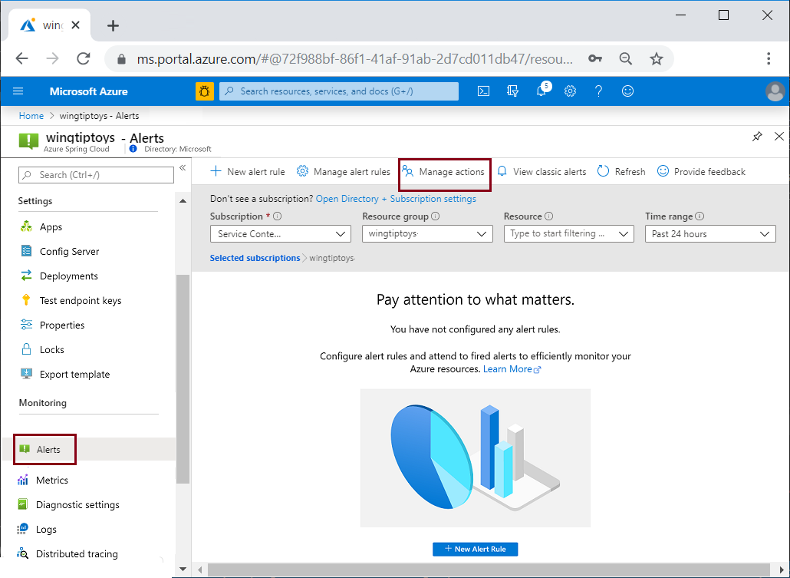
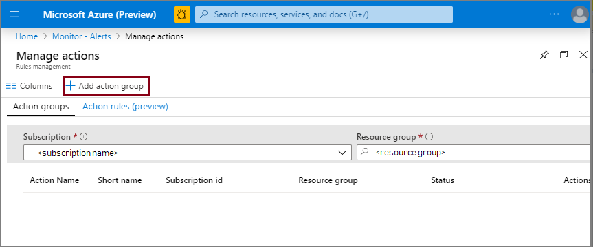
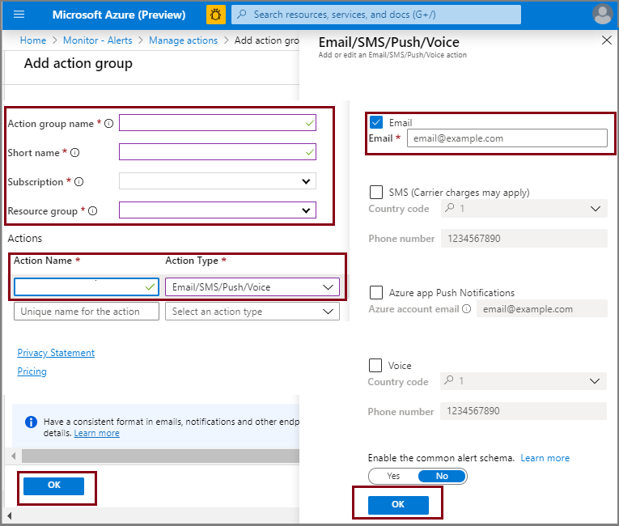
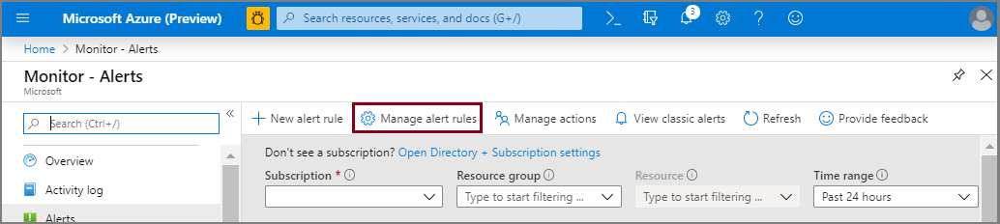
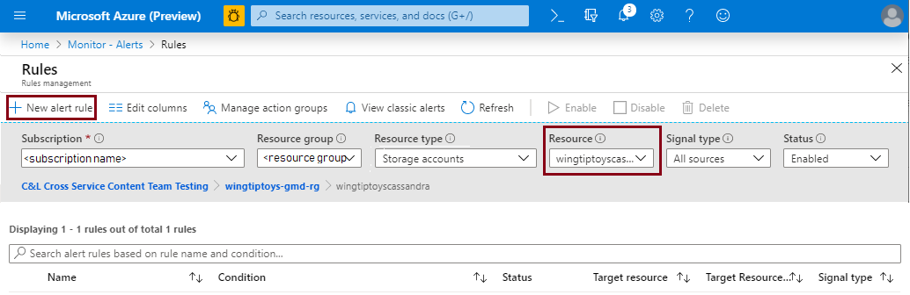
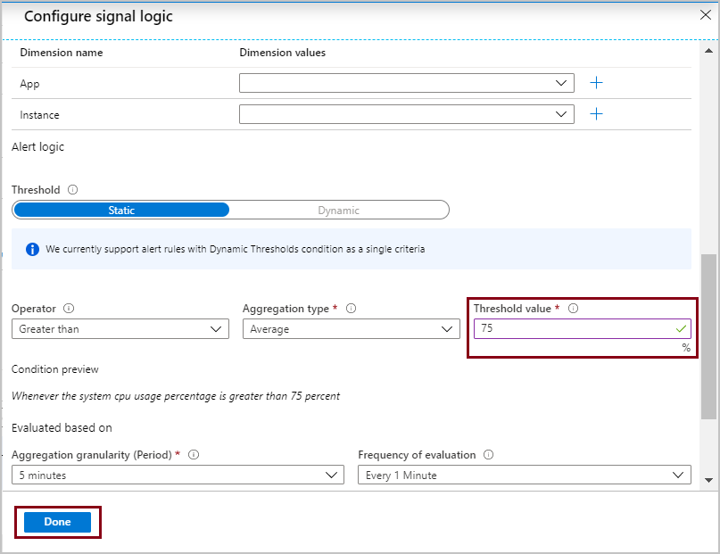
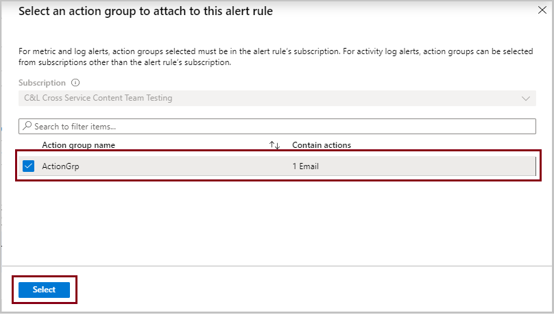
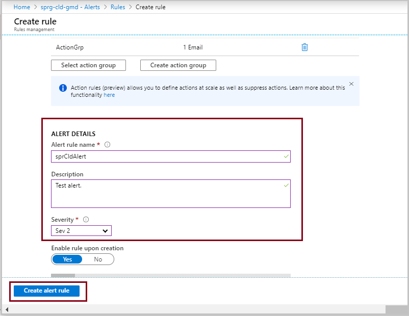
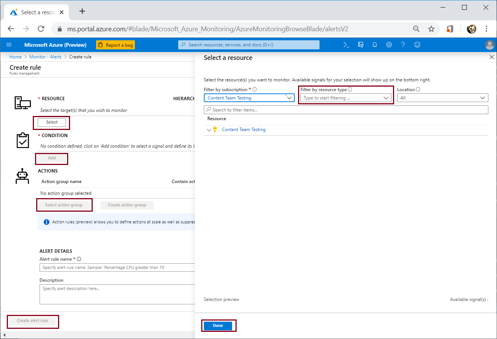
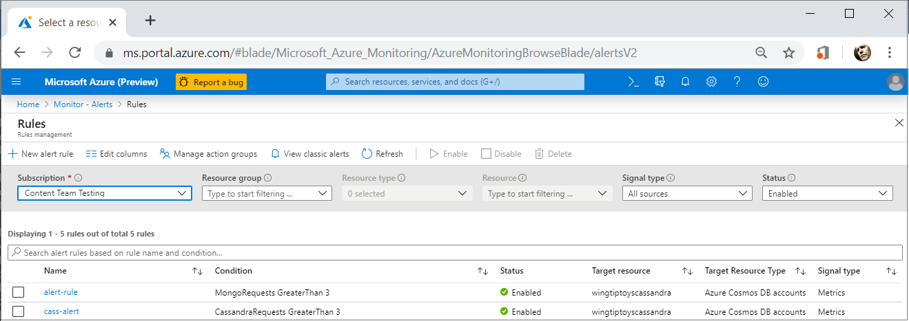

# Tutorial: Monitor Spring Cloud resources using alerts and action groups

Azure Spring Cloud alerts support monitoring resources based on conditions such as available storage, rate of requests, or data usage. An alert sends notification when rates or conditions meet the defined specifications.

There are two steps to set up an alert pipeline: 
1. Set up an Action Group with the actions to be taken when an alert is triggered, such as email, SMS, Runbook, or Webhook. Action Groups can be re-used among different alerts.
2. Set up Alert rules. The rules bind metric patterns with the action groups based on target resource, metric, condition, time aggregation, etc.

## Prerequisites
In addition to the Azure Spring requirements, this tutorial depends on the following resources.

* A deployed Azure Spring Cloud instance.  Follow our [quickstart](spring-cloud-quickstart-launch-app-cli.md) to get started.

* An Azure resource to monitor. This example monitors a Spring Cloud instance.
 
The following procedures initialize both **Action Group** and **Alert** starting from the **Alerts** option in the left navigation pane of a Spring Cloud instance. (The procedure can also start from the **Monitor Overview** page of the Azure portal.) 

Navigate from a resource group to your Spring Cloud instance. Select **Alerts** in the left pane, then select **Manage actions**:

## Set up Action Group

To begin the procedure to initialize a new **Action Group**, select **+ Add action group**.

On the **Add action group** page:

 1. Specify an **Action group name** and **Short name**.

 1. Specify **Subscription** and **Resource group**.

 1. Specify **Action Name**.

 1. Select **Action Type**.  This will open another pane on the right to define the action that will be taken on activation.

 1. Define the action using the options in the right pane.  This case uses email notification.

 1. Click **OK** in the right action pane.

 1. Click **OK** in the **Add action group** dialog. 

  

## Set up Alert 

The previous steps created an **Action Group** that uses email. You could also use phone notification, webhooks, Azure functions, etc.  

To configure an **Alert**, navigate back to the **Alerts** page, and click **Manage Alert Rules**.

  

1. Select the **Resource** for the alert.

1. Click **+ New alert rule**.

   

1. On the **Create rule** page, specify the **RESOURCE**.

1. The **CONDITION** setting provides many options for monitoring your **Spring Cloud** resources.  Click **Add** to open the **Configure signal logic** pane.

1. Select a condition. This example uses **System CPU Usage Percentage**.

   

1. Scroll down the **Configure signal logic** pane to set the **Threshold value** to monitor.

   

1. Click **Done**.

For details of the conditions available to monitor, see [User portal metrics options](spring-cloud-concept-metrics.md#user-metrics-options).

 Under **ACTIONS**, click **Select action group**. From **ACTIONS** pane select the previously defined **Action Group**.

    

1. Scroll down, and under **ALERT DETAILS**, name the alert rule.

1. Set the **Severity**.

1. Click **Create alert rule**.

   

Verify that the new alert rule is enabled.

   

A rule can also be created using the **Metrics** page:

   

## Next steps
* [User portal metrics options](spring-cloud-concept-metrics.md#user-metrics-options)
* [Create and manage action groups in the Azure portal](https://docs.microsoft.com/azure/azure-monitor/platform/action-groups)
* [SMS Alert Behavior in Action Groups](https://docs.microsoft.com/azure/azure-monitor/platform/alerts-sms-behavior)
* [Tutorial: Using Distributed Tracing with Azure Spring Cloud](https://docs.microsoft.com/azure/spring-cloud/spring-cloud-tutorial-distributed-tracing)
