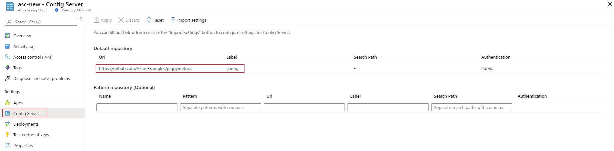
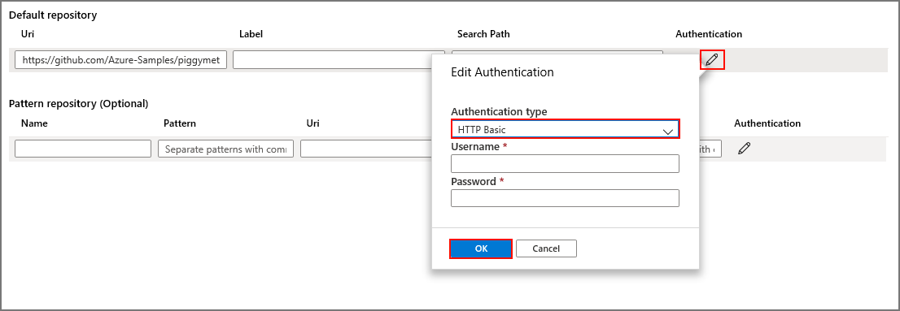
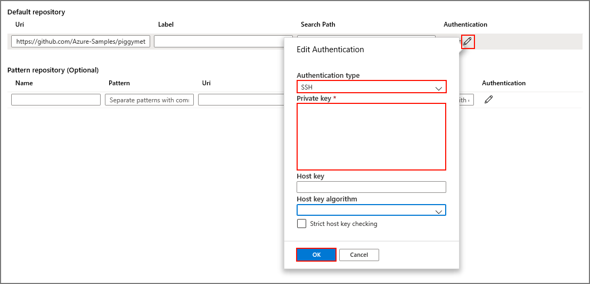

# Tutorial: Set up a Spring Cloud Config Server for your service

This tutorial will show you how to connect a Spring Cloud Config Server to your Azure Spring Cloud service.

Spring Cloud Config provides server and client-side support for externalized configuration in a distributed system. With the Config Server, you have a central place to manage external properties for applications across all environments.​ To learn more, visit the [Spring Cloud Config Server reference](https://spring.io/projects/spring-cloud-config).

## Prerequisites
* An Azure subscription. If you don't have an Azure subscription, create a [free account](https://azure.microsoft.com/free/?WT.mc_id=A261C142F) before you begin. 
* An already provisioned and running Azure Spring Cloud service.  Complete [this quickstart](spring-cloud-quickstart-launch-app-cli.md) to provision and launch an Azure Spring Cloud service.

## Restriction

There are some restrictions when you use __Config Server__ with a git backend. Some properties will automatically be injected into your application environment to access __Config Server__ and __Service Discovery__. If you also configure those properties from your **Config Server** files, you may experience conflicts and unexpected behavior. The properties include: 

```yaml
eureka.client.service-url.defaultZone
eureka.client.tls.keystore
server.port
spring.cloud.config.tls.keystore
spring.application.name
```
> [!CAUTION]
> We strongly suggest you __DO NOT__ put the above properties in your __Config Server__  application files.

## Create your Config Server files

Azure Spring Cloud supports Azure DevOps, GitHub, GitLab, and Bitbucket for storing your Config Server files. When you have your repository ready, make the configuration files with the instructions below and store them there.

Furthermore, some configurable properties are only available for some types. The following subsections list the properties for each repository type.

### Public repository

When using a public repository, your configurable properties will be more limited.

All configurable properties used to set up the public `Git` repository are listed below.

> [!NOTE]
> Using a hyphen ("-") to separate words is the only naming convention that is currently supported. For example, you can use `default-label`, but not `defaultLabel`.

| Property        | Required | Feature                                                      |
| :-------------- | -------- | ------------------------------------------------------------ |
| `uri`           | `yes`    | The `uri` of the `Git` repository used as the config server backend, should be started with `http://`, `https://`, `git@`, or `ssh://`. |
| `default-label` | `no`     | The default label of the `Git` repository, should be the `branch name`, `tag name`, or `commit-id` of the repository. |
| `search-paths`  | `no`     | An array of strings used to search subdirectories of the `Git` repository. |

------

### Private repository with SSH authentication

All configurable properties used to set up private `Git` repository with `Ssh` are listed below.

> [!NOTE]
> Using a hyphen ("-") to separate words is the only naming convention that is currently supported. For example, you can use `default-label`, but not `defaultLabel`.

| Property                   | Required | Feature                                                      |
| :------------------------- | -------- | ------------------------------------------------------------ |
| `uri`                      | `yes`    | The `uri` of the `Git` repository used as the config server backend, should be started with `http://`, `https://`, `git@`, or `ssh://`. |
| `default-label`            | `no`     | The default label of the `Git` repository, should be the `branch name`, `tag name`, or `commit-id` of the repository. |
| `search-paths`             | `no`     | An array of strings used to search subdirectories of the `Git` repository. |
| `private-key`              | `no`     | The `Ssh` private key to access the `Git` repository, __required__ when `uri` starts with `git@` or `ssh://`. |
| `host-key`                 | `no`     | The host key of the Git repository server, should not include the algorithm prefix as covered by `host-key-algorithm`. |
| `host-key-algorithm`       | `no`     | The host key algorithm, should be `ssh-dss`, `ssh-rsa`, `ecdsa-sha2-nistp256`, `ecdsa-sha2-nistp384`, or `ecdsa-sha2-nistp521`. Only required if `host-key` exists. |
| `strict-host-key-checking` | `no`     | Indicates whether the config server will fail to start when leveraging the private `host-key`. Should be `true` (default value) or `false`. |

-----

### Private repository with basic authentication

All configurable properties used to set up private Git repository with basic authentication are listed below.

> [!NOTE]
> Using a hyphen ("-") to separate words is the only naming convention that is currently supported. For example, use `default-label` not `defaultLabel`.

| Property        | Required | Feature                                                      |
| :-------------- | -------- | ------------------------------------------------------------ |
| `uri`           | `yes`    | The `uri` of the `Git` repository used as the config server backend, should be started with `http://`, `https://`, `git@`, or `ssh://`. |
| `default-label` | `no`     | The default label of the `Git` repository, should be the `branch name`, `tag name`, or `commit-id` of the repository. |
| `search-paths`  | `no`     | An array of strings used to search subdirectories of the `Git` repository. |
| `username`      | `no`     | The `username` used to access the `Git` repository server, __required__ when the `Git` repository server supports `Http Basic Authentication`. |
| `password`      | `no`     | The password used to access the `Git` repository server, __required__ when the `Git` repository server supports `Http Basic Authentication`. |

> [!NOTE]
> Some `Git` repository servers, like GitHub, support a "personal-token" or "access-token" as a password for `HTTP Basic Authentication`. You can use that kind of token as a password here too, and the "personal-token" or "access-token" will not expire. However, for Git repository servers like BitBucket and Azure DevOps, the token will expire in one or two hours, making that option not viable for use with Azure Spring Cloud.

### Git repositories with pattern

All configurable properties used to set up Git repositories with pattern are listed below.

> [!NOTE]
> Using a hyphen ("-") to separate words is the only naming convention that is currently supported. For example, use `default-label` not `defaultLabel`.

| Property                           | Required         | Feature                                                      |
| :--------------------------------- | ---------------- | ------------------------------------------------------------ |
| `repos`                            | `no`             | A map consisting of the settings for a `Git` repository with a given name. |
| `repos."uri"`                      | `yes` on `repos` | The `uri` of the `Git` repository used as the config server backend, should be started with `http://`, `https://`, `git@`, or `ssh://`. |
| `repos."name"`                     | `yes` on `repos` | A name to identify one `Git` repository, __required__ only if `repos` exists. For example from above, `team-A`, `team-B`. |
| `repos."pattern"`                  | `no`             | An array of strings used to match an application name. For each pattern, use the `{application}/{profile}` format with wildcards. |
| `repos."default-label"`            | `no`             | The default label of the `Git` repository, should be the `branch name`, `tag name`, or `commit-id` of the repository. |
| `repos."search-paths`"             | `no`             | An array of strings used to search subdirectories of the `Git` repository. |
| `repos."username"`                 | `no`             | The `username` used to access the `Git` repository server, __required__ when the `Git` repository server supports `Http Basic Authentication`. |
| `repos."password"`                 | `no`             | The password used to access the `Git` repository server, __required__ when the `Git` repository server supports `Http Basic Authentication`. |
| `repos."private-key"`              | `no`             | The `Ssh` private key to access `Git` repository, __required__ when `uri` starts with `git@` or `ssh://`. |
| `repos."host-key"`                 | `no`             | The host key of the Git repository server, should not include the algorithm prefix as covered by `host-key-algorithm`. |
| `repos."host-key-algorithm"`       | `no`             | The host key algorithm, should be `ssh-dss`, `ssh-rsa`, `ecdsa-sha2-nistp256`, `ecdsa-sha2-nistp384`, or `ecdsa-sha2-nistp521`. Only __required__ if `host-key` exists. |
| `repos."strict-host-key-checking"` | `no`             | Indicates whether the config server will fail to start when leveraging the private `host-key`. Should be `true` (default value) or `false`. |

## Attaching your Config Server repository to Azure Spring Cloud

Now that you have your configuration files saved in a repository, you need to connect Azure Spring Cloud to it.

1. Log in to the [Azure portal](https://portal.azure.com).

1. Navigate to your Azure Spring Cloud **Overview** page.

1. Go to the **Config Server** tab under the **Settings** heading in the menu on the left side.



### Input repository information directly to the Azure portal

#### Default repository

* Public repository: In the **Default repository** section, paste the repository URI in the **Uri** section and ensure the **Authentication** setting is **Public**. Then click **Apply** to finish. 

* Private repository: Azure Spring Cloud supports basic password/token based authentication and SSH.

    * Basic Authentication: In the **Default repository** section, paste the repository's URI in the **Uri** section, then click the **Authentication**. Select **Basic** as your **Authentication type** and enter your username and password/token to grant access to Azure Spring Cloud. Click **OK** and **Apply** to finish setting up your Config Server.

    
    
    > [!CAUTION]
    > Some Git repository servers like GitHub use a `personal-token` or a `access-token` like a password for **Basic Authentication**. You can use that kind of token as password in Azure Spring Cloud, as it will never expire. But for other Git repository servers such as BitBucket and Azure DevOps, the `access-token` will expire in one or two hours. This means that option not viable when using those repository servers with Azure Spring Cloud.]

    * SSH: In the **Default repository** section, paste the repository's URI in the **Uri** section, then click the **Authentication**. Select **SSH** as your **Authentication type** and enter your **Private key**. You can optionally specify your **Host key** and **Host key algorithm**. Be sure to include your public key in your config server repository. Click **OK** and **Apply** to finish setting up your Config Server.

    

#### Pattern repository

If you want to use an optional **Pattern repository** to configure your service, specify the **URI** and **Authentication** the same way as the **Default repository**. Be sure to include a **Name** for your pattern, then click **Apply** to attach it to your instance. 

### Enter repository information into a YAML file

If you have written a YAML file with your repository settings, you can import your YAML file directly from your local machine to Azure Spring Cloud. A simple YAML file for a private repository with basic authentication would look like this:

```yml
spring:
    cloud:
        config:
            server:
                git:
                    uri: https://github.com/azure-spring-cloud-samples/config-server-repository.git
                    username: <username>
                    password: <password/token>

```

Click the **Import settings** button, then select the `.yml` file from your project directory. Click **Import**, then an `async` operation from your **Notifications** will pop up. After 1-2 minutes, it should report success.


You should see the information from your YAML file displayed in the Azure portal. Click **Apply** to finish. 


## Delete your app configuration

Once you've saved a configuration file, the **Delete app configuration** button will appear in the **Configuration** tab. This will erase your existing settings completely. You should do this if you wish to connect your config server to another source, such as moving from GitHub to Azure DevOps.


## Next steps

In this tutorial, you learned how to enable and configure the Config Server. To learn more about managing your application, continue to the tutorial for manually scaling your app.

> [!div class="nextstepaction"]
> [Learn how to manually scale your Azure Spring Cloud application](spring-cloud-tutorial-scale-manual.md).

