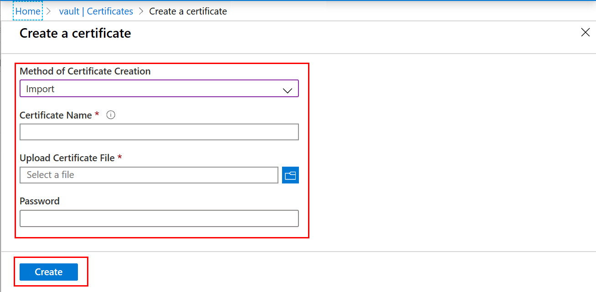
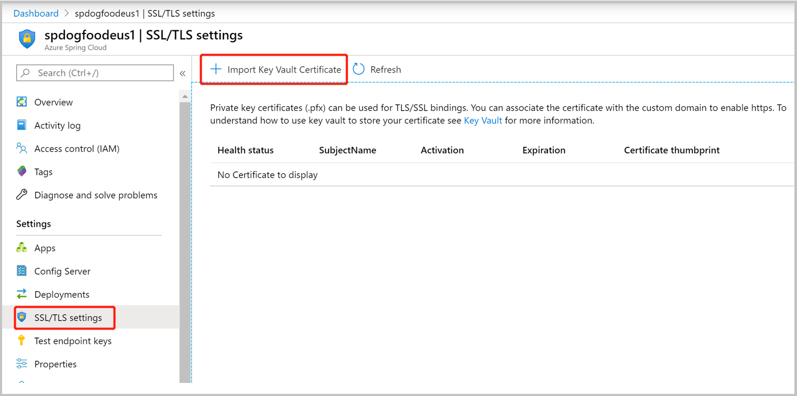
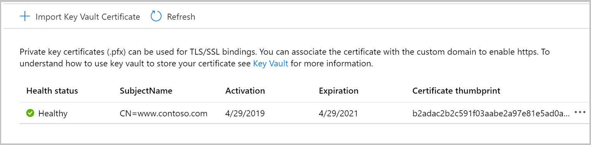
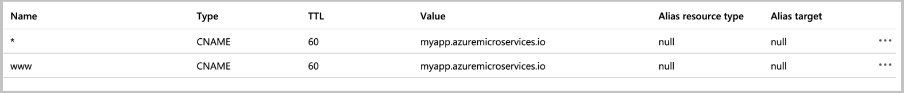
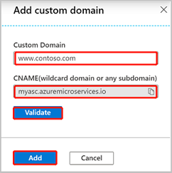
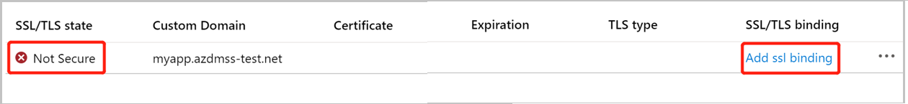
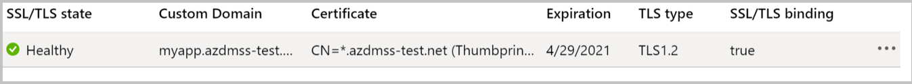

# Map an existing custom DNS name to Azure Spring Cloud
This tutorial maps a domain, such as www.contoso.com, using a CNAME record. It secures the custom domain with a certificate and shows how to enforce Transport Layer Security (TLS), also known as Secure Sockets Layer (SSL). 

Certificates encrypt web traffic. These TLS/SSL certificates can be stored in Azure Key Vault. 

## Prerequisites
* An application deployed to Azure Spring Cloud (see [Quickstart: Launch an existing Azure Spring Cloud application using the Azure portal](spring-cloud-quickstart-launch-app-portal.md), or use an existing app).
* A domain name with access to the DNS registry for domain provider such as GoDaddy.
* A private certificate from a third-party provider. The certificate must match the domain.
* A deployed instance of [Azure Key Vault](https://docs.microsoft.com/azure/key-vault/key-vault-overview)

## Import certificate 
The procedure to import a certificate requires the PEM or PFX encoded file to be on disk and you must have the private key. 

To upload your certificate to key vault:
1. Go to your key vault instance.
1. In the left navigation pane, click **Certificates**.
1. On the upper menu, click **Generate/import**.
1. In the **Create a certificate** dialog under **Method of certificate creation** select `Import`.
1. Under **Upload Certificate File** navigate to certificate location and select it.
1. Under **Password** enter the private key for your certificate.
1. Click **Create**.

To import certificate to Azure Spring Cloud:
1. Go to your service instance. 
1. From the left navigation pane of your app, select **TLS/SSL settings**.
1. Then click **Import Key Vault Certificate**.

When you have successfully imported your certificate, you'll see it on the list of **Private Key Certificates**.

>[!IMPORTANT] 
> To secure a custom domain with this certificate, you still need to bind the certificate to a specific domain. Follow the steps in this document under the heading **Add SSL Binding**.

## Add Custom Domain
You can use a CNAME record to map a custom DNS name to Azure Spring Cloud. 

> [NOTE] 
> The A record is not supported. 

### Create the CNAME record
Go to your DNS provider and add a CNAME record to map your domain to the <service_name>.azuremicroservices.io, where <service_name> is the name of your Azure Spring Cloud instance. We support wildcard domain and sub domain. 
After you add the CNAME, the DNS records page will resemble the following example: 

## Map your custom domain to Azure Spring Cloud app
If you don't have an application in Azure Spring Cloud, follow the instructions in [Quickstart: Launch an existing Azure Spring Cloud application using the Azure portal](https://review.docs.microsoft.com/azure/spring-cloud/spring-cloud-quickstart-launch-app-portal?branch=master).

Go to application page.

1. Select **Custom Domain**.
2. Then **Add Custom Domain**. 

3. Type the fully qualified domain name for which you added a CNAME record, such as www.contoso.com. Make sure that Hostname record type is set to CNAME (<service_name>.azuremicroservices.io)
4. Click **Validate** to enable the **Add** button.
5. Click **Add**.

One app can have multiple domains, but one domain can only map to one app. When you've successfully mapped your custom domain to the app, you'll see it on the custom domain table.

>[!NOTE]
> A **Not Secure** label for your custom domain means that it's not yet bound to an SSL certificate. Any HTTPS request from a browser to your custom domain will receive an error or warning.

## Add SSL binding
In the custom domain table, select **Add ssl binding** as shown in the previous figure.  
1. Select your **Certificate** or import it.
1. Click **Save**.

After you successfully add SSL binding, the domain state will be secure: **Healthy**. 

## Enforce HTTPS
By default, anyone can still access your app using HTTP, but you can redirect all HTTP requests to the HTTPS port.

In your app page, in the left navigation, select **Custom Domain**. Then, set **HTTPS Only**, to *True*.

When the operation is complete, navigate to any of the HTTPs URLs that point to your app. Note that HTTP URLs don't work.

## See also
* [What is Azure Key Vault?](https://docs.microsoft.com/azure/key-vault/key-vault-overview)
* [Import a certificate](https://docs.microsoft.com/azure/key-vault/certificate-scenarios#import-a-certificate)
* [Launch your Spring Cloud App using the Azure CLI](https://docs.microsoft.com/azure/spring-cloud/spring-cloud-quickstart-launch-app-cli)

