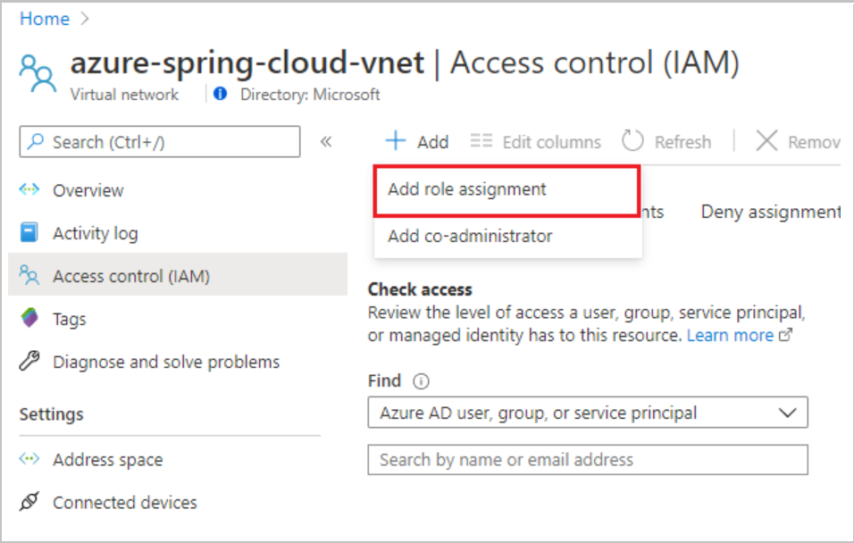
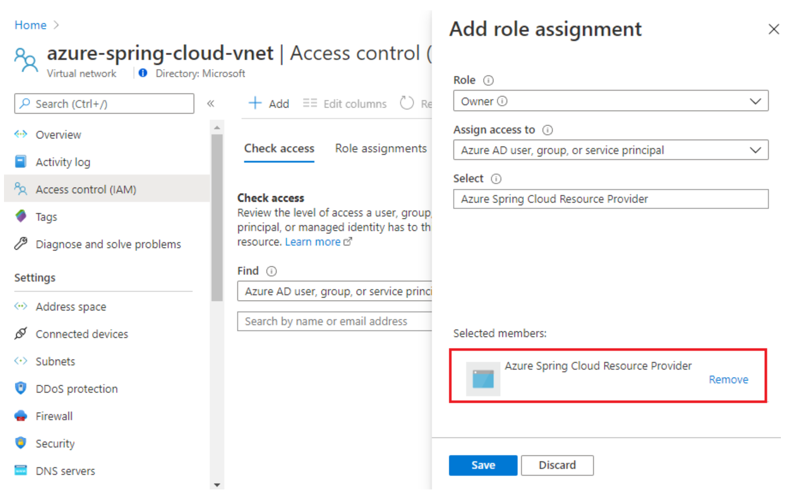
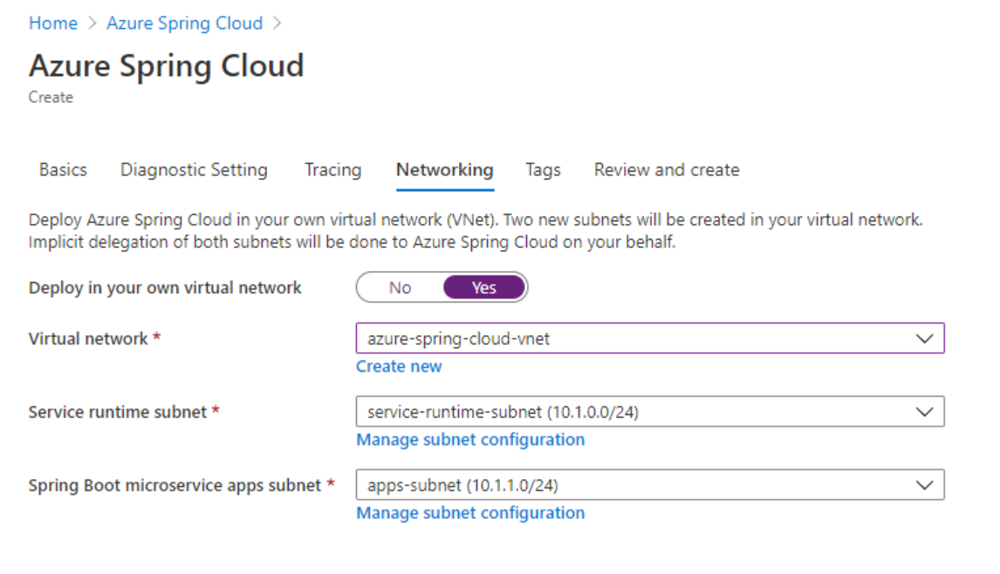
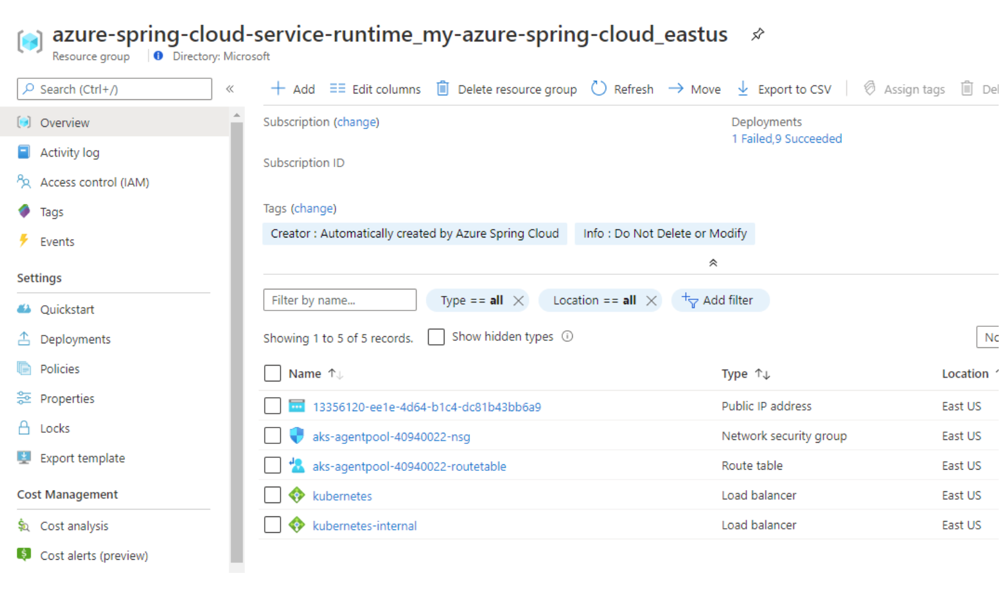
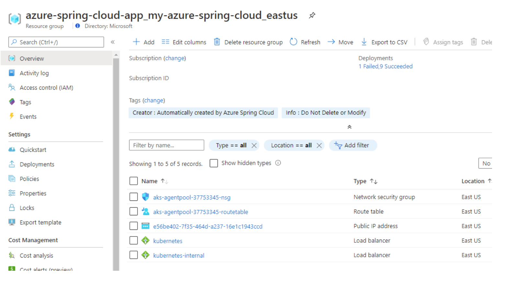
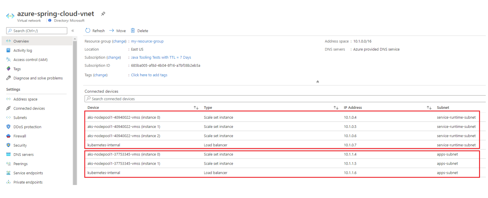

# Tutorial: Deploy Azure Spring Cloud in Azure virtual network (VNet injection)

This tutorial explains how to deploy an Azure Spring Cloud service instance in your virtual network. This is sometimes called VNet injection.  

The deployment enables:

* Isolation of Azure Spring Cloud apps and service runtime from the Internet​ on your corporate network​
* Azure Spring Cloud interaction with systems in ​on-premises data centers ​and/or Azure services in other virtual networks
* Empowerment of customers to control inbound and outbound network communications for Azure Spring Cloud

## Prerequisites
You must register Azure Spring Cloud resource provider `Microsoft.AppPlatform` according to instructions [Register Resource Provider on Azure portal](https://docs.microsoft.com/azure/azure-resource-manager/management/resource-providers-and-types#azure-portal) or by running the following az CLI command:

```azurecli
az provider register --namespace Microsoft.AppPlatform
```
## Virtual network requirements
The virtual network to which you deploy your Azure Spring Cloud service instance must meet the following requirements:

* **Location**: The virtual network must reside in the same location as the Azure Spring Cloud service instance.
* **Subscription**: The virtual network must be in the same subscription as the Azure Spring Cloud service instance.
* **Subnets**: The virtual network must include two subnets dedicated to an Azure Spring Cloud service instance: 
    * One for Service Runtime
    * One for your Spring Boot Microservice Applications. 
    * There is a one-to-one relationship between these subnets and an Azure Spring Cloud service instance. You must use a new subnet for each service instance you deploy and each subnet can only include a single service instance.
* **Address space**: One CIDR block up to /28 for Service Runtime subnet and another CIDR block up to /24 for Spring Boot Microservice Applications subnet.
* **Route table**: The subnets must not have an existing route table associated.

The following procedures describe setup of the virtual network to contain the instance of Azure Spring Cloud.

## Create a virtual network
If you already have a virtual network to host Azure Spring Cloud service instance, skip step 1, 2 and 3. You can start from step 4 to prepare subnets for the virtual network.

1. From the Azure portal menu, select **Create a resource**. From the Azure Marketplace, select **Networking** > **Virtual network**.

1. In the **Create virtual network** dialog, enter or select the following information:

    |Setting          |Value                                             |
    |-----------------|--------------------------------------------------|
    |Subscription     |Select your subscription.                         |
    |Resource group   |Select your resource group, or create a new one.  |
    |Name             |Enter *azure-spring-cloud-vnet*                   |
    |Location         |Select **East US**                                |

1. Click **Next: IP Addresses >**. 
 
1. For IPv4 address space, enter 10.1.0.0/16.

1. Select **Add subnet**, then enter *service-runtime-subnet* for **Subnet name** and 10.1.0.0/24 for **Subnet address range**. Then click **Add**.

1. Select **Add subnet** again, then enter *apps-subnet* for **Subnet name** and 10.1.1.0/24 for **Subnet address range**.  Click **Add**.

1. Click **Review + create**. Leave the rest as defaults and click **Create**.

## Grant service permission to the virtual network

Select the virtual network *azure-spring-cloud-vnet* you previously created.

1. Select **Access control (IAM)**, then select **Add > Add role assignment**.

    

2. In the **Add role assignment** dialog, enter or select this information:

    |Setting  |Value                                             |
    |---------|--------------------------------------------------|
    |Role     |Select **Owner**                                  |
    |Select   |Enter *Azure Spring Cloud Resource Provider*      |

    Then select *Azure Spring Cloud Resource Provider*, and click **Save**.

    

You can also achieve this by running the following az CLI command

```azurecli
VIRTUAL_NETWORK_RESOURCE_ID=`az network vnet show \
    --name ${NAME_OF_VIRTUAL_NETWORK} \
    --resource-group ${RESOURCE_GROUP_OF_VIRTUAL_NETWORK} \
    --query "id" \
    --output tsv`

az role assignment create \
    --role "Owner" \
    --scope ${VIRTUAL_NETWORK_RESOURCE_ID} \
    --assignee e8de9221-a19c-4c81-b814-fd37c6caf9d2
```

## Deploy Azure Spring Cloud service instance in the virtual network

1. Open the Azure portal using at https://ms.portal.azure.com .

1. From the top search box, search for **Azure Spring Cloud**, and select **Azure Spring Cloud** from the result.

1. On the **Azure Spring Cloud** page, select **+ Add**.

1. Fill out the form on the Azure Spring Cloud **Create** page. 

1. Select the same resource group and region as the virtual network.

1. For **Name** under **Service Details**, select *azure-spring-cloud-vnet*.

1. Select **Networking** tab and select the following:

    |Setting                                |Value                                             |
    |---------------------------------------|--------------------------------------------------|
    |Deploy in your own virtual network     |Select **Yes**                                    |
    |Virtual network                        |Select *azure-spring-cloud-vnet*                  |
    |Service runtime subnet                 |Select *service-runtime-subnet*                   |
    |Spring Boot microservice apps subnet   |Select *apps-subnet*                              |

    

1. Click **Review and create**.

1. Verify your specifications, and click **Create**.

After the deployment, two additional resource groups will be created in your subscription to host the network resources for the Azure Spring Cloud service instance.  Navigate to **Home** then select **Resource groups** from the top menu items to find the following new resource groups.

The resource group named as *azure-spring-cloud-service-runtime_{service instance name}_{service instance region}* contains network resources for the Service Runtime of the service instance.

  

The resource group named as *azure-spring-cloud-service-runtime_{service instance name}_{service instance region}* contains network resources for your Spring Boot Microservice Applications of the service instance.

  

Those network resources are connected to your virtual network created above.

  

   > [!Important]
   > The resource groups are fully managed by Azure Spring Cloud service. Please do NOT manually delete or modify any resource inside.

## Next steps

[Deploy Application to Azure Spring Cloud in your VNet](https://github.com/microsoft/vnet-in-azure-spring-cloud/blob/master/02-deploy-application-to-azure-spring-cloud-in-your-vnet.md)

## See also

- [Troubleshooting Azure Spring Cloud in VNET](https://github.com/microsoft/vnet-in-azure-spring-cloud/blob/master/05-troubleshooting-azure-spring-cloud-in-vnet.md)
- [Customer Responsibilities for Running Azure Spring Cloud in VNET](https://github.com/microsoft/vnet-in-azure-spring-cloud/blob/master/06-customer-responsibilities-for-running-azure-spring-cloud-in-vnet.md)
