# Use IntelliJ to deploy Azure Spring Cloud applications
The IntelliJ plug-in for Azure Spring Cloud supports application deployment from the IntelliJ IDEA.  

## Prerequisites
* [JDK 8 Azul Zulu](https://docs.microsoft.com/java/azure/jdk/java-jdk-install?view=azure-java-stable)
* [Maven 3.5.0+](https://maven.apache.org/download.cgi)
* [IntelliJ IDEA, Community/Ultimate Edition, version 2020.1/2019.3](https://www.jetbrains.com/idea/download/#section=windows)

## Install the plug-in
You can add the Azure Toolkit for IntelliJ IDEA 3.35.0 from the IntelliJ **Plugins** UI.

1. Start IntelliJ.  If you have opened a project previously, close the project to show the welcome dialog. Select **Configure** from link lower right, and then click **Plugins** to open the plug-in configuration dialog, and select **Install Plugins from disk**.

    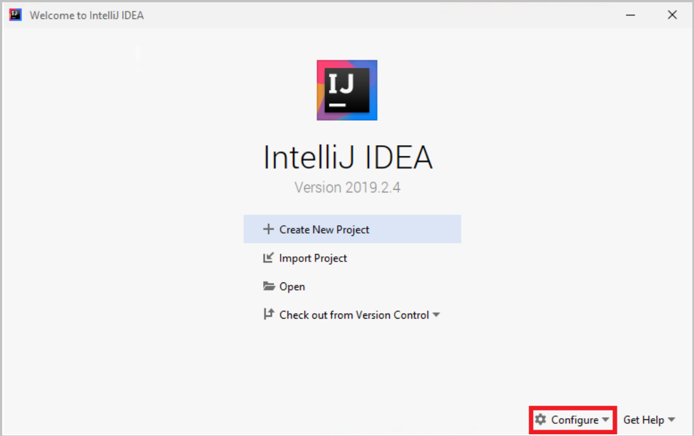

1. Search for Azure Toolkit for IntelliJ.  Click **Install**.

    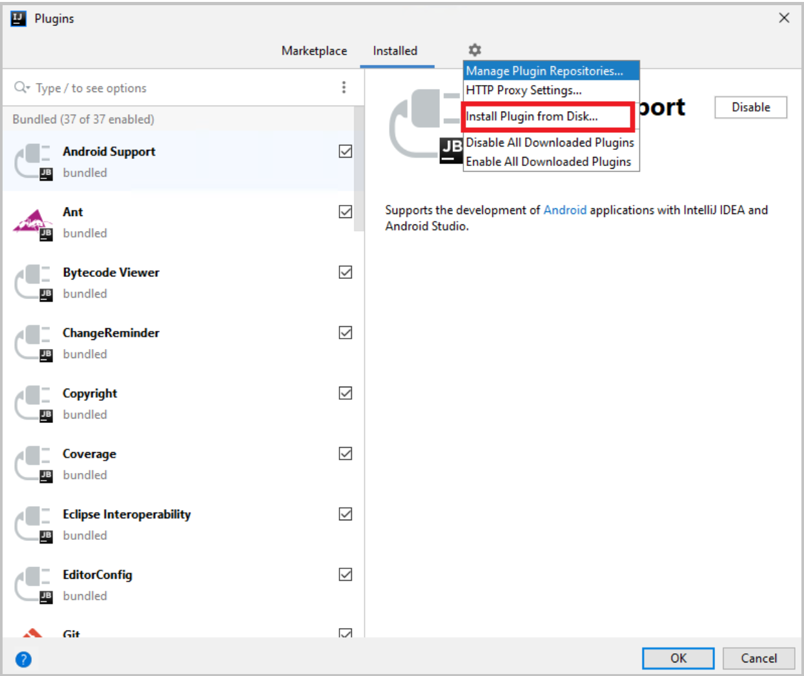

1. Click **Restart IDE**.

## Tutorial procedures
The following procedures deploy a Hello World application using the IntelliJ IDEA.

* Open gs-spring-boot project
* Deploy to Azure Spring Cloud
* Show streaming logs

## Open gs-spring-boot project

1. Download and unzip the source repository for this tutorial, or clone it using Git: git clone https://github.com/spring-guides/gs-spring-boot.git 
1. cd into gs-spring-boot\complete.
1. Open IntelliJ **Welcome** dialog, select **Import Project** to open the import wizard.
1. Select `gs-spring-boot\complete` folder.

    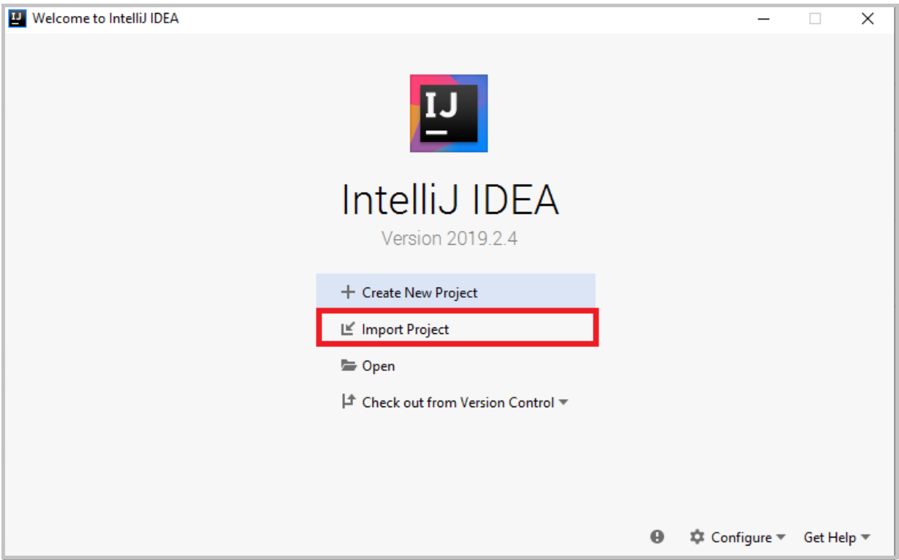

## Deploy to Azure Spring Cloud
In order to deploy to Azure you must sign-in with your Azure account, and choose your subscription.  For sign-in details, see [Installation and sign-in](https://docs.microsoft.com/azure/developer/java/toolkit-for-intellij/create-hello-world-web-app#installation-and-sign-in).

1. Right-click your project in IntelliJ project explorer, and select **Azure** -> **Deploy to Azure Spring Cloud**.

    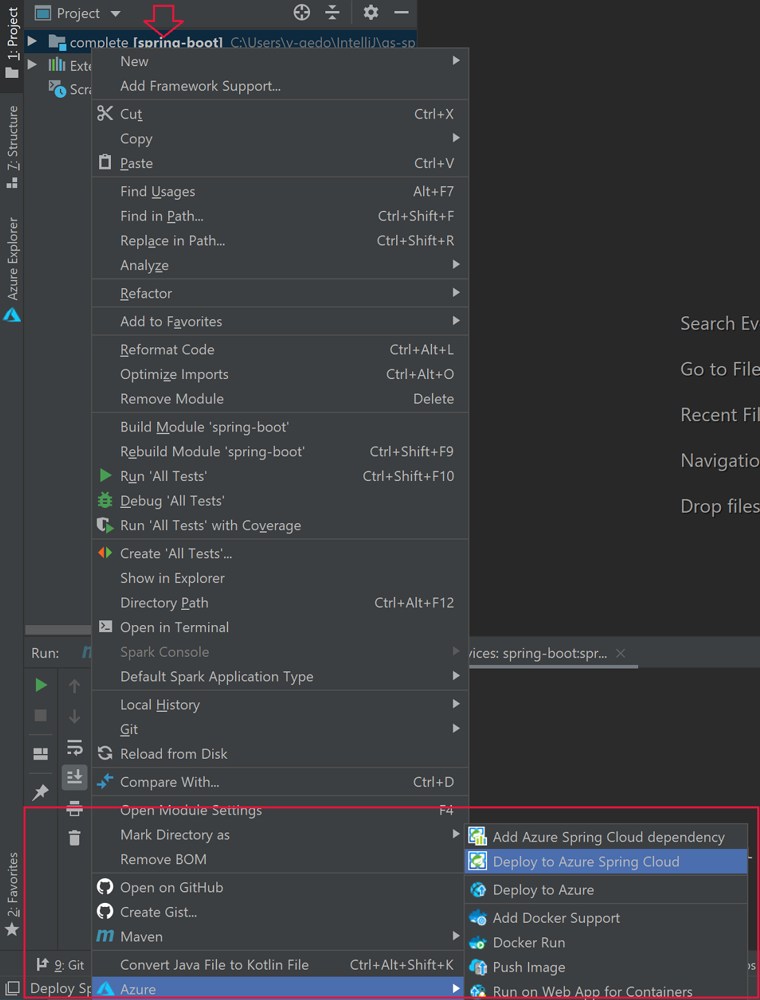

1. Accept the name for app in the **Name** field. **Name** refers to the configuration, not app name. Users don't usually need to change it.
1. Accept the identifier from the project for the **Artifact**.
1. Select **App:** then click **Create app...**.

    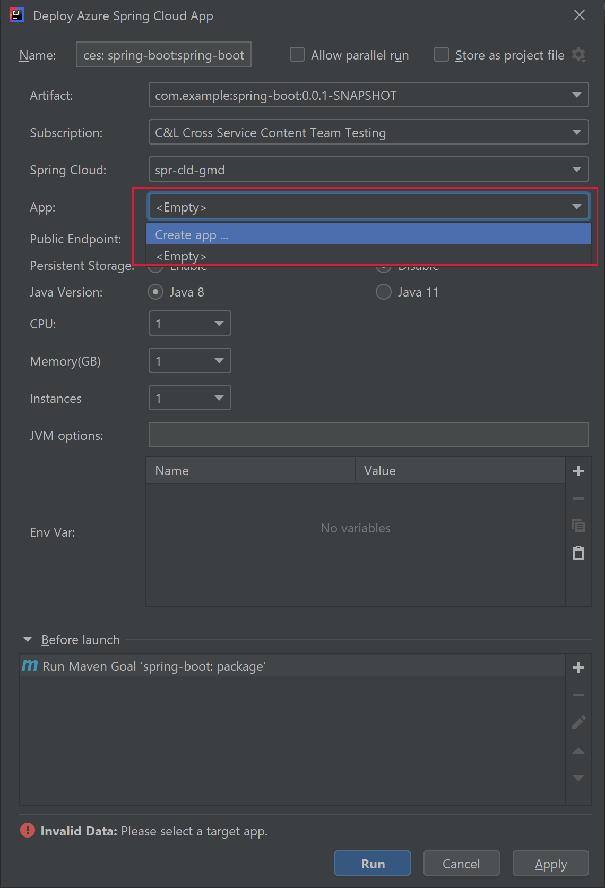

1. Enter **App name**, then click **OK**.

    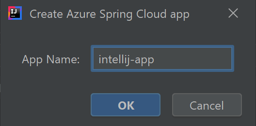

1. Start the deployment by clicking **Run** button. 

    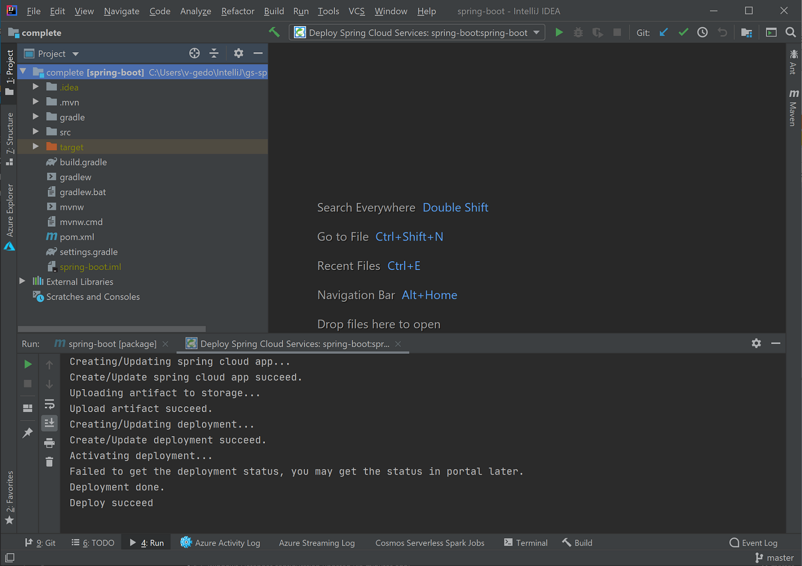

1. The plug-in will run the command `mvn package` on the project and then create the new app and deploy the jar generated by the `package` command.

1. If the app URL is not shown in the output window, get it from the Azure portal. Navigate from your resource group to the instance of Azure Spring Cloud.  Then click **Apps**.  The running app will be listed.

    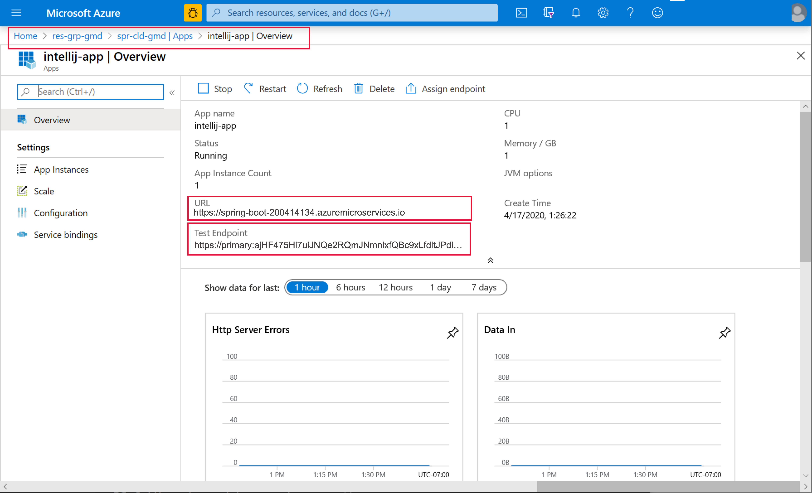

1. Navigate to the URL in browser.

    

## Show streaming logs
To get the logs:
1. Select **Azure Explorer**, then **Spring Cloud**.
1. Right-click the running app.
1. Select **Streaming Logs** from the drop-down list.

    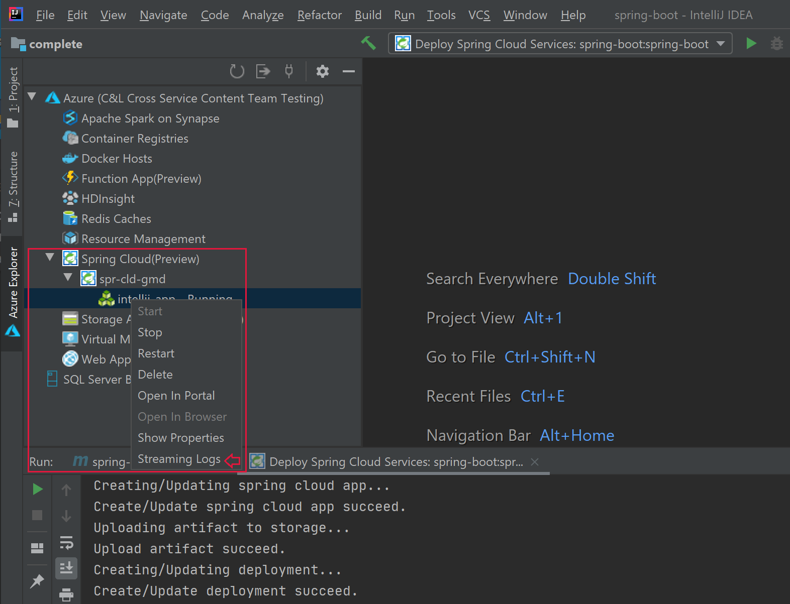

1. Select instance.

    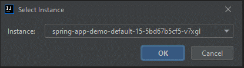

1. The streaming log will be visible in the output window.

    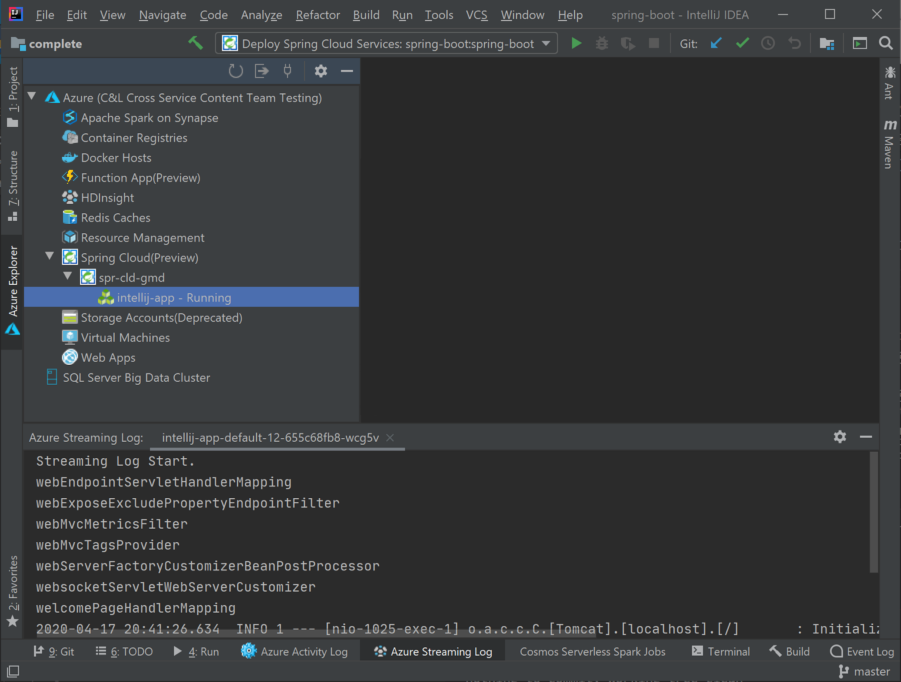

## Next steps
* [Prepare Spring application for Azure Spring Cloud](https://docs.microsoft.com/azure/spring-cloud/spring-cloud-tutorial-prepare-app-deployment)
* [Learn more about Azure Toolkit for IntelliJ](https://docs.microsoft.com/azure/developer/java/toolkit-for-intellij/)
