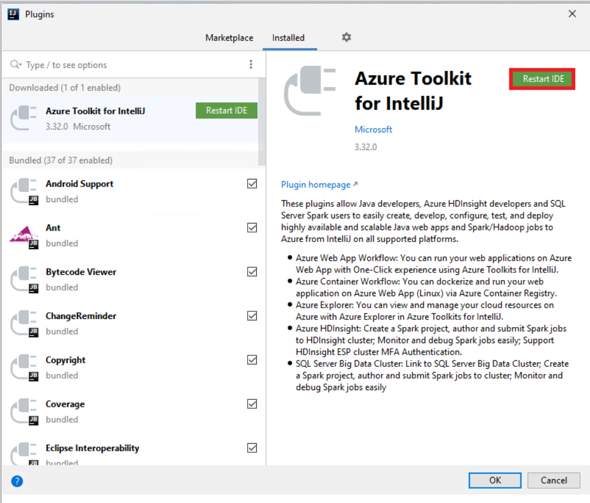
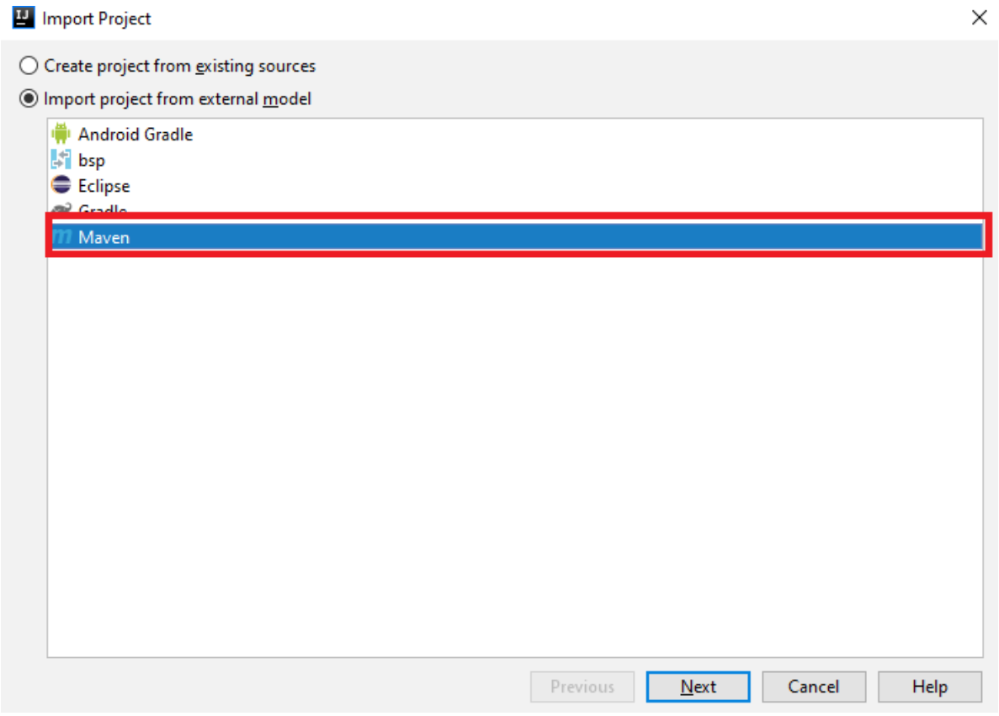
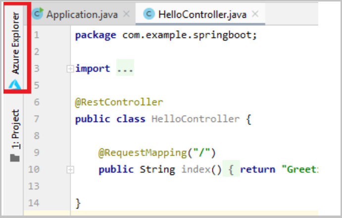
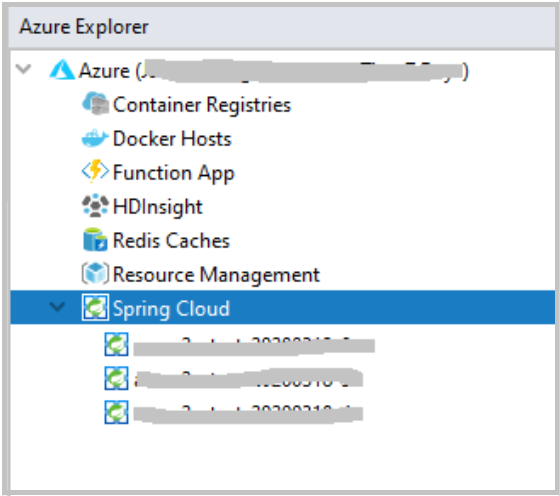
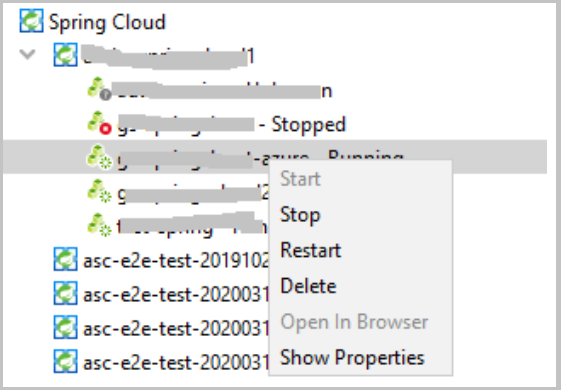
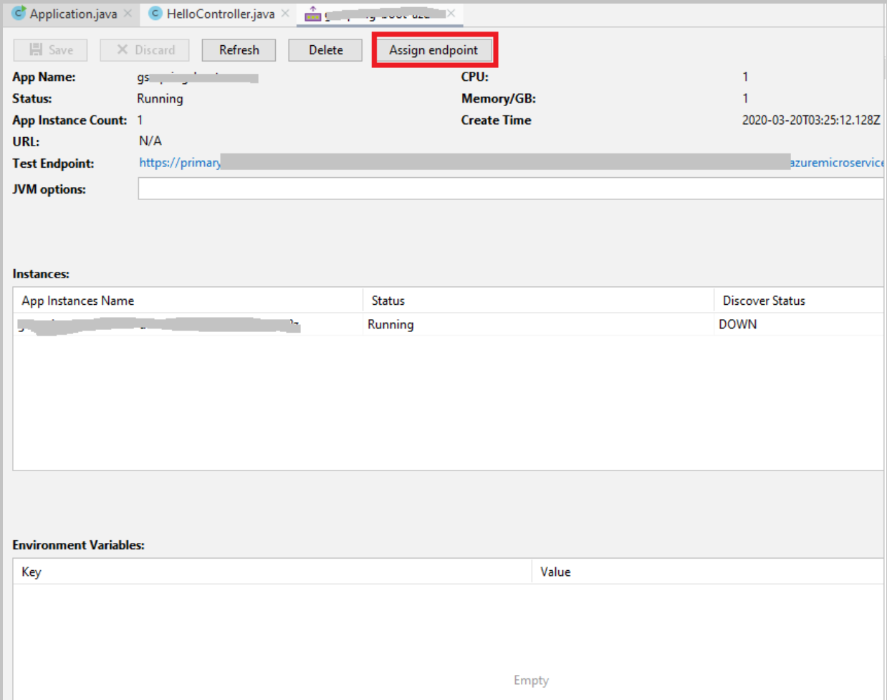
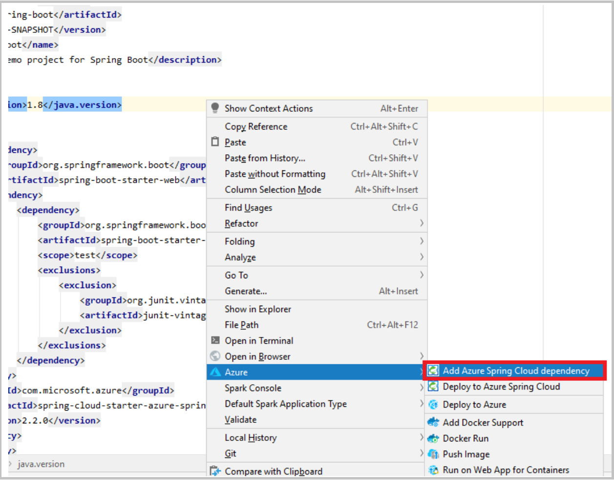

# Use IntelliJ to deploy Azure Spring Cloud applications
The IntelliJ plug-in for Azure Spring Cloud supports application deployment from the IntelliJ IDEA.  

## Prerequisites
* [JDK 8 Azul Zulu](https://docs.microsoft.com/java/azure/jdk/java-jdk-install?view=azure-java-stable)
* [Maven 3.5.0+](https://maven.apache.org/download.cgi)
* [IntelliJ IDEA Community Edition, version [2019.3, 2020.1]](https://www.jetbrains.com/idea/download/)
* Or: IntelliJ IDEA Ultimate Edition, version [2019.3, 2020.1]

## Install the plug-in
1. Download the [Azure Toolkit for IntelliJ IDEA 3.35.0](https://github.com/Microsoft/azure-tools-for-java/releases/tag/azure-intellij-toolkit-v3.35.0)

1. Start IntelliJ.  If you have opened a project previously, close the project to show the welcome dialog. Select **Configure** from link lower right, and then select **Plugins** to open the plug-in configuration dialog.

    

1. In the plugin configuration dialog, select **Install Plugin from Disk**.  Find the preview bits zip file you downloaded in step 1.

    

1. Click **Restart IDE** to restart IntellJ.

    

## Tutorial procedures
The following procedures deploy a Hello World application using the IntelliJ IDEA.

* Open gs-spring-boot project
* Deploy to Azure Spring Cloud
* Open Azure Spring Cloud app in Azure Explorer
* Navigate in browser
* Add Azure specific dependencies
* Show streaming logs

## Open gs-spring-boot project

1. Download and unzip the source repository for this tutorial, or clone it using Git: git clone https://github.com/spring-guides/gs-spring-boot.git 
1. cd into gs-spring-boot\complete.
1. Open IntelliJ **Welcome** dialog, select **Import Project** to open the import wizard.
1. Select `gs-spring-boot\complete` folder.

    

1. Choose **Maven** as the importer.
1. Proceed with default settings by clicking **next**, and then finish the import wizard. Wait for IntelliJ to download dependencies.

    

## Deploy to Azure Spring Cloud
In order to deploy to Azure you must sign-in with your Azure account, and choose your subscription.  For sign-in details, see [Installation and sign-in](https://docs.microsoft.com/azure/java/intellij/azure-toolkit-for-intellij-create-hello-world-web-app#installation-and-sign-in).

1. Right click your project in IntelliJ project explorer, and select **Azure** -> **Deploy to Azure Spring Cloud**.

    

1. Accept the name for app in the **Name** field. **Name** refers to the configuration, not app name. Users don't usually need to change it.
1. Assign a unique identifier for the **Artifact**, such as *gs-spring-boot-azure*.
1. Select the **Subscription** and **Spring Cloud** service instance.
1. Select **Create app...**. (You can also deploy an existing application.)

    

1. Start the deployment by clicking **Run** button. The plug-in will run the command `mvn package` on the project and then create the new app and deploy the jar generated by the `package` command.

    

## Open Azure Spring Cloud app in Azure Explorer

1. Click the **Azure Explorer** button at left side bar and sign-in to Azure.

    

1. Find the Spring Cloud node and double click.

    

1. Wait a few seconds to see all Azure Spring Cloud Clusters in the tree.  Double click the cluster to which you just created the app. (Refresh if status doesn't include the cluster.)
1. When loaded, you can see the new app.
1. Right click the app just created. Select **Show Properties** to see the property view for the app.

    

## Assign application endpoint

In the property view, you will see 'N/A' in the URL, because by default the public endpoint is not enabled.

1. Assign endpoint accessible publicly by clicking the **Assign endpoint** button.

    

1. Wait a few seconds for the assign-endpoint operation. Then you will see the URL field as a clickable link. Click the link to open a browser and show the message *Greetings from Spring Boot*.

    

## Add Azure specific dependencies
Read this [tutorial](https://docs.microsoft.com/azure/spring-cloud/spring-cloud-tutorial-prepare-app-deployment) for Azure specific dependencies. To simplify the steps and configure dependencies, this plugin provides the dependency management. 
1. Open the pom.xml file in IntelliJ
1. Right click on the editor, and select Add Azure Spring Cloud dependency menu. Wait a few minutes for the dependencies to resolve.  It will update your pom.xml file with the compatible latest version mentioned in the [tutorial](https://docs.microsoft.com/azure/spring-cloud/spring-cloud-tutorial-prepare-app-deployment).

    

## Show streaming logs
TODO

## See also
* [Create a Hello World web app for Azure App Service using IntelliJ](https://docs.microsoft.com/azure/java/intellij/azure-toolkit-for-intellij-create-hello-world-web-app)
* [Prepare a Java Spring application for deployment in Azure Spring Cloud](https://docs.microsoft.com/azure/spring-cloud/spring-cloud-tutorial-prepare-app-deployment) 