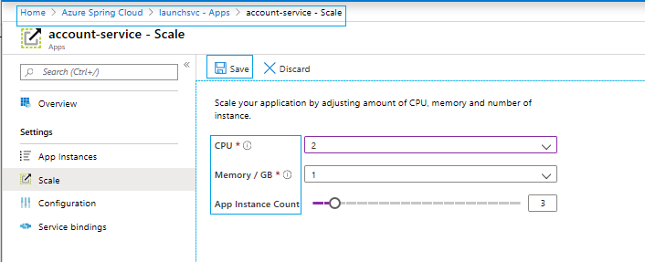

# Scale an application in Azure Spring Cloud

This tutorial demonstrates how to scale any microservice application using the Azure Spring Cloud dashboard in the Azure portal.

Scale your application up and down by modifying its number of virtual CPUs (vCPUs) and amount of memory. Scale your application in and out by modifying the number of application instances.

After you finish, you'll know how to make quick manual changes to each application in your service. Scaling takes effect in seconds and doesn't require any code changes or redeployment.

## Prerequisites

To complete this tutorial, you need:

* An Azure subscription. If you don't have an Azure subscription, create a [free account](https://azure.microsoft.com/free/?WT.mc_id=A261C142F) before you begin. 
* A deployed Azure Spring Cloud service instance.  Follow our [quickstart on deploying an app via the Azure CLI](spring-cloud-quickstart-launch-app-cli.md) to get started.
* At least one application already created in your service instance.

## Navigate to the Scale page in the Azure portal

1. Sign in to the [Azure portal](https://portal.azure.com).

1. Go to your Azure Spring Cloud **Overview** page.

1. Select the resource group that contains your service.

1. Select the **Apps** tab under **Settings** in the menu on the left side of the page.

1. Select the application you want to scale. In this example, select the application named **account-service**. You should then see the application's **Overview** page.

1. Go to the **Scale** tab under **Settings** in the menu on the left side of the page. You should see options for the scaling the attributes shown in the following section.

## Scale your application

If you modify the scaling attributes, keep the following notes in mind:

* **CPUs**: The maximum number of CPUs per application instance is four. The total number of CPUs for an application is the value set here multiplied by the number of application instances.

* **Memory/GB**: The maximum amount of memory per application instance is 8 GB. The total amount of memory for an application is the value set here multiplied by the number of application instances.

* **App instance count**: In the Standard tier, you can scale out to a maximum of 20 instances. This value changes the number of separate running instances of the microservice application.

Be sure to select **Save** to apply your scaling settings.

After a few seconds, the changes you made are displayed on the **Overview** page, with more details available in the **Application instances** tab. Scaling doesn't require any code changes or redeployment.

## Upgrade to the Standard tier
If you are on the Basic tier and constrained by one or more of these [limits](spring-cloud-quotas.md), you can upgrade to the Standard tier. To do this go to the Pricing tier menu by first selecting the Standard tier column and the clicking the **Upgrade** button.

## Next steps

In this tutorial, you learned how to manually scale your Azure Spring Cloud applications. To learn how to monitor your application, continue to the next tutorial.

> [!div class="nextstepaction"]
> [Learn how to monitor an application](spring-cloud-tutorial-distributed-tracing.md)
