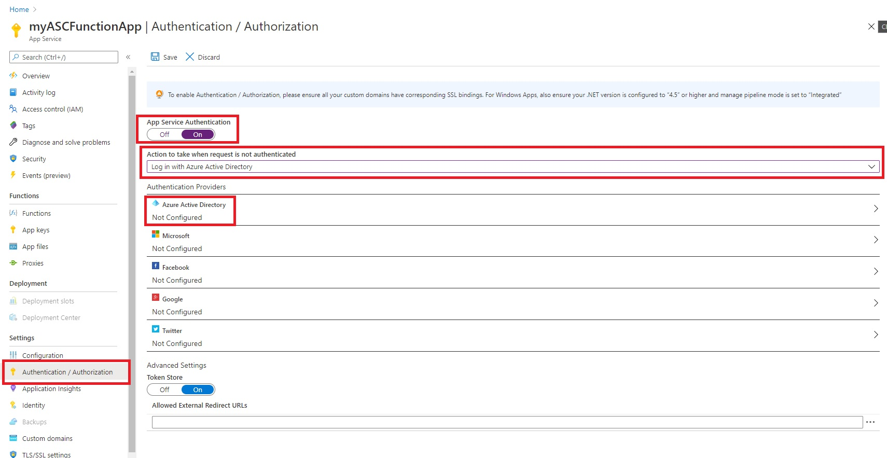
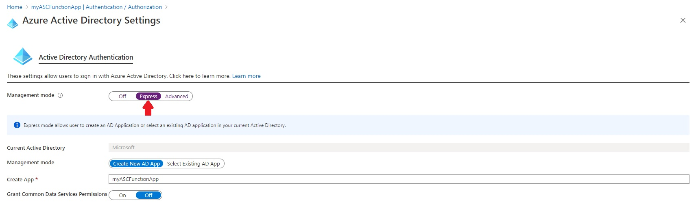

# Tutorial: Use a managed identity to invoke Azure Functions from an Azure Spring Cloud app

This article shows you how to create a managed identity for an Azure Spring Cloud app and use it to invoke Http triggered Functions.

Both Azure Functions and App Services have built in support for Azure Active Directory (Azure AD) authentication. By leveraging this built-in authentication capability along with Managed Identities for Azure Spring Cloud, we can invoke RESTful services using modern OAuth semantics. This method doesn't require storing secrets in code and provides more granular controls for controlling access to external resources. 


## Prerequisites

* [Sign up for an Azure subscription](https://azure.microsoft.com/free/)
* [Install the Azure CLI version 2.0.67 or higher](/cli/azure/install-azure-cli)
* [Install Maven 3.0 or above](https://maven.apache.org/download.cgi)
* [Install the Azure Functions Core Tools version 3.0.2009 or higher](../azure-functions/functions-run-local.md#install-the-azure-functions-core-tools)


## Create a resource group
A resource group is a logical container into which Azure resources are deployed and managed. Create a resource group to contain both the Function app and Spring Cloud using the command [az group create](/cli/azure/group#az_group_create):

```azurecli-interactive
az group create --name myResourceGroup --location eastus
```


## Create a Function App
To create a Function app you must first create a backing storage account, use the command [az storage account create](/cli/azure/storage/account#az_storage_account_create):

> [!Important]
> Each Function app and Storage Account must have a unique name. Replace <your-functionapp-name> with the name of your Function app and <your-storageaccount-name> with the name of your Storage Account in the following examples.

```azurecli-interactive
az storage account create --name <your-storageaccount-name> --resource-group myResourceGroup --location eastus --sku Standard_LRS
```

Once the Storage Account has been created, you can create the Function app.

```azurecli-interactive
az functionapp create --name <your-functionapp-name> --resource-group myResourceGroup --consumption-plan-location eastus --os-type windows --runtime node --storage-account <your-storageaccount-name> --functions-version 3
```

Make a note of the returned **hostNames**, which will be in the format "https://<your-functionapp-name>.azurewebsites.net". It will be used in a following step.


## Enable Azure Active Directory Authentication

Access the newly created Function app from the [Azure portal](https://portal.azure.com) and select "Authentication / Authorization" from the settings menu. Enable App Service Authentication and set the "Action to take when request is not authenticated" to "Log in with Azure Active Directory". This setting will ensure that all unauthenticated requests are denied (401 response).



Under Authentication Providers, select Azure Active Directory to configure the application registration. Selecting Express Management Mode will automatically create an application registration in your Azure AD tenant with the correct configuration.



Once you save the settings, the function app will restart and all subsequent requests will be prompted to log in via Azure AD. You can test that unauthenticated requests are now being rejected by navigating to the function apps root URL (returned in the **hostNames** output in the step above). You should be redirected to your organizations Azure AD login screen.


## Create an Http Triggered Function

In an empty local directory, create a new function app and add an Http triggered function.

```console
func init --worker-runtime node
func new --template HttpTrigger --name HttpTrigger
```

By default Functions use key-based authentication to secure Http endpoints. Since we'll be enabling Azure AD authentication to secure access to the Functions, we want to [set the function auth level to anonymous](../azure-functions/functions-bindings-http-webhook-trigger.md#secure-an-http-endpoint-in-production).

```json function.json
{
  "bindings": [
    {
      "authLevel": "anonymous",
      "type": "httpTrigger",
      ...
    }
  ]
}
```

The app can now be published to the [Function app](#create-a-function-app) instance created in the previous step.

```console
func azure functionapp publish <your-functionapp-name>
```

The output from the publish command should list the URL to your newly created function.

```output
Deployment completed successfully.
Syncing triggers...
Functions in <your-functionapp-name>:
    HttpTrigger - [httpTrigger]
        Invoke url: https://<your-functionapp-name>.azurewebsites.net/api/httptrigger
```


## Create Azure Spring Cloud service and app
After installing the spring-cloud extension, create an Azure Spring Cloud instance with the Azure CLI command `az spring-cloud create`. 

```azurecli-interactive
az extension add --name spring-cloud
az spring-cloud create --name mymsispringcloud --resource-group myResourceGroup --location eastus
```

The following example creates an app named `msiapp` with a system-assigned managed identity, as requested by the `--assign-identity` parameter.

```azurecli
az spring-cloud app create --name "msiapp" --service "mymsispringcloud" --resource-group "myResourceGroup" --assign-endpoint true --assign-identity
```

## Build sample Spring Boot app to invoke the Function

This sample will invoke the Http triggered function by first requesting an access token from the [MSI endpoint](../active-directory/managed-identities-azure-resources/how-to-use-vm-token.md#get-a-token-using-http) and using that token to authenticate the Function http request.

1. Clone the sample project. 

    ```console
    git clone https://github.com/Azure-Samples/Azure-Spring-Cloud-Samples.git
    ```

2. Specify your function URI and the trigger name in your app properties. 

    ```bash
    cd Azure-Spring-Cloud-Samples/managed-identity-function
    vim src/main/resources/application.properties
    ```

    To use managed identity for Azure Spring Cloud apps, add properties with the following content to *src/main/resources/application.properties*.

    ```
    azure.function.uri=https://<your-functionapp-name>.azurewebsites.net
    azure.function.triggerPath=httptrigger
    ```

3. Package your sample app. 

    ```console
    mvn clean package
    ```

4. Now deploy the app to Azure with the Azure CLI command  `az spring-cloud app deploy`. 

    ```azurecli
    az spring-cloud app deploy  --name "msiapp" --service "mymsispringcloud" --resource-group "myResourceGroup" --jar-path target/sc-managed-identity-function-sample-0.1.0.jar
    ```

5. Access the public endpoint or test endpoint to test your app. 

    ```console
    curl https://mymsispringcloud-msiapp.azuremicroservices.io/func/springcloud
    ```

    You'll see the following message returned in the response body.
    ```output
    Function Response: Hello, springcloud. This HTTP triggered function executed successfully.
    ```
    
    You can try passing different values to the function by changing the path parameter.

## Next steps

* [How to enable system-assigned managed identity for Azure Spring Cloud application](./spring-cloud-howto-enable-system-assigned-managed-identity.md)
* [Learn more about managed identities for Azure resources](https://github.com/MicrosoftDocs/azure-docs/blob/master/articles/active-directory/managed-identities-azure-resources/overview.md)
* [Configure client apps to access your App Service](../app-service/configure-authentication-provider-aad.md#configure-client-apps-to-access-your-app-service)
