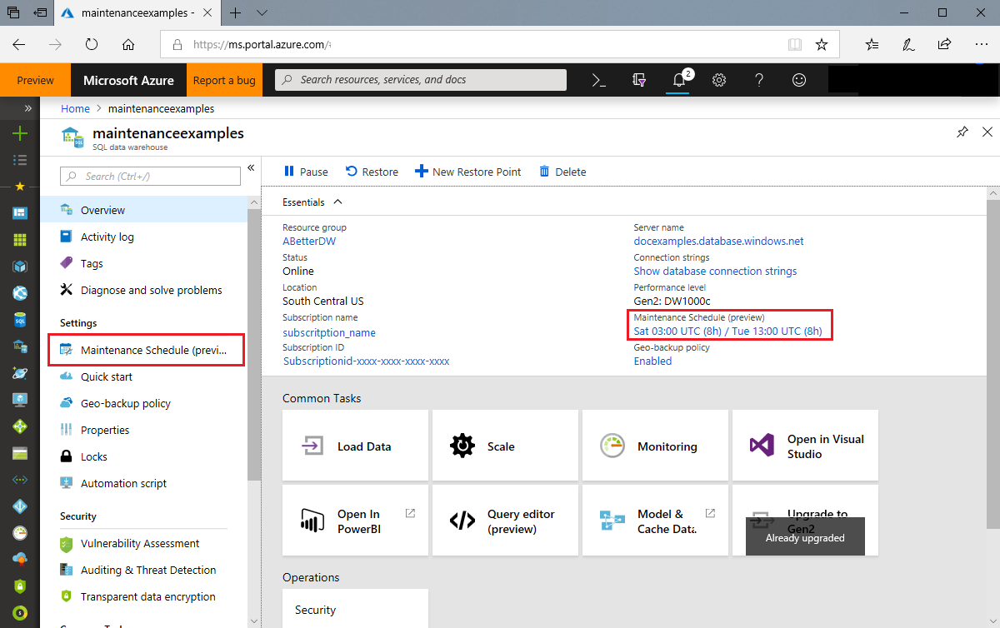
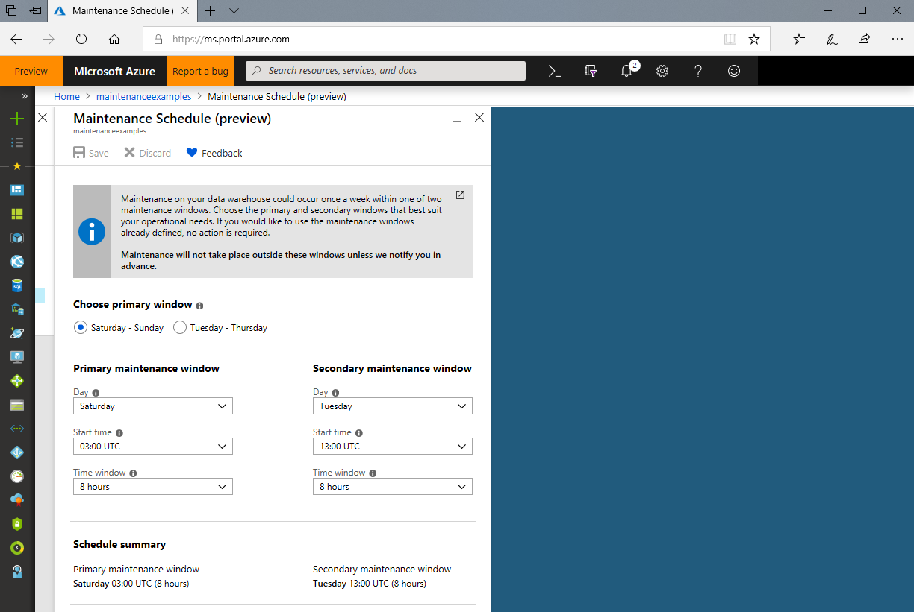
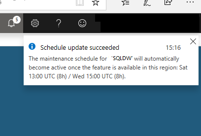

# Change a maintenance schedule 

## Portal
A Maintenance schedule can be updated or changed at any time. However, if the selected instance is currently going through active maintenance cycle the settings will be saved and only become active during the next identified maintenance period. [Learn more](https://docs.microsoft.com/azure/service-health/resource-health-overview) about monitoring your data warehouse during an active maintenance event. 

In preview, we will be asking you to select two maintenance windows during a 7-day period. Each maintenance window can be between 3 and 8 hours each, with 3 hrs currently being the shortest available option. Maintenance can occur at any time within an identified maintenance window but will not occur outside of those identified Time windows with prior notification, you will also experience be brief loss of connectivity as the service deploys new code to your data warehouse. 

## Identifying the Primary and Secondary windows

The Primary and Secondary windows must be identified within separate day ranges (That is, Primary window (Tuesday – Thursday), Secondary window (Saturday – Sunday)

Complete the following steps to change the maintenance schedule that has been applied to your data warehouse in portal.
1.	Sign in to the [Azure portal](https://portal.azure.com/).
2.	Select the data warehouse that you would like to update. The page will open on the overview blade. 
3.	The Maintenance schedule settings page can be accessed by either clicking on the Maintenance schedule (preview) summary link in the overview blade or via the Maintenance schedule option in the left-hand Resource Menu.  

    

4. You can identify the preferred day range for your Primary maintenance window using the radio buttons at the top of the page. This selection determines if your primary window will occur on a weekday or over the weekend. Your selection will update the dropdown values below accordingly. 
During preview some regions may not yet support the full set of available Day options. These values will update in the coming months.

   

5. Choose your preferred Primary and Secondary maintenance windows using the Day, Start time and Time window dropdowns below. The Schedule summary at the bottom of the blade will update based on the dropdown values selected.

#### Dropdown options
- Day: Preferred day to perform maintenance during the selected window.
- Start time: Preferred maintenance window start time.
- Time window: Preferred duration of your time window.

  Click Save after you have selected your preferred maintenance windows. A confirmation message will appear confirming your new schedule is not active. If you are saving a schedule in a region that does not yet support Maintenance scheduling, then the following message will appear. Your settings will be saved and become active when the feature becomes available in your selected region.    

    

## Next steps
- [Learn more](https://docs.microsoft.com/azure/monitoring-and-diagnostics/monitor-alerts-unified-log-webhook) about Webhook actions for log alert rules.
- [Learn more](https://docs.microsoft.com/azure/service-health/service-health-overview) about Azure Service Health

