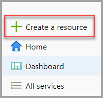
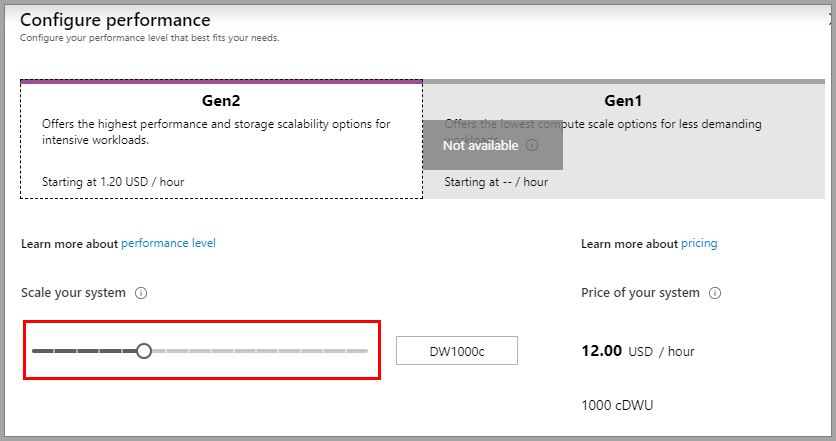
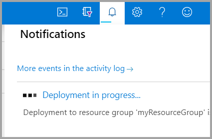

# Quickstart: Create and query a data warehouse in Azure Synapse Analytics using the Azure portal

Quickly create and query a data warehouse by provisioning SQL pool in Azure Synapse Analytics (formerly SQL DW) using the Azure portal.

## Prerequisites

1. If you don't have an Azure subscription, create a [free](https://azure.microsoft.com/free/) account before you begin.

   > [!NOTE]
   > Creating a data warehouse in Azure Synapse may result in a new billable service. For more information, see [Azure Synapse Analytics pricing](https://azure.microsoft.com/pricing/details/synapse-analytics/).

1. Download and install the newest version of [SQL Server Management Studio](/sql/ssms/download-sql-server-management-studio-ssms) (SSMS).

## Sign in to the Azure portal

Sign in to the [Azure portal](https://portal.azure.com/).

## Create a SQL pool

Data warehouses are created using SQL pool in Azure Synapse analytics. A SQL pool is created with a defined set of [compute resources](memory-concurrency-limits.md). The database is created within an [Azure resource group](../azure-resource-manager/management/overview.md) and in an [Azure SQL logical server](../sql-database/sql-database-servers.md).

Follow these steps to create a data warehouse that contains the **AdventureWorksDW** sample data.

1. Click **Create a resource** in the upper left-hand corner of the Azure portal.

   

2. Select **Databases** on the **New** page, and select **Azure Synapse Analytics (formerly SQL DW)** in the **Featured** list.

   

3. In **Basics**, provide your subscription, resource group, SQL pool name, and server name:

   | Setting | Suggested value | Description |
   | :------ | :-------------- | :---------- |
   | **Subscription** | Your subscription | For details about your subscriptions, see [Subscriptions](https://account.windowsazure.com/Subscriptions). |
   | **Resource group** | myResourceGroup | For valid resource group names, see [Naming rules and restrictions](/azure/architecture/best-practices/resource-naming). |
   | **Data warehouse name** | mySampleDataWarehouse | For valid database names, see [Database Identifiers](/sql/relational-databases/databases/database-identifiers). Note, a data warehouse is one type of database.|
   | **Server** | Any globally unique name | Select existing server, or create a new server name, click **Create new**. For valid server names, see [Naming rules and restrictions](/azure/architecture/best-practices/resource-naming). |

   

4. Under **Performance level**, click **Select performance level** to optionally change your configuration with a slider.

     

   For more information about performance levels, see [Manage compute in Azure SQL Data Warehouse](sql-data-warehouse-manage-compute-overview.md).

5. Now that you've completed the Basics tab of the Azure Synapse Analytics form, click **Review + Create** and then **Create** to create the data warehouse in the SQL pool. Provisioning takes a few minutes.

    

    

6. On the toolbar, click **Notifications** to monitor the deployment process.
    
     

## Create a server-level firewall rule

The Azure Synapse service creates a firewall at the server-level. This firewall prevents external applications and tools from connecting to the server or any databases on the server. To enable connectivity, you can add firewall rules that enable connectivity for specific IP addresses. Follow these steps to create a [server-level firewall rule](../sql-database/sql-database-firewall-configure.md) for your client's IP address.

> [!NOTE]
> SQL Data Warehouse communicates over port 1433. If you are trying to connect from within a corporate network, outbound traffic over port 1433 might not be allowed by your network's firewall. If so, you cannot connect to your Azure SQL Database server unless your IT department opens port 1433.

1. After the deployment completes, select **All services** from the left-hand menu. Select **Databases**, select the star next to **SQL data warehouses** to add SQL data warehouses to your favorites.
1. Select **SQL data warehouses** from the left-hand menu and then click **mySampleDataWarehouse** on the **SQL data warehouses** page. The overview page for your database opens, showing you the fully qualified server name (such as **mynewserver-20180430.database.windows.net**) and provides options for further configuration.
1. Copy this fully qualified server name for use to connect to your server and its databases in this and other quick starts. To open server settings, click the server name.

   

1. Click **Show firewall settings**.

   

1. The **Firewall settings** page for the SQL Database server opens.

   

1. To add your current IP address to a new firewall rule, click **Add client IP** on the toolbar. A firewall rule can open port 1433 for a single IP address or a range of IP addresses.

1. Click **Save**. A server-level firewall rule is created for your current IP address opening port 1433 on the logical server.

1. Click **OK** and then close the **Firewall settings** page.

You can now connect to the SQL server and its data warehouses using this IP address. The connection works from SQL Server Management Studio or another tool of your choice. When you connect, use the ServerAdmin account you created previously.

> [!IMPORTANT]
> By default, access through the SQL Database firewall is enabled for all Azure services. Click **OFF** on this page and then click **Save** to disable the firewall for all Azure services.

## Get the fully qualified server name

Get the fully qualified server name for your SQL server in the Azure portal. Later you use the fully qualified name when connecting to the server.

1. Sign in to the [Azure portal](https://portal.azure.com/).
2. Select **SQL Data warehouses** from the left-hand menu, and click your data warehouse on the **SQL data warehouses** page.
3. In the **Essentials** pane in the Azure portal page for your database, locate and then copy the **Server name**. In this example, the fully qualified name is mynewserver-20180430.database.windows.net.

    

## Connect to the server as server admin

This section uses [SQL Server Management Studio](/sql/ssms/download-sql-server-management-studio-ssms) (SSMS) to establish a connection to your Azure SQL server.

1. Open SQL Server Management Studio.

2. In the **Connect to Server** dialog box, enter the following information:

   | Setting | Suggested value | Description |
   | :------ | :-------------- | :---------- |
   | Server type | Database engine | This value is required |
   | Server name | The fully qualified server name | Here's an example: **mynewserver-20180430.database.windows.net**. |
   | Authentication | SQL Server Authentication | SQL Authentication is the only authentication type that is configured in this tutorial. |
   | Login | The server admin account | Account that you specified when you created the server. |
   | Password | The password for your server admin account | Password that you specified when you created the server. |
   ||||

    

3. Click **Connect**. The Object Explorer window opens in SSMS. 

4. In Object Explorer, expand **Databases**. Then expand **mySampleDatabase** to view the objects in your new database.

     

## Run some queries

SQL Data Warehouse uses T-SQL as the query language. To open a query window and run some T-SQL queries, use the following steps:

1. Right-click **mySampleDataWarehouse** and select **New Query**. A new query window opens.
2. In the query window, enter the following command to see a list of databases.

    ```sql
    SELECT * FROM sys.databases
    ```

3. Click **Execute**. The query results show two databases: **master** and **mySampleDataWarehouse**.

    

4. To look at some data, use the following command to see the number of customers with last name of Adams that have three children at home. The results list six customers. 

    ```sql
    SELECT LastName, FirstName FROM dbo.dimCustomer
    WHERE LastName = 'Adams' AND NumberChildrenAtHome = 3;
    ```

    

## Clean up resources

You're being charged for data warehouse units and data stored your data warehouse. These compute and storage resources are billed separately.

- If you want to keep the data in storage, you can pause compute when you aren't using the data warehouse. By pausing compute, you're only charged for data storage. You can resume compute whenever you're ready to work with the data.
- If you want to remove future charges, you can delete the data warehouse.

Follow these steps to clean up resources you no longer need.

1. Sign in to the [Azure portal](https://portal.azure.com), click on your data warehouse.

    

2. To pause compute, click the **Pause** button. When the data warehouse is paused, you see a **Resume** button. To resume compute, click **Resume**.

3. To remove the data warehouse so you aren't charged for compute or storage, click **Delete**.

4. To remove the SQL server you created, click **mynewserver-20180430.database.windows.net** in the previous image, and then click **Delete**. Be careful with this deletion, since deleting the server also deletes all databases assigned to the server.

5. To remove the resource group, click **myResourceGroup**, and then click **Delete resource group**.

## Next steps

You've now created a data warehouse, created a firewall rule, connected to your data warehouse, and run a few queries. To learn more about Azure SQL Data Warehouse, continue to the tutorial for loading data.

> [!div class="nextstepaction"]
> [Load data into a SQL Data Warehouse](load-data-from-azure-blob-storage-using-polybase.md)
