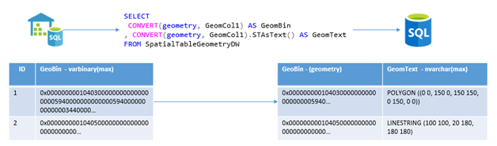

# Elastic Query Concepts with SQL Data Warehouse


Elastic Query with Azure SQL Data Warehouse allows you to write Transact-SQL in a SQL Database that is sent remotely to a Azure SQL Data Warehouse instance through the use of external tables. A remote external table definition is created in a SQL database instance which points to a table in the SQL database warehouse.

When you use a query that uses an external table, the portion of the query query referring to the external table is sent to the SQL data warehouse instance to be processed. Once the query has completed, the result set is sent back to the calling SQL database instance. For a brief tutorial of setting up an Elastic Query between SQL database and SQL data warehouse, see the [Elastic Query tutorial][Elastic Query tutorial].

This feature enables two primary scenarios:

1. Domain isolation
2. Remote query execution

### Domain isolation

Domain isolation refers to the classic data mart scenario. In certain cases, one may want to provide a logical domain of data to downstream users which are isolated from the rest of the data warehouse.  This can occur for a variety of reasons including but not limited to:

1. Resource Isolation - SQL database is optimized to serve a large base of concurrent users serving slightly different workloads than the large analytical queries that the data warehouse is reserved for. Isolation ensures the right workloads are served by the right tools.
2. Security isolation - to separate an authorized data subset selectively via certain schemas.
3. Sandboxing - provide a sample set of data as a "playground" to explore production queries etc.

Elastic query can provide the ability to easily select subsets of SQL data warehouse data and move it into a SQL database instance. Furthermore this isolation does not preclude the ability to also enable Remote query execution allowing for more interesting "cache" scenarios.

### Remote query execution

Elastic query allows for remote query execution on a SQL data warehouse instance. This means that you can get the best of both SQL database and SQL data warehouse by separating your hot and cold data between the two databases. Users can keep more recent years of data within a SQL database which can serve reports and large numbers of average business users. However, when more data or computation is needed, a user can offload part of the query to a SQL data warehouse instance where large scale aggregates can be processed much faster and more efficiently.

## Best Practices

### General

- When using remote query execution, ensure you're only selecting necessary columns and applying the right filters. Not only does this increase the compute necessary, but it also increases the size of the result set and therefore the amount of data that need to be moved between the two instances.
- Maintain data for analytical purposes in both SQL Data Warehouse and SQL Database in clustered columnstore for analytical performance.
- Ensure that source tables are partitioned for query and data movement
- Ideally use PremiumRS databases because they provide the analytical benefits of clustered columnstore indexing with a focus on IO-intensive workloads at a discount from Premium databases.

### Elastic Querying

- The external table and interally cached table exist as different objects with the SQL database instance. Consider creating a view over the top of the cached portion of the table and the external table which unions both tables and applies filters on the boundary point of each table.

  Imagine we would like to keep the most recent year of data in a SQL database instance. We have two tables **ext.Orders** which references the data warehouse orders tables and **dbo.Orders** which represents the most recent years worth of data within the SQL database instance. Instead of asking users to decide whether to query one table or another, we create a view over the top of both tables on the partition point of the most recent year.

  ```sql
  CREATE VIEW dbo.Orders_Elastic AS
  SELECT 
  	[col_a]		
  ,	[col_b]			
  ,	...
  ,	[col_n]
  FROM
  	[dbo].[Orders]
  WHERE 
  	YEAR([o_orderdate]) >= '<Most Recent Year>'
  UNION
  SELECT 
  	[col_a]		
  ,	[col_b]			
  ,	...
  ,	[col_n] 		
  FROM
  	[ext].[Orders]
  WHERE
  	YEAR([o_orderdate]) < '<Most Recent Year>'
  ```

  A view produced in such a way let's the query compiler determine whether it need to use the data warehouse instance to answer your users query. 

  There is overhead of submitting, compiling, running, and moving data associated with each elastic query against the data warehouse instance. Be cognizant that each elastic query counts against your concurrency slots and uses resources.  


- If one plans to drill down further into the result set from the data warehouse instance, consider materializing it in a temp table in the SQL Database for performance and to prevent unnecessary resource usage.

### Moving data 

- If possible, keep data management easier with append-only source tables such that updates are easily maintainable between the data warehouse and database instances.
- Move data on the partition level with flush and fill semantics to minimize the query cost on the data warehouse level and the amount of data moved to keep the database instance up to date. 

### When to choose Azure Analysis Services vs SQL Database

#### Azure Analysis Services

- You plan on using your cache with a BI tool that submits large numbers of small queries
- You need sub-second query latency
- You are experienced in managing an Analysis Services cache

#### SQL Database

- You want to query your cache data with SQL
- You need remote execution for certain queries
- You have large cache requirements


## FAQ

Q: Can I use databases within an Elastic Database pool withelastic query?

A: Yes. SQL Databases within an elastic pool can use elastic query. 

Q: Is there a cap for how many databases I can use for elastic query?

A: Logical servers have DTU limits in place to prevent customers from accidental overspending. If you are enabling several databases for elastic query alongside a SQL Data Warehouse instance, you may hit the cap unexpectedly. If this occurs, submit a request to increase DTU limit on your logical server. You can increase your quota by [creating a support ticket](https://docs.microsoft.com/azure/sql-data-warehouse/sql-data-warehouse-get-started-create-support-ticket) and selecting *Quota* as the request type

Q: Can I use row level security/Dynamic Data Masking with Elastic Query?

A: Customers who wish to use more advanced security features with SQL Database can do so by first moving and storing the data in the SQL Database. You cannot currently apply row level security or DDM on data queried through external tables. 

Q: Can I use spatial types like geometry/geography?

A: You can store spatial types in SQL Data Warehouse as varbinary(max) values. When you query these columns using elastic query, you can convert them to the appropriate types at runtime.




<!--Image references-->

<!--Article references-->

[SQL Data Warehouse development overview]: ./sql-data-warehouse-overview-develop/
[Elastic Query tutorial]: ./sql-data-warehouse-elastic-query-with-sql-database.md

<!--MSDN references-->

<!--Other Web references-->