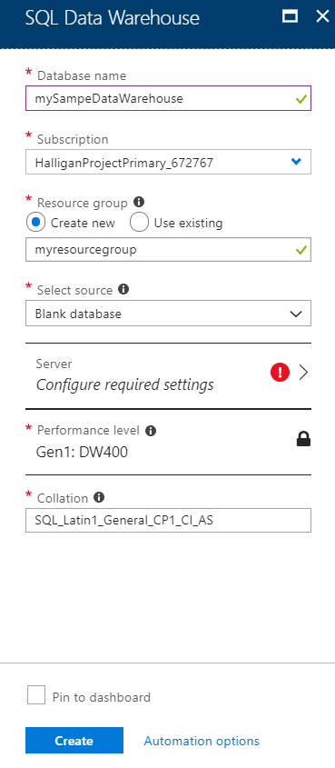
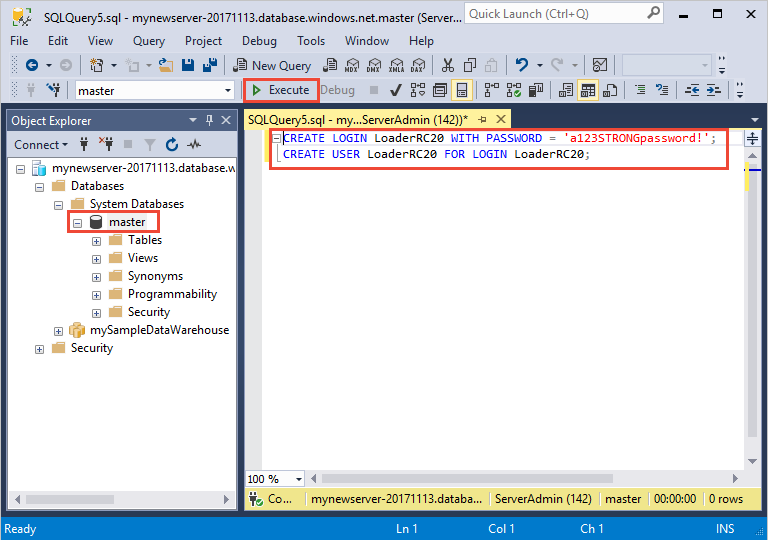
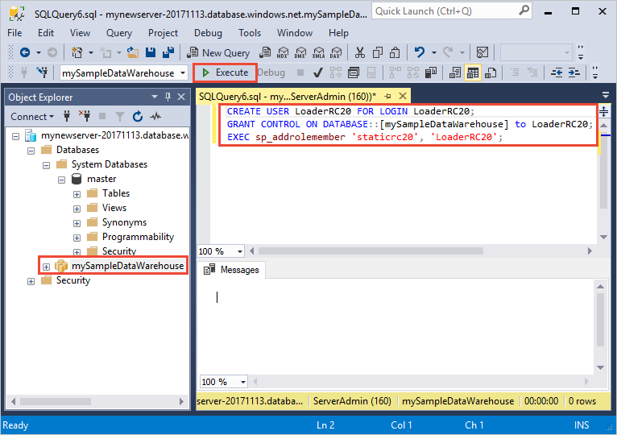
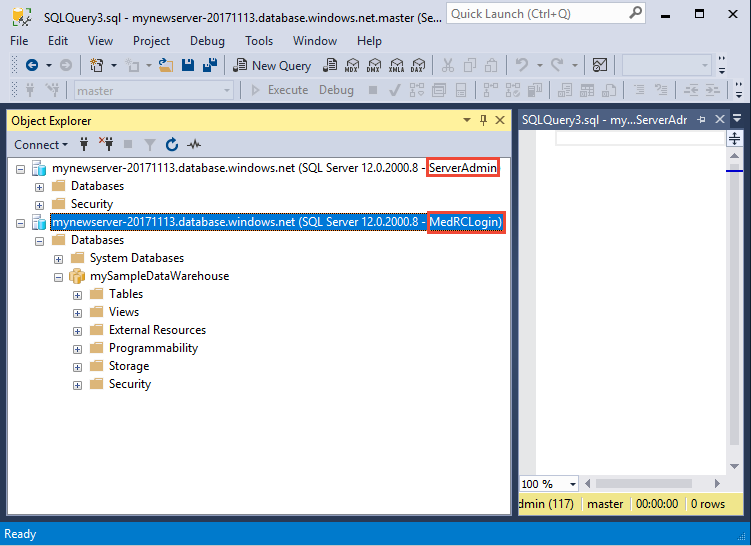
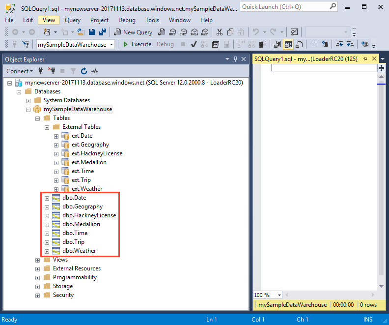

# Tutorial: Load New York Taxicab data to Azure SQL Data Warehouse

This tutorial uses PolyBase to load New York Taxicab data from a public Azure blob to Azure SQL Data Warehouse. The tutorial uses the [Azure portal](https://portal.azure.com) and [SQL Server Management Studio](/sql/ssms/download-sql-server-management-studio-ssms) (SSMS) to: 

> [!div class="checklist"]
> * Create a data warehouse in the Azure portal
> * Set up a server-level firewall rule in the Azure portal
> * Connect to the data warehouse with SSMS
> * Create a user designated for loading data
> * Create external tables for data in Azure blob storage
> * Use the CTAS T-SQL statement to load data into your data warehouse
> * View the progress of data as it is loading
> * Create statistics on the newly loaded data

If you don't have an Azure subscription, [create a free account](https://azure.microsoft.com/free/) before you begin.

## Before you begin

Before you begin this tutorial, download and install the newest version of [SQL Server Management Studio](/sql/ssms/download-sql-server-management-studio-ssms) (SSMS).


## Log in to the Azure portal

Log in to the [Azure portal](https://portal.azure.com/).

## Create a blank SQL data warehouse

An Azure SQL data warehouse is created with a defined set of [compute resources](memory-and-concurrency-limits.md). The database is created within an [Azure resource group](../azure-resource-manager/resource-group-overview.md) and in an [Azure SQL logical server](../sql-database/sql-database-features.md). 

Follow these steps to create a blank SQL data warehouse. 

1. Click **Create a resource** in the upper left-hand corner of the Azure portal.

2. Select **Databases** from the **New** page, and select **SQL Data Warehouse** under **Featured** on the **New** page.

    

3. Fill out the SQL Data Warehouse form with the following information:   

   | Setting | Suggested value | Description | 
   | ------- | --------------- | ----------- | 
   | **Database name** | mySampleDataWarehouse | For valid database names, see [Database Identifiers](/sql/relational-databases/databases/database-identifiers). | 
   | **Subscription** | Your subscription  | For details about your subscriptions, see [Subscriptions](https://account.windowsazure.com/Subscriptions). |
   | **Resource group** | myResourceGroup | For valid resource group names, see [Naming rules and restrictions](https://docs.microsoft.com/azure/architecture/best-practices/naming-conventions). |
   | **Select source** | Blank database | Specifies to create a blank database. Note, a data warehouse is one type of database.|

    

4. Click **Server** to create and configure a new server for your new database. Fill out the **New server form** with the following information: 

    | Setting | Suggested value | Description | 
    | ------- | --------------- | ----------- |
    | **Server name** | Any globally unique name | For valid server names, see [Naming rules and restrictions](https://docs.microsoft.com/azure/architecture/best-practices/naming-conventions). | 
    | **Server admin login** | Any valid name | For valid login names, see [Database Identifiers](https://docs.microsoft.com/sql/relational-databases/databases/database-identifiers).|
    | **Password** | Any valid password | Your password must have at least eight characters and must contain characters from three of the following categories: upper case characters, lower case characters, numbers, and non-alphanumeric characters. |
    | **Location** | Any valid location | For information about regions, see [Azure Regions](https://azure.microsoft.com/regions/). |

    

5. Click **Select**.

6. Click **Performance level** to specify whether the data warehouse is Gen1 or Gen2, and the number of data warehouse units. 

7. For this tutorial, select  **Gen2** of SQL Data Warehouse. The slider is set to **DW1000c** by default.  Try moving it up and down to see how it works. 

    

8. Click **Apply**.
9. In the SQL Data Warehouse page, select a **collation** for the blank database. For this tutorial, use the default value. For more information about collations, see [Collations](/sql/t-sql/statements/collations)

11. Now that you have completed the SQL Database form, click **Create** to provision the database. Provisioning takes a few minutes. 

    

12. On the toolbar, click **Notifications** to monitor the deployment process.
    
     

## Create a server-level firewall rule

The SQL Data Warehouse service creates a firewall at the server-level that prevents external applications and tools from connecting to the server or any databases on the server. To enable connectivity, you can add firewall rules that enable connectivity for specific IP addresses.  Follow these steps to create a [server-level firewall rule](../sql-database/sql-database-firewall-configure.md) for your client's IP address. 

> [!NOTE]
> SQL Data Warehouse communicates over port 1433. If you are trying to connect from within a corporate network, outbound traffic over port 1433 might not be allowed by your network's firewall. If so, you cannot connect to your Azure SQL Database server unless your IT department opens port 1433.
>

1. After the deployment completes, click **SQL databases** from the left-hand menu and then click **mySampleDatabase** on the **SQL databases** page. The overview page for your database opens, showing you the fully qualified server name (such as **mynewserver-20180430.database.windows.net**) and provides options for further configuration. 

2. Copy this fully qualified server name for use to connect to your server and its databases in subsequent quick starts. Then click on the server name to open server settings.

     

3. Click the server name to open server settings.

     

5. Click **Show firewall settings**. The **Firewall settings** page for the SQL Database server opens. 

     

4. Click **Add client IP** on the toolbar to add your current IP address to a new firewall rule. A firewall rule can open port 1433 for a single IP address or a range of IP addresses.

5. Click **Save**. A server-level firewall rule is created for your current IP address opening port 1433 on the logical server.

6. Click **OK** and then close the **Firewall settings** page.

You can now connect to the SQL server and its data warehouses using this IP address. The connection works from SQL Server Management Studio or another tool of your choice. When you connect, use the ServerAdmin account you created previously.  

> [!IMPORTANT]
> By default, access through the SQL Database firewall is enabled for all Azure services. Click **OFF** on this page and then click **Save** to disable the firewall for all Azure services.

## Get the fully qualified server name

Get the fully qualified server name for your SQL server in the Azure portal. Later you will use the fully qualified name when connecting to the server.

1. Log in to the [Azure portal](https://portal.azure.com/).
2. Select **SQL Data warehouses** from the left-hand menu, and click your database on the **SQL data warehouses** page. 
3. In the **Essentials** pane in the Azure portal page for your database, locate and then copy the **Server name**. In this example, the fully qualified name is mynewserver-20180430.database.windows.net. 

      

## Connect to the server as server admin

This section uses [SQL Server Management Studio](/sql/ssms/download-sql-server-management-studio-ssms) (SSMS) to establish a connection to your Azure SQL server.

1. Open SQL Server Management Studio.

2. In the **Connect to Server** dialog box, enter the following information:

    | Setting      | Suggested value | Description | 
    | ------------ | --------------- | ----------- | 
    | Server type | Database engine | This value is required |
    | Server name | The fully qualified server name | The name should be something like this: **mynewserver-20180430.database.windows.net**. |
    | Authentication | SQL Server Authentication | SQL Authentication is the only authentication type that we have configured in this tutorial. |
    | Login | The server admin account | This is the account that you specified when you created the server. |
    | Password | The password for your server admin account | This is the password that you specified when you created the server. |

    

4. Click **Connect**. The Object Explorer window opens in SSMS. 

5. In Object Explorer, expand **Databases**. Then expand **System databases** and **master** to view the objects in the master database.  Expand **mySampleDatabase** to view the objects in your new database.

     

## Create a user for loading data

The server admin account is meant to perform management operations, and is not suited for running queries on user data. Loading data is a memory-intensive operation. Memory maximums are defined according to which Generation of SQL Data Warehouse you've provisioned, [data warehouse units](what-is-a-data-warehouse-unit-dwu-cdwu.md), and [resource class](resource-classes-for-workload-management.md). 

It's best to create a login and user that is dedicated for loading data. Then add the loading user to a [resource class](resource-classes-for-workload-management.md) that enables an appropriate maximum memory allocation.

Since you are currently connected as the server admin, you can create logins and users. Use these steps to create a login and user called **LoaderRC20**. Then assign the user to the **staticrc20** resource class. 

1.  In SSMS, right-click **master** to show a drop-down menu, and choose **New Query**. A new query window opens.

    

2. In the query window, enter these T-SQL commands to create a login and user named LoaderRC20, substituting your own password for 'a123STRONGpassword!'. 

    ```sql
    CREATE LOGIN LoaderRC20 WITH PASSWORD = 'a123STRONGpassword!';
    CREATE USER LoaderRC20 FOR LOGIN LoaderRC20;
    ```

3. Click **Execute**.

4. Right-click **mySampleDataWarehouse**, and choose **New Query**. A new query Window opens.  

    
 
5. Enter the following T-SQL commands to create a database user named LoaderRC20 for the LoaderRC20 login. The second line grants the new user CONTROL permissions on the new data warehouse.  These permissions are similar to making the user the owner of the database. The third line adds the new user as a member of the staticrc20 [resource class](resource-classes-for-workload-management.md).

    ```sql
    CREATE USER LoaderRC20 FOR LOGIN LoaderRC20;
    GRANT CONTROL ON DATABASE::[mySampleDataWarehouse] to LoaderRC20;
    EXEC sp_addrolemember 'staticrc20', 'LoaderRC20';
    ```

6. Click **Execute**.

## Connect to the server as the loading user

The first step toward loading data is to login as LoaderRC20.  

1. In Object Explorer, click the **Connect** drop down menu and select **Database Engine**. The **Connect to Server** dialog box appears.

    

2. Enter the fully qualified server name, and enter **LoaderRC20** as the Login.  Enter your password for LoaderRC20.

3. Click **Connect**.

4. When your connection is ready, you will see two server connections in Object Explorer. One connection as ServerAdmin and one connection as MedRCLogin.

    

## Create external tables for the sample data

You are ready to begin the process of loading data into your new data warehouse. This tutorial shows you how to use external tables to load New York City taxi cab data from an Azure storage blob. For future reference, to learn how to get your data to Azure blob storage or to load it directly from your source into SQL Data Warehouse, see the [loading overview](sql-data-warehouse-overview-load.md).

Run the following SQL scripts specify information about the data you wish to load. This information includes where the data is located, the format of the contents of the data, and the table definition for the data. 

1. In the previous section, you logged into your data warehouse as LoaderRC20. In SSMS, right-click your LoaderRC20 connection and select **New Query**.  A new query window appears. 

    

2. Compare your query window to the previous image.  Verify your new query window is running as LoaderRC20 and performing queries on your MySampleDataWarehouse database. Use this query window to perform all of the loading steps.

3. Create a master key for the MySampleDataWarehouse database. You only need to create a master key once per database. 

    ```sql
    CREATE MASTER KEY;
    ```

4. Run the following [CREATE EXTERNAL DATA SOURCE](/sql/t-sql/statements/create-external-data-source-transact-sql) statement to define the location of the Azure blob. This is the location of the external taxi cab data.  To run a command that you have appended to the query window, highlight the commands you wish to run and click **Execute**.

    ```sql
    CREATE EXTERNAL DATA SOURCE NYTPublic
    WITH
    (
        TYPE = Hadoop,
        LOCATION = 'wasbs://2013@nytaxiblob.blob.core.windows.net/'
    );
    ```

5. Run the following [CREATE EXTERNAL FILE FORMAT](/sql/t-sql/statements/create-external-file-format-transact-sql) T-SQL statement to specify formatting characteristics and options for the external data file. This  statement specifies the external data is stored as text and the values are separated by the pipe ('|') character. The external file is compressed with Gzip. 

    ```sql
    CREATE EXTERNAL FILE FORMAT uncompressedcsv
    WITH (
        FORMAT_TYPE = DELIMITEDTEXT,
        FORMAT_OPTIONS ( 
            FIELD_TERMINATOR = ',',
            STRING_DELIMITER = '',
            DATE_FORMAT = '',
            USE_TYPE_DEFAULT = False
        )
    );
    CREATE EXTERNAL FILE FORMAT compressedcsv
    WITH ( 
        FORMAT_TYPE = DELIMITEDTEXT,
        FORMAT_OPTIONS ( FIELD_TERMINATOR = '|',
            STRING_DELIMITER = '',
        DATE_FORMAT = '',
            USE_TYPE_DEFAULT = False
        ),
        DATA_COMPRESSION = 'org.apache.hadoop.io.compress.GzipCodec'
    );
    ```

6.  Run the following [CREATE SCHEMA](/sql/t-sql/statements/create-schema-transact-sql) statement to create a schema for your external file format. The schema provides a way to organize the external tables you are about to create.

    ```sql
    CREATE SCHEMA ext;
    ```

7. Create the external tables. The table definitions are stored in SQL Data Warehouse, but the tables reference data that is stored in Azure blob storage. Run the following T-SQL commands to create several external tables that all point to the Azure blob we defined previously in our external data source.

    ```sql
    CREATE EXTERNAL TABLE [ext].[Date] 
    (
        [DateID] int NOT NULL,
        [Date] datetime NULL,
        [DateBKey] char(10) COLLATE SQL_Latin1_General_CP1_CI_AS NULL,
        [DayOfMonth] varchar(2) COLLATE SQL_Latin1_General_CP1_CI_AS NULL,
        [DaySuffix] varchar(4) COLLATE SQL_Latin1_General_CP1_CI_AS NULL,
        [DayName] varchar(9) COLLATE SQL_Latin1_General_CP1_CI_AS NULL,
        [DayOfWeek] char(1) COLLATE SQL_Latin1_General_CP1_CI_AS NULL,
        [DayOfWeekInMonth] varchar(2) COLLATE SQL_Latin1_General_CP1_CI_AS NULL,
        [DayOfWeekInYear] varchar(2) COLLATE SQL_Latin1_General_CP1_CI_AS NULL,
        [DayOfQuarter] varchar(3) COLLATE SQL_Latin1_General_CP1_CI_AS NULL,
        [DayOfYear] varchar(3) COLLATE SQL_Latin1_General_CP1_CI_AS NULL,
        [WeekOfMonth] varchar(1) COLLATE SQL_Latin1_General_CP1_CI_AS NULL,
        [WeekOfQuarter] varchar(2) COLLATE SQL_Latin1_General_CP1_CI_AS NULL,
        [WeekOfYear] varchar(2) COLLATE SQL_Latin1_General_CP1_CI_AS NULL,
        [Month] varchar(2) COLLATE SQL_Latin1_General_CP1_CI_AS NULL,
        [MonthName] varchar(9) COLLATE SQL_Latin1_General_CP1_CI_AS NULL,
        [MonthOfQuarter] varchar(2) COLLATE SQL_Latin1_General_CP1_CI_AS NULL,
        [Quarter] char(1) COLLATE SQL_Latin1_General_CP1_CI_AS NULL,
        [QuarterName] varchar(9) COLLATE SQL_Latin1_General_CP1_CI_AS NULL,
        [Year] char(4) COLLATE SQL_Latin1_General_CP1_CI_AS NULL,
        [YearName] char(7) COLLATE SQL_Latin1_General_CP1_CI_AS NULL,
        [MonthYear] char(10) COLLATE SQL_Latin1_General_CP1_CI_AS NULL,
        [MMYYYY] char(6) COLLATE SQL_Latin1_General_CP1_CI_AS NULL,
        [FirstDayOfMonth] date NULL,
        [LastDayOfMonth] date NULL,
        [FirstDayOfQuarter] date NULL,
        [LastDayOfQuarter] date NULL,
        [FirstDayOfYear] date NULL,
        [LastDayOfYear] date NULL,
        [IsHolidayUSA] bit NULL,
        [IsWeekday] bit NULL,
        [HolidayUSA] varchar(50) COLLATE SQL_Latin1_General_CP1_CI_AS NULL
    )
    WITH
    (
        LOCATION = 'Date',
        DATA_SOURCE = NYTPublic,
        FILE_FORMAT = uncompressedcsv,
        REJECT_TYPE = value,
        REJECT_VALUE = 0
    ); 
    CREATE EXTERNAL TABLE [ext].[Geography]
    (
        [GeographyID] int NOT NULL,
        [ZipCodeBKey] varchar(10) COLLATE SQL_Latin1_General_CP1_CI_AS NOT NULL,
        [County] varchar(50) COLLATE SQL_Latin1_General_CP1_CI_AS NULL,
        [City] varchar(50) COLLATE SQL_Latin1_General_CP1_CI_AS NULL,
        [State] varchar(50) COLLATE SQL_Latin1_General_CP1_CI_AS NULL,
        [Country] varchar(50) COLLATE SQL_Latin1_General_CP1_CI_AS NULL,
        [ZipCode] varchar(50) COLLATE SQL_Latin1_General_CP1_CI_AS NULL
    )
    WITH
    (
        LOCATION = 'Geography',
        DATA_SOURCE = NYTPublic,
        FILE_FORMAT = uncompressedcsv,
        REJECT_TYPE = value,
        REJECT_VALUE = 0 
    );      
    CREATE EXTERNAL TABLE [ext].[HackneyLicense]
    (
        [HackneyLicenseID] int NOT NULL,
        [HackneyLicenseBKey] varchar(50) COLLATE SQL_Latin1_General_CP1_CI_AS NOT NULL,
        [HackneyLicenseCode] varchar(50) COLLATE SQL_Latin1_General_CP1_CI_AS NULL
    )
    WITH
    (
        LOCATION = 'HackneyLicense',
        DATA_SOURCE = NYTPublic,
        FILE_FORMAT = uncompressedcsv,
        REJECT_TYPE = value,
        REJECT_VALUE = 0
    );
    CREATE EXTERNAL TABLE [ext].[Medallion]
    (
        [MedallionID] int NOT NULL,
        [MedallionBKey] varchar(50) COLLATE SQL_Latin1_General_CP1_CI_AS NOT NULL,
        [MedallionCode] varchar(50) COLLATE SQL_Latin1_General_CP1_CI_AS NULL
    )
    WITH
    (
        LOCATION = 'Medallion',
        DATA_SOURCE = NYTPublic,
        FILE_FORMAT = uncompressedcsv,
        REJECT_TYPE = value,
        REJECT_VALUE = 0
    )
    ;  
    CREATE EXTERNAL TABLE [ext].[Time]
    (
        [TimeID] int NOT NULL,
        [TimeBKey] varchar(8) COLLATE SQL_Latin1_General_CP1_CI_AS NOT NULL,
        [HourNumber] tinyint NOT NULL,
        [MinuteNumber] tinyint NOT NULL,
        [SecondNumber] tinyint NOT NULL,
        [TimeInSecond] int NOT NULL,
        [HourlyBucket] varchar(15) COLLATE SQL_Latin1_General_CP1_CI_AS NOT NULL,
        [DayTimeBucketGroupKey] int NOT NULL,
        [DayTimeBucket] varchar(100) COLLATE SQL_Latin1_General_CP1_CI_AS NOT NULL
    )
    WITH
    (
        LOCATION = 'Time',
        DATA_SOURCE = NYTPublic,
        FILE_FORMAT = uncompressedcsv,
        REJECT_TYPE = value,
        REJECT_VALUE = 0
    );
    CREATE EXTERNAL TABLE [ext].[Trip]
    (
        [DateID] int NOT NULL,
        [MedallionID] int NOT NULL,
        [HackneyLicenseID] int NOT NULL,
        [PickupTimeID] int NOT NULL,
        [DropoffTimeID] int NOT NULL,
        [PickupGeographyID] int NULL,
        [DropoffGeographyID] int NULL,
        [PickupLatitude] float NULL,
        [PickupLongitude] float NULL,
        [PickupLatLong] varchar(50) COLLATE SQL_Latin1_General_CP1_CI_AS NULL,
        [DropoffLatitude] float NULL,
        [DropoffLongitude] float NULL,
        [DropoffLatLong] varchar(50) COLLATE SQL_Latin1_General_CP1_CI_AS NULL,
        [PassengerCount] int NULL,
        [TripDurationSeconds] int NULL,
        [TripDistanceMiles] float NULL,
        [PaymentType] varchar(50) COLLATE SQL_Latin1_General_CP1_CI_AS NULL,
        [FareAmount] money NULL,
        [SurchargeAmount] money NULL,
        [TaxAmount] money NULL,
        [TipAmount] money NULL,
        [TollsAmount] money NULL,
        [TotalAmount] money NULL
    )
    WITH
    (
        LOCATION = 'Trip2013',
        DATA_SOURCE = NYTPublic,
        FILE_FORMAT = compressedcsv,
        REJECT_TYPE = value,
        REJECT_VALUE = 0
    );
    CREATE EXTERNAL TABLE [ext].[Weather]
    (
        [DateID] int NOT NULL,
        [GeographyID] int NOT NULL,
        [PrecipitationInches] float NOT NULL,
        [AvgTemperatureFahrenheit] float NOT NULL
    )
    WITH
    (
        LOCATION = 'Weather',
        DATA_SOURCE = NYTPublic,
        FILE_FORMAT = uncompressedcsv,
        REJECT_TYPE = value,
        REJECT_VALUE = 0
    )
    ;
    ```

8. In Object Explorer, expand mySampleDataWarehouse to see the list of external tables you just created.

    

## Load the data into your data warehouse

This section uses the external tables you just defined to load the sample data from Azure Storage Blob to SQL Data Warehouse.  

> [!NOTE]
> This tutorial loads the data directly into the final table. In a production environment, you will usually use CREATE TABLE AS SELECT to load into a staging table. While data is in the staging table you can perform any necessary transformations. To append the data in the staging table to a production table, you can use the INSERT...SELECT statement. For more information, see [Inserting data into a production table](guidance-for-loading-data.md#inserting-data-into-a-production-table).
> 

The script uses the [CREATE TABLE AS SELECT (CTAS)](/sql/t-sql/statements/create-table-as-select-azure-sql-data-warehouse) T-SQL statement to load the data from Azure Storage Blob into new tables in your data warehouse. CTAS creates a new table based on the results of a select statement. The new table has the same columns and data types as the results of the select statement. When the select statement selects from an external table, SQL Data Warehouse imports the data into a relational table in the data warehouse. 

1. Run the following script to load the data into new tables in your data warehouse.

    ```sql
    CREATE TABLE [dbo].[Date]
    WITH
    ( 
        DISTRIBUTION = ROUND_ROBIN,
        CLUSTERED COLUMNSTORE INDEX
    )
    AS SELECT * FROM [ext].[Date]
    OPTION (LABEL = 'CTAS : Load [dbo].[Date]')
    ;
    CREATE TABLE [dbo].[Geography]
    WITH
    ( 
        DISTRIBUTION = ROUND_ROBIN,
        CLUSTERED COLUMNSTORE INDEX
    )
    AS
    SELECT * FROM [ext].[Geography]
    OPTION (LABEL = 'CTAS : Load [dbo].[Geography]')
    ;
    CREATE TABLE [dbo].[HackneyLicense]
    WITH
    ( 
        DISTRIBUTION = ROUND_ROBIN,
        CLUSTERED COLUMNSTORE INDEX
    )
    AS SELECT * FROM [ext].[HackneyLicense]
    OPTION (LABEL = 'CTAS : Load [dbo].[HackneyLicense]')
    ;
    CREATE TABLE [dbo].[Medallion]
    WITH
    (
        DISTRIBUTION = ROUND_ROBIN,
        CLUSTERED COLUMNSTORE INDEX
    )
    AS SELECT * FROM [ext].[Medallion]
    OPTION (LABEL = 'CTAS : Load [dbo].[Medallion]')
    ;
    CREATE TABLE [dbo].[Time]
    WITH
    (
        DISTRIBUTION = ROUND_ROBIN,
        CLUSTERED COLUMNSTORE INDEX
    )
    AS SELECT * FROM [ext].[Time]
    OPTION (LABEL = 'CTAS : Load [dbo].[Time]')
    ;
    CREATE TABLE [dbo].[Weather]
    WITH
    ( 
        DISTRIBUTION = ROUND_ROBIN,
        CLUSTERED COLUMNSTORE INDEX
    )
    AS SELECT * FROM [ext].[Weather]
    OPTION (LABEL = 'CTAS : Load [dbo].[Weather]')
    ;
    CREATE TABLE [dbo].[Trip]
    WITH
    (
        DISTRIBUTION = ROUND_ROBIN,
        CLUSTERED COLUMNSTORE INDEX
    )
    AS SELECT * FROM [ext].[Trip]
    OPTION (LABEL = 'CTAS : Load [dbo].[Trip]')
    ;
    ```

2. View your data as it loads. You’re loading several GBs of data and compressing it into highly performant clustered columnstore indexes. Run the following query that uses a dynamic management views (DMVs) to show the status of the load. After starting the query, grab a coffee and a snack while SQL Data Warehouse does some heavy lifting.

    ```sql
    SELECT
        r.command,
        s.request_id,
        r.status,
        count(distinct input_name) as nbr_files,
        sum(s.bytes_processed)/1024/1024/1024.0 as gb_processed
    FROM 
        sys.dm_pdw_exec_requests r
        INNER JOIN sys.dm_pdw_dms_external_work s
        ON r.request_id = s.request_id
    WHERE
        r.[label] = 'CTAS : Load [dbo].[Date]' OR
        r.[label] = 'CTAS : Load [dbo].[Geography]' OR
        r.[label] = 'CTAS : Load [dbo].[HackneyLicense]' OR
        r.[label] = 'CTAS : Load [dbo].[Medallion]' OR
        r.[label] = 'CTAS : Load [dbo].[Time]' OR
        r.[label] = 'CTAS : Load [dbo].[Weather]' OR
        r.[label] = 'CTAS : Load [dbo].[Trip]'
    GROUP BY
        r.command,
        s.request_id,
        r.status
    ORDER BY
        nbr_files desc, 
        gb_processed desc;
    ```

3. View all system queries.

    ```sql
    SELECT * FROM sys.dm_pdw_exec_requests;
    ```

4. Enjoy seeing your data nicely loaded into your data warehouse.

    

## Authenticate using managed identities to load (optional)
Loading using PolyBase and authenticating through managed identities is the most secure mechanism and enables you to leverage VNet Service Endpoints with Azure storage. 

### Prerequisites
1.	Install Azure PowerShell using this [guide](https://docs.microsoft.com/powershell/azure/install-az-ps).
2.	If you have a general-purpose v1 or blob storage account, you must first upgrade to general-purpose v2 using this [guide](https://docs.microsoft.com/azure/storage/common/storage-account-upgrade).
3.  You must have **Allow trusted Microsoft services to access this storage account** turned on under Azure Storage account **Firewalls and Virtual networks** settings menu. Refer to this [guide](https://docs.microsoft.com/azure/storage/common/storage-network-security#exceptions) for more information.

#### Steps
1. In PowerShell, **register your SQL Database server** with Azure Active Directory (AAD):

   ```powershell
   Connect-AzAccount
   Select-AzSubscription -SubscriptionId your-subscriptionId
   Set-AzSqlServer -ResourceGroupName your-database-server-resourceGroup -ServerName your-database-servername -AssignIdentity
   ```
    
   1. Create a **general-purpose v2 Storage Account** using this [guide](https://docs.microsoft.com/azure/storage/common/storage-quickstart-create-account).

   > [!NOTE]
   > - If you have a general-purpose v1 or blob storage account, you must **first upgrade to v2** using this [guide](https://docs.microsoft.com/azure/storage/common/storage-account-upgrade).
    
1. Under your storage account, navigate to **Access Control (IAM)**, and click **Add role assignment**. Assign **Storage Blob Data Contributor** RBAC role to your SQL Database server.

   > [!NOTE] 
   > Only members with Owner privilege can perform this step. For various built-in roles for Azure resources, refer to this [guide](https://docs.microsoft.com/azure/role-based-access-control/built-in-roles).
  
1. **Polybase connectivity to the Azure Storage account:**
    
   1. Create your database scoped credential with **IDENTITY = 'Managed Service Identity'**:

       ```SQL
       CREATE DATABASE SCOPED CREDENTIAL msi_cred WITH IDENTITY = 'Managed Service Identity';
       ```
       > [!NOTE] 
       > - There is no need to specify SECRET with Azure Storage access key because this mechanism uses [Managed Identity](https://docs.microsoft.com/azure/active-directory/managed-identities-azure-resources/overview) under the covers.
       > - IDENTITY name should be **'Managed Service Identity'** for PolyBase connectivity to work with Azure Storage account.
    
   1. Create the External Data Source specifying the Database Scoped Credential with the Managed Service Identity.
        
   1. Query as normal using [external tables](https://docs.microsoft.com/sql/t-sql/statements/create-external-table-transact-sql).

Refer to the following [documentation](https://docs.microsoft.com/azure/sql-database/sql-database-vnet-service-endpoint-rule-overview) if you'd like to set up virtual network service endpoints for SQL Data Warehouse. 

## Clean up resources

You are being charged for compute resources and data that you loaded into your data warehouse. These are billed separately. 

- If you want to keep the data in storage, you can pause compute when you aren't using the data warehouse. By pausing compute you will only be charge for data storage and you can resume the compute whenever you are ready to work with the data.
- If you want to remove future charges, you can delete the data warehouse. 

Follow these steps to clean up resources as you desire.

1. Log in to the [Azure portal](https://portal.azure.com), click on your data warehouse.

    

2. To pause compute, click the **Pause** button. When the data warehouse is paused, you will see a **Start** button.  To resume compute, click **Start**.

3. To remove the data warehouse so you won't be charged for compute or storage, click **Delete**.

4. To remove the SQL server you created, click **mynewserver-20180430.database.windows.net** in the previous image, and then click **Delete**.  Be careful with this as deleting the server will delete all databases assigned to the server.

5. To remove the resource group, click **myResourceGroup**, and then click **Delete resource group**.

## Next steps 
In this tutorial, you learned how to create a data warehouse and create a user for loading data. You created external tables to define the structure for data stored in Azure Storage Blob, and then used the PolyBase CREATE TABLE AS SELECT statement to load data into your data warehouse. 

You did these things:
> [!div class="checklist"]
> * Created a data warehouse in the Azure portal
> * Set up a server-level firewall rule in the Azure portal
> * Connected to the data warehouse with SSMS
> * Created a user designated for loading data
> * Created external tables for data in Azure Storage Blob
> * Used the CTAS T-SQL statement to load data into your data warehouse
> * Viewed the progress of data as it is loading
> * Created statistics on the newly loaded data

Advance to the development overview to learn how to migrate an existing database to SQL Data Warehouse.

> [!div class="nextstepaction"]
>[Design decisions to migrate an existing database to SQL Data Warehouse](sql-data-warehouse-overview-migrate.md)
