# Tutorial: Load data to Azure SQL Data Warehouse

This tutorial uses PolyBase to load the WideWorldImportersDW data warehouse from Azure Blob storage to Azure SQL Data Warehouse. The tutorial uses the [Azure portal](https://portal.azure.com) and [SQL Server Management Studio](/sql/ssms/download-sql-server-management-studio-ssms) (SSMS) to: 

> [!div class="checklist"]
> * Create a data warehouse in the Azure portal
> * Set up a server-level firewall rule in the Azure portal
> * Connect to the data warehouse with SSMS
> * Create a user designated for loading data
> * Create external tables that use Azure blob as the data source
> * Use the CTAS T-SQL statement to load data into your data warehouse
> * View the progress of data as it is loading
> * Generate a year of data in the date dimension and sales fact tables
> * Create statistics on the newly loaded data

If you don't have an Azure subscription, [create a free account](https://azure.microsoft.com/free/) before you begin.

## Before you begin

Before you begin this tutorial, download and install the newest version of [SQL Server Management Studio](/sql/ssms/download-sql-server-management-studio-ssms) (SSMS).


## Log in to the Azure portal

Log in to the [Azure portal](https://portal.azure.com/).

## Create a blank SQL data warehouse

An Azure SQL data warehouse is created with a defined set of [compute resources](memory-and-concurrency-limits.md). The database is created within an [Azure resource group](../azure-resource-manager/resource-group-overview.md) and in an [Azure SQL logical server](../sql-database/sql-database-features.md). 

Follow these steps to create a blank SQL data warehouse. 

1. Click **Create a resource** in the upper left-hand corner of the Azure portal.

2. Select **Databases** from the **New** page, and select **SQL Data Warehouse** under **Featured** on the **New** page.

    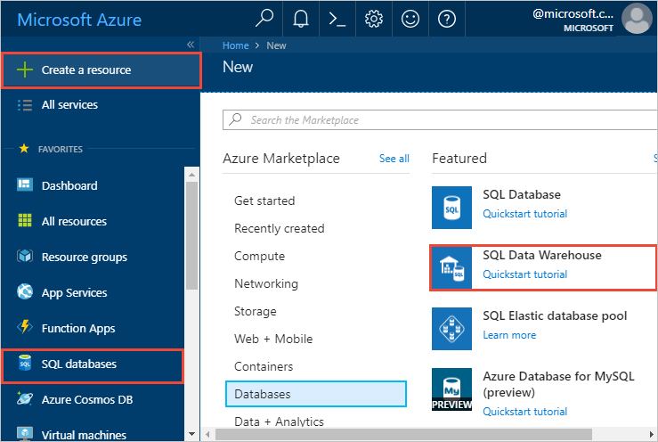

3. Fill out the SQL Data Warehouse form with the following information:   

   | Setting | Suggested value | Description | 
   | ------- | --------------- | ----------- | 
   | **Database name** | SampleDW | For valid database names, see [Database Identifiers](/sql/relational-databases/databases/database-identifiers). | 
   | **Subscription** | Your subscription  | For details about your subscriptions, see [Subscriptions](https://account.windowsazure.com/Subscriptions). |
   | **Resource group** | SampleRG | For valid resource group names, see [Naming rules and restrictions](https://docs.microsoft.com/azure/architecture/best-practices/naming-conventions). |
   | **Select source** | Blank database | Specifies to create a blank database. Note, a data warehouse is one type of database.|

    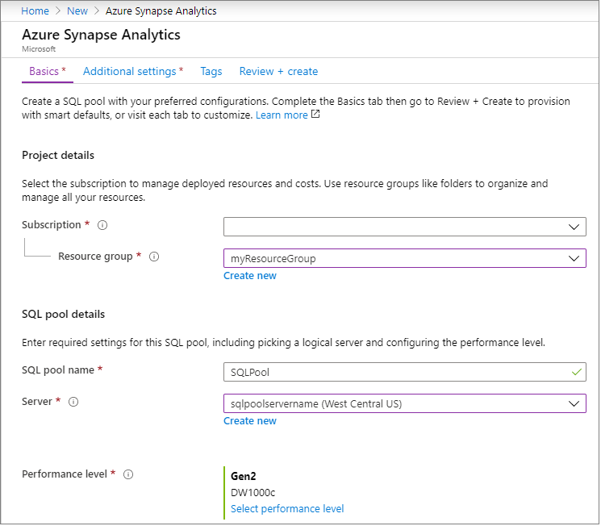

4. Click **Server** to create and configure a new server for your new database. Fill out the **New server form** with the following information: 

    | Setting | Suggested value | Description | 
    | ------- | --------------- | ----------- |
    | **Server name** | Any globally unique name | For valid server names, see [Naming rules and restrictions](https://docs.microsoft.com/azure/architecture/best-practices/naming-conventions). | 
    | **Server admin login** | Any valid name | For valid login names, see [Database Identifiers](https://docs.microsoft.com/sql/relational-databases/databases/database-identifiers).|
    | **Password** | Any valid password | Your password must have at least eight characters and must contain characters from three of the following categories: upper case characters, lower case characters, numbers, and non-alphanumeric characters. |
    | **Location** | Any valid location | For information about regions, see [Azure Regions](https://azure.microsoft.com/regions/). |

    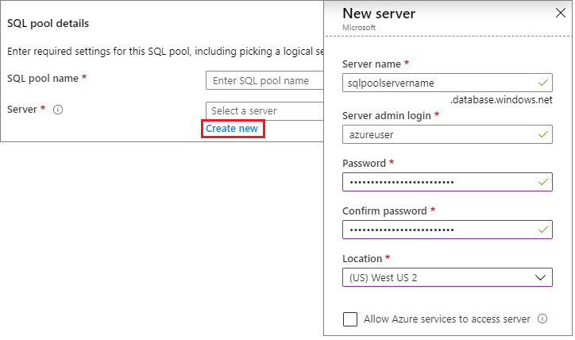

5. Click **Select**.

6. Click **Performance tier** to specify whether the data warehouse is optimized for elasticity or compute, and the number of data warehouse units. 

7. For this tutorial, select the **Optimized for Elasticity** service tier. The slider, by default, is set to **DW400**.  Try moving it up and down to see how it works. 

    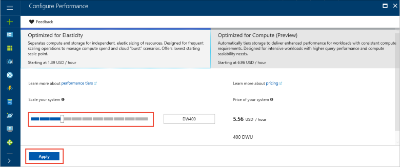

8. Click **Apply**.
9. In the SQL Data Warehouse page, select a **collation** for the blank database. For this tutorial, use the default value. For more information about collations, see [Collations](/sql/t-sql/statements/collations)

11. Now that you have completed the SQL Database form, click **Create** to provision the database. Provisioning takes a few minutes. 

    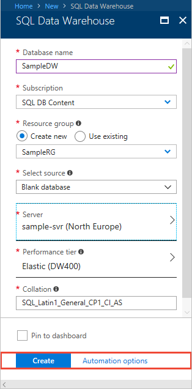

12. On the toolbar, click **Notifications** to monitor the deployment process.
    
     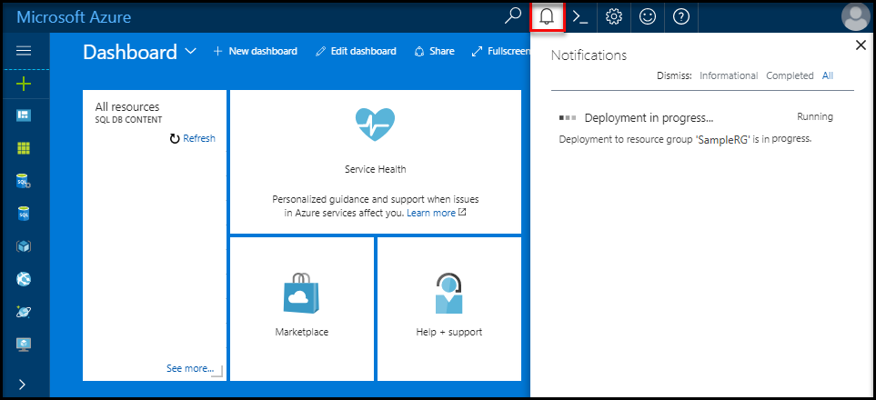

## Create a server-level firewall rule

The SQL Data Warehouse service creates a firewall at the server-level that prevents external applications and tools from connecting to the server or any databases on the server. To enable connectivity, you can add firewall rules that enable connectivity for specific IP addresses.  Follow these steps to create a [server-level firewall rule](../sql-database/sql-database-firewall-configure.md) for your client's IP address. 

> [!NOTE]
> SQL Data Warehouse communicates over port 1433. If you are trying to connect from within a corporate network, outbound traffic over port 1433 might not be allowed by your network's firewall. If so, you cannot connect to your Azure SQL Database server unless your IT department opens port 1433.
>

1. After the deployment completes, click **SQL databases** from the left-hand menu and then click **SampleDW** on the **SQL databases** page. The overview page for your database opens, showing you the fully qualified server name (such as **sample-svr.database.windows.net**) and provides options for further configuration. 

2. Copy this fully qualified server name for use to connect to your server and its databases in subsequent quick starts. To open the server settings, click the server name.

    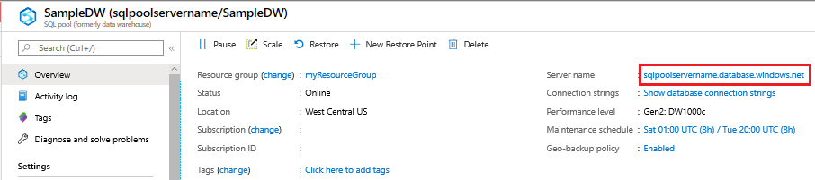 

3. To open the server settings, click the server name.

     

5. Click **Show firewall settings**. The **Firewall settings** page for the SQL Database server opens. 

    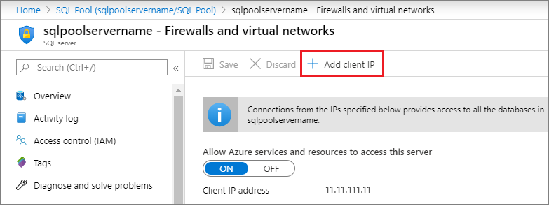 

4.  To add your current IP address to a new firewall rule, click **Add client IP** on the toolbar. A firewall rule can open port 1433 for a single IP address or a range of IP addresses.

5. Click **Save**. A server-level firewall rule is created for your current IP address opening port 1433 on the logical server.

6. Click **OK** and then close the **Firewall settings** page.

You can now connect to the SQL server and its data warehouses using this IP address. The connection works from SQL Server Management Studio or another tool of your choice. When you connect, use the serveradmin account you created previously.  

> [!IMPORTANT]
> By default, access through the SQL Database firewall is enabled for all Azure services. Click **OFF** on this page and then click **Save** to disable the firewall for all Azure services.

## Get the fully qualified server name

Get the fully qualified server name for your SQL server in the Azure portal. Later you will use the fully qualified name when connecting to the server.

1. Log in to the [Azure portal](https://portal.azure.com/).
2. Select **SQL Databases** from the left-hand menu, and click your database on the **SQL databases** page. 
3. In the **Essentials** pane in the Azure portal page for your database, locate and then copy the **Server name**. In this example, the fully qualified name is mynewserver-20171113.database.windows.net. 

      

## Connect to the server as server admin

This section uses [SQL Server Management Studio](/sql/ssms/download-sql-server-management-studio-ssms) (SSMS) to establish a connection to your Azure SQL server.

1. Open SQL Server Management Studio.

2. In the **Connect to Server** dialog box, enter the following information:

    | Setting      | Suggested value | Description | 
    | ------------ | --------------- | ----------- | 
    | Server type | Database engine | This value is required |
    | Server name | The fully qualified server name | For example, **sample-svr.database.windows.net** is a fully qualified server name. |
    | Authentication | SQL Server Authentication | SQL Authentication is the only authentication type that is configured in this tutorial. |
    | Login | The server admin account | This is the account that you specified when you created the server. |
    | Password | The password for your server admin account | This is the password that you specified when you created the server. |

    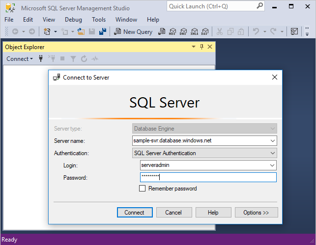

4. Click **Connect**. The Object Explorer window opens in SSMS. 

5. In Object Explorer, expand **Databases**. Then expand **System databases** and **master** to view the objects in the master database.  Expand **mySampleDatabase** to view the objects in your new database.

     

## Create a user for loading data

The server admin account is meant to perform management operations, and is not suited for running queries on user data. Loading data is a memory-intensive operation. Memory maximums are defined according to the Generation of SQL Data Warehouse you're using, [data warehouse units](what-is-a-data-warehouse-unit-dwu-cdwu.md), and [resource class](resource-classes-for-workload-management.md). 

It's best to create a login and user that is dedicated for loading data. Then add the loading user to a [resource class](resource-classes-for-workload-management.md) that enables an appropriate maximum memory allocation.

Since you are currently connected as the server admin, you can create logins and users. Use these steps to create a login and user called **LoaderRC60**. Then assign the user to the **staticrc60** resource class. 

1.  In SSMS, right-click **master** to show a drop-down menu, and choose **New Query**. A new query window opens.

    

2. In the query window, enter these T-SQL commands to create a login and user named LoaderRC60, substituting your own password for 'a123STRONGpassword!'. 

    ```sql
    CREATE LOGIN LoaderRC60 WITH PASSWORD = 'a123STRONGpassword!';
    CREATE USER LoaderRC60 FOR LOGIN LoaderRC60;
    ```

3. Click **Execute**.

4. Right-click **SampleDW**, and choose **New Query**. A new query Window opens.  

    
 
5. Enter the following T-SQL commands to create a database user named LoaderRC60 for the LoaderRC60 login. The second line grants the new user CONTROL permissions on the new data warehouse.  These permissions are similar to making the user the owner of the database. The third line adds the new user as a member of the staticrc60 [resource class](resource-classes-for-workload-management.md).

    ```sql
    CREATE USER LoaderRC60 FOR LOGIN LoaderRC60;
    GRANT CONTROL ON DATABASE::[SampleDW] to LoaderRC60;
    EXEC sp_addrolemember 'staticrc60', 'LoaderRC60';
    ```

6. Click **Execute**.

## Connect to the server as the loading user

The first step toward loading data is to login as LoaderRC60.  

1. In Object Explorer, click the **Connect** drop down menu and select **Database Engine**. The **Connect to Server** dialog box appears.

    

2. Enter the fully qualified server name, and enter **LoaderRC60** as the Login.  Enter your password for LoaderRC60.

3. Click **Connect**.

4. When your connection is ready, you will see two server connections in Object Explorer. One connection as ServerAdmin and one connection as LoaderRC60.

    

## Create external tables and objects

You are ready to begin the process of loading data into your new data warehouse. For future reference, to learn how to get your data to Azure Blob storage or to load it directly from your source into SQL Data Warehouse, see the [loading overview](sql-data-warehouse-overview-load.md).

Run the following SQL scripts to specify information about the data you wish to load. This information includes where the data is located, the format of the contents of the data, and the table definition for the data. The data is located in a public Azure Blob.

1. In the previous section, you logged into your data warehouse as LoaderRC60. In SSMS, right-click **SampleDW** under your LoaderRC60 connection and select **New Query**.  A new query window appears. 

    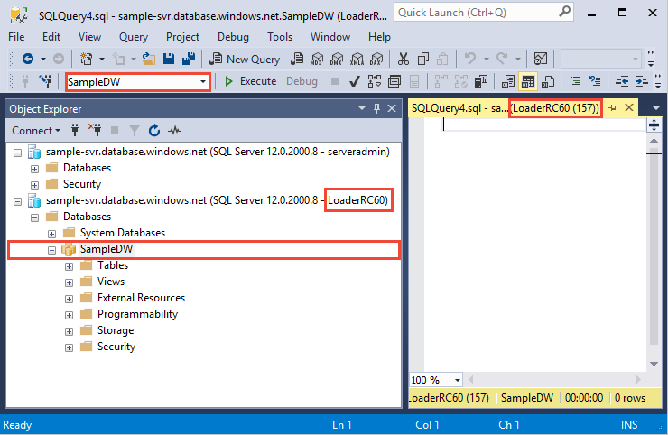

2. Compare your query window to the previous image.  Verify your new query window is running as LoaderRC60 and performing queries on your SampleDW database. Use this query window to perform all of the loading steps.

3. Create a master key for the SampleDW database. You only need to create a master key once per database. 

    ```sql
    CREATE MASTER KEY;
    ```

4. Run the following [CREATE EXTERNAL DATA SOURCE](/sql/t-sql/statements/create-external-data-source-transact-sql) statement to define the location of the Azure blob. This is the location of the external taxi cab data.  To run a command that you have appended to the query window, highlight the commands you wish to run and click **Execute**.

    ```sql
    CREATE EXTERNAL DATA SOURCE WWIStorage
    WITH
    (
        TYPE = Hadoop,
        LOCATION = 'wasbs://wideworldimporters@sqldwholdata.blob.core.windows.net'
    );
    ```

5. Run the following [CREATE EXTERNAL FILE FORMAT](/sql/t-sql/statements/create-external-file-format-transact-sql) T-SQL statement to specify the formatting characteristics and options for the external data file. This statement specifies the external data is stored as text and the values are separated by the pipe ('|') character.  

    ```sql
    CREATE EXTERNAL FILE FORMAT TextFileFormat 
    WITH 
    (   
        FORMAT_TYPE = DELIMITEDTEXT,
        FORMAT_OPTIONS
	    (   
	        FIELD_TERMINATOR = '|',
            USE_TYPE_DEFAULT = FALSE 
        )
    );
    ```

6.  Run the following [CREATE SCHEMA](/sql/t-sql/statements/create-schema-transact-sql) statements to create a schema for your external file format. The ext schema provides a way to organize the external tables you are about to create. The wwi schema organizes the standard tables that will contain the data. 

    ```sql
    CREATE SCHEMA ext;
    GO
    CREATE SCHEMA wwi;
    ```

7. Create the external tables. The table definitions are stored in SQL Data Warehouse, but the tables reference data that is stored in Azure blob storage. Run the following T-SQL commands to create several external tables that all point to the Azure blob you defined previously in the external data source.

    ```sql
    CREATE EXTERNAL TABLE [ext].[dimension_City](
    	[City Key] [int] NOT NULL,
    	[WWI City ID] [int] NOT NULL,
    	[City] [nvarchar](50) NOT NULL,
    	[State Province] [nvarchar](50) NOT NULL,
    	[Country] [nvarchar](60) NOT NULL,
    	[Continent] [nvarchar](30) NOT NULL,
    	[Sales Territory] [nvarchar](50) NOT NULL,
    	[Region] [nvarchar](30) NOT NULL,
    	[Subregion] [nvarchar](30) NOT NULL,
    	[Location] [nvarchar](76) NULL,
    	[Latest Recorded Population] [bigint] NOT NULL,
    	[Valid From] [datetime2](7) NOT NULL,
    	[Valid To] [datetime2](7) NOT NULL,
    	[Lineage Key] [int] NOT NULL
    )
    WITH (LOCATION='/v1/dimension_City/',   
        DATA_SOURCE = WWIStorage,  
        FILE_FORMAT = TextFileFormat,
		REJECT_TYPE = VALUE,
        REJECT_VALUE = 0
    );  
    CREATE EXTERNAL TABLE [ext].[dimension_Customer] (
    	[Customer Key] [int] NOT NULL,
    	[WWI Customer ID] [int] NOT NULL,
    	[Customer] [nvarchar](100) NOT NULL,
    	[Bill To Customer] [nvarchar](100) NOT NULL,
       	[Category] [nvarchar](50) NOT NULL,
    	[Buying Group] [nvarchar](50) NOT NULL,
    	[Primary Contact] [nvarchar](50) NOT NULL,
    	[Postal Code] [nvarchar](10) NOT NULL,
    	[Valid From] [datetime2](7) NOT NULL,
    	[Valid To] [datetime2](7) NOT NULL,
    	[Lineage Key] [int] NOT NULL
    )
    WITH (LOCATION='/v1/dimension_Customer/',   
        DATA_SOURCE = WWIStorage,  
        FILE_FORMAT = TextFileFormat,
		REJECT_TYPE = VALUE,
        REJECT_VALUE = 0
    );  
    CREATE EXTERNAL TABLE [ext].[dimension_Employee] (
	    [Employee Key] [int] NOT NULL,
	    [WWI Employee ID] [int] NOT NULL,
	    [Employee] [nvarchar](50) NOT NULL,
	    [Preferred Name] [nvarchar](50) NOT NULL,
	    [Is Salesperson] [bit] NOT NULL,
	    [Photo] [varbinary](300) NULL,
	    [Valid From] [datetime2](7) NOT NULL,
	    [Valid To] [datetime2](7) NOT NULL,
	    [Lineage Key] [int] NOT NULL
    )
    WITH ( LOCATION='/v1/dimension_Employee/',   
        DATA_SOURCE = WWIStorage,  
        FILE_FORMAT = TextFileFormat,
		REJECT_TYPE = VALUE,
        REJECT_VALUE = 0
    );
    CREATE EXTERNAL TABLE [ext].[dimension_PaymentMethod] (
	    [Payment Method Key] [int] NOT NULL,
	    [WWI Payment Method ID] [int] NOT NULL,
	    [Payment Method] [nvarchar](50) NOT NULL,
	    [Valid From] [datetime2](7) NOT NULL,
	    [Valid To] [datetime2](7) NOT NULL,
	    [Lineage Key] [int] NOT NULL
    )
    WITH ( LOCATION ='/v1/dimension_PaymentMethod/',   
        DATA_SOURCE = WWIStorage,  
        FILE_FORMAT = TextFileFormat,
		REJECT_TYPE = VALUE,
        REJECT_VALUE = 0
    );
    CREATE EXTERNAL TABLE [ext].[dimension_StockItem](
	    [Stock Item Key] [int] NOT NULL,
	    [WWI Stock Item ID] [int] NOT NULL,
	    [Stock Item] [nvarchar](100) NOT NULL,
	    [Color] [nvarchar](20) NOT NULL,
	    [Selling Package] [nvarchar](50) NOT NULL,
	    [Buying Package] [nvarchar](50) NOT NULL,
	    [Brand] [nvarchar](50) NOT NULL,
	    [Size] [nvarchar](20) NOT NULL,
	    [Lead Time Days] [int] NOT NULL,
	    [Quantity Per Outer] [int] NOT NULL,
	    [Is Chiller Stock] [bit] NOT NULL,
	    [Barcode] [nvarchar](50) NULL,
	    [Tax Rate] [decimal](18, 3) NOT NULL,
	    [Unit Price] [decimal](18, 2) NOT NULL,
	    [Recommended Retail Price] [decimal](18, 2) NULL,
	    [Typical Weight Per Unit] [decimal](18, 3) NOT NULL,
	    [Photo] [varbinary](300) NULL,
	    [Valid From] [datetime2](7) NOT NULL,
	    [Valid To] [datetime2](7) NOT NULL,
	    [Lineage Key] [int] NOT NULL
    )
    WITH ( LOCATION ='/v1/dimension_StockItem/',   
        DATA_SOURCE = WWIStorage,  
        FILE_FORMAT = TextFileFormat,
		REJECT_TYPE = VALUE,
        REJECT_VALUE = 0
    );
    CREATE EXTERNAL TABLE [ext].[dimension_Supplier](
	    [Supplier Key] [int] NOT NULL,
	    [WWI Supplier ID] [int] NOT NULL,
	    [Supplier] [nvarchar](100) NOT NULL,
	    [Category] [nvarchar](50) NOT NULL,
	    [Primary Contact] [nvarchar](50) NOT NULL,
	    [Supplier Reference] [nvarchar](20) NULL,
	    [Payment Days] [int] NOT NULL,
	    [Postal Code] [nvarchar](10) NOT NULL,
	    [Valid From] [datetime2](7) NOT NULL,
	    [Valid To] [datetime2](7) NOT NULL,
	    [Lineage Key] [int] NOT NULL
    )
    WITH ( LOCATION ='/v1/dimension_Supplier/',   
        DATA_SOURCE = WWIStorage,  
        FILE_FORMAT = TextFileFormat,
		REJECT_TYPE = VALUE,
        REJECT_VALUE = 0
    );
    CREATE EXTERNAL TABLE [ext].[dimension_TransactionType](
	    [Transaction Type Key] [int] NOT NULL,
	    [WWI Transaction Type ID] [int] NOT NULL,
	    [Transaction Type] [nvarchar](50) NOT NULL,
	    [Valid From] [datetime2](7) NOT NULL,
	    [Valid To] [datetime2](7) NOT NULL,
	    [Lineage Key] [int] NOT NULL
    )    
    WITH ( LOCATION ='/v1/dimension_TransactionType/',   
        DATA_SOURCE = WWIStorage,  
        FILE_FORMAT = TextFileFormat,
		REJECT_TYPE = VALUE,
        REJECT_VALUE = 0
    );
    CREATE EXTERNAL TABLE [ext].[fact_Movement] (
	    [Movement Key] [bigint] NOT NULL,
	    [Date Key] [date] NOT NULL,
	    [Stock Item Key] [int] NOT NULL,
	    [Customer Key] [int] NULL,
	    [Supplier Key] [int] NULL,
	    [Transaction Type Key] [int] NOT NULL,
	    [WWI Stock Item Transaction ID] [int] NOT NULL,
	    [WWI Invoice ID] [int] NULL,
	    [WWI Purchase Order ID] [int] NULL,
	    [Quantity] [int] NOT NULL,
	    [Lineage Key] [int] NOT NULL
    )
    WITH ( LOCATION ='/v1/fact_Movement/',   
        DATA_SOURCE = WWIStorage,  
        FILE_FORMAT = TextFileFormat,
		REJECT_TYPE = VALUE,
        REJECT_VALUE = 0
    );
    CREATE EXTERNAL TABLE [ext].[fact_Order] (
	    [Order Key] [bigint] NOT NULL,
	    [City Key] [int] NOT NULL,
	    [Customer Key] [int] NOT NULL,
	    [Stock Item Key] [int] NOT NULL,
	    [Order Date Key] [date] NOT NULL,
	    [Picked Date Key] [date] NULL,
	    [Salesperson Key] [int] NOT NULL,
	    [Picker Key] [int] NULL,
	    [WWI Order ID] [int] NOT NULL,
	    [WWI Backorder ID] [int] NULL,
	    [Description] [nvarchar](100) NOT NULL,
	    [Package] [nvarchar](50) NOT NULL,
	    [Quantity] [int] NOT NULL,
	    [Unit Price] [decimal](18, 2) NOT NULL,
	    [Tax Rate] [decimal](18, 3) NOT NULL,
	    [Total Excluding Tax] [decimal](18, 2) NOT NULL,
	    [Tax Amount] [decimal](18, 2) NOT NULL,
	    [Total Including Tax] [decimal](18, 2) NOT NULL,
	    [Lineage Key] [int] NOT NULL
    )
    WITH ( LOCATION ='/v1/fact_Order/',   
        DATA_SOURCE = WWIStorage,  
        FILE_FORMAT = TextFileFormat,
		REJECT_TYPE = VALUE,
        REJECT_VALUE = 0
    );
    CREATE EXTERNAL TABLE [ext].[fact_Purchase] (
	    [Purchase Key] [bigint] NOT NULL,
	    [Date Key] [date] NOT NULL,
	    [Supplier Key] [int] NOT NULL,
	    [Stock Item Key] [int] NOT NULL,
	    [WWI Purchase Order ID] [int] NULL,
	    [Ordered Outers] [int] NOT NULL,
	    [Ordered Quantity] [int] NOT NULL,
	    [Received Outers] [int] NOT NULL,
	    [Package] [nvarchar](50) NOT NULL,
	    [Is Order Finalized] [bit] NOT NULL,
	    [Lineage Key] [int] NOT NULL
    )
    WITH ( LOCATION ='/v1/fact_Purchase/',   
        DATA_SOURCE = WWIStorage,  
        FILE_FORMAT = TextFileFormat,
		REJECT_TYPE = VALUE,
        REJECT_VALUE = 0
    );
    CREATE EXTERNAL TABLE [ext].[fact_Sale] (
	    [Sale Key] [bigint] NOT NULL,
	    [City Key] [int] NOT NULL,
    	[Customer Key] [int] NOT NULL,
	    [Bill To Customer Key] [int] NOT NULL,
	    [Stock Item Key] [int] NOT NULL,
	    [Invoice Date Key] [date] NOT NULL,
	    [Delivery Date Key] [date] NULL,
	    [Salesperson Key] [int] NOT NULL,
	    [WWI Invoice ID] [int] NOT NULL,
	    [Description] [nvarchar](100) NOT NULL,
	    [Package] [nvarchar](50) NOT NULL,
	    [Quantity] [int] NOT NULL,
	    [Unit Price] [decimal](18, 2) NOT NULL,
	    [Tax Rate] [decimal](18, 3) NOT NULL,
	    [Total Excluding Tax] [decimal](18, 2) NOT NULL,
	    [Tax Amount] [decimal](18, 2) NOT NULL,
	    [Profit] [decimal](18, 2) NOT NULL,
	    [Total Including Tax] [decimal](18, 2) NOT NULL,
	    [Total Dry Items] [int] NOT NULL,
	    [Total Chiller Items] [int] NOT NULL,
	    [Lineage Key] [int] NOT NULL
    )
    WITH ( LOCATION ='/v1/fact_Sale/',   
        DATA_SOURCE = WWIStorage,  
        FILE_FORMAT = TextFileFormat,
		REJECT_TYPE = VALUE,
        REJECT_VALUE = 0
    );
    CREATE EXTERNAL TABLE [ext].[fact_StockHolding] (
	    [Stock Holding Key] [bigint] NOT NULL,
	    [Stock Item Key] [int] NOT NULL,
	    [Quantity On Hand] [int] NOT NULL,
	    [Bin Location] [nvarchar](20) NOT NULL,
	    [Last Stocktake Quantity] [int] NOT NULL,
	    [Last Cost Price] [decimal](18, 2) NOT NULL,
    	[Reorder Level] [int] NOT NULL,
	    [Target Stock Level] [int] NOT NULL,
	    [Lineage Key] [int] NOT NULL
    )
    WITH ( LOCATION ='/v1/fact_StockHolding/',   
        DATA_SOURCE = WWIStorage,  
        FILE_FORMAT = TextFileFormat,
		REJECT_TYPE = VALUE,
        REJECT_VALUE = 0
    );
    CREATE EXTERNAL TABLE [ext].[fact_Transaction] (
	    [Transaction Key] [bigint] NOT NULL,
	    [Date Key] [date] NOT NULL,
	    [Customer Key] [int] NULL,
	    [Bill To Customer Key] [int] NULL,
	    [Supplier Key] [int] NULL,
	    [Transaction Type Key] [int] NOT NULL,
	    [Payment Method Key] [int] NULL,
	    [WWI Customer Transaction ID] [int] NULL,
	    [WWI Supplier Transaction ID] [int] NULL,
	    [WWI Invoice ID] [int] NULL,
	    [WWI Purchase Order ID] [int] NULL,
	    [Supplier Invoice Number] [nvarchar](20) NULL,
	    [Total Excluding Tax] [decimal](18, 2) NOT NULL,
	    [Tax Amount] [decimal](18, 2) NOT NULL,
	    [Total Including Tax] [decimal](18, 2) NOT NULL,
	    [Outstanding Balance] [decimal](18, 2) NOT NULL,
	    [Is Finalized] [bit] NOT NULL,
	    [Lineage Key] [int] NOT NULL
    )
    WITH ( LOCATION ='/v1/fact_Transaction/',   
        DATA_SOURCE = WWIStorage,  
        FILE_FORMAT = TextFileFormat,
		REJECT_TYPE = VALUE,
        REJECT_VALUE = 0
    );
    ```

8. In Object Explorer, expand SampleDW to see the list of external tables you just created.

    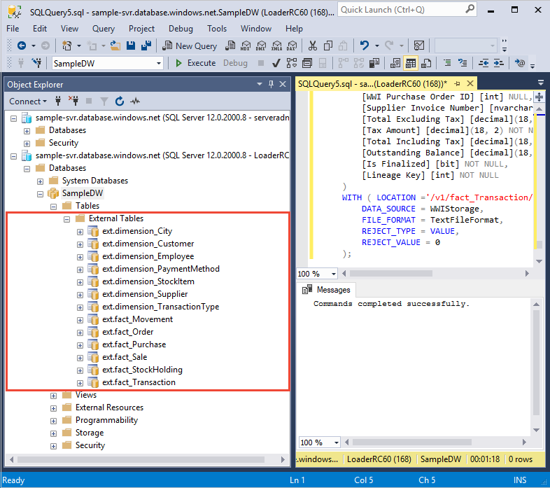

## Load the data into your data warehouse

This section uses the external tables you just defined to load the sample data from Azure Blob to SQL Data Warehouse.  

> [!NOTE]
> This tutorial loads the data directly into the final table. In a production environment, you will usually use CREATE TABLE AS SELECT to load into a staging table. While data is in the staging table you can perform any necessary transformations. To append the data in the staging table to a production table, you can use the INSERT...SELECT statement. For more information, see [Inserting data into a production table](guidance-for-loading-data.md#inserting-data-into-a-production-table).
> 

The script uses the [CREATE TABLE AS SELECT (CTAS)](/sql/t-sql/statements/create-table-as-select-azure-sql-data-warehouse) T-SQL statement to load the data from Azure Storage Blob into new tables in your data warehouse. CTAS creates a new table based on the results of a select statement. The new table has the same columns and data types as the results of the select statement. When the select statement selects from an external table, SQL Data Warehouse imports the data into a relational table in the data warehouse. 

This script does not load data into the wwi.dimension_Date and wwi.fact_Sales tables. These tables are generated in a later step in order to make the tables have a sizeable number of rows.

1. Run the following script to load the data into new tables in your data warehouse.

    ```sql
    CREATE TABLE [wwi].[dimension_City]
    WITH
    ( 
        DISTRIBUTION = REPLICATE,
        CLUSTERED COLUMNSTORE INDEX
    )
    AS
    SELECT * FROM [ext].[dimension_City]
    OPTION (LABEL = 'CTAS : Load [wwi].[dimension_City]')
    ;

    CREATE TABLE [wwi].[dimension_Customer]
    WITH
    ( 
        DISTRIBUTION = REPLICATE,
        CLUSTERED COLUMNSTORE INDEX
    )
    AS
    SELECT * FROM [ext].[dimension_Customer]
    OPTION (LABEL = 'CTAS : Load [wwi].[dimension_Customer]')
    ;

    CREATE TABLE [wwi].[dimension_Employee]
    WITH
    ( 
        DISTRIBUTION = REPLICATE,
        CLUSTERED COLUMNSTORE INDEX
    )
    AS
    SELECT * FROM [ext].[dimension_Employee]
    OPTION (LABEL = 'CTAS : Load [wwi].[dimension_Employee]')
    ;

    CREATE TABLE [wwi].[dimension_PaymentMethod]
    WITH
    ( 
        DISTRIBUTION = REPLICATE,
        CLUSTERED COLUMNSTORE INDEX
    )
    AS
    SELECT * FROM [ext].[dimension_PaymentMethod]
    OPTION (LABEL = 'CTAS : Load [wwi].[dimension_PaymentMethod]')
    ;

    CREATE TABLE [wwi].[dimension_StockItem]
    WITH
    ( 
        DISTRIBUTION = REPLICATE,
        CLUSTERED COLUMNSTORE INDEX
    )
    AS
    SELECT * FROM [ext].[dimension_StockItem]
    OPTION (LABEL = 'CTAS : Load [wwi].[dimension_StockItem]')
    ;

    CREATE TABLE [wwi].[dimension_Supplier]
    WITH
    ( 
        DISTRIBUTION = REPLICATE,
        CLUSTERED COLUMNSTORE INDEX
    )
    AS
    SELECT * FROM [ext].[dimension_Supplier]
    OPTION (LABEL = 'CTAS : Load [wwi].[dimension_Supplier]')
    ;

    CREATE TABLE [wwi].[dimension_TransactionType]
    WITH
    ( 
        DISTRIBUTION = REPLICATE,
        CLUSTERED COLUMNSTORE INDEX
    )
    AS
    SELECT * FROM [ext].[dimension_TransactionType]
    OPTION (LABEL = 'CTAS : Load [wwi].[dimension_TransactionType]')
    ;

    CREATE TABLE [wwi].[fact_Movement]
    WITH
    ( 
        DISTRIBUTION = HASH([Movement Key]),
        CLUSTERED COLUMNSTORE INDEX
    )
    AS
    SELECT * FROM [ext].[fact_Movement]
    OPTION (LABEL = 'CTAS : Load [wwi].[fact_Movement]')
    ;

    CREATE TABLE [wwi].[fact_Order]
    WITH
    ( 
        DISTRIBUTION = HASH([Order Key]),
        CLUSTERED COLUMNSTORE INDEX
    )
    AS
    SELECT * FROM [ext].[fact_Order]
    OPTION (LABEL = 'CTAS : Load [wwi].[fact_Order]')
    ;

    CREATE TABLE [wwi].[fact_Purchase]
    WITH
    ( 
        DISTRIBUTION = HASH([Purchase Key]),
        CLUSTERED COLUMNSTORE INDEX
    )
    AS
    SELECT * FROM [ext].[fact_Purchase]
    OPTION (LABEL = 'CTAS : Load [wwi].[fact_Purchase]')
    ;

    CREATE TABLE [wwi].[seed_Sale]
    WITH
    ( 
        DISTRIBUTION = HASH([WWI Invoice ID]),
        CLUSTERED COLUMNSTORE INDEX
    )
    AS
    SELECT * FROM [ext].[fact_Sale]
    OPTION (LABEL = 'CTAS : Load [wwi].[seed_Sale]')
    ;

    CREATE TABLE [wwi].[fact_StockHolding]
    WITH
    ( 
        DISTRIBUTION = HASH([Stock Holding Key]),
        CLUSTERED COLUMNSTORE INDEX
    )
    AS
    SELECT * FROM [ext].[fact_StockHolding]
    OPTION (LABEL = 'CTAS : Load [wwi].[fact_StockHolding]')
    ;

    CREATE TABLE [wwi].[fact_Transaction]
    WITH
    ( 
        DISTRIBUTION = HASH([Transaction Key]),
        CLUSTERED COLUMNSTORE INDEX
    )
    AS
    SELECT * FROM [ext].[fact_Transaction]
    OPTION (LABEL = 'CTAS : Load [wwi].[fact_Transaction]')
    ;
    ```

2. View your data as it loads. You’re loading several GBs of data and compressing it into highly performant clustered columnstore indexes. Open a new query window on SampleDW, and run the following query to show the status of the load. After starting the query, grab a coffee and a snack while SQL Data Warehouse does some heavy lifting.

    ```sql
    SELECT
        r.command,
        s.request_id,
        r.status,
        count(distinct input_name) as nbr_files,
        sum(s.bytes_processed)/1024/1024/1024 as gb_processed
    FROM 
        sys.dm_pdw_exec_requests r
        INNER JOIN sys.dm_pdw_dms_external_work s
        ON r.request_id = s.request_id
    WHERE
        r.[label] = 'CTAS : Load [wwi].[dimension_City]' OR
        r.[label] = 'CTAS : Load [wwi].[dimension_Customer]' OR
        r.[label] = 'CTAS : Load [wwi].[dimension_Employee]' OR
        r.[label] = 'CTAS : Load [wwi].[dimension_PaymentMethod]' OR
        r.[label] = 'CTAS : Load [wwi].[dimension_StockItem]' OR
        r.[label] = 'CTAS : Load [wwi].[dimension_Supplier]' OR
        r.[label] = 'CTAS : Load [wwi].[dimension_TransactionType]' OR
        r.[label] = 'CTAS : Load [wwi].[fact_Movement]' OR
        r.[label] = 'CTAS : Load [wwi].[fact_Order]' OR
        r.[label] = 'CTAS : Load [wwi].[fact_Purchase]' OR
        r.[label] = 'CTAS : Load [wwi].[fact_StockHolding]' OR
        r.[label] = 'CTAS : Load [wwi].[fact_Transaction]'
    GROUP BY
        r.command,
        s.request_id,
        r.status
    ORDER BY
        nbr_files desc, 
        gb_processed desc;
    ```

3. View all system queries.

    ```sql
    SELECT * FROM sys.dm_pdw_exec_requests;
    ```

4. Enjoy seeing your data nicely loaded into your data warehouse.

    

## Create tables and procedures to generate the Date and Sales tables

This section creates the wwi.dimension_Date and wwi.fact_Sales tables. It also creates stored procedures that can generate millions of rows in the wwi.dimension_Date and wwi.fact_Sales tables.

1. Create the dimension_Date and fact_Sale tables.  

    ```sql
    CREATE TABLE [wwi].[dimension_Date]
    (
	    [Date] [datetime] NOT NULL,
	    [Day Number] [int] NOT NULL,
	    [Day] [nvarchar](10) NOT NULL,
	    [Month] [nvarchar](10) NOT NULL,
	    [Short Month] [nvarchar](3) NOT NULL,
	    [Calendar Month Number] [int] NOT NULL,
	    [Calendar Month Label] [nvarchar](20) NOT NULL,
	    [Calendar Year] [int] NOT NULL,
	    [Calendar Year Label] [nvarchar](10) NOT NULL,
	    [Fiscal Month Number] [int] NOT NULL,
	    [Fiscal Month Label] [nvarchar](20) NOT NULL,
	    [Fiscal Year] [int] NOT NULL,
	    [Fiscal Year Label] [nvarchar](10) NOT NULL,
	    [ISO Week Number] [int] NOT NULL
    )
    WITH 
    (
        DISTRIBUTION = REPLICATE,
        CLUSTERED INDEX ([Date])
    );
    CREATE TABLE [wwi].[fact_Sale]
    (
	    [Sale Key] [bigint] IDENTITY(1,1) NOT NULL,
	    [City Key] [int] NOT NULL,
	    [Customer Key] [int] NOT NULL,
	    [Bill To Customer Key] [int] NOT NULL,
	    [Stock Item Key] [int] NOT NULL,
	    [Invoice Date Key] [date] NOT NULL,
	    [Delivery Date Key] [date] NULL,
	    [Salesperson Key] [int] NOT NULL,
	    [WWI Invoice ID] [int] NOT NULL,
	    [Description] [nvarchar](100) NOT NULL,
	    [Package] [nvarchar](50) NOT NULL,
	    [Quantity] [int] NOT NULL,
	    [Unit Price] [decimal](18, 2) NOT NULL,
	    [Tax Rate] [decimal](18, 3) NOT NULL,
	    [Total Excluding Tax] [decimal](18, 2) NOT NULL,
	    [Tax Amount] [decimal](18, 2) NOT NULL,
	    [Profit] [decimal](18, 2) NOT NULL,
	    [Total Including Tax] [decimal](18, 2) NOT NULL,
	    [Total Dry Items] [int] NOT NULL,
	    [Total Chiller Items] [int] NOT NULL,
	    [Lineage Key] [int] NOT NULL
    )
    WITH
    (
	    DISTRIBUTION = HASH ( [WWI Invoice ID] ),
	    CLUSTERED COLUMNSTORE INDEX
    )
    ```

2. Create [wwi].[InitialSalesDataPopulation] to increase the number of rows in [wwi].[seed_Sale] by a factor of eight. 

    ```sql
    CREATE PROCEDURE [wwi].[InitialSalesDataPopulation] AS
    BEGIN
        INSERT INTO [wwi].[seed_Sale] (
            [Sale Key], [City Key], [Customer Key], [Bill To Customer Key], [Stock Item Key], [Invoice Date Key], [Delivery Date Key], [Salesperson Key], [WWI Invoice ID], [Description], [Package], [Quantity], [Unit Price], [Tax Rate], [Total Excluding Tax], [Tax Amount], [Profit], [Total Including Tax], [Total Dry Items], [Total Chiller Items], [Lineage Key]
        )
        SELECT
            [Sale Key], [City Key], [Customer Key], [Bill To Customer Key], [Stock Item Key], [Invoice Date Key], [Delivery Date Key], [Salesperson Key], [WWI Invoice ID], [Description], [Package], [Quantity], [Unit Price], [Tax Rate], [Total Excluding Tax], [Tax Amount], [Profit], [Total Including Tax], [Total Dry Items], [Total Chiller Items], [Lineage Key]
        FROM [wwi].[seed_Sale]

        INSERT INTO [wwi].[seed_Sale] (
            [Sale Key], [City Key], [Customer Key], [Bill To Customer Key], [Stock Item Key], [Invoice Date Key], [Delivery Date Key], [Salesperson Key], [WWI Invoice ID], [Description], [Package], [Quantity], [Unit Price], [Tax Rate], [Total Excluding Tax], [Tax Amount], [Profit], [Total Including Tax], [Total Dry Items], [Total Chiller Items], [Lineage Key]
        )
        SELECT
            [Sale Key], [City Key], [Customer Key], [Bill To Customer Key], [Stock Item Key], [Invoice Date Key], [Delivery Date Key], [Salesperson Key], [WWI Invoice ID], [Description], [Package], [Quantity], [Unit Price], [Tax Rate], [Total Excluding Tax], [Tax Amount], [Profit], [Total Including Tax], [Total Dry Items], [Total Chiller Items], [Lineage Key]
        FROM [wwi].[seed_Sale]

        INSERT INTO [wwi].[seed_Sale] (
            [Sale Key], [City Key], [Customer Key], [Bill To Customer Key], [Stock Item Key], [Invoice Date Key], [Delivery Date Key], [Salesperson Key], [WWI Invoice ID], [Description], [Package], [Quantity], [Unit Price], [Tax Rate], [Total Excluding Tax], [Tax Amount], [Profit], [Total Including Tax], [Total Dry Items], [Total Chiller Items], [Lineage Key]
        )
        SELECT
            [Sale Key], [City Key], [Customer Key], [Bill To Customer Key], [Stock Item Key], [Invoice Date Key], [Delivery Date Key], [Salesperson Key], [WWI Invoice ID], [Description], [Package], [Quantity], [Unit Price], [Tax Rate], [Total Excluding Tax], [Tax Amount], [Profit], [Total Including Tax], [Total Dry Items], [Total Chiller Items], [Lineage Key]
        FROM [wwi].[seed_Sale]
    END
    ```

3. Create this stored procedure that populates rows into wwi.dimension_Date.

    ```sql
    CREATE PROCEDURE [wwi].[PopulateDateDimensionForYear] @Year [int] AS
    BEGIN
	    IF OBJECT_ID('tempdb..#month', 'U') IS NOT NULL 
		    DROP TABLE #month
	    CREATE TABLE #month (
	        monthnum int,
		    numofdays int
        )
	    WITH ( DISTRIBUTION = ROUND_ROBIN, heap )
	    INSERT INTO #month
	        SELECT 1, 31 UNION SELECT 2, CASE WHEN (@YEAR % 4 = 0 AND @YEAR % 100 <> 0) OR @YEAR % 400 = 0 THEN 29 ELSE 28 END UNION SELECT 3,31 UNION SELECT 4,30 UNION SELECT 5,31 UNION SELECT 6,30 UNION SELECT 7,31 UNION SELECT 8,31 UNION SELECT 9,30 UNION SELECT 10,31 UNION SELECT 11,30 UNION SELECT 12,31

	    IF OBJECT_ID('tempdb..#days', 'U') IS NOT NULL 
		    DROP TABLE #days
	    CREATE TABLE #days (days int)
	    WITH (DISTRIBUTION = ROUND_ROBIN, HEAP)

	    INSERT INTO #days
	        SELECT 1 UNION SELECT 2 UNION SELECT 3 UNION SELECT 4 UNION SELECT 5 UNION SELECT 6 UNION SELECT 7 UNION SELECT 8 UNION SELECT 9 UNION SELECT 10 UNION SELECT 11 UNION SELECT 12 UNION SELECT 13 UNION SELECT 14 UNION SELECT 15 UNION SELECT 16 UNION SELECT 17 UNION SELECT 18 UNION SELECT 19 UNION SELECT 20	UNION SELECT 21 UNION SELECT 22 UNION SELECT 23 UNION SELECT 24 UNION SELECT 25 UNION SELECT 26 UNION SELECT 27 UNION SELECT 28 UNION SELECT 29 UNION SELECT 30 UNION SELECT 31

        INSERT [wwi].[dimension_Date] (
            [Date], [Day Number], [Day], [Month], [Short Month], [Calendar Month Number], [Calendar Month Label], [Calendar Year], [Calendar Year Label], [Fiscal Month Number], [Fiscal Month Label], [Fiscal Year], [Fiscal Year Label], [ISO Week Number] 
        )
	    SELECT
            CAST(CAST(monthnum AS VARCHAR(2)) + '/' + CAST([days] AS VARCHAR(3)) + '/' + CAST(@year AS CHAR(4)) AS DATE) AS [Date]
            ,DAY(CAST(CAST(monthnum AS VARCHAR(2)) + '/' + CAST([days] AS VARCHAR(3)) + '/' + CAST(@year AS CHAR(4)) AS DATE)) AS [Day Number]
            ,CAST(DATENAME(day, CAST(CAST(monthnum AS VARCHAR(2)) + '/' + CAST([days] AS VARCHAR(3)) + '/' + CAST(@year AS CHAR(4)) AS DATE)) AS NVARCHAR(10)) AS [Day]
		    ,CAST(DATENAME(month, CAST(CAST(monthnum AS VARCHAR(2)) + '/' + CAST([days] AS VARCHAR(3)) + '/' + CAST(@year as char(4)) AS DATE)) AS nvarchar(10)) AS [Month]
		    ,CAST(SUBSTRING(DATENAME(month, CAST(CAST(monthnum as varchar(2)) + '/' + CAST([days] as varchar(3)) + '/' + CAST(@year as char(4)) AS DATE)), 1, 3) AS nvarchar(3)) AS [Short Month]
		    ,MONTH(CAST(CAST(monthnum as varchar(2)) + '/' + CAST([days] as varchar(3)) + '/' + CAST(@year as char(4)) AS DATE)) AS [Calendar Month Number]
		    ,CAST(N'CY' + CAST(YEAR(CAST(CAST(monthnum as varchar(2)) + '/' + CAST([days] as varchar(3)) + '/' + CAST(@year as char(4)) AS DATE)) AS nvarchar(4)) + N'-' + SUBSTRING(DATENAME(month, CAST(CAST(monthnum as varchar(2)) + '/' + CAST([days] as varchar(3)) + '/' + CAST(@year as char(4)) AS DATE)), 1, 3) AS nvarchar(10)) AS [Calendar Month Label]
		    ,YEAR(CAST(CAST(monthnum as varchar(2)) + '/' + CAST([days] as varchar(3)) + '/' + CAST(@year as char(4)) AS DATE)) AS [Calendar Year]
		    ,CAST(N'CY' + CAST(YEAR(CAST(CAST(monthnum as varchar(2)) + '/' + CAST([days] as varchar(3)) + '/' + CAST(@year as char(4)) AS DATE)) AS nvarchar(4)) AS nvarchar(10)) AS [Calendar Year Label]
		    ,CASE WHEN MONTH(CAST(CAST(monthnum as varchar(2)) + '/' + CAST([days] as varchar(3)) + '/' + CAST(@year as char(4)) AS DATE)) IN (11, 12)
			THEN MONTH(CAST(CAST(monthnum as varchar(2)) + '/' + CAST([days] as varchar(3)) + '/' + CAST(@year as char(4)) AS DATE)) - 10
			ELSE MONTH(CAST(CAST(monthnum as varchar(2)) + '/' + CAST([days] as varchar(3)) + '/' + CAST(@year as char(4)) AS DATE)) + 2 END AS [Fiscal Month Number]
		    ,CAST(N'FY' + CAST(CASE WHEN MONTH(CAST(CAST(monthnum as varchar(2)) + '/' + CAST([days] as varchar(3)) + '/' + CAST(@year as char(4)) AS DATE)) IN (11, 12)
			THEN YEAR(CAST(CAST(monthnum as varchar(2)) + '/' + CAST([days] as varchar(3)) + '/' + CAST(@year as char(4)) AS DATE)) + 1
			ELSE YEAR(CAST(CAST(monthnum as varchar(2)) + '/' + CAST([days] as varchar(3)) + '/' + CAST(@year as char(4)) AS DATE)) END AS nvarchar(4)) + N'-' + SUBSTRING(DATENAME(month, CAST(CAST(monthnum as varchar(2)) + '/' + CAST([days] as varchar(3)) + '/' + CAST(@year as char(4)) AS DATE)), 1, 3) AS nvarchar(20)) AS [Fiscal Month Label]
		    ,CASE WHEN MONTH(CAST(CAST(monthnum as varchar(2)) + '/' + CAST([days] as varchar(3)) + '/' + CAST(@year as char(4)) AS DATE)) IN (11, 12)
			THEN YEAR(CAST(CAST(monthnum as varchar(2)) + '/' + CAST([days] as varchar(3)) + '/' + CAST(@year as char(4)) AS DATE)) + 1
			ELSE YEAR(CAST(CAST(monthnum as varchar(2)) + '/' + CAST([days] as varchar(3)) + '/' + CAST(@year as char(4)) AS DATE)) END AS [Fiscal Year]
		    ,CAST(N'FY' + CAST(CASE WHEN MONTH(CAST(CAST(monthnum as varchar(2)) + '/' + CAST([days] as varchar(3)) + '/' + CAST(@year as char(4)) AS DATE)) IN (11, 12)
			THEN YEAR(CAST(CAST(monthnum as varchar(2)) + '/' + CAST([days] as varchar(3)) + '/' + CAST(@year as char(4)) AS DATE)) + 1
			ELSE YEAR(CAST(CAST(monthnum as varchar(2)) + '/' + CAST([days] as varchar(3)) + '/' + CAST(@year as char(4)) AS DATE))END AS nvarchar(4)) AS nvarchar(10)) AS [Fiscal Year Label]
		    , DATEPART(ISO_WEEK, CAST(CAST(monthnum as varchar(2)) + '/' + CAST([days] as varchar(3)) + '/' + CAST(@year as char(4)) AS DATE)) AS [ISO Week Number]
	FROM #month m
		CROSS JOIN #days d
	WHERE d.days <= m.numofdays

	DROP table #month;
	DROP table #days;
    END;
    ```
4. Create this procedure that populates the wwi.dimension_Date and wwi.fact_Sales tables. It calls [wwi].[PopulateDateDimensionForYear] to populate wwi.dimension_Date.

    ```sql
    CREATE PROCEDURE [wwi].[Configuration_PopulateLargeSaleTable] @EstimatedRowsPerDay [bigint],@Year [int] AS
    BEGIN
        SET NOCOUNT ON;
        SET XACT_ABORT ON;

	    EXEC [wwi].[PopulateDateDimensionForYear] @Year;

	    DECLARE @OrderCounter bigint = 0;
	    DECLARE @NumberOfSalesPerDay bigint = @EstimatedRowsPerDay;
	    DECLARE @DateCounter date; 
	    DECLARE @StartingSaleKey bigint;
	    DECLARE @MaximumSaleKey bigint = (SELECT MAX([Sale Key]) FROM wwi.seed_Sale);
	    DECLARE @MaxDate date;
	    SET @MaxDate = (SELECT MAX([Invoice Date Key]) FROM wwi.fact_Sale)
	    IF ( @MaxDate < CAST(@YEAR AS CHAR(4)) + '1231') AND (@MaxDate > CAST(@YEAR AS CHAR(4)) + '0101')
		    SET @DateCounter = @MaxDate
	    ELSE
		    SET @DateCounter= CAST(@Year as char(4)) + '0101';

	    PRINT 'Targeting ' + CAST(@NumberOfSalesPerDay AS varchar(20)) + ' sales per day.';

	    DECLARE @OutputCounter varchar(20);
	    DECLARE @variance DECIMAL(18,10);
	    DECLARE @VariantNumberOfSalesPerDay BIGINT;

	    WHILE @DateCounter < CAST(@YEAR AS CHAR(4)) + '1231'
	    BEGIN
		    SET @OutputCounter = CONVERT(varchar(20), @DateCounter, 112);
		    RAISERROR(@OutputCounter, 0, 1);
		    SET @variance = (SELECT RAND() * 10)*.01 + .95
		    SET @VariantNumberOfSalesPerDay = FLOOR(@NumberOfSalesPerDay * @variance)

		    SET @StartingSaleKey = @MaximumSaleKey - @VariantNumberOfSalesPerDay - FLOOR(RAND() * 20000);
		    SET @OrderCounter = 0;

		    INSERT [wwi].[fact_Sale] (
                [City Key], [Customer Key], [Bill To Customer Key], [Stock Item Key], [Invoice Date Key], [Delivery Date Key], [Salesperson Key], [WWI Invoice ID], [Description], Package, Quantity, [Unit Price], [Tax Rate], [Total Excluding Tax], [Tax Amount], Profit, [Total Including Tax], [Total Dry Items], [Total Chiller Items], [Lineage Key]
            )
		    SELECT TOP(@VariantNumberOfSalesPerDay)
		        [City Key], [Customer Key], [Bill To Customer Key], [Stock Item Key], @DateCounter, DATEADD(day, 1, @DateCounter), [Salesperson Key], [WWI Invoice ID], [Description], Package, Quantity, [Unit Price], [Tax Rate], [Total Excluding Tax], [Tax Amount], Profit, [Total Including Tax], [Total Dry Items], [Total Chiller Items], [Lineage Key]
		    FROM [wwi].[seed_Sale]
		    WHERE 
                 --[Sale Key] > @StartingSaleKey and /* IDENTITY DOES NOT WORK THE SAME IN SQLDW AND CAN'T USE THIS METHOD FOR VARIANT */
			    [Invoice Date Key] >=cast(@YEAR AS CHAR(4)) + '-01-01'
		    ORDER BY [Sale Key];

		    SET @DateCounter = DATEADD(day, 1, @DateCounter);
	    END;

    END;
    ```

## Generate millions of rows
Use the stored procedures you created to generate millions of rows in the wwi.fact_Sales table, and corresponding data in the wwi.dimension_Date table. 


1. Run this procedure to seed the [wwi].[seed_Sale] with more rows.

    ```sql    
    EXEC [wwi].[InitialSalesDataPopulation]
    ```

2. Run this procedure to populate wwi.fact_Sales with 100,000 rows per day for each day in the year 2000.

    ```sql
    EXEC [wwi].[Configuration_PopulateLargeSaleTable] 100000, 2000
    ```
3. The data generation in the previous step might take a while as it progresses through the year.  To see which day the current process is on, open a new query and run this SQL command:

    ```sql
    SELECT MAX([Invoice Date Key]) FROM wwi.fact_Sale;
    ```

4. Run the following command to see the space used.

    ```sql
    EXEC sp_spaceused N'wwi.fact_Sale';
    ```

## Populate the replicated table cache
SQL Data Warehouse replicates a table by caching the data to each Compute node. The cache gets populated when a query runs against the table. Therefore, the first query on a replicated table might require extra time to populate the cache. After the cache is populated, queries on replicated tables run faster.

Run these SQL queries to populate the replicated table cache on the Compute nodes. 

    ```sql
    SELECT TOP 1 * FROM [wwi].[dimension_City];
    SELECT TOP 1 * FROM [wwi].[dimension_Customer];
    SELECT TOP 1 * FROM [wwi].[dimension_Date];
    SELECT TOP 1 * FROM [wwi].[dimension_Employee];
    SELECT TOP 1 * FROM [wwi].[dimension_PaymentMethod];
    SELECT TOP 1 * FROM [wwi].[dimension_StockItem];
    SELECT TOP 1 * FROM [wwi].[dimension_Supplier];
    SELECT TOP 1 * FROM [wwi].[dimension_TransactionType];
    ```

## Create statistics on newly loaded data

To achieve high query performance, it's important to create statistics on each column of each table after the first load. It's also important to update statistics after substantial changes in the data. 

1. Create this stored procedure that updates statistics on all columns of all tables.

    ```sql
    CREATE PROCEDURE    [dbo].[prc_sqldw_create_stats]
    (   @create_type    tinyint -- 1 default 2 Fullscan 3 Sample
    ,   @sample_pct     tinyint
    )
    AS

    IF @create_type IS NULL
    BEGIN
        SET @create_type = 1;
    END;

    IF @create_type NOT IN (1,2,3)
    BEGIN
        THROW 151000,'Invalid value for @stats_type parameter. Valid range 1 (default), 2 (fullscan) or 3 (sample).',1;
    END;

    IF @sample_pct IS NULL
    BEGIN;
        SET @sample_pct = 20;
    END;

    IF OBJECT_ID('tempdb..#stats_ddl') IS NOT NULL
    BEGIN;
        DROP TABLE #stats_ddl;
    END;
    
    CREATE TABLE #stats_ddl
    WITH    (   DISTRIBUTION    = HASH([seq_nmbr])
            ,   LOCATION        = USER_DB
            )
    AS
    WITH T
    AS
    (
    SELECT      t.[name]                        AS [table_name]
    ,           s.[name]                        AS [table_schema_name]
    ,           c.[name]                        AS [column_name]
    ,           c.[column_id]                   AS [column_id]
    ,           t.[object_id]                   AS [object_id]
    ,           ROW_NUMBER()
                OVER(ORDER BY (SELECT NULL))    AS [seq_nmbr]
    FROM        sys.[tables] t
    JOIN        sys.[schemas] s         ON  t.[schema_id]       = s.[schema_id]
    JOIN        sys.[columns] c         ON  t.[object_id]       = c.[object_id]
    LEFT JOIN   sys.[stats_columns] l   ON  l.[object_id]       = c.[object_id]
                                        AND l.[column_id]       = c.[column_id]
                                        AND l.[stats_column_id] = 1
    LEFT JOIN    sys.[external_tables] e    ON    e.[object_id]        = t.[object_id]
    WHERE       l.[object_id] IS NULL
    AND            e.[object_id] IS NULL -- not an external table
    )
    SELECT  [table_schema_name]
    ,       [table_name]
    ,       [column_name]
    ,       [column_id]
    ,       [object_id]
    ,       [seq_nmbr]
    ,       CASE @create_type
            WHEN 1
            THEN    CAST('CREATE STATISTICS '+QUOTENAME('stat_'+table_schema_name+ '_' + table_name + '_'+column_name)+' ON '+QUOTENAME(table_schema_name)+'.'+QUOTENAME(table_name)+'('+QUOTENAME(column_name)+')' AS VARCHAR(8000))
            WHEN 2
            THEN    CAST('CREATE STATISTICS '+QUOTENAME('stat_'+table_schema_name+ '_' + table_name + '_'+column_name)+' ON '+QUOTENAME(table_schema_name)+'.'+QUOTENAME(table_name)+'('+QUOTENAME(column_name)+') WITH FULLSCAN' AS VARCHAR(8000))
            WHEN 3
            THEN    CAST('CREATE STATISTICS '+QUOTENAME('stat_'+table_schema_name+ '_' + table_name + '_'+column_name)+' ON '+QUOTENAME(table_schema_name)+'.'+QUOTENAME(table_name)+'('+QUOTENAME(column_name)+') WITH SAMPLE '+CONVERT(varchar(4),@sample_pct)+' PERCENT' AS VARCHAR(8000))
            END AS create_stat_ddl
    FROM T
    ;

    DECLARE @i INT              = 1
    ,       @t INT              = (SELECT COUNT(*) FROM #stats_ddl)
    ,       @s NVARCHAR(4000)   = N''
    ;

    WHILE @i <= @t
    BEGIN
        SET @s=(SELECT create_stat_ddl FROM #stats_ddl WHERE seq_nmbr = @i);
        PRINT @s
        EXEC sp_executesql @s
        SET @i+=1;
    END

    DROP TABLE #stats_ddl;
    ```

2. Run this command to create statistics on all columns of all tables in the data warehouse.

    ```sql
    EXEC [dbo].[prc_sqldw_create_stats] 1, NULL;
    ```

## Clean up resources

You are being charged for compute resources and data that you loaded into your data warehouse. These are billed separately.  

Follow these steps to clean up resources as you desire.

1. Log in to the [Azure portal](https://portal.azure.com), click on your data warehouse.

    

2. If you want to keep the data in storage, you can pause compute when you aren't using the data warehouse. By pausing compute you will only be charge for data storage and you can resume the compute whenever you are ready to work with the data. To pause compute, click the **Pause** button. When the data warehouse is paused, you will see a **Start** button.  To resume compute, click **Start**.

3. If you want to remove future charges, you can delete the data warehouse. To remove the data warehouse so you won't be charged for compute or storage, click **Delete**.

4. To remove the SQL server you created, click **sample-svr.database.windows.net** in the previous image, and then click **Delete**.  Be careful with this as deleting the server will delete all databases assigned to the server.

5. To remove the resource group, click **SampleRG**, and then click **Delete resource group**.

## Next steps 
In this tutorial, you learned how to create a data warehouse and create a user for loading data. You created external tables to define the structure for data stored in Azure Storage Blob, and then used the PolyBase CREATE TABLE AS SELECT statement to load data into your data warehouse. 

You did these things:
> [!div class="checklist"]
> * Created a data warehouse in the Azure portal
> * Set up a server-level firewall rule in the Azure portal
> * Connected to the data warehouse with SSMS
> * Created a user designated for loading data
> * Created external tables for data in Azure Storage Blob
> * Used the CTAS T-SQL statement to load data into your data warehouse
> * Viewed the progress of data as it is loading
> * Created statistics on the newly loaded data

Advance to the migration overview to learn how to migrate an existing database to SQL Data Warehouse.

> [!div class="nextstepaction"]
>[Learn how to migrate an existing database to SQL Data Warehouse](sql-data-warehouse-overview-migrate.md)
