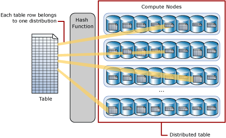
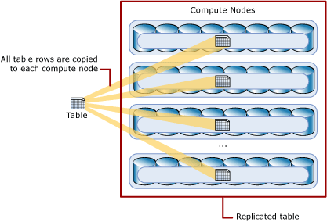

# Azure SQL Data Warehouse - Massively parallel processing (MPP) architecture
Learn how Azure SQL Data Warehouse combines massively parallel processing (MPP) with Azure storage to achieve high performance and scalability. 

> [!VIDEO https://www.youtube.com/embed/PlyQ8yOb8kc]

## MPP architecture components
SQL Data Warehouse leverages a scale out architecture to distribute computational processing of data across multiple nodes. The unit of scale is an abstraction of compute power that is known as a data warehouse unit. SQL Data Warehouse separates compute from storage which enables you to scale compute independently of the data in your system.

SQL Data Warehouse uses a node-based architecture. Applications connect and issue T-SQL commands to a Control node, which is the single point of entry for the data warehouse. The Control node runs the MPP engine which optimizes queries for parallel processing, and then passes operations to Compute nodes to do their work in parallel. The Compute nodes store all user data in Azure Storage and run the parallel queries. The Data Movement Service (DMS) is a system-level internal service that moves data across the nodes as necessary to run queries in parallel and return accurate results. 

With decoupled storage and compute, SQL Data Warehouse can:

* Independently size compute power irrespective of your storage needs.
* Grow or shrink compute power without moving data.
* Pause compute capacity while leaving data intact, so you only pay for storage.
* Resume compute capacity during operational hours.

### Azure storage
SQL Data Warehouse uses Azure storage to keep your user data safe.  Since your data is stored and managed by Azure storage, SQL Data Warehouse charges separately for your storage consumption. The data itself is sharded into **distributions** to optimize the performance of the system. You can choose which sharding pattern to use to distribute the data when you define the table. SQL Data Warehouse supports these sharding patterns:

* Hash
* Round Robin
* Replicate

### Control node

The Control node is the brain of the data warehouse. It is the front end that interacts with all applications and connections. The MPP engine runs on the Control node to optimize and coordinate parallel queries. When you submit a T-SQL query to SQL Data Warehouse, the Control node transforms it into queries that run against each distribution in parallel.

### Compute nodes

The Compute nodes provide the computational power. Distributions map to Compute nodes for processing. As you pay for more compute resources, SQL Data Warehouse re-maps the distributions to the available Compute nodes. The number of compute nodes ranges from 1 to 60, and is determined by the service level for the data warehouse.

Each Compute node has a node ID that is visible in system views. You can see the Compute node ID by looking for the node_id column in system views whose names begin with sys.pdw_nodes. For a list of these system views, see [MPP system views](sql-data-warehouse-reference-tsql-statements.md).

### Data Movement Service
Data Movement Service (DMS) is the data transport technology that coordinates data movement between the Compute nodes. Some queries require data movement to ensure the parallel queries return accurate results. When data movement is required, DMS ensures the right data gets to the right location. 

## Distributions

A distribution is the basic unit of storage and processing for parallel queries that run on distributed data. When SQL Data Warehouse runs a query, the work is divided into 60 smaller queries that run in parallel. Each of the 60 smaller queries runs on one of the data distributions. Each Compute node manages one or more of the 60 distributions. A data warehouse with maximum compute resources has one distribution per Compute node. A data warehouse with minimum compute resources has all the distributions on one compute node.  

## Hash-distributed tables
A hash distributed table can deliver the highest query performance for joins and aggregations on large tables. 

To shard data into a hash-distributed table, SQL Data Warehouse uses a hash function to deterministically assign each row to one distribution. In the table definition, one of the columns is designated as the distribution column. The hash function uses the values in the distribution column to assign each row to a distribution.

The following diagram illustrates how a full (non-distributed table) gets stored as a hash-distributed table. 

  

* Each row belongs to one distribution.  
* A deterministic hash algorithm assigns each row to one distribution.  
* The number of table rows per distribution varies as shown by the different sizes of tables.

There are performance considerations for the selection of a distribution column, such as distinctness, data skew, and the types of queries that run on the system.

## Round-robin distributed tables
A round-robin table is the simplest table to create and delivers fast performance when used as a staging table for loads.

A round-robin distributed table distributes data evenly across the table but without any further optimization. A distribution is first chosen at random and then buffers of rows are assigned to distributions sequentially. It is quick to load data into a round-robin table, but query performance can often be better with hash distributed tables. Joins on round-robin tables require reshuffling data and this takes additional time.

## Replicated Tables
A replicated table provides the fastest query performance for small tables.

A table that is replicated caches a full copy of the table on each compute node. Consequently, replicating a table removes the need to transfer data among compute nodes before a join or aggregation. Replicated tables are best utilized with small tables. Extra storage is required and there are additional overheads that are incurred when writing data which make large tables impractical.  

The following diagram shows a replicated table. For SQL Data Warehouse, the replicated table is cached on the first distribution on each compute node.  

 

## Next steps
Now that you know a bit about SQL Data Warehouse, learn how to quickly [create a SQL Data Warehouse][create a SQL Data Warehouse] and [load sample data][load sample data]. If you are new to Azure, you may find the [Azure glossary][Azure glossary] helpful as you encounter new terminology. Or look at some of these other SQL Data Warehouse Resources.  

* [Customer success stories]
* [Blogs]
* [Feature requests]
* [Videos]
* [Customer Advisory Team blogs]
* [Create support ticket]
* [MSDN forum]
* [Stack Overflow forum]
* [Twitter]

<!--Image references-->
[1]: ./media/sql-data-warehouse-overview-what-is/dwarchitecture.png

<!--Article references-->
[Create support ticket]: ./sql-data-warehouse-get-started-create-support-ticket.md
[load sample data]: ./sql-data-warehouse-load-sample-databases.md
[create a SQL Data Warehouse]: ./sql-data-warehouse-get-started-provision.md
[Migration documentation]: ./sql-data-warehouse-overview-migrate.md
[SQL Data Warehouse solution partners]: ./sql-data-warehouse-partner-business-intelligence.md
[Integrated tools overview]: ./sql-data-warehouse-overview-integrate.md
[Backup and restore overview]: ./sql-data-warehouse-restore-database-overview.md
[Azure glossary]: ../azure-glossary-cloud-terminology.md

<!--MSDN references-->

<!--Other Web references-->
[Customer success stories]: https://azure.microsoft.com/case-studies/?service=sql-data-warehouse
[Blogs]: https://azure.microsoft.com/blog/tag/azure-sql-data-warehouse/
[Customer Advisory Team blogs]: https://blogs.msdn.microsoft.com/sqlcat/tag/sql-dw/
[Feature requests]: https://feedback.azure.com/forums/307516-sql-data-warehouse
[MSDN forum]: https://social.msdn.microsoft.com/Forums/azure/home?forum=AzureSQLDataWarehouse
[Stack Overflow forum]: http://stackoverflow.com/questions/tagged/azure-sqldw
[Twitter]: https://twitter.com/hashtag/SQLDW
[Videos]: https://azure.microsoft.com/documentation/videos/index/?services=sql-data-warehouse
[SLA for SQL Data Warehouse]: https://azure.microsoft.com/support/legal/sla/sql-data-warehouse/v1_0/
[Volume Licensing]: http://www.microsoftvolumelicensing.com/DocumentSearch.aspx?Mode=3&DocumentTypeId=37
[Service Level Agreements]: https://azure.microsoft.com/support/legal/sla/
