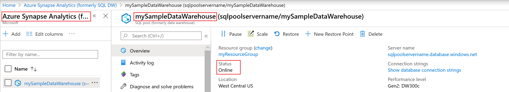
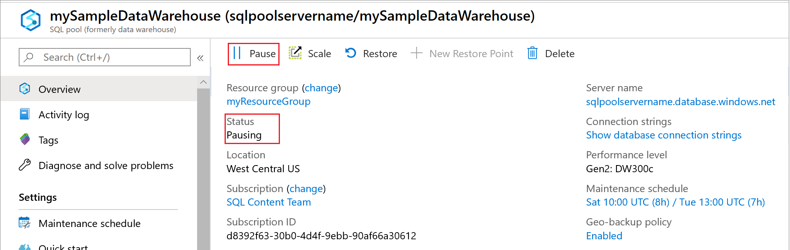
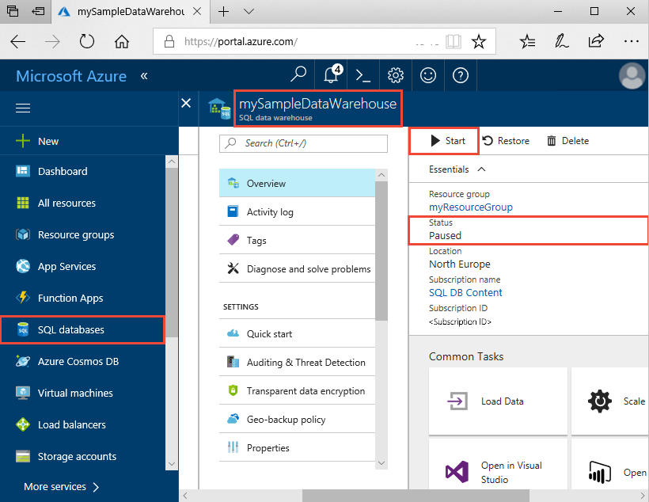
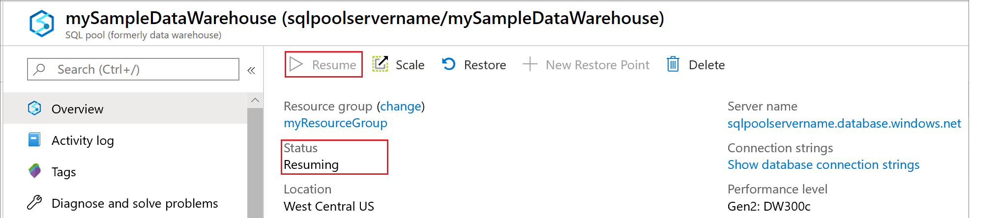
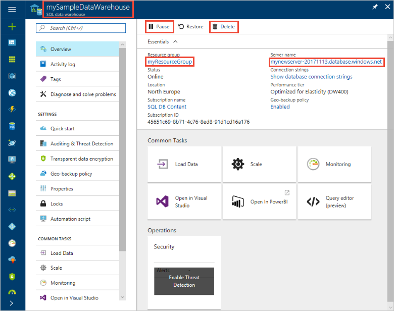

# Quickstart: Pause and resume compute for an Azure SQL Data Warehouse in the Azure portal
Use the Azure portal to pause compute in Azure SQL Data Warehouse to save costs. [Resume compute](sql-data-warehouse-manage-compute-overview.md) when you are ready to use the data warehouse.

If you don't have an Azure subscription, create a [free](https://azure.microsoft.com/free/) account before you begin.

## Sign in to the Azure portal

Sign in to the [Azure portal](https://portal.azure.com/).

## Before you begin

Use [Create and Connect - portal](create-data-warehouse-portal.md) to create a data warehouse called **mySampleDataWarehouse**. 

## Pause compute
To save costs, you can pause and resume compute resources on-demand. For example, if you won't be using the database during the night and on weekends, you can pause it during those times, and resume it during the day. You won't be charged for compute resources while the database is paused. However, you will continue to be charged for storage. 

Follow these steps to pause a SQL data warehouse.

1. Click **SQL databases** in the left page of the Azure portal.
2. Select **mySampleDataWarehouse** from the **SQL databases** page. This opens the data warehouse. 
3. On the **mySampleDataWarehouse** page, notice **Status** is **Online**.

    

4. To pause the data warehouse, click the **Pause** button. 
5. A confirmation question appears asking if you want to continue. Click **Yes**.
6. Wait a few moments, and then notice the **Status** is **Pausing**.

    

7. When the pause operation is complete, the status is **Paused** and the option button is **Start**.
8. The compute resources for the data warehouse are now offline. You won't be charged for compute until you resume the service.

    

## Resume compute
Follow these steps to resume a SQL data warehouse.

1. Click **SQL databases** in the left page of the Azure portal.
2. Select **mySampleDataWarehouse** from the **SQL databases** page. This opens the data warehouse. 
3. On the **mySampleDataWarehouse** page, notice **Status** is **Paused**.

    

4. To resume the data warehouse, click **Start**. 
5. A confirmation question appears asking if you want to start. Click **Yes**.
6. Notice the **Status** is **Resuming**.

    

7. When the data warehouse is back online, the status is **Online** and the option button is **Pause**.
8. The compute resources for the data warehouse are now online and you can use the service. Charges for compute have resumed.

    

## Clean up resources

You are being charged for data warehouse units and the data stored in your data warehouse. These compute and storage resources are billed separately. 

- If you want to keep the data in storage, pause compute.
- If you want to remove future charges, you can delete the data warehouse. 

Follow these steps to clean up resources as you desire.

1. Sign in to the [Azure portal](https://portal.azure.com), and click on your data warehouse.

    

1. To pause compute, click the **Pause** button. When the data warehouse is paused, you see a **Start** button.  To resume compute, click **Start**.

2. To remove the data warehouse so you are not charged for compute or storage, click **Delete**.

3. To remove the SQL server you created, click **mynewserver-20171113.database.windows.net**, and then click **Delete**.  Be careful with this deletion, since deleting the server also deletes all databases assigned to the server.

4. To remove the resource group, click **myResourceGroup**, and then click **Delete resource group**.

## Next steps
You have now paused and resumed compute for your data warehouse. To learn more about Azure SQL Data Warehouse, continue to the tutorial for loading data.

> [!div class="nextstepaction"]
>[Load data into a SQL data warehouse](load-data-from-azure-blob-storage-using-polybase.md)
