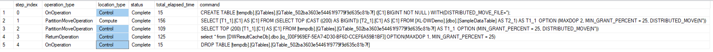

# Performance tuning with result set caching  
When result set caching is enabled, Azure SQL Data Warehouse automatically caches query results in the user database for repetitive use.  This allows subsequent query executions to get results directly from the persisted cache so recomputation is not needed.   Result set caching improves query performance and reduces compute resource usage.  In addition, queries using cached results set do not use any concurrency slots and thus do not count against existing concurrency limits. For security, users can only access the cached results if they have the same data access permissions as the users creating the cached results.  

## Key commands
[Turn ON/OFF result set caching for a user database](https://docs.microsoft.com/sql/t-sql/statements/alter-database-transact-sql-set-options?view=azure-sqldw-latest)

[Turn ON/OFF result set caching for a session](https://docs.microsoft.com/sql/t-sql/statements/set-result-set-caching-transact-sql?view=azure-sqldw-latest)

[Check the size of cached result set](https://docs.microsoft.com/sql/t-sql/database-console-commands/dbcc-showresultcachespaceused-transact-sql?view=azure-sqldw-latest)  

[Clean up the cache](https://docs.microsoft.com/sql/t-sql/database-console-commands/dbcc-dropresultsetcache-transact-sql?view=azure-sqldw-latest)

## What's not cached  

Once result set caching is turned ON for a database, results are cached for all queries until the cache is full, except for these queries:
- Queries using non-deterministic functions such as DateTime.Now()
- Queries using user defined functions
- Queries using tables with row level security or column level security enabled
- Queries returning data with row size larger than 64KB

> [!IMPORTANT]
> The operations to create result set cache and retrieve data from the cache happen on the control node of a data warehouse instance. 
> When result set caching is turned ON, running queries that return large result set (for example, >1 million rows) can cause high CPU usage on the control node and slow down the overall query response on the instance.  Those queries are commonly used during data exploration or ETL operations. To avoid stressing the control node and cause performance issue, users should turn OFF result set caching on the database before running those types of queries.  

Run this query for the time taken by result set caching operations for a query:

```sql
SELECT step_index, operation_type, location_type, status, total_elapsed_time, command 
FROM sys.dm_pdw_request_steps 
WHERE request_id  = <'request_id'>; 
```

Here is an example output for a query executed with result set caching disabled.


Here is an example output for a query executed with result set caching enabled.



## When cached results are used

Cached result set is reused for a query if all of the following requirements are all met:
- The user who's running the query has access to all the tables referenced in the query.
- There is an exact match between the new query and the previous query that generated the result set cache.
- There is no data or schema changes in the tables where the cached result set was generated from.

Run this command to check if a query was executed with a result cache hit or miss. If there is a cache hit, the result_cache_hit will return 1.

```sql
SELECT request_id, command, result_cache_hit FROM sys.dm_pdw_exec_requests 
WHERE request_id = <'Your_Query_Request_ID'>
```

## Manage cached results 

The maximum size of result set cache is 1 TB per database.  The cached results are automatically invalidated when the underlying query data change.  

The cache eviction is managed by Azure SQL Data Warehouse automatically following this schedule: 
- Every 48 hours if the result set hasn't been used or has been invalidated. 
- When the result set cache approaches the maximum size.

Users can manually empty the entire result set cache by using one of these options: 
- Turn OFF the result set cache feature for the database 
- Run DBCC DROPRESULTSETCACHE while connected to the database

Pausing a database won't empty cached result set.  

## Next steps
For more development tips, see [SQL Data Warehouse development overview](sql-data-warehouse-overview-develop.md). 
