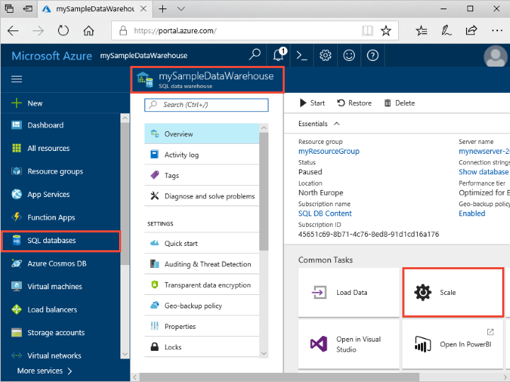
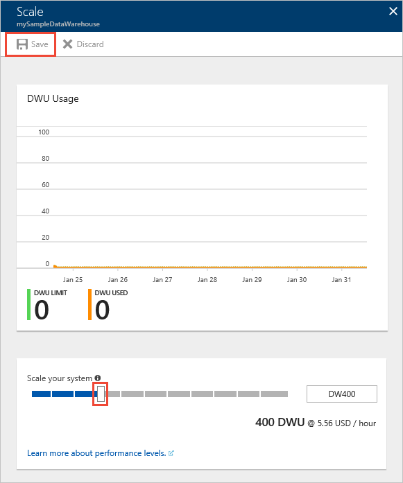

# Quickstart: Scale compute in SQL pool in the Azure portal

Scale compute in SQL pool in the Azure portal. [Scale out compute](sql-data-warehouse-manage-compute-overview.md) for better performance, or scale back compute to save costs. 

If you don't have an Azure subscription, create a [free](https://azure.microsoft.com/free/) account before you begin.

## Sign in to the Azure portal

Sign in to the [Azure portal](https://portal.azure.com/).

## Before you begin

You can scale a SQL pool that you already have, or use [Quickstart: create and connect - portal](create-data-warehouse-portal.md) to create a SQL pool named **mySampleDataWarehouse**.  This quickstart scales **mySampleDataWarehouse**.

>[!Note]
>Your SQL pool must be online to scale. 

## Scale compute

SQL pool compute resources can be scaled by increasing or decreasing data warehouse units. The [create and connect - portal] quickstart(create-data-warehouse-portal.md) created **mySampleDataWarehouse** and initialized it with 400 DWUs. The following steps adjust the DWUs for **mySampleDataWarehouse**.

To change data warehouse units:

1. Click **Azure Synapse Analytics (formerly SQL DW)** in the left page of the Azure portal.
2. Select **mySampleDataWarehouse** from the **Azure Synapse Analytics (formerly SQL DW)** page. The SQL pool opens.
3. Click **Scale**.

    

2. In the Scale panel, move the slider left or right to change the DWU setting. Then select scale.

    

## Next steps
You've now learned to scale compute for SQL pool. To learn more about SQL pool, continue to the tutorial for loading data.

> [!div class="nextstepaction"]
>[Load data into SQL pool](load-data-from-azure-blob-storage-using-polybase.md)
