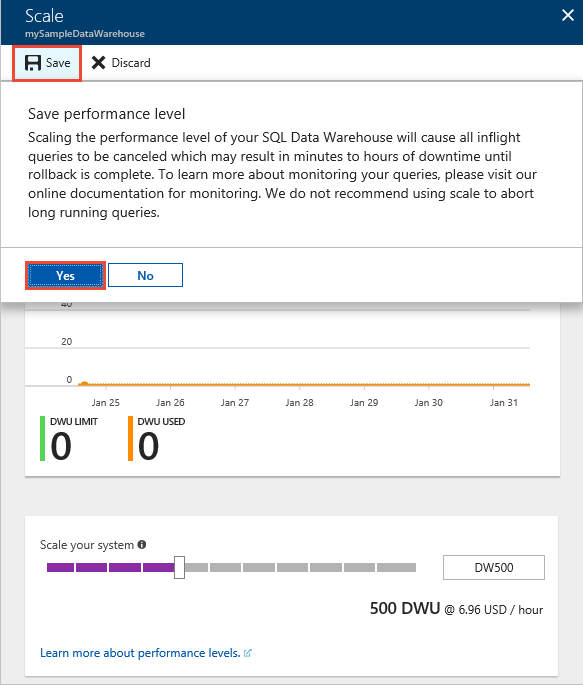

# Quickstart: Scale compute in Azure SQL Data Warehouse in the Azure portal

Scale compute in Azure SQL Data Warehouse in the Azure portal. [Scale out compute](sql-data-warehouse-manage-compute-overview.md) for better performance, or scale back compute to save costs. 

If you don't have an Azure subscription, create a [free](https://azure.microsoft.com/free/) account before you begin.

## Sign in to the Azure portal

Sign in to the [Azure portal](https://portal.azure.com/).

## Before you begin

You can scale a data warehouse that you already have, or use [Quickstart: create and Connect - portal](create-data-warehouse-portal.md) to create a data warehouse named **mySampleDataWarehouse**.  This quickstart scales **mySampleDataWarehouse**.

## Scale compute

In SQL Data Warehouse, you can increase or decrease compute resources by adjusting data warehouse units. The [Create and Connect - portal](create-data-warehouse-portal.md) created **mySampleDataWarehouse** and initialized it with 400 DWUs. The following steps adjust the DWUs for **mySampleDataWarehouse**.

To change data warehouse units:

1. Click **SQL databases** in the left page of the Azure portal.
2. Select **mySampleDataWarehouse** from the **SQL databases** page. The data warehouse opens.
3. Click **Scale**.

    

2. In the Scale panel, move the slider left or right to change the DWU setting.

    

3. Click **Save**. A confirmation message appears. Click **yes** to confirm or **no** to cancel.

    

## Next steps
You have now learned how to scale compute for your data warehouse. To learn more about Azure SQL Data Warehouse, continue to the tutorial for loading data.

> [!div class="nextstepaction"]
>[Load data into a SQL data warehouse](load-data-from-azure-blob-storage-using-polybase.md)
