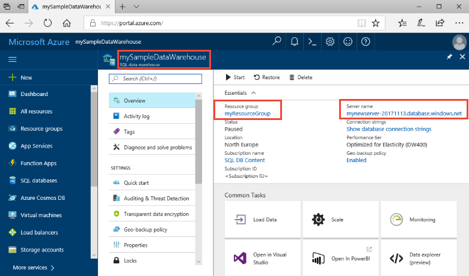

# Quickstart: Scale compute in Azure SQL Data Warehouse in PowerShell

Scale compute in Azure SQL Data Warehouse in PowerShell. [Scale out compute](sql-data-warehouse-manage-compute-overview.md) for better performance, or scale back compute to save costs.

If you don't have an Azure subscription, create a [free](https://azure.microsoft.com/free/) account before you begin.

This tutorial requires Azure PowerShell module version 5.1.1 or later. Run `Get-Module -ListAvailable AzureRM` to find the version you have currently. If you need to install or upgrade, see [Install Azure PowerShell module](/powershell/azure/install-azurerm-ps.md).

## Before you begin

This quickstart assumes you already have a SQL data warehouse that you can scale. If you need to create one, use [Create and Connect - portal](create-data-warehouse-portal.md) to create a data warehouse called **mySampleDataWarehouse**.

## Log in to Azure

Log in to your Azure subscription using the [Connect-AzureRmAccount](/powershell/module/azurerm.profile/connect-azurermaccount) command and follow the on-screen directions.

```powershell
Connect-AzureRmAccount
```

To see which subscription you are using, run [Get-AzureRmSubscription](/powershell/module/azurerm.profile/get-azurermsubscription).

```powershell
Get-AzureRmSubscription
```

If you need to use a different subscription than the default, run [Select-AzureRmSubscription](/powershell/module/azurerm.profile/select-azurermsubscription).

```powershell
Select-AzureRmSubscription -SubscriptionName "MySubscription"
```

## Look up data warehouse information

Locate the database name, server name, and resource group for the data warehouse you plan to pause and resume.

Follow these steps to find location information for your data warehouse.

1. Sign in to the [Azure portal](https://portal.azure.com/).
2. Click **SQL data warehouses** in the left page of the Azure portal.
3. Select **mySampleDataWarehouse** from the **SQL data warehouses** page. This opens the data warehouse.

    

4. Write down the data warehouse name, which will be used as the database name. Remember, a data warehouse is one type of database. Also write down the server name, and the resource group. You will use these in the pause and resume commands.
5. If your server is foo.database.windows.net, use only the first part as the server name in the PowerShell cmdlets. In the preceding image, the full server name is newserver-20171113.database.windows.net. We use **newserver-20180430** as the server name in the PowerShell cmdlet.

## Scale compute

In SQL Data Warehouse, you can increase or decrease compute resources by adjusting data warehouse units. The [Create and Connect - portal](create-data-warehouse-portal.md) created **mySampleDataWarehouse** and initialized it with 400 DWUs. The following steps adjust the DWUs for **mySampleDataWarehouse**.

To change data warehouse units, use the [Set-AzureRmSqlDatabase](/powershell/module/azurerm.sql/set-azurermsqldatabase) PowerShell cmdlet. The following example sets the data warehouse units to DW300 for the database **mySampleDataWarehouse** which is hosted in the Resource group **myResourceGroup** on server **mynewserver-20180430**.

```Powershell
Set-AzureRmSqlDatabase -ResourceGroupName "myResourceGroup" -DatabaseName "mySampleDataWarehouse" -ServerName "mynewserver-20171113" -RequestedServiceObjectiveName "DW300"
```

## Check data warehouse state

To see the current state of the data warehouse, use the [Get-AzureRmSqlDatabase](/powershell/module/azurerm.sql/get-azurermsqldatabase) PowerShell cmdlet. This gets the state of the **mySampleDataWarehouse** database in ResourceGroup **myResourceGroup** and server **mynewserver-20180430.database.windows.net**.

```powershell
$database = Get-AzureRmSqlDatabase -ResourceGroupName myResourceGroup -ServerName mynewserver-20171113 -DatabaseName mySampleDataWarehouse
$database
```

Which will result in something like this:

```powershell
ResourceGroupName             : myResourceGroup
ServerName                    : mynewserver-20171113
DatabaseName                  : mySampleDataWarehouse
Location                      : North Europe
DatabaseId                    : 34d2ffb8-b70a-40b2-b4f9-b0a39833c974
Edition                       : DataWarehouse
CollationName                 : SQL_Latin1_General_CP1_CI_AS
CatalogCollation              :
MaxSizeBytes                  : 263882790666240
Status                        : Online
CreationDate                  : 11/20/2017 9:18:12 PM
CurrentServiceObjectiveId     : 284f1aff-fee7-4d3b-a211-5b8ebdd28fea
CurrentServiceObjectiveName   : DW300
RequestedServiceObjectiveId   : 284f1aff-fee7-4d3b-a211-5b8ebdd28fea
RequestedServiceObjectiveName :
ElasticPoolName               :
EarliestRestoreDate           :
Tags                          :
ResourceId                    : /subscriptions/xxxxxxxx-xxxx-xxxx-xxxx-xxxxxxxxxxxx/
                                resourceGroups/myResourceGroup/providers/Microsoft.Sql/servers/mynewserver-20171113/databases/mySampleDataWarehouse
CreateMode                    :
ReadScale                     : Disabled
ZoneRedundant                 : False
```

You can see the **Status** of the database in the output. In this case, you can see that this database is online.  When you run this command, you should receive a Status value of Online, Pausing, Resuming, Scaling, or Paused.

To see the status by itself, use the following command:

```powershell
$database | Select-Object DatabaseName,Status
```

## Next steps
You have now learned how to scale compute for your data warehouse. To learn more about Azure SQL Data Warehouse, continue to the tutorial for loading data.

> [!div class="nextstepaction"]
>[Load data into a SQL data warehouse](load-data-from-azure-blob-storage-using-polybase.md)
