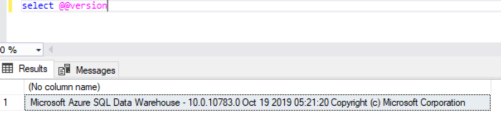

# Azure SQL Data Warehouse release notes

This article summarizes the new features and improvements in the recent releases of [Azure SQL Data Warehouse](sql-data-warehouse-overview-what-is.md) (Azure SQL DW). The article also lists notable content updates that aren't directly related to the release but published in the same time frame. For improvements to other Azure services, see [Service updates](https://azure.microsoft.com/updates).

## Check your Azure SQL Data Warehouse version

As new features are rolled out to all regions, check the version deployed to your instance and the latest Azure SQL DW release notes for feature availability. To check your Azure SQL DW version, connect to your data warehouse via SQL Server Management Studio (SSMS) and run `SELECT @@VERSION;` to return the current version of Azure SQL DW.

Sample output:

Use the version identified to confirm which release has been applied to your Azure SQL DW.

## January 2020

| Service improvements | Details |
| --- | --- |
|**Workload Management Portal Metrics (Preview)**|With the release of [Workload Isolation](/azure/sql-data-warehouse/sql-data-warehouse-workload-isolation) for preview this past October, users can create their own [workload groups](/sql/t-sql/statements/create-workload-group-transact-sql?view=azure-sqldw-latest) to efficiently manage system resources and ensure business SLAs are met.  As part of the overall [workload management](/azure/sql-data-warehouse/sql-data-warehouse-workload-management) enhancements for Azure Synapse Analytics, new [workload management monitoring metrics](/azure/sql-data-warehouse/sql-data-warehouse-workload-management-portal-monitor) are now available.    Monitoring your workload now has greater insights with the following metrics:   - Effective cap resource percent    - Effective min resource percent   - Workload group active queries   - Workload group allocation by max resource percent   - Workload group allocation by system percent   - Workload group query timeouts   - Workload group queued queries    Use these metrics to identify [workload group bottlenecks](/azure/sql-data-warehouse/sql-data-warehouse-workload-management-portal-monitor#workload-group-bottleneck) or workload groups that are configured with [underutilized workload isolation](/azure/sql-data-warehouse/sql-data-warehouse-workload-management-portal-monitor#underutilized-workload-isolation).  These metrics can be used in the Azure Portal that allows splitting by workload group.  Filter and pin your favorite graphs to a dashboard for quick access to insights.|
|**Portal Monitoring Metrics**| The following metrics were added to the portal for monitoring overall query activity:   - Active queries   - Queued queries    These metrics are described along with the existing metrics in the [Monitoring resource utilization and query activity documentation](/azure/sql-data-warehouse/sql-data-warehouse-concept-resource-utilization-query-activity).|

## October 2019

| Service improvements | Details |
| --- | --- |
|**Copy (Preview)**|We are excited to announce the public preview of a simple and flexible COPY statement for data ingestion. With only one statement, you can now seamlessly ingest data with additional flexibility and without requiring high privileged users. For more information, see [COPY command documentation](/sql/t-sql/statements/copy-into-transact-sql?view=azure-sqldw-latest).|
|**Workload Isolation (Preview)**|To support customers as they democratize their data warehouses, we are announcing new features for intelligent workload management. The new [Workload Isolation](/azure/sql-data-warehouse/sql-data-warehouse-workload-isolation) functionality allows you to manage the execution of heterogeneous workloads while providing flexibility and control over data warehouse resources. This leads to improved execution predictability and enhances the ability to satisfy predefined SLAs.  In addition to workload isolation, additional options are now available for [Workload Classification](/azure/sql-data-warehouse/sql-data-warehouse-workload-classification).  Beyond login classification, the [Create Workload Classifier](/sql/t-sql/statements/create-workload-classifier-transact-sql?view=azure-sqldw-latest) syntax provides the capability to classify requests based on query label, session context and time of day.|
|**PREDICT (Preview)**|You can now score machine learning models within your data warehouse avoiding the need for large and complex data movement. The T-SQL PREDICT function relies on open model framework and takes data and machine learning model as input to generate predictions.
|**SSDT CI/CD (GA)**|Today we are excited to announce the General Availability of the [highest requested feature](https://feedback.azure.com/forums/307516-sql-data-warehouse/suggestions/13313247--in-preview-database-project-from-visual-studio-t) for SQL Data Warehouse – SQL Server Data Tools (SSDT) Database projects. This release includes support for SSDT with Visual Studio 2019 along with native platform integration with Azure DevOps providing built-in continuous integration and deployment (CI/CD) capabilities for enterprise level deployments. |
|**Materialized View (GA)**|A Materialized View persists the data returned from the view definition query and automatically gets updated as data changes in the underlying tables. It improves the performance of complex queries (typically queries with joins and aggregations) while offering simple maintenance operations. For more information, see [Performance tuning with materialized views](/azure/sql-data-warehouse/performance-tuning-materialized-views).  Install [SQL Server Management Studio 18.4 or later](https://docs.microsoft.com/sql/ssms/download-sql-server-management-studio-ssms?view=sql-server-ver15) for scripting Materialized Views.|
|**Dynamic Data Masking (GA)**|Dynamic Data Masking (DDM) prevents unauthorized access to your sensitive data in your data warehouse by obfuscating it on-the-fly in the query results, based on the masking rules you define. For more information, see [SQL Database dynamic data masking](/azure/sql-database/sql-database-dynamic-data-masking-get-started).|
|**Read Committed Snapshot Isolation  (GA)**|You can use ALTER DATABSE to enable or disable snapshot isolation for a user database. To avoid impact to your current workload, you may want to set this option during database maintenance window or wait until there is no other active connection to the database. For more information, see [Alter database set options](/sql/t-sql/statements/alter-database-transact-sql-set-options?view=azure-sqldw-latest).|
|**Ordered Clustered Columnstore Index (GA)**|Columnstore is a key enabler for storing and efficiently querying large amounts of data. Ordered clustered columnstore indexes further optimize query execution by enabling efficient segment elimination.   For more information, see [Performance tuning with ordered clustered columnstore index](/azure/sql-data-warehouse/performance-tuning-ordered-cci).|
|**Result Set Caching (GA)**|When result set caching is enabled, Azure SQL Data Warehouse automatically caches query results in the user database for repetitive use. This allows subsequent query executions to get results directly from the persisted cache so recomputation is not needed. Result set caching improves query performance and reduces compute resource usage. In addition, queries using cached results set do not use any concurrency slots and thus do not count against existing concurrency limits. For security, users can only access the cached results if they have the same data access permissions as the users creating the cached results. For more information, see [Performance tuning with result set caching](/azure/sql-data-warehouse/performance-tuning-result-set-caching). Applies to version 10.0.10783.0 or higher.|

## September 2019

| Service improvements | Details |
| --- | --- |
|**Azure Private Link (Preview)**|With [Azure Private Link](https://azure.microsoft.com/blog/announcing-azure-private-link/), you can create a private endpoint in your Virtual Network (VNet) and map it to your Azure SQL DW. These resources are then accessible over a private IP address in your VNet, enabling connectivity from on-premises through Azure ExpressRoute private peering and/or VPN gateway. Overall, this simplifies the network configuration by not requiring you to open it up to public IP addresses. This also enables protection against data exfiltration risks. For more details, see [overview](/azure/private-link/private-link-overview) and [SQL DW documentation](/azure/sql-database/sql-database-private-endpoint-overview).|
|**Data Discovery & Classification (GA)**|[Data discovery and classification](/azure/sql-database/sql-database-data-discovery-and-classification?toc=/azure/sql-data-warehouse/toc.json) feature is now Generally Available. This feature provides advanced capabilities for **discovering, classifying, labeling & protecting** sensitive data in your databases.|
|**Azure Advisor one-click Integration**|SQL Data Warehouse now directly integrates with Azure Advisor recommendations in the overview blade along with providing a one-click experience. You can now discover recommendations in the overview blade instead of navigating to the Azure advisor blade. Find out more about recommendations [here](sql-data-warehouse-concept-recommendations.md).|
|**Read Committed Snapshot Isolation (Preview)**|You can use ALTER DATABSE to enable or disable snapshot isolation for a user database.  To avoid impact to your current workload, you may want to set this option during database maintenance window or wait until there is no other active connection to the database. For more information, see [Alter database set options](/sql/t-sql/statements/alter-database-transact-sql-set-options?view=azure-sqldw-latest).|
|**EXECUTE AS (Transact-SQL)**| [EXECUTE AS](/sql/t-sql/statements/execute-as-transact-sql?view=azure-sqldw-latest) T-SQL support is now available in SQL Data Warehouse enabling customers to set the execution context of a session to the specified user.|
|**Additional T-SQL support**|The T-SQL language surface area for SQL Data Warehouse has been extended to include support for:   - [FORMAT (Transact-SQL)](/sql/t-sql/functions/format-transact-sql?view=azure-sqldw-latest)  - [TRY_PARSE (Transact-SQL)](/sql/t-sql/functions/try-parse-transact-sql?view=azure-sqldw-latest)  - [TRY_CAST (Transact-SQL)](/sql/t-sql/functions/try-cast-transact-sql?view=azure-sqldw-latest)  - [TRY_CONVERT (Transact-SQL)](/sql/t-sql/functions/try-convert-transact-sql?view=azure-sqldw-latest)  - [sys.user_token (Transact-SQL)](/sql//relational-databases/system-catalog-views/sys-user-token-transact-sql?view=azure-sqldw-latest)|

## July 2019

| Service improvements | Details |
| --- | --- |
|**Materialized View (Preview)**|A Materialized View persists the data returned from the view definition query and automatically gets updated as data changes in the underlying tables. It improves the performance of complex queries (typically queries with joins and aggregations) while offering simple maintenance operations. For more information, see:   - [CREATE MATERIALIZED VIEW AS SELECT &#40;Transact-SQL&#41;](/sql/t-sql/statements/create-materialized-view-as-select-transact-sql?view=azure-sqldw-latest)  - [ALTER MATERIALIZED VIEW &#40;Transact-SQL&#41;](/sql/t-sql/statements/alter-materialized-view-transact-sql?view=azure-sqldw-latest)   - [T-SQL statements supported in Azure SQL Data Warehouse](/azure/sql-data-warehouse/sql-data-warehouse-reference-tsql-statements)|
|**Additional T-SQL support**|The T-SQL language surface area for SQL Data Warehouse has been extended to include support for:   - [AT TIME ZONE (Transact-SQL)](/sql/t-sql/queries/at-time-zone-transact-sql?view=azure-sqldw-latest)  - [STRING_AGG (Transact-SQL)](/sql/t-sql/functions/string-agg-transact-sql?view=azure-sqldw-latest)|
|**Result set caching (Preview)**|DBCC commands added to manage the previously announced result set cache. For more information, see:   - [DBCC DROPRESULTSETCACHE &#40;Transact-SQL&#41;](/sql/t-sql/database-console-commands/dbcc-dropresultsetcache-transact-sql?view=azure-sqldw-latest)    - [DBCC SHOWRESULTCACHESPACEUSED &#40;Transact-SQL&#41;](/sql/t-sql/database-console-commands/dbcc-showresultcachespaceused-transact-sql?view=azure-sqldw-latest)    Also see the new result_set_cache column in [sys.dm_pdw_exec_requests](/sql/relational-databases/system-dynamic-management-views/sys-dm-pdw-exec-requests-transact-sql?view=azure-sqldw-latest) that shows when an executed query used the result set cache.|
|**Ordered clustered columnstore index (Preview)**|New column, column_store_order_ordinal, added to [sys.index_columns](/sql/relational-databases/system-catalog-views/sys-index-columns-transact-sql?view=azure-sqldw-latest) to identify the order of columns in an ordered clustered columnstore index.|

## May 2019

| Service improvements | Details |
| --- | --- |
|**Dynamic data masking (Preview)**|Dynamic Data Masking (DDM) prevents unauthorized access to your sensitive data in your data warehouse by obfuscating it on-the-fly in the query results, based on the masking rules you define. For more information, see [SQL Database dynamic data masking](/azure/sql-database/sql-database-dynamic-data-masking-get-started).|
|**Workload importance now Generally Available**|Workload Management Classification and Importance provide the ability to influence the run order of queries. For more information on workload importance, see the [Classification](sql-data-warehouse-workload-classification.md) and [Importance](sql-data-warehouse-workload-importance.md) overview articles in the documentation. Check out the [CREATE WORKLOAD CLASSIFIER](/sql/t-sql/statements/create-workload-classifier-transact-sql?view=azure-sqldw-latest) doc as well.  See workload importance in action in the below videos:  -[Workload Management concepts](https://www.youtube.com/embed/QcCRBAhoXpM)  -[Workload Management scenarios](https://www.youtube.com/embed/_2rLMljOjw8)|
|**Additional T-SQL support**|The T-SQL language surface area for SQL Data Warehouse has been extended to include support for:   - [TRIM](/sql/t-sql/functions/trim-transact-sql?view=azure-sqldw-latest)|
|**JSON functions**|Business analysts can now use familiar T-SQL language to query and manipulate documents that are formatted as JSON data using the following new JSON functions in Azure Data Warehouse:  - [ISJSON](/sql/t-sql/functions/isjson-transact-sql?view=azure-sqldw-latest)  - [JSON_VALUE](/sql/t-sql/functions/json-value-transact-sql?view=azure-sqldw-latest)  -  [JSON_QUERY](/sql/t-sql/functions/json-query-transact-sql?view=azure-sqldw-latest)  -  [JSON_MODIFY](/sql/t-sql/functions/json-modify-transact-sql?view=azure-sqldw-latest)  - [OPENJSON](/sql/t-sql/functions/openjson-transact-sql?view=azure-sqldw-latest)|
|**Result set caching (Preview)**|Result-set caching enables instant query response times while reducing time-to-insight for business analysts and reporting users. For more information, see:  - [ALTER DATABASE (Transact-SQL)](/sql/t-sql/statements/alter-database-transact-sql?view=azure-sqldw-latest)  - [ALTER DATABASE SET Options (Transact SQL)](/sql/t-sql/statements/alter-database-transact-sql-set-options?view=azure-sqldw-latest)  - [SET RESULT SET CACHING (Transact-SQL)](/sql/t-sql/statements/set-result-set-caching-transact-sql?view=azure-sqldw-latest)  - [SET Statement (Transact-SQL)](/sql/t-sql/statements/set-statements-transact-sql)  - [sys.databases (Transact-SQL)](/sql/relational-databases/system-catalog-views/sys-databases-transact-sql?view=azure-sqldw-latest)|
|**Ordered clustered columnstore index (Preview)**|Columnstore is a key enabler for storing and efficiently querying large amounts of data. For each table, it divides the incoming data into Row Groups and each column of a Row Group forms a Segment on a disk.  Ordered clustered columnstore indexes further optimize query execution by enabling efficient segment elimination.   For more information, see:  -  [CREATE TABLE (Azure SQL Data Warehouse)](/sql/t-sql/statements/create-table-azure-sql-data-warehouse?view=azure-sqldw-latest)  -  [CREATE COLUMNSTORE INDEX (Transact-SQL)](/sql/t-sql/statements/create-columnstore-index-transact-sql?view=azure-sqldw-latest).|

## March 2019

| Service improvements | Details |
| --- | --- |
|**Data Discovery & Classification**|Data Discovery & Classification is now available in public preview for Azure SQL Data Warehouse. It’s critical to protect sensitive data and the privacy of your customers. As your business and customer data assets grow, it becomes unmanageable to discover, classify, and protect your data. The data discovery and classification feature that we’re introducing natively with Azure SQL Data Warehouse helps make protecting your data more manageable. The overall benefits of this capability are: &bull; &nbsp; Meeting data privacy standards and regulatory compliance requirements. &bull; &nbsp; Restricting access to and hardening the security of data warehouses containing highly sensitive data. &bull; &nbsp; Monitoring and alerting on anomalous access to sensitive data. &bull; &nbsp; Visualization of sensitive data in a central dashboard on the Azure portal.   Data Discovery & Classification is available for Azure SQL Data Warehouse in all Azure regions, It's part of Advanced Data Security including Vulnerability Assessment and Threat Detection. For more information about Data Discovery & Classification, see the [blog post](https://azure.microsoft.com/blog/announcing-public-preview-of-data-discovery-classification-for-microsoft-azure-sql-data-warehouse/) and our online [documentation](/azure/sql-database/sql-database-data-discovery-and-classification).|
|**GROUP BY ROLLUP**|ROLLUP is now a supported GROUP BY option in Azure Data Warehouse.   GROUP BY ROLLUP creates a group for each combination of column expressions. GROUP BY also "rolls up" the results into subtotals and grand totals. The GROUP BY function processes from right to left, decreasing the number of column expressions over which it creates groups and aggregation(s).  The column order affects the ROLLUP output and can affect the number of rows in the result set.  For more information on GROUP BY ROLLUP, see  [GROUP BY (Transact-SQL)](/sql/t-sql/queries/select-group-by-transact-sql?view=azure-sqldw-latest)
|**Improved accuracy for DWU used and CPU portal metrics**|SQL Data Warehouse significantly enhances metric accuracy in the Azure portal.  This release includes a fix to the CPU and DWU Used metric definition to properly reflect your workload across all compute nodes. Before this fix, metric values were being underreported. Expect to see an increase in the DWU used and CPU metrics in the Azure portal. |
|**Row Level Security**|We introduced Row-level Security capability back in Nov 2017. We’ve now extended this support to external tables as well. Additionally, we’ve added support for calling non-deterministic functions in the inline table-valued functions (inline TVFs) required for defining a security filter predicate. This addition allows you to specify IS_ROLEMEMBER(), USER_NAME() etc. in the security filter predicate. For more information, please see the examples in the [Row-level Security documentation](/sql/relational-databases/security/row-level-security).|
|**Additional T-SQL Support**|The T-SQL language surface area for SQL Data Warehouse has been extended to include support for [STRING_SPLIT (Transact-SQL)](/sql/t-sql/functions/string-split-transact-sql).
|**Query Optimizer enhancements** |Query optimization is a critical component of any database. Making optimal choices on how to best execute a query can yield significant improvements.  When executing complex analytical queries in a distributed environment, the number of operations executed matters. Query performance has been enhanced by producing better quality plans. These plans minimize expensive data transfer operations and redundant computations such as, repeated subqueries. For more information, see this Azure SQL Data Warehouse [blog post](https://azure.microsoft.com/blog/smarter-faster-safer-azure-sql-data-warehouse-is-simply-unmatched/).|
| | |

### Documentation improvements

| Documentation improvements | Details |
| --- | --- |
| | |

## January 2019

### Service improvements

| Service improvements | Details |
| --- | --- |
|**Return Order By Optimization**|SELECT…ORDER BY queries get a performance boost in this release.   Now, all compute nodes send their results to a single compute node. This node merges and sorts the results and returns them to the user.  Merging through a single compute node results in a significant performance gain when the query result set contains a large number of rows. Previously, the query execution engine would order results on each compute node. The results would them be streamed to the control node. The control node would then merge the results.|
|**Data Movement Enhancements for PartitionMove and BroadcastMove**|In Azure SQL Data Warehouse Gen2, data movement steps of type ShuffleMove, use instant data movement techniques.  For more information, see [performance enhancements blog](https://azure.microsoft.com/blog/lightning-fast-query-performance-with-azure-sql-data-warehouse/). With this release, PartitionMove and BroadcastMove are now powered by the same instant data movement techniques. User queries that use these types of data movement steps will run with improved performance. No code change is required to take advantage of these performance improvements.|
|**Notable Bugs**|Incorrect Azure SQL Data Warehouse version - `SELECT @@VERSION` may return the incorrect version, 10.0.9999.0. The correct version for the current release is 10.0.10106.0. This bug has been reported and is under review.
| | |

### Documentation improvements

| Documentation improvements | Details |
| --- | --- |
|none | |
| | |

## December 2018

### Service improvements

| Service improvements | Details |
| --- | --- |
|**Virtual Network Service Endpoints Generally Available**|This release includes general availability of Virtual Network (VNet) Service Endpoints for Azure SQL Data Warehouse in all Azure regions. VNet Service Endpoints enable you to isolate connectivity to your logical server from a given subnet or set of subnets within your virtual network. The traffic to Azure SQL Data Warehouse from your VNet will always stay within the Azure backbone network. This direct route will be preferred over any specific routes that take Internet traffic through virtual appliances or on-premises. No additional billing is charged for virtual network access through service endpoints. Current pricing model for [Azure SQL Data Warehouse](https://azure.microsoft.com/pricing/details/sql-data-warehouse/gen2/) applies as is.  With this release, we also enabled PolyBase connectivity to [Azure Data Lake Storage Gen2](https://docs.microsoft.com/azure/storage/blobs/data-lake-storage-introduction) (ADLS) via [Azure Blob File System](https://docs.microsoft.com/azure/storage/blobs/data-lake-storage-abfs-driver) (ABFS) driver. Azure Data Lake Storage Gen2 brings all the qualities that are required for the complete lifecycle of analytics data to Azure Storage. Features of the two existing Azure storage services, Azure Blob Storage and Azure Data Lake Storage Gen1 are converged. Features from [Azure Data Lake Storage Gen1](https://docs.microsoft.com/azure/data-lake-store/index), such as file system semantics, file-level security, and scale are combined with low-cost, tiered storage, and high availability/disaster recovery capabilities from [Azure Blob Storage](https://docs.microsoft.com/azure/storage/blobs/storage-blobs-introduction).  Using Polybase you can also import data into Azure SQL Data Warehouse from Azure Storage secured to VNet. Similarly, exporting data from Azure SQL Data Warehouse to Azure Storage secured to VNet is also supported via Polybase.  For more information on VNet Service Endpoints in Azure SQL Data Warehouse, refer to the [blog post](https://azure.microsoft.com/blog/general-availability-of-vnet-service-endpoints-for-azure-sql-data-warehouse/) or the [documentation](https://docs.microsoft.com/azure/sql-database/sql-database-vnet-service-endpoint-rule-overview?toc=/azure/sql-data-warehouse/toc.json).|
|**Automatic Performance Monitoring (Preview)**|[Query Store](https://docs.microsoft.com/sql/relational-databases/performance/monitoring-performance-by-using-the-query-store?view=sql-server-2017) is now available in Preview for Azure SQL Data Warehouse. Query Store is designed to help you with query performance troubleshooting by tracking queries, query plans, runtime statistics, and query history to help you monitor the activity and performance of your data warehouse. Query Store is a set of internal stores and Dynamic Management Views (DMVs) that allow you to:  &bull; &nbsp; Identify and tune top resource consuming queries &bull; &nbsp; Identify and improve unplanned workloads &bull; &nbsp; Evaluate query performance and impact to the plan by changes in statistics, indexes, or system size (DWU setting) &bull; &nbsp; See full query text for all queries executed  The Query Store contains three actual stores: &bull; &nbsp; A plan store for persisting the execution plan information &bull; &nbsp; A runtime stats store for persisting the execution statistics information &bull; &nbsp; A wait stats store for persisting wait stats information.  SQL Data Warehouse manages these stores automatically and provides an unlimited number of queries storied over the last seven days at no additional charge. Enabling Query Store is as simple as running an ALTER DATABASE T-SQL statement:  sql ----ALTER DATABASE [DatabaseName] SET QUERY_STORE = ON;-------For more information on Query Store  in Azure SQL Data Warehouse, see the article, [Monitoring performance by using the Query Store](/sql/relational-databases/performance/monitoring-performance-by-using-the-query-store), and the Query Store DMVs, such as [sys.query_store_query](/sql/relational-databases/system-catalog-views/sys-query-store-query-transact-sql). Here is the [blog post](https://azure.microsoft.com/blog/automatic-performance-monitoring-in-azure-sql-data-warehouse-with-query-store/) announcing the release.|
|**Lower Compute Tiers for Azure SQL Data Warehouse Gen2**|Azure SQL Data Warehouse Gen2 now supports lower compute tiers. Customers can experience Azure SQL Data Warehouse’s leading performance, flexibility, and security features starting with 100 cDWU ([Data Warehouse Units](what-is-a-data-warehouse-unit-dwu-cdwu.md)) and scale to 30,000 cDWU in minutes. Starting mid-December 2018, customers can benefit from Gen2 performance and flexibility with lower compute tiers in [regions](gen2-migration-schedule.md#automated-schedule-and-region-availability-table), with the rest of the regions available during 2019.  By dropping the entry point for next-generation data warehousing, Microsoft opens the doors to value-driven customers who want to evaluate all the benefits of a secure, high-performance data warehouse without guessing which trial environment is best for them. Customers may start as low as 100 cDWU, down from the current 500 cDWU entry point. SQL Data Warehouse Gen2 continues to support pause and resume operations and goes beyond just the flexibility in compute. Gen2 also supports unlimited column-store storage capacity along with 2.5 times more memory per query, up to 128 concurrent queries and [adaptive caching](https://azure.microsoft.com/blog/adaptive-caching-powers-azure-sql-data-warehouse-performance-gains/) features. These features on average bring five times more performance compared to the same Data Warehouse Unit on Gen1 at the same price. Geo-redundant backups are standard for Gen2 with built-in guaranteed data protection. Azure SQL Data Warehouse Gen2 is ready to scale when you are.|
|**Columnstore Background Merge**|By default, Azure SQL Data Warehouse (Azure SQL DW) stores data in columnar format, with micro-partitions called [rowgroups](sql-data-warehouse-memory-optimizations-for-columnstore-compression.md). Sometimes, due to memory constrains at index build or data load time, the rowgroups may be compressed with less than the optimal size of one  million rows. Rowgroups may also become fragmented due to deletes. Small or fragmented rowgroups result in higher memory consumption, as well as inefficient query execution. With this release of Azure SQL DW, the columnstore background maintenance task merges small compressed rowgroups to create larger rowgroups to better utilize memory and speed up query execution.
| | |

## October 2018

### Service improvements

| Service improvements | Details |
| --- | --- |
|**DevOps for Data Warehousing**|The highly requested feature for SQL Data Warehouse (SQL DW) is now in preview with the support for SQL Server Data Tool (SSDT) in Visual Studio! Teams of developers can now collaborate over a single, version-controlled codebase and quickly deploy changes to any instance in the world. Interested in joining? This feature is available for preview today! You can register by visiting the [SQL Data Warehouse Visual Studio SQL Server Data Tools (SSDT) - Preview Enrollment form](https://forms.office.com/Pages/ResponsePage.aspx?id=v4j5cvGGr0GRqy180BHbR4-brmKy3TZOjoktwuHd7S1UODkwQ1lVMEw1NDBGRjNLRDNWOFlQRUpIRi4u). Given the high demand, we are managing acceptance into preview to ensure the best experience for our customers. Once you sign up, our goal is to confirm your status within seven business days.|
|**Row Level Security Generally Available**|Azure SQL Data Warehouse (SQL DW) now supports row level security (RLS) adding a powerful capability to secure your sensitive data. With the introduction of RLS, you can implement security policies to control access to rows in your tables, as in who can access what rows. RLS enables this fine-grained access control without having to redesign your data warehouse. RLS simplifies the overall security model as the access restriction logic is located in the database tier itself rather than away from the data in another application. RLS also eliminates the need to introduce views to filter out rows for access control management. There is no additional cost for this enterprise-grade security feature for all our customers.|
|**Advanced Advisors**|Advanced tuning for Azure SQL Data Warehouse (SQL DW) just got simpler with additional data warehouse recommendations and metrics. There are additional advanced performance recommendations through Azure Advisor at your disposal, including:  1. Adaptive cache – Be advised when to scale to optimize cache utilization. 2. Table distribution – Determine when to replicate tables to reduce data movement and increase workload performance. 3. Tempdb – Understand when to scale and configure resource classes to reduce tempdb contention.  There is a deeper integration of data warehouse metrics with [Azure Monitor](https://azure.microsoft.com/blog/enhanced-capabilities-to-monitor-manage-and-integrate-sql-data-warehouse-in-the-azure-portal/) including an enhanced customizable monitoring chart for near real-time metrics in the overview blade. You no longer must leave the data warehouse overview blade to access Azure Monitor metrics when monitoring usage, or validating and applying data warehouse recommendations. In addition, there are new metrics available, such as tempdb and adaptive cache utilization to complement your performance recommendations.|
|**Advanced tuning with integrated advisors**|Advanced tuning for Azure SQL Data Warehouse (SQL DW) just got simpler with additional data warehouse recommendations and metrics and a redesign of the portal overview blade that provides an integrated experience with Azure Advisor and Azure Monitor.|
|**Accelerated Database Recovery (ADR)**|Azure SQL Data Warehouse Accelerated Database Recovery (ADR) is now in Public Preview. ADR is a new SQL Server Engine that greatly improves database availability, especially in the presence of long running transactions, by completely redesigning the current recovery process from the ground up. The primary benefits of ADR are fast and consistent database recovery and instantaneous transaction rollback.|
|**Azure Monitor diagnostics logs**|SQL Data Warehouse (SQL DW) now enables enhanced insights into analytical workloads by integrating directly with Azure Monitor diagnostic logs. This new capability enables developers to analyze workload behavior over an extended time period and make informed decisions on query optimization or capacity management. We have now introduced an external logging process through [Azure Monitor diagnostic logs](https://docs.microsoft.com/azure/monitoring/monitoring-data-collection?toc=/azure/azure-monitor/toc.json#logs) that provide additional insights into your data warehouse workload. With a single click of a button, you are now able to configure diagnostic logs for historical query performance troubleshooting capabilities using [Log Analytics](https://docs.microsoft.com/azure/log-analytics/log-analytics-queries). Azure Monitor diagnostic logs support customizable retention periods by saving the logs to a storage account for auditing purposes, the capability to stream logs to event hubs near real-time telemetry insights, and the ability to analyze logs using Log Analytics with log queries. Diagnostic logs consist of telemetry views of your data warehouse equivalent to the most commonly used performance troubleshooting DMVs for SQL Data Warehouse. For this initial release, we have enabled views for the following system dynamic management views:  &bull; &nbsp; [sys.dm_pdw_exec_requests](/sql/relational-databases/system-dynamic-management-views/sys-dm-pdw-exec-requests-transact-sql) &bull; &nbsp; [sys.dm_pdw_request_steps](/sql/relational-databases/system-dynamic-management-views/sys-dm-pdw-request-steps-transact-sql) &bull; &nbsp; [sys.dm_pdw_dms_workers](/sql/relational-databases/system-dynamic-management-views/sys-dm-pdw-dms-workers-transact-sql) &bull; &nbsp; [sys.dm_pdw_waits](/sql/relational-databases/system-dynamic-management-views/sys-dm-pdw-waits-transact-sql) &bull; &nbsp; [sys.dm_pdw_sql_requests](/sql/relational-databases/system-dynamic-management-views/sys-dm-pdw-sql-requests-transact-sql)|
|**Columnstore memory management**|As the number of compressed column store row groups increases, the memory required to manage the internal column segment metadata for those rowgroups increases.  As a result, query performance and queries executed against some of the Columnstore Dynamic Management Views (DMVs) can degrade.  Improvements have made in this release to optimize the size of the internal metadata for these cases, leading to improved experience and performance for such queries.|
|**Azure Data Lake Storage Gen2 integration (GA**|Azure SQL Data Warehouse (SQL DW) now has native integration with Azure Data Lake Storage Gen2. Customers can now load data using external tables from ABFS into SQL DW. This functionality enables customers to integrate with their data lakes in Data Lake Storage Gen2.|
|**Notable Bugs**|CETAS to Parquet failures in small resource classes on Data warehouses of DW2000 and more - This fix correctly identifies a null reference in the Create External Table As to Parquet code path.  Identity column value might lose in some CTAS operation - The value of an identify column may not be preserved when CTASed to another table. Reported in a [blog](https://blog.westmonroepartners.com/azure-sql-dw-identity-column-bugs/).  Internal failure in some cases when a session is terminated while a query is still running - This fix triggers an InvalidOperationException if a session is terminated when the query is still running.  (Deployed in November 2018) Customers were experiencing a suboptimal performance when attempting to load multiple small files from ADLS (Gen1) using Polybase. - System performance was bottlenecked during AAD security token validation. Performance problems were mitigated by enabling caching of security tokens. |
| | |

## Next steps

- [create a SQL Data Warehouse](./create-data-warehouse-portal.md)

## More information

- [Blog - Azure SQL Data Warehouse](https://azure.microsoft.com/blog/tag/azure-sql-data-warehouse/)
- [Customer Advisory Team blogs](https://blogs.msdn.microsoft.com/sqlcat/tag/sql-dw/)
- [Customer success stories](https://azure.microsoft.com/case-studies/?service=sql-data-warehouse)
- [Stack Overflow forum](https://stackoverflow.com/questions/tagged/azure-sqldw)
- [Twitter](https://twitter.com/hashtag/SQLDW)
- [Videos](https://azure.microsoft.com/documentation/videos/index/?services=sql-data-warehouse)
- [Azure glossary](../azure-glossary-cloud-terminology.md)
