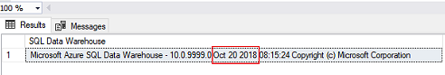

# Azure SQL Data Warehouse release notes

Azure SQL Data Warehouse is a cloud-based Enterprise Data Warehouse (EDW) that leverages Massively Parallel Processing (MPP) to quickly run complex queries across petabytes of data. Use SQL Data Warehouse as a key component of a big data solution. Import big data into SQL Data Warehouse with simple PolyBase T-SQL queries, and then use the power of MPP to run high-performance analytics. As you integrate and analyze, the data warehouse will become the single version of truth your business can count on for insights.

Click on the links below to find out more about the new features and improvements that you can expect in the latest version of Azure SQL Data Warehouse. You can expect to receive these service updates during your identified maintenance schedule.

- [October 2018](./release-notes-october-2018.md)
- [September 2018](./release-notes-september-2018.md)
- [August 2018](./release-notes-august-2018.md)
- [July 2018](./release-notes-july-2018.md)
- [June 2018](./release-notes-june-2018.md)
- [May 2018](./release-notes-may-2018.md)

## Checking the code version that has been applied to your data warehouse

To confirm which release has been as been applied to your data warehouse. Connect to your data warehouse via SSMS and run the following syntax to return the current version of SQL Data Warehouse.

```sql
SELECT @@VERSION AS 'SQL Data Warehouse';
```

Example output: 


Please use the date identified to confirm which release has been applied to your Azure SQL Data Warehouse. 


## Next steps
- [Learn more](https://docs.microsoft.com/azure/sql-data-warehouse/viewing-maintenance-schedule) about viewing a maintenance schedule. 
- [Learn more](https://docs.microsoft.com/azure/sql-data-warehouse/changing-maintenance-schedule) about changing a maintenance schedule.
- [Learn more](https://docs.microsoft.com/azure/monitoring-and-diagnostics/alert-metric) about creating, viewing, and managing alerts by using Azure Monitor.
- [Learn more](https://docs.microsoft.com/azure/monitoring-and-diagnostics/monitor-alerts-unified-log-webhook) about webhook actions for log alert rules.
- [Learn more](https://docs.microsoft.com/azure/service-health/service-health-overview) about Azure Service Health
