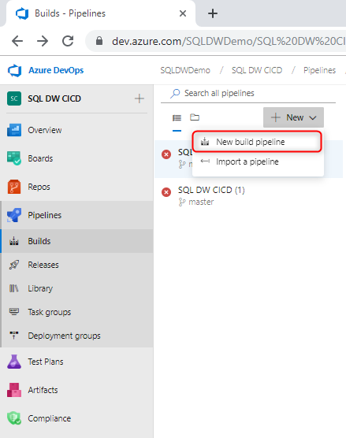
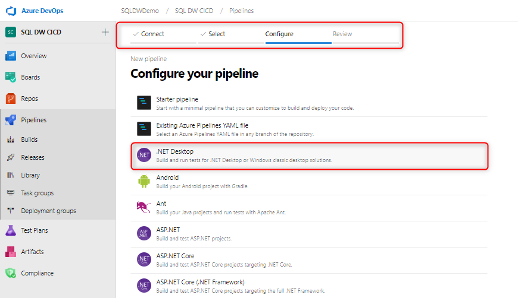

# Continuous integration and deployment for Azure SQL Data Warehouse

This simple tutorial outlines how to integrate your SQL Server Data tools (SSDT) database project with Azure DevOps and leverage Azure Pipelines to set up continuous integration and deployment. This tutorial is the second step in building your continuous integration and deployment pipeline with SQL Data Warehouse. 

## Before you begin

- Go through the [source control integration tutorial](https://docs.microsoft.com/azure/sql-data-warehouse/sql-data-warehouse-source-control-integration)

- Set up and connect to Azure DevOps

## Continuous integration with Visual Studio build

1. Navigate to Azure Pipelines and create a new build pipeline.

      

2. Select your source code repository (Azure Repos Git) and select the .NET Desktop app template.

       

3. Edit your YAML file to use the proper pool of your agent. Your YAML file should look something like this:

      

At this point, you have a simple environment where any check-in to your source control repository master branch should automatically trigger a successful Visual Studio build of your database project. Validate the automation is working end to end by making a change in your local database project and checking in that change to your master branch.

## Continuous deployment with the Azure SQL Data Warehouse (or Database) deployment task

1. Add a new task using the [Azure SQL Database deployment task](https://docs.microsoft.com/azure/devops/pipelines/tasks/deploy/sql-azure-dacpac-deployment?view=azure-devops) and fill in the required fields to connect to your target data warehouse. When this task runs, the DACPAC generated from the previous build process is deployed to the target data warehouse. You can also use the [Azure SQL Data Warehouse deployment task](https://marketplace.visualstudio.com/items?itemName=ms-sql-dw.SQLDWDeployment). 

      

2. If you are using a self-hosted agent, make sure you set your environment variable to use the correct SqlPackage.exe for SQL Data Warehouse. The path should look something like this:

      

   C:\Program Files (x86)\Microsoft Visual Studio\2019\Preview\Common7\IDE\Extensions\Microsoft\SQLDB\DAC\150  

   Run and validate your pipeline. You can make changes locally and check in changes to your source control that should generate an automatic build and deployment.

## Next steps

- Explore [Azure SQL Data Warehouse architecture](massively-parallel-processing-mpp-architecture.md)
- Quickly [create a SQL Data Warehouse](create-data-warehouse-portal.md)
- [Load sample data](sql-data-warehouse-load-sample-databases.md)
- Explore [Videos](/azure/sql-data-warehouse/sql-data-warehouse-videos)
