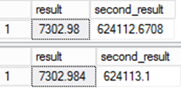

# CREATE TABLE AS SELECT (CTAS) in Azure SQL Data Warehouse

This article explains the CREATE TABLE AS SELECT (CTAS) T-SQL statement in Azure SQL Data Warehouse for developing solutions. The article also provides code examples.

## CREATE TABLE AS SELECT

The [CREATE TABLE AS SELECT](/sql/t-sql/statements/create-table-as-select-azure-sql-data-warehouse) (CTAS) statement is one of the most important T-SQL features available. CTAS is a parallel operation that creates a new table based on the output of a SELECT statement. CTAS is the simplest and fastest way to create and insert data into a table with a single command.

## SELECT...INTO vs. CTAS

CTAS is a more customizable version of the [SELECT...INTO](/sql/t-sql/queries/select-into-clause-transact-sql) statement.

The following is an example of a simple SELECT...INTO:

```sql
SELECT *
INTO    [dbo].[FactInternetSales_new]
FROM    [dbo].[FactInternetSales]
```

SELECT...INTO doesn't allow you to change either the distribution method or the index type as part of the operation. You create `[dbo].[FactInternetSales_new]` by using the default distribution type of ROUND_ROBIN, and the default table structure of CLUSTERED COLUMNSTORE INDEX.

With CTAS, on the other hand, you can specify both the distribution of the table data as well as the table structure type. To convert the previous example to CTAS:

```sql
CREATE TABLE [dbo].[FactInternetSales_new]
WITH
(
    DISTRIBUTION = ROUND_ROBIN
   ,CLUSTERED COLUMNSTORE INDEX
)
AS
SELECT  *
FROM    [dbo].[FactInternetSales]
;
```

> [!NOTE]
> If you're only trying to change the index in your CTAS operation, and the source table is hash distributed, maintain the same distribution column and data type. This avoids cross-distribution data movement during the operation, which is more efficient.

## Use CTAS to copy a table

Perhaps one of the most common uses of CTAS is creating a copy of a table in order to change the DDL. Let's say you originally created your table as `ROUND_ROBIN`, and now want to change it to a table distributed on a column. CTAS is how you would change the distribution column. You can also use CTAS to change partitioning, indexing, or column types.

Let's say you created this table by using the default distribution type of `ROUND_ROBIN`, not specifying a distribution column in the `CREATE TABLE`.

```sql
CREATE TABLE FactInternetSales
(
    ProductKey int NOT NULL,
    OrderDateKey int NOT NULL,
    DueDateKey int NOT NULL,
    ShipDateKey int NOT NULL,
    CustomerKey int NOT NULL,
    PromotionKey int NOT NULL,
    CurrencyKey int NOT NULL,
    SalesTerritoryKey int NOT NULL,
    SalesOrderNumber nvarchar(20) NOT NULL,
    SalesOrderLineNumber tinyint NOT NULL,
    RevisionNumber tinyint NOT NULL,
    OrderQuantity smallint NOT NULL,
    UnitPrice money NOT NULL,
    ExtendedAmount money NOT NULL,
    UnitPriceDiscountPct float NOT NULL,
    DiscountAmount float NOT NULL,
    ProductStandardCost money NOT NULL,
    TotalProductCost money NOT NULL,
    SalesAmount money NOT NULL,
    TaxAmt money NOT NULL,
    Freight money NOT NULL,
    CarrierTrackingNumber nvarchar(25),
    CustomerPONumber nvarchar(25)
);
```

Now you want to create a new copy of this table, with a `Clustered Columnstore Index`, so you can take advantage of the performance of Clustered Columnstore tables. You also want to distribute this table on `ProductKey`, because you're anticipating joins on this column and want to avoid data movement during joins on `ProductKey`. Lastly, you also want to add partitioning on `OrderDateKey`, so you can quickly delete old data by dropping old partitions. Here is the CTAS statement, which copies your old table into a new table.

```sql
CREATE TABLE FactInternetSales_new
WITH
(
    CLUSTERED COLUMNSTORE INDEX,
    DISTRIBUTION = HASH(ProductKey),
    PARTITION
    (
        OrderDateKey RANGE RIGHT FOR VALUES
        (
        20000101,20010101,20020101,20030101,20040101,20050101,20060101,20070101,20080101,20090101,
        20100101,20110101,20120101,20130101,20140101,20150101,20160101,20170101,20180101,20190101,
        20200101,20210101,20220101,20230101,20240101,20250101,20260101,20270101,20280101,20290101
        )
    )
)
AS SELECT * FROM FactInternetSales;
```

Finally, you can rename your tables, to swap in your new table and then drop your old table.

```sql
RENAME OBJECT FactInternetSales TO FactInternetSales_old;
RENAME OBJECT FactInternetSales_new TO FactInternetSales;

DROP TABLE FactInternetSales_old;
```

## Use CTAS to work around unsupported features

You can also use CTAS to work around a number of the unsupported features listed below. This method can often prove helpful, because not only will your code be compliant, but it will often run faster on SQL Data Warehouse. This performance is a result of its fully parallelized design. Scenarios include:

* ANSI JOINS on UPDATEs
* ANSI JOINs on DELETEs
* MERGE statement

> [!TIP]
> Try to think "CTAS first." Solving a problem by using CTAS is generally a good approach, even if you're writing more data as a result.

## ANSI join replacement for update statements

You might find that you have a complex update. The update joins more than two tables together by using ANSI join syntax to perform the UPDATE or DELETE.

Imagine you had to update this table:

```sql
CREATE TABLE [dbo].[AnnualCategorySales]
(    [EnglishProductCategoryName]    NVARCHAR(50)    NOT NULL
,    [CalendarYear]                    SMALLINT        NOT NULL
,    [TotalSalesAmount]                MONEY            NOT NULL
)
WITH
(
    DISTRIBUTION = ROUND_ROBIN
)
;
```

The original query might have looked something like this example:

```sql
UPDATE    acs
SET        [TotalSalesAmount] = [fis].[TotalSalesAmount]
FROM    [dbo].[AnnualCategorySales]     AS acs
JOIN    (
        SELECT    [EnglishProductCategoryName]
        ,        [CalendarYear]
        ,        SUM([SalesAmount])                AS [TotalSalesAmount]
        FROM    [dbo].[FactInternetSales]        AS s
        JOIN    [dbo].[DimDate]                    AS d    ON s.[OrderDateKey]                = d.[DateKey]
        JOIN    [dbo].[DimProduct]                AS p    ON s.[ProductKey]                = p.[ProductKey]
        JOIN    [dbo].[DimProductSubCategory]    AS u    ON p.[ProductSubcategoryKey]    = u.[ProductSubcategoryKey]
        JOIN    [dbo].[DimProductCategory]        AS c    ON u.[ProductCategoryKey]        = c.[ProductCategoryKey]
        WHERE     [CalendarYear] = 2004
        GROUP BY
                [EnglishProductCategoryName]
        ,        [CalendarYear]
        ) AS fis
ON    [acs].[EnglishProductCategoryName]    = [fis].[EnglishProductCategoryName]
AND    [acs].[CalendarYear]                = [fis].[CalendarYear]
;
```

SQL Data Warehouse doesn't support ANSI joins in the `FROM` clause of an `UPDATE` statement, so you can't use the previous example without modifying it.

You can use a combination of a CTAS and an implicit join to replace the previous example:

```sql
-- Create an interim table
CREATE TABLE CTAS_acs
WITH (DISTRIBUTION = ROUND_ROBIN)
AS
SELECT    ISNULL(CAST([EnglishProductCategoryName] AS NVARCHAR(50)),0)    AS [EnglishProductCategoryName]
,        ISNULL(CAST([CalendarYear] AS SMALLINT),0)                         AS [CalendarYear]
,        ISNULL(CAST(SUM([SalesAmount]) AS MONEY),0)                        AS [TotalSalesAmount]
FROM    [dbo].[FactInternetSales]        AS s
JOIN    [dbo].[DimDate]                    AS d    ON s.[OrderDateKey]                = d.[DateKey]
JOIN    [dbo].[DimProduct]                AS p    ON s.[ProductKey]                = p.[ProductKey]
JOIN    [dbo].[DimProductSubCategory]    AS u    ON p.[ProductSubcategoryKey]    = u.[ProductSubcategoryKey]
JOIN    [dbo].[DimProductCategory]        AS c    ON u.[ProductCategoryKey]        = c.[ProductCategoryKey]
WHERE     [CalendarYear] = 2004
GROUP BY
        [EnglishProductCategoryName]
,        [CalendarYear]
;

-- Use an implicit join to perform the update
UPDATE  AnnualCategorySales
SET     AnnualCategorySales.TotalSalesAmount = CTAS_ACS.TotalSalesAmount
FROM    CTAS_acs
WHERE   CTAS_acs.[EnglishProductCategoryName] = AnnualCategorySales.[EnglishProductCategoryName]
AND     CTAS_acs.[CalendarYear]               = AnnualCategorySales.[CalendarYear]
;

--Drop the interim table
DROP TABLE CTAS_acs
;
```

## ANSI join replacement for delete statements

Sometimes the best approach for deleting data is to use CTAS, especially for `DELETE` statements that use ANSI join syntax. This is because SQL Data Warehouse doesn't support ANSI joins in the `FROM` clause of a `DELETE` statement. Rather than deleting the data, select the data you want to keep.

The following is an example of a converted `DELETE` statement:

```sql
CREATE TABLE dbo.DimProduct_upsert
WITH
(   Distribution=HASH(ProductKey)
,   CLUSTERED INDEX (ProductKey)
)
AS -- Select Data you want to keep
SELECT     p.ProductKey
,          p.EnglishProductName
,          p.Color
FROM       dbo.DimProduct p
RIGHT JOIN dbo.stg_DimProduct s
ON         p.ProductKey = s.ProductKey
;

RENAME OBJECT dbo.DimProduct        TO DimProduct_old;
RENAME OBJECT dbo.DimProduct_upsert TO DimProduct;
```

## Replace merge statements

You can replace merge statements, at least in part, by using CTAS. You can combine the `INSERT` and the `UPDATE` into a single statement. Any deleted records should be restricted from the `SELECT` statement to omit from the results.

The following example is for an `UPSERT`:

```sql
CREATE TABLE dbo.[DimProduct_upsert]
WITH
(   DISTRIBUTION = HASH([ProductKey])
,   CLUSTERED INDEX ([ProductKey])
)
AS
-- New rows and new versions of rows
SELECT      s.[ProductKey]
,           s.[EnglishProductName]
,           s.[Color]
FROM      dbo.[stg_DimProduct] AS s
UNION ALL  
-- Keep rows that are not being touched
SELECT      p.[ProductKey]
,           p.[EnglishProductName]
,           p.[Color]
FROM      dbo.[DimProduct] AS p
WHERE NOT EXISTS
(   SELECT  *
    FROM    [dbo].[stg_DimProduct] s
    WHERE   s.[ProductKey] = p.[ProductKey]
)
;

RENAME OBJECT dbo.[DimProduct]          TO [DimProduct_old];
RENAME OBJECT dbo.[DimProduct_upsert]  TO [DimProduct];
```

## Explicitly state data type and nullability of output

When migrating code, you might find you run across this type of coding pattern:

```sql
DECLARE @d decimal(7,2) = 85.455
,       @f float(24)    = 85.455

CREATE TABLE result
(result DECIMAL(7,2) NOT NULL
)
WITH (DISTRIBUTION = ROUND_ROBIN)

INSERT INTO result
SELECT @d*@f
;
```

You might think you should migrate this code to CTAS, and you'd be correct. However, there's a hidden issue here.

The following code doesn't yield the same result:

```sql
DECLARE @d decimal(7,2) = 85.455
,       @f float(24)    = 85.455
;

CREATE TABLE ctas_r
WITH (DISTRIBUTION = ROUND_ROBIN)
AS
SELECT @d*@f as result
;
```

Notice that the column "result" carries forward the data type and nullability values of the expression. Carrying the data type forward can lead to subtle variances in values if you aren't careful.

Try this example:

```sql
SELECT result,result*@d
from result
;

SELECT result,result*@d
from ctas_r
;
```

The value stored for result is different. As the persisted value in the result column is used in other expressions, the error becomes even more significant.



This is important for data migrations. Even though the second query is arguably more accurate, there's a problem. The data would be different compared to the source system, and that leads to questions of integrity in the migration. This is one of those rare cases where the "wrong" answer is actually the right one!

The reason we see a disparity between the two results is due to implicit type casting. In the first example, the table defines the column definition. When the row is inserted, an implicit type conversion occurs. In the second example, there is no implicit type conversion as the expression defines the data type of the column.

Notice also that the column in the second example has been defined as a NULLable column, whereas in the first example it has not. When the table was created in the first example, column nullability was explicitly defined. In the second example, it was left to the expression, and by default would result in a NULL definition.

To resolve these issues, you must explicitly set the type conversion and nullability in the SELECT portion of the CTAS statement. You can't set these properties in 'CREATE TABLE'.
The following example demonstrates how to fix the code:

```sql
DECLARE @d decimal(7,2) = 85.455
,       @f float(24)    = 85.455

CREATE TABLE ctas_r
WITH (DISTRIBUTION = ROUND_ROBIN)
AS
SELECT ISNULL(CAST(@d*@f AS DECIMAL(7,2)),0) as result
```

Note the following:

* You can use CAST or CONVERT.
* Use ISNULL, not COALESCE, to force NULLability. See the following note.
* ISNULL is the outermost function.
* The second part of the ISNULL is a constant, 0.

> [!NOTE]
> For the nullability to be correctly set, it's vital to use ISNULL and not COALESCE. COALESCE is not a deterministic function, and so the result of the expression will always be NULLable. ISNULL is different. It's deterministic. Therefore, when the second part of the ISNULL function is a constant or a literal, the resulting value will be NOT NULL.

Ensuring the integrity of your calculations is also important for table partition switching. Imagine you have this table defined as a fact table:

```sql
CREATE TABLE [dbo].[Sales]
(
    [date]      INT     NOT NULL
,   [product]   INT     NOT NULL
,   [store]     INT     NOT NULL
,   [quantity]  INT     NOT NULL
,   [price]     MONEY   NOT NULL
,   [amount]    MONEY   NOT NULL
)
WITH
(   DISTRIBUTION = HASH([product])
,   PARTITION   (   [date] RANGE RIGHT FOR VALUES
                    (20000101,20010101,20020101
                    ,20030101,20040101,20050101
                    )
                )
)
;
```

However, the amount field is a calculated expression. It isn't part of the source data.

To create your partitioned dataset, you might want to use the following code:

```sql
CREATE TABLE [dbo].[Sales_in]
WITH
(   DISTRIBUTION = HASH([product])
,   PARTITION   (   [date] RANGE RIGHT FOR VALUES
                    (20000101,20010101
                    )
                )
)
AS
SELECT
    [date]
,   [product]
,   [store]
,   [quantity]
,   [price]
,   [quantity]*[price]  AS [amount]
FROM [stg].[source]
OPTION (LABEL = 'CTAS : Partition IN table : Create')
;
```

The query would run perfectly well. The problem comes when you try to do the partition switch. The table definitions don't match. To make the table definitions match, modify the CTAS to add an `ISNULL` function to preserve the column's nullability attribute.

```sql
CREATE TABLE [dbo].[Sales_in]
WITH
(   DISTRIBUTION = HASH([product])
,   PARTITION   (   [date] RANGE RIGHT FOR VALUES
                    (20000101,20010101
                    )
                )
)
AS
SELECT
    [date]
,   [product]
,   [store]
,   [quantity]
,   [price]   
,   ISNULL(CAST([quantity]*[price] AS MONEY),0) AS [amount]
FROM [stg].[source]
OPTION (LABEL = 'CTAS : Partition IN table : Create');
```

You can see that type consistency and maintaining nullability properties on a CTAS is an engineering best practice. It helps to maintain integrity in your calculations, and also ensures that partition switching is possible.

CTAS is one of the most important statements in SQL Data Warehouse. Make sure you thoroughly understand it. See the [CTAS documentation](/sql/t-sql/statements/create-table-as-select-azure-sql-data-warehouse).

## Next steps

For more development tips, see the [development overview](sql-data-warehouse-overview-develop.md).

