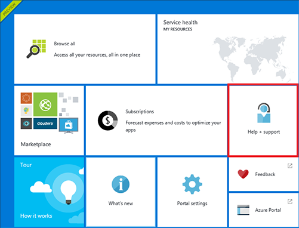
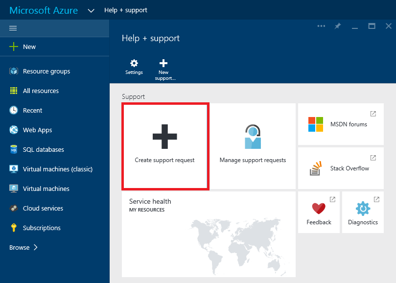
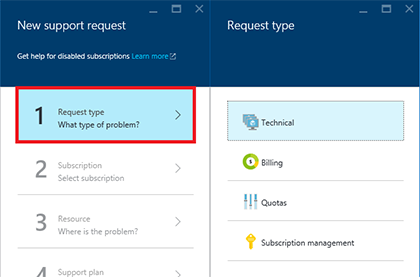
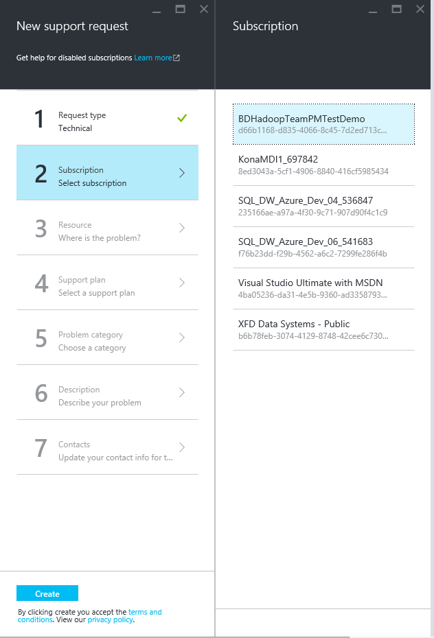
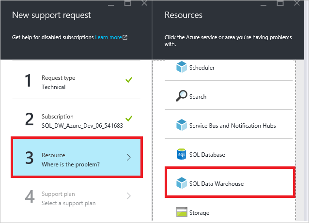
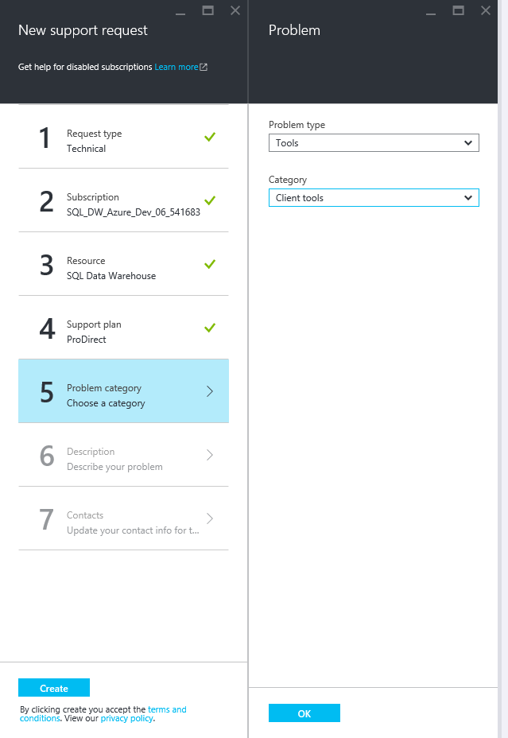
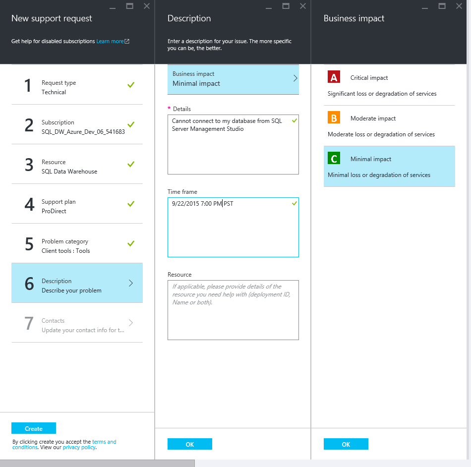
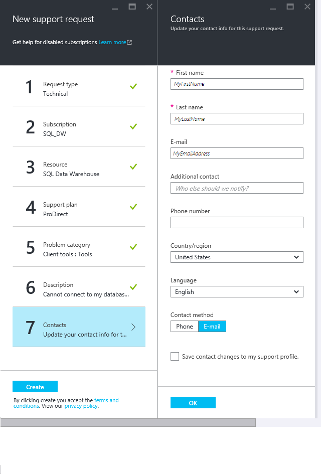
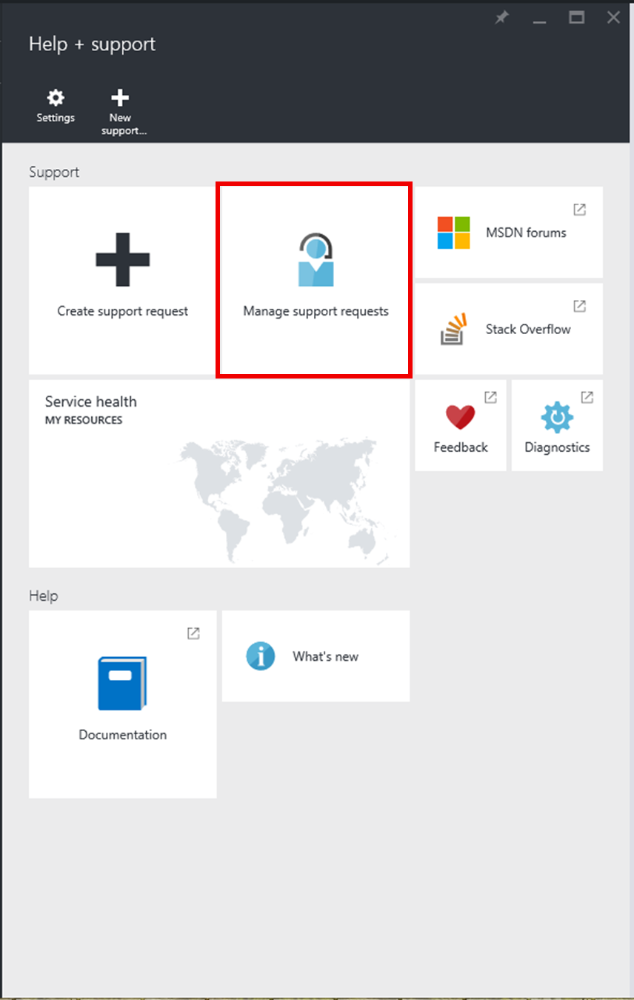

<properties
   pageTitle="How to create a support ticket for SQL Data Warehouse | Microsoft Azure"
   description="How to create a support ticket in Azure SQL Data Warehouse."
   services="sql-data-warehouse"
   documentationCenter="NA"
   authors="sonyam"
   manager="barbkess"
   editor=""/>

<tags
   ms.service="sql-data-warehouse"
   ms.devlang="NA"
   ms.topic="get-started-article"
   ms.tgt_pltfrm="NA"
   ms.workload="data-services"
   ms.date="07/18/2016"
   ms.author="sonyam;barbkess;sonyama"/>

# How to create a support ticket for SQL Data Warehouse
 
If you having any issues with your SQL Data Warehouse, please create a support ticket so that our engineering team can assist you.

## Create a support ticket

1. Open the [Azure portal][].

2. On the Home screen, click the **Help + support** tile.

    

3. On the Help + Support blade, click **Create support request**.

    
    
     

4. Select the **Request Type**.

    
    
    >[AZURE.NOTE]  By default, each SQL server (e.g. myserver.database.windows.net) has a **DTU Quota** of 45,000. This quota is simply a safety limit. You can increase your quota by creating a support ticket and selecting *Quota* as the request type. To calculate your DTU needs, you'll need to know that each 100 [DWU][] of SQL Data Warehouse consumes 750 DTU. Therefore, the default quota of 45,000 will allow you to create up to a DW6000 (45,000 / 750) or several smaller databases with less DWU. If, for example, you would like to host two DW6000s on one SQL server, then you should request a DTU quota of 90,000.  You can view your current DTU consumption from the SQL server blade in the portal. Both paused and un-paused databases count toward the DTU quota. 

5. Select the **Subscription** that hosts the database with the problem you are reporting.

    

6. Select **SQL Data Warehouse** as the Resource.

    

7. Select your **Support plan**.

    - **Billing and subscription management-related** support is available at all support levels.
    - **Break-fix** support is provided through Developer, Standard, Pro Direct, or Premier support. **Break-fix** issues are problems experienced by customers while using Azure where there is a reasonable expectation that Microsoft caused the problem.
    - **Developer mentoring** and **advisory services** are available at the Professional Direct and Premier support levels.
    
    See [Azure support plans][] to learn more about the various support plans, including scope, response times, pricing, etc.  For frequently asked questions about Azure support, see [Azure support FAQs][].

    

    If you have a Premier support plan, you can also report SQL Data Warehouse related issues on the [Microsoft Premier online portal][].

8. Select the **Problem Type** and **Category**.

    

9. Describe the problem and choose the level of business impact.

    

10. Your **contact information** for this support ticket will be pre-filled. Update this if necessary.

    

11. Click **Create** to submit the support request.

## Monitor a support ticket

After you have submitted the support request, the Azure support team will contact you. To check your request status and details, click **Manage support requests** on the dashboard.

## Other Resources

Additionally, you can connect with the SQL Data Warehouse community on [Stack Overflow][] or on the [Azure SQL Data Warehouse MSDN forum][].

<!-- External links -->
[Azure portal]: https://portal.azure.com/
[Azure support plans]: https://azure.microsoft.com/support/plans/?WT.mc_id=Support_Plan_510979/
[Azure support FAQs]: https://azure.microsoft.com/support/faq/
[Microsoft Premier online portal]: https://premier.microsoft.com/
[Stack Overflow]: https://stackoverflow.com/questions/tagged/azure-sqldw/
[Azure SQL Data Warehouse MSDN forum]: https://social.msdn.microsoft.com/Forums/home?forum=AzureSQLDataWarehouse/
[DWU]: ./sql-data-warehouse-overview-what-is.md#data-warehouse-units
