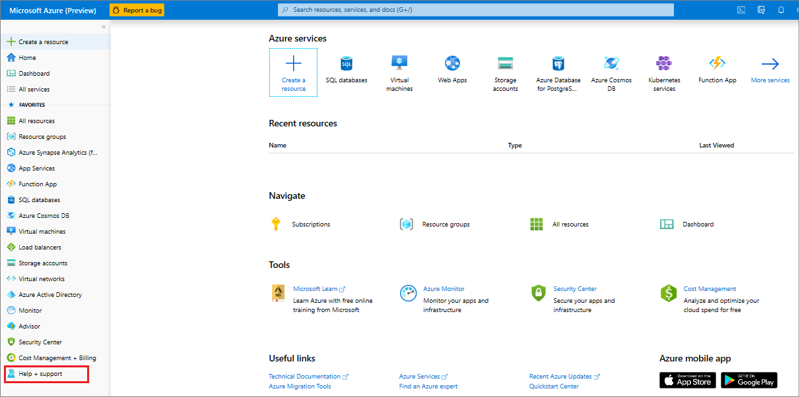
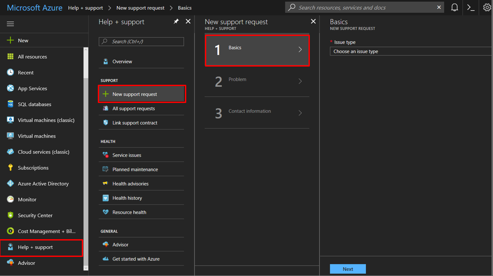
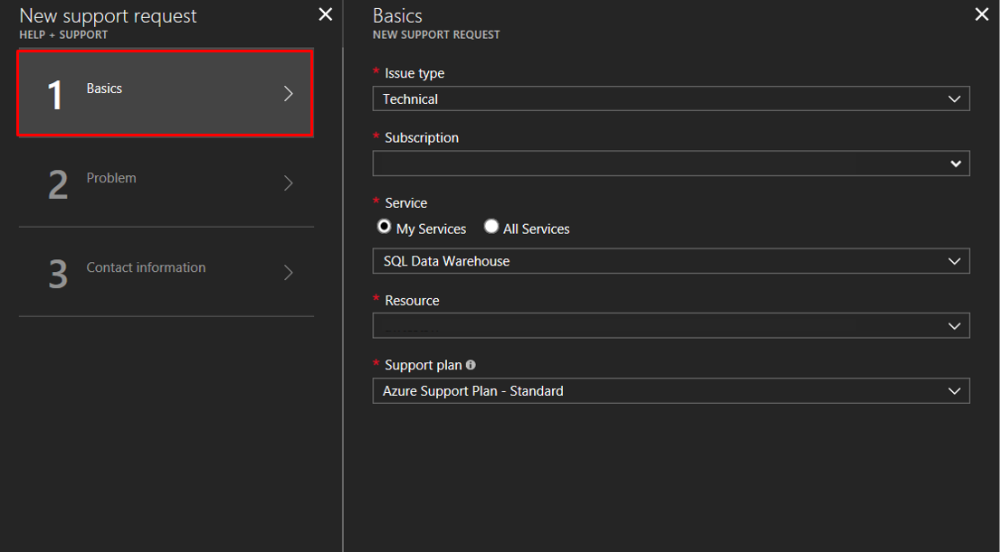
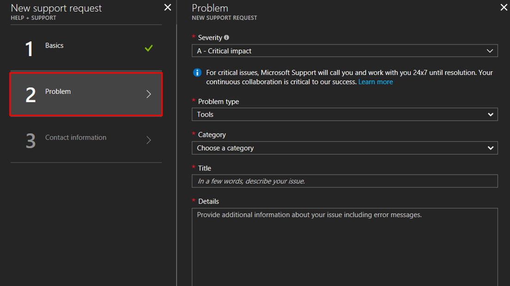
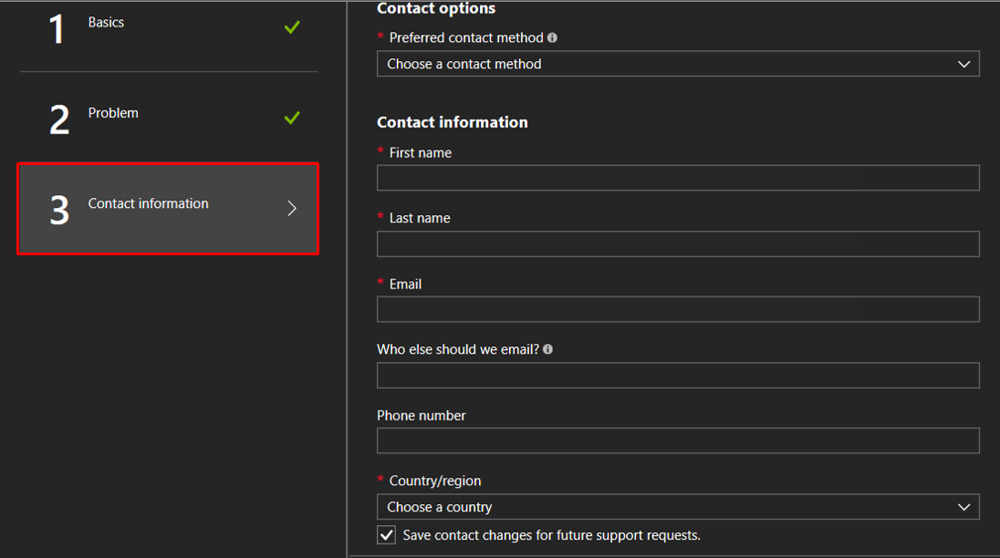
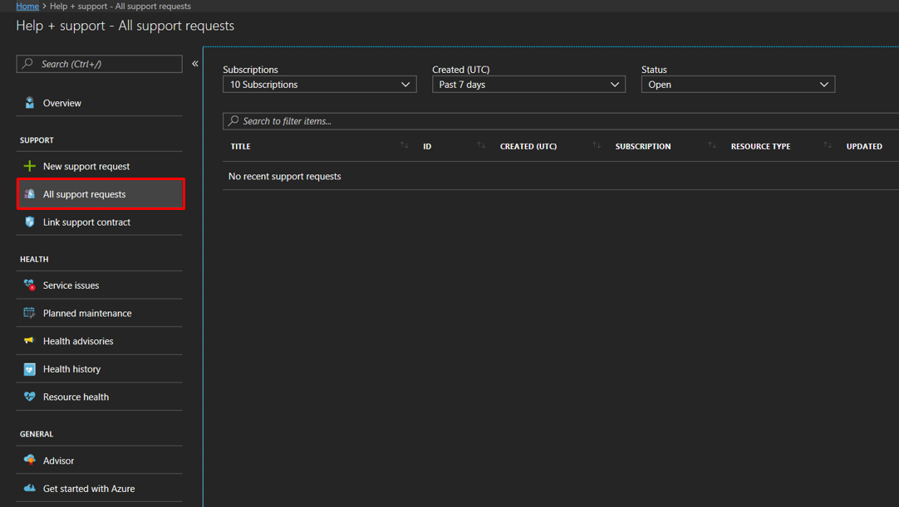

# How to create a support ticket for SQL Data Warehouse
If you're having any issues with your SQL Data Warehouse, create a support ticket so the engineering support team can assist you.

## Create a support ticket
1. Open the [Azure portal](https://portal.azure.com/).
2. On the Home screen, click the **Help + support** tab.
   
    
3. On the Help + Support blade, click **New support request** and fill out the **Basics** blade.

   Select your [Azure support plan](https://azure.microsoft.com/support/plans/?WT.mc_id=Support_Plan_510979/).
   
   * **Billing, quota, and subscription management** support are available at all support levels.
   * **Break-fix** support is provided through [Developer](https://azure.microsoft.com/support/plans/developer/), [Standard](https://azure.microsoft.com/support/plans/standard/), [Professional Direct](https://azure.microsoft.com/support/plans/prodirect/), or [Premier](https://azure.microsoft.com/support/plans/premier/) support. Break-fix issues are problems experienced by customers while using Azure where there is a reasonable expectation that Microsoft caused the problem.
   * **Developer mentoring** and **advisory services** are available at the [Professional Direct](https://azure.microsoft.com/support/plans/prodirect/) and [Premier](https://azure.microsoft.com/support/plans/premier/) support levels. 
     
     If you have a Premier support plan, you can also report SQL Data Warehouse related issues on the [Microsoft Premier online portal](https://premier.microsoft.com/). See [Azure support plans](https://azure.microsoft.com/support/plans/?WT.mc_id=Support_Plan_510979/) to learn more about the various support plans, including scope, response times, pricing, etc.  For frequently asked questions about Azure support, see [Azure support FAQs](https://azure.microsoft.com/support/faq/).  
        
     
     
4. Fill out the **Problem** blade.

    
   
   > [!NOTE]
   > By default, each SQL server (for example, myserver.database.windows.net) has a **DTU Quota** of 45,000. This quota is simply a safety limit. You can increase your quota by creating a support ticket and selecting *Quota* as the request type. To calculate your DTU needs, multiply 7.5 by the total [DWU](sql-data-warehouse-overview-what-is.md) needed. For example, you would like to host two DW6000s on one SQL server, then you should request a DTU quota of 90,000.  You can view your current DTU consumption from the SQL server blade in the portal. Both paused and unpaused databases count toward the DTU quota. 
   > 
   > 
   
5. Fill out your **contact information**.

   

    
6. Click **Create** to submit the support request.

## Monitor a support ticket
After you've submitted the support request, the Azure support team will contact you. To check your request status and details, click **All support requests** on the dashboard.

## Other resources
You can also connect with the SQL Data Warehouse community on [Stack Overflow](https://stackoverflow.com/questions/tagged/azure-sqldw/) or through the [Azure SQL Data Warehouse MSDN forum](https://social.msdn.microsoft.com/Forums/home?forum=AzureSQLDataWarehouse/).

 
