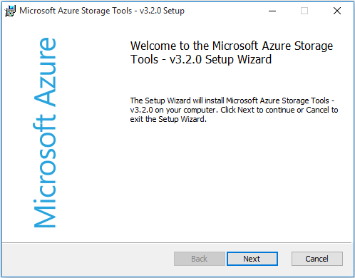
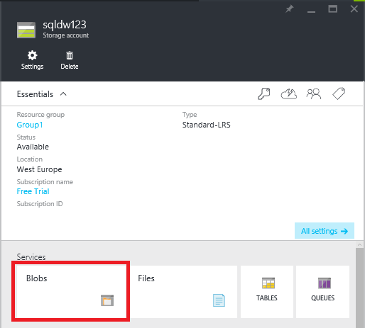
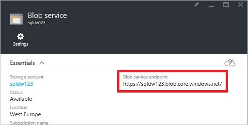
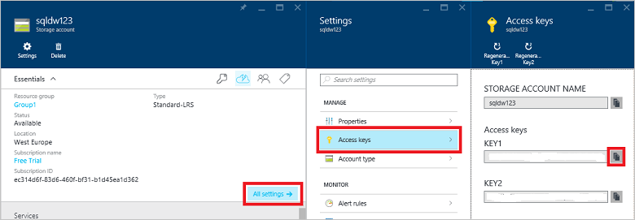
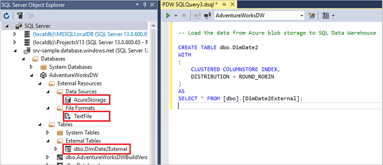

<properties
   pageTitle="PolyBase in SQL Data Warehouse Tutorial | Microsoft Azure"
   description="Learn what PolyBase is and how to use it for data warehousing scenarios."
   services="sql-data-warehouse"
   documentationCenter="NA"
   authors="happynicolle"
   manager="barbkess"
   editor=""/>

<tags
   ms.service="sql-data-warehouse"
   ms.devlang="NA"
   ms.topic="get-started-article"
   ms.tgt_pltfrm="NA"
   ms.workload="data-services"
   ms.date="06/30/2016"
   ms.author="nicw;barbkess;jrj;sonyama"/>


# Load data with PolyBase in SQL Data Warehouse

> [AZURE.SELECTOR]
- [Data Factory](sql-data-warehouse-get-started-load-with-azure-data-factory.md)
- [PolyBase](sql-data-warehouse-get-started-load-with-polybase.md)
- [BCP](sql-data-warehouse-load-with-bcp.md)

This tutorial shows how to load data into SQL Data Warehouse by using AzCopy and PolyBase. When finished, you will know how to:

- Use AzCopy to copy data to Azure blob storage
- Create database objects to define the data
- Run a T-SQL query to load the data

>[AZURE.VIDEO loading-data-with-polybase-in-azure-sql-data-warehouse]

## Prerequisites

To step through this tutorial, you need

- A SQL Data Warehouse database.
- An Azure storage account of type Standard Locally Redundant Storage (Standard-LRS), Standard Geo-Redundant Storage (Standard-GRS), or Standard Read-Access Geo-Redundant Storage (Standard-RAGRS).
- AzCopy Command-Line Utility. Download and install the [latest version of AzCopy][] which is installed with the Microsoft Azure Storage Tools.

    


## Step 1: Add sample data to Azure blob storage

In order to load data, we need to put some sample data into an Azure blob storage. In this step we populate an Azure Storage blob with sample data. Later, we will use PolyBase to load this sample data into your SQL Data Warehouse database.

### A. Prepare a sample text file

To prepare a sample text file:

1. Open Notepad and copy the following lines of data into a new file. Save this to your local temp directory as %temp%\DimDate2.txt.

```
20150301,1,3
20150501,2,4
20151001,4,2
20150201,1,3
20151201,4,2
20150801,3,1
20150601,2,4
20151101,4,2
20150401,2,4
20150701,3,1
20150901,3,1
20150101,1,3
```

### B. Find your blob service endpoint

To find your blob service endpoint:

1. From the Azure Portal select **Browse** > **Storage Accounts**.
2. Click the storage account you want to use.
3. In the Storage account blade, click Blobs

    

1. Save your blob service endpoint URL for later.

    

### C. Find your Azure storage key

To find your Azure storage key:

1. From the Azure Portal, select **Browse** > **Storage Accounts**.
2. Click on the storage account you want to use.
3. Select **All settings** > **Access keys**.
4. Click the copy box to copy one of your access keys to the clipboard.

    

### D. Copy the sample file to Azure blob storage

To copy your data to Azure blob storage:

1. Open a command prompt, and change directories to the AzCopy installation directory. This command changes to the default installation directory on a 64-bit Windows client.

    ```
    cd /d "%ProgramFiles(x86)%\Microsoft SDKs\Azure\AzCopy"
    ```

1. Run the following command to upload the file. Specify your blob service endpoint URL for <blob service endpoint URL> and your Azure storage account key for <azure_storage_account_key>.

    ```
    .\AzCopy.exe /Source:C:\Temp\ /Dest:<blob service endpoint URL> /datacontainer/datedimension/ /DestKey:<azure_storage_account_key> /Pattern:DimDate2.txt
    ```

See also [Getting Started with the AzCopy Command-Line Utility][].

### E. Explore your blob storage container

To see the file you uploaded to blob storage:

1. Go back to your Blob service blade.
2. Under Containers, double-click **datacontainer**.
3. To explore the path to your data, click the folder **datedimension** and you will see your uploaded file **DimDate2.txt**.
4. To view properties, click **DimDate2.txt**.
5. Note that in the Blob properties blade, you can download or delete the file.

    


## Step 2: Create an external table for the sample data

In this section we create an external table that defines the sample data.

PolyBase uses external tables to access data in Azure blob storage. Since the data is not stored within SQL Data Warehouse, PolyBase handles authentication to the external data by using a database-scoped credential.

The example in this step uses these Transact-SQL statements to create an external table.

- [Create Master Key (Transact-SQL)][] to encrypt the secret of your database scoped credential.
- [Create Database Scoped Credential (Transact-SQL)][] to specify authentication information for your Azure storage account.
- [Create External Data Source (Transact-SQL)][] to specify the location of your Azure blob storage.
- [Create External File Format (Transact-SQL)][] to specify the format of your data.
- [Create External Table (Transact-SQL)][] to specify the table definition and location of the data.

Run this query against your SQL Data Warehouse database. It will create an external table named DimDate2External in the dbo schema that points to the DimDate2.txt sample data in the Azure blob storage.


```sql
-- A: Create a master key.
-- Only necessary if one does not already exist.
-- Required to encrypt the credential secret in the next step.

CREATE MASTER KEY;


-- B: Create a database scoped credential
-- IDENTITY: Provide any string, it is not used for authentication to Azure storage.
-- SECRET: Provide your Azure storage account key.


CREATE DATABASE SCOPED CREDENTIAL AzureStorageCredential
WITH
    IDENTITY = 'user',
    SECRET = '<azure_storage_account_key>'
;


-- C: Create an external data source
-- TYPE: HADOOP - PolyBase uses Hadoop APIs to access data in Azure blob storage.
-- LOCATION: Provide Azure storage account name and blob container name.
-- CREDENTIAL: Provide the credential created in the previous step.

CREATE EXTERNAL DATA SOURCE AzureStorage
WITH (
    TYPE = HADOOP,
    LOCATION = 'wasbs://<blob_container_name>@<azure_storage_account_name>.blob.core.windows.net',
    CREDENTIAL = AzureStorageCredential
);


-- D: Create an external file format
-- FORMAT_TYPE: Type of file format in Azure storage (supported: DELIMITEDTEXT, RCFILE, ORC, PARQUET).
-- FORMAT_OPTIONS: Specify field terminator, string delimiter, date format etc. for delimited text files.
-- Specify DATA_COMPRESSION method if data is compressed.

CREATE EXTERNAL FILE FORMAT TextFile
WITH (
    FORMAT_TYPE = DelimitedText,
    FORMAT_OPTIONS (FIELD_TERMINATOR = ',')
);


-- E: Create the external table
-- Specify column names and data types. This needs to match the data in the sample file.
-- LOCATION: Specify path to file or directory that contains the data (relative to the blob container).
-- To point to all files under the blob container, use LOCATION='.'

CREATE EXTERNAL TABLE dbo.DimDate2External (
    DateId INT NOT NULL,
    CalendarQuarter TINYINT NOT NULL,
    FiscalQuarter TINYINT NOT NULL
)
WITH (
    LOCATION='/datedimension/',
    DATA_SOURCE=AzureStorage,
    FILE_FORMAT=TextFile
);


-- Run a query on the external table

SELECT count(*) FROM dbo.DimDate2External;

```


In SQL Server Object Explorer in Visual Studio, you can see the external file format, external data source, and the DimDate2External table.



## Step 3: Load data into SQL Data Warehouse

Once the external table is created, you can either load the data into a new table or insert it into an existing table.

- To load the data into a new table, run the [CREATE TABLE AS SELECT (Transact-SQL)][] statement. The new table will have the columns named in the query. The data types of the columns will match the data types in the external table definition.
- To load the data into an existing table, use the [INSERT...SELECT (Transact-SQL)][] statement.

```sql
-- Load the data from Azure blob storage to SQL Data Warehouse

CREATE TABLE dbo.DimDate2
WITH
(   
    CLUSTERED COLUMNSTORE INDEX,
    DISTRIBUTION = ROUND_ROBIN
)
AS
SELECT * FROM [dbo].[DimDate2External];
```

## Step 4: Create statistics on your newly loaded data

SQL Data Warehouse does not auto-create or auto-update statistics. Therefore, to achieve high query performance, it's important to create statistics on each column of each table after the first load. It's also important to update statistics after substantial changes in the data.

This example creates single-column statistics on the new DimDate2 table.

```sql
CREATE STATISTICS [DateId] on [DimDate2] ([DateId]);
CREATE STATISTICS [CalendarQuarter] on [DimDate2] ([CalendarQuarter]);
CREATE STATISTICS [FiscalQuarter] on [DimDate2] ([FiscalQuarter]);
```

To learn more, see [Statistics][].  


## Next steps
See the [PolyBase guide][] for further information you should know as you develop a solution that uses PolyBase.

<!--Image references-->


<!--Article references-->
[PolyBase in SQL Data Warehouse Tutorial]: ./sql-data-warehouse-get-started-load-with-polybase.md
[Load data with bcp]: ./sql-data-warehouse-load-with-bcp.md
[Statistics]: ./sql-data-warehouse-tables-statistics.md
[PolyBase guide]: ./sql-data-warehouse-load-polybase-guide.md
[Getting Started with the AzCopy Command-Line Utility]: ../storage/storage-use-azcopy.md
[latest version of AzCopy]: ../storage/storage-use-azcopy.md

<!--External references-->
[supported source/sink]: https://msdn.microsoft.com/library/dn894007.aspx
[copy activity]: https://msdn.microsoft.com/library/dn835035.aspx
[SQL Server destination adapter]: https://msdn.microsoft.com/library/ms141095.aspx
[SSIS]: https://msdn.microsoft.com/library/ms141026.aspx


[CREATE EXTERNAL DATA SOURCE (Transact-SQL)]:https://msdn.microsoft.com/library/dn935022.aspx
[CREATE EXTERNAL FILE FORMAT (Transact-SQL)]:https://msdn.microsoft.com/library/dn935026.aspx
[CREATE EXTERNAL TABLE (Transact-SQL)]:https://msdn.microsoft.com/library/dn935021.aspx

[DROP EXTERNAL DATA SOURCE (Transact-SQL)]:https://msdn.microsoft.com/library/mt146367.aspx
[DROP EXTERNAL FILE FORMAT (Transact-SQL)]:https://msdn.microsoft.com/library/mt146379.aspx
[DROP EXTERNAL TABLE (Transact-SQL)]:https://msdn.microsoft.com/library/mt130698.aspx

[CREATE TABLE AS SELECT (Transact-SQL)]:https://msdn.microsoft.com/library/mt204041.aspx
[INSERT...SELECT (Transact-SQL)]:https://msdn.microsoft.com/library/ms174335.aspx
[CREATE MASTER KEY (Transact-SQL)]:https://msdn.microsoft.com/library/ms174382.aspx
[CREATE CREDENTIAL (Transact-SQL)]:https://msdn.microsoft.com/library/ms189522.aspx
[CREATE DATABASE SCOPED CREDENTIAL (Transact-SQL)]:https://msdn.microsoft.com/library/mt270260.aspx
[DROP CREDENTIAL (Transact-SQL)]:https://msdn.microsoft.com/library/ms189450.aspx
