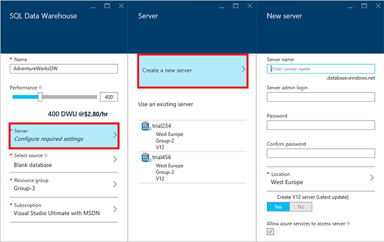
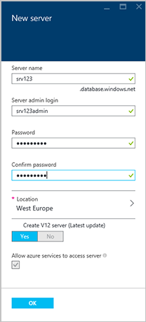

<properties
   pageTitle="Create a SQL Data Warehouse database in the Azure Portal | Microsoft Azure"
   description="Learn how to create an Azure SQL Data Warehouse in the Azure Portal"
   services="sql-data-warehouse"
   documentationCenter="NA"
   authors="barbkess"
   manager="jhubbard"
   editor=""
   tags="azure-sql-data-warehouse"/>

<tags
   ms.service="sql-data-warehouse"
   ms.devlang="NA"
   ms.topic="get-started-article"
   ms.tgt_pltfrm="NA"
   ms.workload="data-services"
   ms.date="05/03/2016"
   ms.author="lodipalm;"/>

# Create a New Logical Server

In SQL Database and SQL Data Warehouse, each database is assigned to a server, and each server is assigned to a geographical location. The server is called a logical SQL server.

> [AZURE.NOTE] A logical SQL server:
  >
  > + Provides a consistent way to configure multiple databases within the same geographical location.
  > + Is not physical hardware like it is for an on-premises server. It  is part of the service software. This is why we call it a *logical server*.
  > + Can host multiple databases without impacting their performance.
  > + Uses a lower case *s* in its name. SQL **s**erver is an Azure logical server, whereas SQL **S**erver is Microsoft's on-premises database product.

1. Click **Server** > **Create a new server**. There is no charge for the server. If you already have a V12 logical SQL server that you want to use, choose your existing server and go to the next step.

    

2. Fill in the **New server** information.

	- **Server Name**: Enter a name for your logical server. This is unique for each geographical location.
	- **Server Admin Name**: Enter a user name for the server administrator account.
	- **Password**: Enter the server admin password.
	- **Location**: Choose a geographical location for your server. To reduce data transfer time, it's best to locate your server geographically close to other data resources this database will access.
	- **Create V12 Server**: YES is the only option for SQL Data Warehouse.
	- **Allow azure services to access server**: This is always checked for SQL Data Warehouse

    >[AZURE.NOTE] Be sure to store the server name, server admin name, and password somewhere.  You will need this information to log on to the server.

3. Click **OK** to save the logical SQL server configuration settings and return to the SQL Data Warehouse blade.

    
